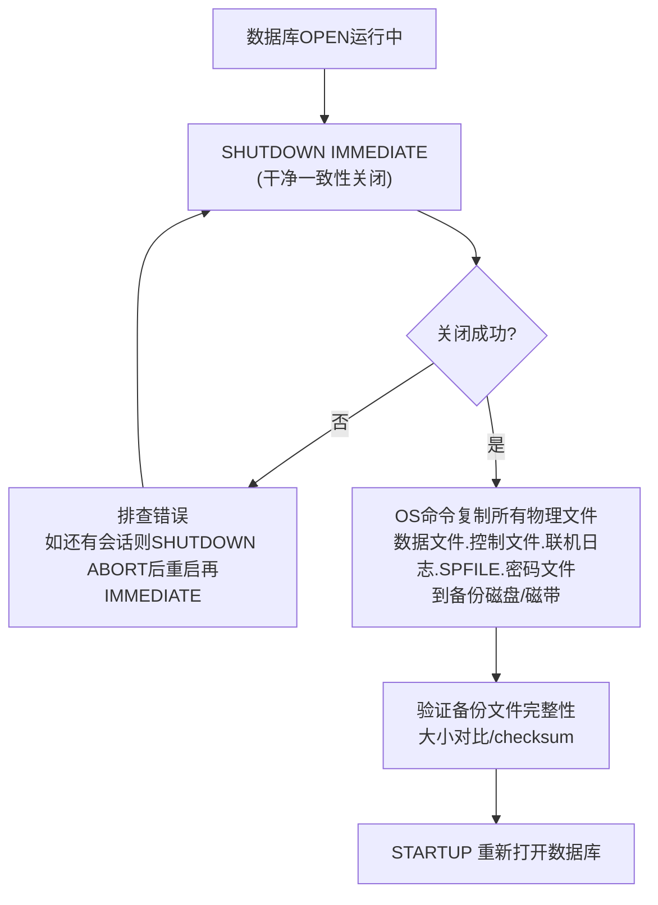

# 8.1 备份分类：冷备份、热备份

本节是[[MOC - 第8章]]的开篇，建立Oracle备份的分类体系，讲解**冷备份（脱机/Offline备份）**与**热备份（联机/Online备份，又称用户管理的热备UMB）**两种物理备份方式的原理、步骤、适用场景与SQL操作。本节内容是后续[[8.2 RMAN工具基础使用]]（Oracle专有的自动化备份工具，替代UMB）与[[8.3 完全恢复与不完全恢复]]的基础。

## 备份目的与策略总览

### 备份目的

| 目的 | 说明 |
| ---- | ---- |
| **防止介质故障** | 磁盘损坏、RAID卡失效、机房火灾等导致数据文件损坏无法读取 |
| **修复用户误操作** | 误DROP表、误TRUNCATE、误删DML误COMMIT后，可恢复到误操作前 |
| **升级/变更回滚** | 软件升级、补丁安装、大规模结构变更前做备份，失败可快速回退 |
| **容灾/合规** | 跨机房容灾、行业法规要求保留多年备份用于审计 |

### 备份策略总览

| 策略 | 说明 | 组合示例（生产典型） |
| ---- | ---- | ---- |
| **全备（Full Backup / Level 0）** | 备份所有使用过的数据块 | 每周日晚：增量0级全备 |
| **增量累计（Level 1 Cumulative）** | 备份自上次0级以来所有变化块 | 每周三晚：累计增量1级（自周日以来的变化） |
| **增量差异（Level 1 Differential）** | 备份自上次任意级别备份以来的变化块 | 周一、二、四、五、六晚：差异增量1级（自昨晚以来的变化） |
| **归档日志备份** | 与增量策略配合，备份归档日志（每小时或每天） | 每小时：备归档+删除已备份输入 |

### 物理备份 vs 逻辑备份

| 分类 | 内容 | Oracle工具 | 恢复粒度 | 典型场景 |
| ---- | ---- | ---- | ---- | ---- |
| **物理备份Physical** | 备份数据库物理文件：数据文件(.dbf)、控制文件(.ctl)、重做日志(.log)、SPFILE、密码文件 | RMAN / OS cp/cold backup | 数据库级/表空间级/数据文件级（**粒度粗但恢复快**） | 介质故障、整库恢复、灾难恢复 |
| **逻辑备份Logical** | 备份数据内容（表数据、DDL等逻辑结构） | exp/imp传统客户端工具 / **expdp/impdp数据泵**（10g+推荐，服务端执行） | 表级/行级/用户级（**粒度细但恢复慢**） | 单表/单用户逻辑恢复、跨版本迁移、跨平台迁移 |

> [!note] 本章重点是**物理备份**，逻辑备份（数据泵）在后续章节深入。

## 冷备份（Cold Backup / Offline Backup，脱机备份）

> [!definition] 冷备份（脱机一致性备份）
> 数据库**干净一致性关闭（SHUTDOWN IMMEDIATE/NORMAL/TRANSACTIONAL）**后，所有数据文件、控制文件、重做日志的SCN完全一致（一致性），DBA用OS命令（cp/copy/robocopy等）把这些物理文件复制到备份目录的过程。这是**NOARCHIVELOG模式下唯一可用的物理备份方式**。

### 冷备份步骤



### 需要备份的文件清单与查询SQL

```sql
-- Oracle 19c: 查看所有需要冷备的物理文件路径

-- ①数据文件
SELECT name FROM v$datafile;

-- ②控制文件（多路复用多份，所有成员都要备份）
SELECT name FROM v$controlfile;

-- ③联机重做日志（多路复用所有成员）
SELECT member FROM v$logfile;

-- ④SPFILE路径（SPFILE在$ORACLE_HOME/dbs下，或ASM中）
SELECT value FROM v$parameter WHERE name = 'spfile';

-- ⑤告警日志路径
SELECT value FROM v$diag_info WHERE name = 'Diag Alert';
```

> [!tip] 生产冷备建议
> - 密码文件（`$ORACLE_HOME/dbs/orapw<sid>`）、listener.ora、tnsnames.ora、sqlnet.ora、pfile/spfile虽然不属于数据库核心文件，但建议一起备份，方便灾难后快速重建环境。
> - 冷备后建议做一次备份校验：OS层用md5sum/sha256sum校验备份文件与源文件哈希值。

### 冷备份优缺点

| 优点 | 缺点 |
| ---- | ---- |
| ①最简单直观、最易理解 | ①必须停机，生产24×7系统不可接受 |
| ②备份的是一致性SCN副本，恢复时无需应用重做，开箱即用 | ②只能恢复到备份时刻，备份后到故障点所有数据丢失（若NOARCHIVELOG无归档可应用） |
| ③OS命令即可完成，无需额外工具 | ③大数据库（TB级）拷贝时间太长，停机窗口不可接受 |

> [!danger] 严禁使用 `SHUTDOWN ABORT` 后做冷备！
> ABORT关闭等价于断电，数据库是不一致的（部分已COMMIT事务未写入数据文件，部分未COMMIT事务已写入），备份的是**不一致副本**。若用不一致副本恢复，必须额外做实例恢复/介质恢复才能OPEN，相当于冷备失去了「开箱即用」的优势。

## 热备份（Hot Backup / Online Backup，联机备份UMB）

> [!definition] 热备份（用户管理的联机备份UMB，User-Managed Backup）
> **ARCHIVELOG模式下**数据库处于 OPEN 状态，对每个表空间执行 `ALTER TABLESPACE ... BEGIN BACKUP`（冻结文件头SCN+记录额外重做），OS复制数据文件后再`ALTER TABLESPACE ... END BACKUP`。备份期间数据库照常读写，**不影响业务**。这是Oracle 8/8i时代的主流联机备份方式，Oracle 9i+逐渐被[[8.2 RMAN工具基础使用|RMAN]]替代，但仍是理解Oracle备份底层原理的关键。

### ARCHIVELOG 热备期间的 Oracle 专有内部机制

> [!note] Oracle 专有：BEGIN BACKUP 的两个内部动作
> 执行 `ALTER TABLESPACE users BEGIN BACKUP` 时，Oracle做两件事：
> 1. **冻结数据文件头SCN（Checkpoint SCN）**：文件头SCN不再随后续检查点推进。恢复时Oracle知道备份的文件SCN起点是多少，需要从那个SCN开始应用重做。备份期间如果实例崩溃，重启后Oracle会自动对该表空间执行 END BACKUP（避免永久冻结）。
> 2. **记录额外的重做记录（Whole Block Image）**：普通DML只记录前像+后像的change vector；BEGIN BACKUP期间，若数据块首次被修改，LGWR把**整个数据块（Whole Block）**写入重做日志——避免OS复制文件时「块被拆分读」（OS复制一个8KB Oracle块的前半部分是旧值，后半部分是新值，造成逻辑块断裂Fractured Block）。

### 单表空间热备份步骤

```sql
-- Oracle 19c: 单表空间USERS热备步骤

-- 步骤1: 表空间进入热备模式
ALTER TABLESPACE users BEGIN BACKUP;

-- 步骤2: OS层复制该表空间的所有数据文件到备份目录
-- OS (Linux): cp /u01/app/oracle/oradata/ORCL/users*.dbf /backup/hot/users/
-- OS (Windows): copy D:\ORADATA\ORCL\USERS*.DBF D:\BACKUP\HOT\USERS\

-- 步骤3: 结束热备模式（必须！否则表空间文件头SCN永久冻结，长时间产生大量额外重做）
ALTER TABLESPACE users END BACKUP;

-- 验证：查看V$BACKUP确认状态已从ACTIVE变为NOT ACTIVE
SELECT t.name, b.status, b.change#, b.time
FROM   v$tablespace t
       JOIN v$backup b ON t.ts# = b.file#;
```

### 全库热备份

```sql
-- Oracle 19c: 一次性对整个数据库进入热备（Oracle 8i+支持）
ALTER DATABASE BEGIN BACKUP;
-- OS层复制ALL数据文件
-- ALTER DATABASE END BACKUP;

-- 备份控制文件（二进制方式）
ALTER DATABASE BACKUP CONTROLFILE TO '/backup/hot/control01.ctl';

-- 备份控制文件（TRACE方式，可编辑SQL脚本）
ALTER DATABASE BACKUP CONTROLFILE TO TRACE AS '/backup/hot/ctl_create.sql' REUSE;
```

### 热备份期间的报错与实例崩溃自动恢复

> [!tip] 热备中崩溃自动 END BACKUP
> 若 `BEGIN BACKUP` 后未END就发生实例崩溃（断电/ABORT），重启时SMON自动检测到文件处于备份模式，会自动对这些文件执行END BACKUP动作再做常规实例恢复，无需DBA手动干预。

### 热备份优缺点

| 优点 | 缺点 |
| ---- | ---- |
| ①数据库OPEN状态，**零业务停机**，24×7系统可用 | ①产生大量额外重做（Whole Block Image），归档量暴增 |
| ②配合归档日志，可恢复到故障前任意时刻 | ②DBA需手动管理「哪些文件在BEGIN/END」，操作繁琐易错 |
| ③支持表空间级/数据文件级细粒度备份 | ③无法自动跳过空块（OS cp整个文件，即使块全空），备份集体积大 |
| ④OS命令即可，架构简单 | ④无法做增量备份、无法自动化校验块损坏、无统一备份目录（RMAN解决了这些问题） |

## 用户管理的备份（UMB） vs RMAN备份对比表

| 维度 | 用户管理备份UMB（cp+BEGIN BACKUP） | RMAN工具（Oracle 9i+推荐，[[8.2 RMAN工具基础使用]]） |
| ---- | ---- | ---- |
| 备份空块 | OS cp整个文件，空块也备份，体积大 | 默认Backup Set**自动跳过未使用的数据块**，备份小 |
| 块损坏检测 | OS无法检测Oracle逻辑块损坏 | 自动对每个块做**逻辑一致性校验**，损坏自动记录并标记 |
| 增量备份 | 无法增量，每次全文件cp | 支持0/1级累计/差异增量，大幅节省空间与时间 |
| 自动化程度 | DBA手写脚本维护BEGIN/END+cp，易漏 | 单命令BACKUP DATABASE全自动，含归档/控制文件 |
| 备份压缩 | OS层gzip/bzip2压缩，需额外步骤 | 内置AS COMPRESSED BACKUPSET专用压缩算法，比gzip快且率更高 |
| 备份目录管理 | 分散在各OS目录，需手动管理过期 | 结合FRA自动按保留策略删除过期，自动空间管理 |
| 恢复操作复杂度 | DBA手动RESTORE每个文件+手动RECOVER | 单条RESTORE+RECOVER自动选择最佳备份链自动应用 |
| 备份加密 | OS层加密，需额外工具 | Oracle 11g+内置透明数据加密TDE+备份集加密 |

> [!note] Oracle 专有定位：RMAN vs UMB
> RMAN是Oracle公司官方推荐并持续增强的备份恢复工具，UMB（用户管理备份）作为兼容模式保留。生产环境**默认使用RMAN**，UMB仅用于RMAN不可用的极端场景或理解底层原理。

## 一致性备份 vs 不一致备份

| 维度 | 一致性备份 Consistent | 不一致备份 Inconsistent |
| ---- | ---- | ---- |
| **定义** | 所有文件头SCN相同，反映的是某一时刻的数据库一致状态 | 备份时数据库正在写，不同文件头SCN不一致 |
| **获取方式** | SHUTDOWN IMMEDIATE后冷备 | ARCHIVELOG模式下数据库OPEN时的热备/RMAN联机备 |
| **恢复是否需重做** | 不需要。直接拷贝回去即可OPEN | 需要。必须应用归档+在线重做，把各文件SCN同步到同一时刻才能OPEN |
| **是否需ARCHIVELOG** | 不需要。NOARCHIVELOG也可 | 必须ARCHIVELOG。否则无法应用重做同步SCN |
| **典型示例** | 冷备份、干净关库后的RMAN全备 | 白天的RMAN联机备份、BEGIN BACKUP热备 |

## 小结

> [!summary] 本节核心
> - 物理备份拷贝文件（快速/粗粒度），逻辑备份expdp/impdp拷贝数据内容（慢速/细粒度）。备份策略：周日0级全备+周中1级增量+每小时归档备。
> - 冷备份：SHUTDOWN IMMEDIATE关库→OS cp所有数据/控制/日志文件/SPFILE→STARTUP。优点简单，缺点必须停机、只能恢复到备份点。NOARCHIVELOG下唯一备份方式。严禁SHUTDOWN ABORT后冷备。
> - 热备份（UMB）：ARCHIVELOG下 `ALTER TABLESPACE ... BEGIN/END BACKUP` 间OS cp数据文件。Oracle专有动作：冻结文件头SCN、首次改块写Whole Block Image防块断裂。优点零停机，缺点归档量大、易操作漏。
> - RMAN vs UMB：RMAN自动跳过空块、校验块、增量、压缩、FRA自动管理、自动化恢复。生产默认RMAN，UMB用于原理学习。
> - 一致性备份（冷备）开箱即用不需重做；不一致备份（联机热备/RMAN备）必须ARCHIVELOG+应用重做同步SCN才能OPEN。

## 关联

- 本章入口：[[MOC - 第8章]]
- 先修：[[3.3 物理文件：数据文件、控制文件、重做日志]]（三大物理文件路径/作用）、[[MOC - 第7章]]（ARCHIVELOG模式是热备前提，重做/归档是不一致备份恢复的必要条件）
- 后续：[[8.2 RMAN工具基础使用]]（生产主流备份工具，替代UMB）、[[8.3 完全恢复与不完全恢复]]（备份+重做应用=恢复）
