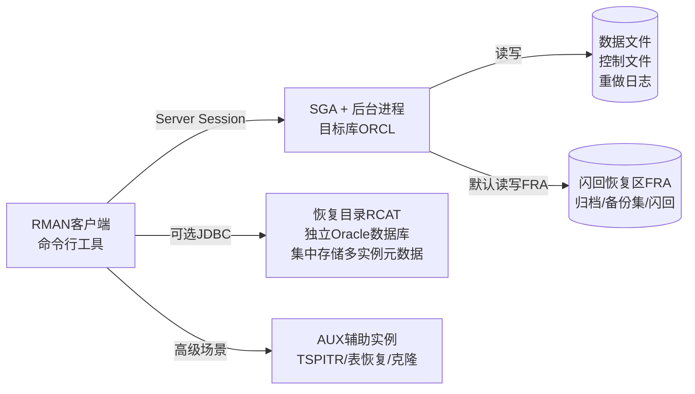

# 8.2 RMAN 工具基础使用

本节是[[MOC - 第8章]]的核心实战章节，讲解Oracle公司官方专有的备份恢复工具——**RMAN（Recovery Manager）**。作为Oracle 9i+的主流备份恢复方案，RMAN完全替代了传统[[8.1 备份分类：冷备份、热备份|用户管理的UMB冷/热备份]]，实现了空块跳过、块校验、增量备份、压缩、FRA自动管理、自动化RESTORE+RECOVER等一系列Oracle专有高级特性。

## RMAN 概述与连接方式

### RMAN 核心定位

> [!definition] Oracle 专有：RMAN（Recovery Manager）
> RMAN是Oracle数据库**内置自带**的专用于备份（Backup）、还原（Restore）、恢复（Recover）的命令行工具，无需额外安装。它通过Server Session在**服务端执行**备份I/O（区别于expdp客户端工具），直接与SGA和存储层交互，具备UMB无法实现的块级智能特性：空块跳过、块逻辑校验、增量跟踪、增量合并、备份加密等。

### 三种连接模式

| 模式 | 连接命令 | 特点 |
| ---- | ---- | ---- |
| **TARGET 本地/目标库** | `$ rman TARGET sys/oracle@ORCL` / `$ rman target /`（OS认证） | 连接要备份/恢复的目标数据库，**最常用模式** |
| **CATALOG 恢复目录** | `$ rman TARGET / CATALOG rman_user/pass@RCAT` | 可选：独立恢复目录数据库，集中存储多实例RMAN元数据，元数据保留不依赖目标库控制文件 |
| **AUXILIARY 辅助实例** | `$ rman TARGET sys/pass@PRIMARY AUXILIARY /` | 用于Data Guard备库创建、TSPITR表空间时间点恢复、表级恢复等需要辅助实例的场景 |

> [!warning] NOCATALOG（无恢复目录）vs CATALOG（有恢复目录）
> - **NOCATALOG（默认）**：RMAN元数据（备份集记录、归档记录等）**仅存于目标库控制文件**。配置简单，单实例小库用得多。
> - **CATALOG**：元数据同时写入控制文件+独立恢复目录数据库。元数据保留时间不受控制文件参数 `CONTROL_FILE_RECORD_KEEP_TIME`（默认7天）限制，适合多实例集中管理、合规长期保留需求。
>
> `> [!danger] NOCATALOG模式下丢失所有控制文件的高风险`：若NOCATALOG模式下所有控制文件多路复用成员均损坏且无自动备份，RMAN元数据**永久丢失**，RESTORE时无法列出备份集，需要DBA手动定位备份文件路径，恢复难度极大。`CONFIGURE CONTROLFILE AUTOBACKUP ON` 必须启用。

### 连接模式 Mermaid 示意图



## RMAN 核心命令一览

### REPORT 报告类

```rman
-- Oracle 19c RMAN: 报告目标库结构（数据文件、表空间）
RMAN> REPORT SCHEMA;

-- 查看哪些文件需要备份（根据保留策略判断）
RMAN> REPORT NEED BACKUP;
RMAN> REPORT NEED BACKUP DAYS 7; -- 7天内未备份的文件

-- 报告已过期的备份/归档（保留策略之外）
RMAN> REPORT OBSOLETE;

-- 报告数据库不可恢复的场景（无对应归档/备份缺口）
RMAN> REPORT UNRECOVERABLE;
```

### BACKUP 备份命令

| 命令 | 说明 |
| ---- | ---- |
| `BACKUP DATABASE;` | 全库备份（所有数据文件+控制文件自动备份若开启） |
| `BACKUP AS COPY DATABASE;` | 全库**镜像副本**备份（完整文件拷贝，同cp） |
| `BACKUP TABLESPACE users, tools;` | 指定表空间备份 |
| `BACKUP DATAFILE 4, '/u01/../users01.dbf';` | 按文件号或路径备份数据文件 |
| `BACKUP ARCHIVELOG ALL DELETE ALL INPUT;` | 备份全部归档后，**删除所有目的地的归档输入源文件**（常用每日归档备） |
| `BACKUP DATABASE PLUS ARCHIVELOG;` | 一步全备：切日志→备归档→备数据文件→备归档→备控制文件SPFILE（生产最常用全备） |
| `BACKUP INCREMENTAL LEVEL 0 DATABASE;` | 增量0级备份（同全备，作为增量1级的基底） |
| `BACKUP INCREMENTAL LEVEL 1 CUMULATIVE DATABASE;` | 累计增量1级：备份自上次0级以来的所有变化块 |
| `BACKUP INCREMENTAL LEVEL 1 DATABASE;` | 差异增量1级：备份自上次任意级别备份以来的变化块 |
| `BACKUP AS COMPRESSED BACKUPSET DATABASE;` | 启用RMAN内置压缩算法的备份，备份集更小 |
| `BACKUP CURRENT CONTROLFILE;` | 单独备份控制文件 |
| `BACKUP SPFILE;` | 单独备份SPFILE |

### CHANNEL 通道分配

RMAN备份I/O通过**通道（Channel）**执行，每个通道对应一个Server Session和一条I/O流。

```rman
-- Oracle 19c RMAN: run块中手动分配磁盘/磁带通道
RMAN> RUN {
  ALLOCATE CHANNEL c1 TYPE DISK FORMAT '/backup/rman/%d_%T_%s_%p.bak';
  ALLOCATE CHANNEL c2 TYPE DISK FORMAT '/backup2/rman/%d_%T_%s_%p.bak';
  -- 可选SBT_TAPE磁带通道: ALLOCATE CHANNEL t1 TYPE SBT_TAPE PARMS 'ENV=(...)';
  BACKUP AS COMPRESSED BACKUPSET
    DATABASE PLUS ARCHIVELOG DELETE ALL INPUT;
  BACKUP CURRENT CONTROLFILE FORMAT '/backup/rman/cf_%T_%F.bak';
  BACKUP SPFILE FORMAT '/backup/rman/spfile_%T_%p.bak';
  RELEASE CHANNEL c1;
  RELEASE CHANNEL c2;
}
```

格式符说明：
- `%d`：数据库名（DB_NAME）
- `%T`：年月日YYYYMMDD
- `%s`：备份集号
- `%p`：备份片段号
- `%U`：系统生成的唯一文件名（自动包含%u_%s_%p，推荐最常用）
- `%F`：DBID+日期+备份集号（控制文件自动备份专用唯一格式）

### RESTORE 还原 + RECOVER 恢复

```rman
-- Oracle 19c RMAN: 整库还原（从备份拷贝回原路径或新路径）
RMAN> RESTORE DATABASE;
RMAN> RESTORE DATABASE; -- 先还原再恢复
RMAN> RECOVER DATABASE; -- 应用归档日志+在线重做

-- 表空间级还原恢复（可OPEN状态下操作，非SYSTEM表空间）
RMAN> SQL 'ALTER TABLESPACE users OFFLINE IMMEDIATE';
RMAN> RESTORE TABLESPACE users;
RMAN> RECOVER TABLESPACE users;
RMAN> SQL 'ALTER TABLESPACE users ONLINE';

-- 数据文件级还原恢复
RMAN> RESTORE DATAFILE 5;
RMAN> RECOVER DATAFILE 5;

-- 从自动备份还原控制文件（NOMOUNT状态）
RMAN> STARTUP FORCE NOMOUNT;
RMAN> SET DBID = 1234567890; -- 需要预先知道DBID
RMAN> RESTORE CONTROLFILE FROM AUTOBACKUP;
RMAN> ALTER DATABASE MOUNT;
RMAN> RESTORE DATABASE;
RMAN> RECOVER DATABASE;
RMAN> ALTER DATABASE OPEN; -- 若做了不完全恢复需要RESETLOGS
```

### 维护命令：LIST / CROSSCHECK / DELETE

```rman
-- Oracle 19c RMAN: 列出所有备份信息
RMAN> LIST BACKUP SUMMARY;          -- 汇总表视图（最快速概览）
RMAN> LIST BACKUP;                  -- 详细列表
RMAN> LIST BACKUP OF DATABASE;      -- 仅数据文件备份
RMAN> LIST BACKUP OF ARCHIVELOG ALL;-- 仅归档备份
RMAN> LIST BACKUP OF CONTROLFILE;   -- 仅控制文件备份
RMAN> LIST COPY;                    -- 镜像副本列表

-- 核对物理文件与RMAN元数据的一致性（DBA误OS删文件后必执行）
RMAN> CROSSCHECK BACKUP;            -- 核对所有备份
RMAN> CROSSCHECK COPY;
RMAN> CROSSCHECK ARCHIVELOG ALL;    -- 核对所有归档文件
RMAN> CROSSCHECK BACKUPSET 1234;    -- 核对特定备份集号

-- 删除过期/无效备份
RMAN> DELETE OBSOLETE;              -- 按保留策略删除过期备份
RMAN> DELETE EXPIRED;               -- 删除CROSSCHECK标记为EXPIRED（物理文件丢失）的元数据
RMAN> DELETE BACKUPSET 1234;        -- 删除指定备份集号+物理文件
RMAN> DELETE BACKUP;                -- 删除所有备份（> danger慎用！）
RMAN> DELETE NOPROMPT OBSOLETE;     -- 无交互确认自动删除（脚本中使用）
```

## RMAN 持久化配置（CONFIGURE）

RMAN配置保存在目标库控制文件中，一次配置永久生效（直到修改）。

```rman
-- Oracle 19c RMAN: 常用持久化配置

-- 1. 保留策略：恢复窗口30天（确保任意时间点可恢复到30天内）
CONFIGURE RETENTION POLICY TO RECOVERY WINDOW OF 30 DAYS;
-- 或 冗余2份（保留2份备份）
CONFIGURE RETENTION POLICY TO REDUNDANCY 2;
-- 禁用（不推荐）
CONFIGURE RETENTION POLICY TO NONE;

-- 2. 控制文件自动备份（> [!danger] 必须开启！）
CONFIGURE CONTROLFILE AUTOBACKUP ON;
CONFIGURE CONTROLFILE AUTOBACKUP FORMAT FOR DEVICE TYPE DISK TO '/backup/rman/cf_%F';

-- 3. 默认设备类型为磁盘，并行度2，默认压缩备份集
CONFIGURE DEFAULT DEVICE TYPE TO DISK;
CONFIGURE DEVICE TYPE DISK PARALLELISM 2 BACKUP TYPE TO COMPRESSED BACKUPSET;

-- 4. 归档日志删除策略：备份1次到磁带后允许删除，且所有备库APPLIED后才删
CONFIGURE ARCHIVELOG DELETION POLICY TO BACKED UP 1 TIMES TO SBT_TAPE APPLIED ON ALL STANDBY;

-- 5. 备份优化（相同文件相同内容跳过重复备份）
CONFIGURE BACKUP OPTIMIZATION ON;

-- 6. 查看所有当前配置
SHOW ALL;
```

## 备份集 Backup Set vs 镜像副本 Image Copy

| 维度 | 备份集 Backup Set（RMAN默认格式） | 镜像副本 Image Copy |
| ---- | ---- | ---- |
| **生成方式** | `BACKUP AS [COMPRESSED] BACKUPSET ...` | `BACKUP AS COPY ...` |
| **空块处理** | **自动跳过从未使用的数据块**，备份集远小于原文件 | 完全复制数据文件字节流，等同OS cp，空块也备份 |
| **压缩** | RMAN内置压缩算法（基本/中/高级）+ 第三方介质管理器压缩 | 只能OS层gzip压缩 |
| **块校验** | 每个块写时自动做逻辑校验，校验错误标记CORRUPT | 无块校验，原样拷贝 |
| **多文件合并** | 多个数据文件块可合并写入同一备份片段 | 一个文件一个镜像副本，一一对应 |
| **RESTORE速度** | RMAN自动选择最优备份链还原，支持增量合并还原 | 可直接SWITCH DATABASE TO COPY即时切换为数据文件，不需拷贝（极快） |
| **恢复场景** | 全场景 | 数据库级/数据文件级快速切换、增量合并更新 |

## RMAN 常用动态性能视图

| 视图 | 用途 |
| ---- | ---- |
| **V$RMAN_BACKUP_JOB_DETAILS** | 每次RMAN备份作业的汇总信息：开始/结束时间、输入/输出字节数、压缩比、耗时、状态 |
| **V$BACKUP_SET / V$BACKUP_PIECE** | 备份集与备份片段信息 |
| **V$BACKUP_DATAFILE** | 数据文件备份的详细信息：检查点SCN、增量级别、块数 |
| **V$RMAN_STATUS** | RMAN会话运行状态、正在执行的命令、进度 |

```sql
-- Oracle 19c: 查询最近7天RMAN备份作业统计
SELECT session_key, session_recid, start_time, end_time,
       status, output_bytes_display, input_bytes_display,
       compression_ratio, time_taken_display, output_device_type
FROM   v$rman_backup_job_details
WHERE  start_time >= sysdate - 7
ORDER  BY start_time DESC;
```

> [!warning] RMAN 脚本最佳实践
> - 使用 `RUN {}` 块封装完整作业，通道分配在块内，异常退出时自动RELEASE。
> - 脚本开头 `ALLOCATE CHANNEL ...` 结尾 `RELEASE CHANNEL` 成对，避免通道泄漏。
> - 日志重定向：`rman target / cmdfile=/scripts/full_backup.rman log=/backup/log/full_$(date +%Y%m%d).log` 保留每次执行日志。
> - 关键作业后主动 `CROSSCHECK`，确认备份可用于恢复。

## 小结

> [!summary] 本节核心
> - RMAN是Oracle专有内置备份恢复工具，服务端执行，默认NOCATALOG模式元数据存控制文件，CATALOG模式独立恢复目录数据库集中管理。`> [!danger] NOCATALOG必须开启控制文件自动备份`。
> - 核心命令：BACKUP（DATABASE/TABLESPACE/DATAFILE/ARCHIVELOG/增量0/1级+PLUS ARCHIVELOG生产首选）、RESTORE、RECOVER、LIST、CROSSCHECK、DELETE OBSOLETE/EXPIRED。
> - 持久化配置：CONFIGURE RETENTION POLICY（30天恢复窗口/冗余2）、CONTROLFILE AUTOBACKUP ON、PARALLELISM + COMPRESSED BACKUPSET、BACKUP OPTIMIZATION ON。
> - 备份集Backup Set（默认）自动跳过空块+压缩+校验，体积小恢复稳；镜像副本Image Copy可SWITCH即时切换，适合增量合并快速恢复。
> - 通道FORMAT符：%d %T %s %p %U %F 组合生成可读唯一文件名。V$RMAN_BACKUP_JOB_DETAILS监控作业。

## 关联

- 本章入口：[[MOC - 第8章]]
- 先修：[[8.1 备份分类：冷备份、热备份]]（UMB vs RMAN对比、增量策略）、[[MOC - 第7章]]（ARCHIVELOG模式、归档日志作为RECOVER输入）
- 后续：[[8.3 完全恢复与不完全恢复]]（RESTORE+RECOVER组合实现两类恢复）、[[8.4 闪回技术基础]]（FRA+闪回日志+RMAN）
