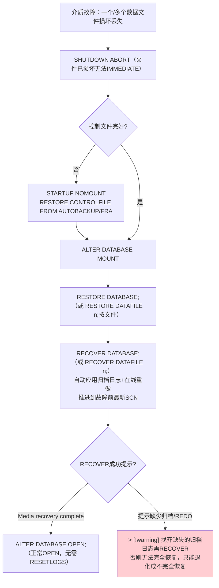
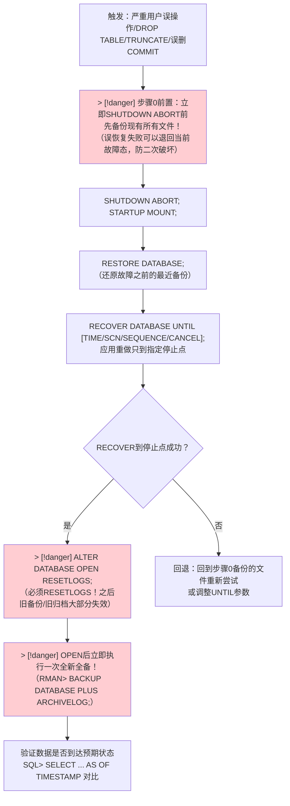

# 8.3 完全恢复与不完全恢复

本节是[[MOC - 第8章]]中**最具生产实战价值**的内容，讲解Oracle数据库发生介质故障或严重逻辑错误后的两类核心恢复方案：**完全恢复（Complete Recovery）**与**不完全恢复（Incomplete Recovery，又称数据库时间点恢复DBPITR）**。所有恢复流程基于[[8.2 RMAN工具基础使用|RMAN]]的RESTORE+RECOVER组合，核心依赖[[MOC - 第7章|第7章]]的重做日志+归档日志形成的完整重做流。

## 恢复的三类故障场景对比

| 恢复类型 | 别名 | 恢复目标时刻 | 典型场景 | 是否 OPEN RESETLOGS |
| ---- | ---- | ---- | ---- | ---- |
| **崩溃恢复 Crash Recovery** | 实例恢复 Instance Recovery | 故障前最新时刻（自动） | 断电/实例崩溃，无物理文件损坏 | 否（SMON自动完成REDO+UNDO后正常OPEN） |
| **完全恢复 Complete Recovery** | 介质恢复 Media Recovery | **故障前最新时刻** | 数据文件介质损坏（磁盘坏、文件误删），**所有归档日志完整可用** | 否（所有已提交事务都应用，序列号继续） |
| **不完全恢复 Incomplete Recovery** | DBPITR数据库时间点恢复 | **故障前某中间时刻**（时间/SCN/序列号/取消） | 严重用户误操作（DROP/TRUNCATE/错误DML COMMIT）、丢失某段归档、CURRENT日志损坏 | **必须 OPEN RESETLOGS**（重置序列号从1开始，旧归档失效，新分支Incarnation） |

> [!note] Oracle 专有术语：数据库化身 Incarnation
> 每次执行 `OPEN RESETLOGS`，Oracle创建一个新的「数据库化身（Incarnation / Database Incarnation）」。V$DATABASE_INCARNATION 视图记录所有历史化身，每个化身有独立RESETLOGS_CHANGE#和RESETLOGS_TIME。恢复时RMAN必须知道当前是哪个化身，才能正确选择对应化身下的备份与归档。通用数据库通常只记录简单分支ID，Oracle的Incarnation体系（RESETLOGS SCN+Resetlogs ID+检查点计数多重校验）是其专有高级恢复保障机制。

## 完全恢复（Complete Recovery）

> [!definition] 完全恢复
> 把数据库从备份还原后，**应用所有可用的归档日志+在线重做日志**，将数据库推进到**故障前最新的SCN时刻**，**不丢失任何已提交事务**。恢复完成后用普通 `ALTER DATABASE OPEN;` 打开，日志序列号继续递增，无需RESETLOGS。

### 完全恢复的 Mermaid 完整流程



### 场景一：非 SYSTEM 表空间单个数据文件丢失（可OPEN状态下恢复）

> [!tip] 生产最佳实践：非核心表空间文件损坏→在线恢复不停库
> 只要不是SYSTEM/UNDO表空间，数据库可保持OPEN状态，用户正常访问其他表空间，只把损坏表空间OFFLINE→RESTORE→RECOVER→ONLINE。业务停机时间极短（仅ONLINE瞬间）。

```rman
-- Oracle 19c RMAN: USERS表空间的5号数据文件丢失损坏，数据库仍OPEN中
-- 步骤1：仅把损坏数据文件OFFLINE（保持数据库OPEN！）
RMAN> SQL 'ALTER DATABASE DATAFILE 5 OFFLINE';
-- 或SQL*Plus：ALTER DATABASE DATAFILE 5 OFFLINE;

-- 步骤2：从RMAN备份还原该数据文件
RMAN> RESTORE DATAFILE 5;
-- 或：RESTORE TABLESPACE users;

-- 步骤3：应用归档+在线重做，完全恢复该文件
RMAN> RECOVER DATAFILE 5;
-- 或：RECOVER TABLESPACE users;

-- 步骤4：恢复成功后ONLINE
RMAN> SQL 'ALTER DATABASE DATAFILE 5 ONLINE';
-- 完成！用户可正常访问USERS表空间。其他表空间全程未受影响。
```

### 场景二：SYSTEM 表空间损坏（需 MOUNT 下整库恢复）

> [!danger] SYSTEM表空间丢失必须关库MOUNT恢复
> SYSTEM表空间存放数据字典等核心元数据，一旦损坏数据库无法OPEN，甚至无法MOUNT（若控制文件也坏）。必须完整停机恢复。

```rman
-- Oracle 19c RMAN: SYSTEM表空间数据文件损坏完全恢复
-- 步骤1：停机（如果还能访问的话），否则SHUTDOWN ABORT
SHUTDOWN ABORT;
STARTUP MOUNT;

-- 步骤2：还原数据库所有数据文件（或至少还原SYSTEM相关文件）
RESTORE DATABASE;

-- 步骤3：完全恢复（RMAN自动找所有归档+在线重做应用）
RECOVER DATABASE;

-- 步骤4：正常打开
ALTER DATABASE OPEN;
```

### 完全恢复 vs 崩溃恢复 vs 逻辑错误恢复

| 对比项 | 崩溃恢复（SMON自动） | 完全恢复（DBA手动） | 不完全恢复（DBA手动） |
| ---- | ---- | ---- | ---- |
| 触发场景 | 断电/实例崩溃，文件完好 | 数据文件介质损坏 | 用户误操作/丢失归档/CURRENT损坏 |
| 执行者 | SMON后台进程自动 | DBA用RMAN手动RESTORE+RECOVER | DBA用RMAN手动RESTORE+UNTIL RECOVER |
| 是否需要RESTORE | 不需要（文件在原地） | **必须**先从备份还原损坏文件 | **必须**先还原整库备份 |
| 重做应用范围 | 在线重做日志 | 归档日志+在线重做 | 从备份SCN到指定时间/SCN的重做 |
| 数据丢失 | 无（不丢已提交） | 无（完全） | 有（指定点之后事务全部丢弃） |
| OPEN方式 | 直接OPEN | 直接OPEN | 必须OPEN RESETLOGS |

## 不完全恢复（Incomplete Recovery / DBPITR）

> [!definition] 不完全恢复（数据库时间点恢复DBPITR）
> 把数据库恢复到**故障前某一中间时刻/SCN/日志序列号**，恢复时只应用到该时刻为止的重做记录，该时刻之后的所有事务**全部丢弃**。完成后必须以 `ALTER DATABASE OPEN RESETLOGS;` 打开：日志序列号重置为1，旧归档在新化身下失效，必须立即做新全备。

### 四类不完全恢复类型

| 类型 | 命令 | 典型场景 |
| ---- | ---- | ---- |
| **UNTIL TIME 基于时间** | `RECOVER DATABASE UNTIL TIME "TO_DATE('...')"` | 误操作发生时刻明确：如14:30误DROP了表 |
| **UNTIL SCN 基于系统改变号** | `RECOVER DATABASE UNTIL SCN 12345678` | 通过LogMiner/闪回查询精确定位误操作SCN（最精确） |
| **UNTIL SEQUENCE 基于日志序列号** | `RECOVER DATABASE UNTIL SEQUENCE 999 THREAD 1` | 丢失序列号1000+的归档，最多只能恢复到999 |
| **UNTIL CANCEL 基于取消** | `RECOVER DATABASE UNTIL CANCEL;`（手动输入CANCEL停止） | 日志有缺口无法自动判断、无法精确时间的老式恢复场景 |

### 不完全恢复的 Mermaid 标准流程



> [!danger] 不完全恢复前置黄金法则：先备份再动手
> 做任何不完全恢复前，**必须先备份当前故障态下的所有数据文件、控制文件、在线重做、归档日志**到安全位置。一旦误判停止点恢复到错误时刻，还可以退回故障态重新选择更早的备份、调整UNTIL参数重跑——没有这个退路就是不可逆操作。

### UNTIL TIME / SCN / SEQUENCE 完整RMAN示例

```rman
-- Oracle 19c RMAN: UNTIL TIME 基于时间不完全恢复
-- 场景：14:30误DROP了HR.EMPLOYEES表，要恢复到14:29:59

-- > [!danger] 步骤0：先备份当前故障态所有文件！
-- OS：cp -r /u01/app/oracle/oradata/ORCL /backup/pre_incarnation/

SHUTDOWN ABORT;
STARTUP MOUNT;

RUN {
  SET UNTIL TIME "TO_DATE('2024-01-15 14:29:59', 'YYYY-MM-DD HH24:MI:SS')";
  RESTORE DATABASE;
  RECOVER DATABASE;
}
ALTER DATABASE OPEN RESETLOGS;

-- > [!danger] OPEN RESETLOGS后立即全备！！！
BACKUP AS COMPRESSED BACKUPSET DATABASE PLUS ARCHIVELOG DELETE ALL INPUT;
BACKUP CURRENT CONTROLFILE FORMAT '/backup/rman/cf_reset_%F.bak';
BACKUP SPFILE FORMAT '/backup/rman/spfile_reset_%U.bak';
```

```rman
-- Oracle 19c RMAN: UNTIL SCN 基于SCN（最精确，推荐）
-- 先用闪回查询或LogMiner定位误操作前的SCN
-- SQL> SELECT versions_xid, versions_startscn FROM hr.employees VERSIONS BETWEEN SCN MINVALUE AND MAXVALUE ...;
-- 假设误操作SCN是 123456789，恢复到误操作前SCN 123456788

SHUTDOWN ABORT;
STARTUP MOUNT;
RUN {
  SET UNTIL SCN 123456788;
  RESTORE DATABASE;
  RECOVER DATABASE;
}
ALTER DATABASE OPEN RESETLOGS;
BACKUP DATABASE PLUS ARCHIVELOG; -- 立即新全备
```

```rman
-- Oracle 19c RMAN: UNTIL SEQUENCE 基于序列号
-- 场景：序列号1000的归档日志彻底丢失，最多只能恢复到999应用完

SHUTDOWN ABORT;
STARTUP MOUNT;
RUN {
  SET UNTIL SEQUENCE 1000 THREAD 1;  -- 应用到999为止（不包含1000）
  RESTORE DATABASE;
  RECOVER DATABASE;
}
ALTER DATABASE OPEN RESETLOGS;
BACKUP DATABASE PLUS ARCHIVELOG;
```

### Oracle 12c+ 专有：单表时间点恢复（Recover Table）

> [!note] Oracle 12c+专有特性：单表级 PITR（不需整库恢复）
> 若只误DROP/TRUNCATE了单个表，不需要整库做不完全恢复（影响所有业务），Oracle 12c RMAN提供**单表时间点恢复 RECOVER TABLE**：内部自动创建一个临时辅助实例（AUXILIARY DESTINATION），只恢复该表到辅助实例再导出导回主库，**其他表/业务不受影响，主库不重启**。

```rman
-- Oracle 19c RMAN: 单表时间点恢复（12c+专有）
-- 场景：15:05误DROP了HR.COUNTRIES表，恢复到15:04
RMAN> RECOVER TABLE HR.COUNTRIES
  UNTIL TIME "TO_DATE('2024-01-15 15:04:00', 'YYYY-MM-DD HH24:MI:SS')"
  AUXILIARY DESTINATION '/u02/rman_aux/';
  -- RMAN内部：创建临时实例→还原SYSTEM/UNDO/SYSAUX+该表所属表空间→
  --         在辅助实例RECOVER到15:04→Data Pump导出→导入回主库
-- 完成后验证：SQL> SELECT count(*) FROM hr.countries;
```

## 恢复进度监控视图

| 视图 | 关键信息 |
| ---- | ---- |
| **V$RECOVERY_PROGRESS** | RECOVER命令执行进度：完成百分比、剩余时间、每秒应用的redo块 |
| **V$RECOVER_FILE** | 需要恢复的数据文件列表：FILE#、ONLINE_STATUS、ERROR、CHANGE# |
| **V$RECOVERY_LOG** | RECOVER还需要但尚未应用的归档日志列表（提示缺哪些归档） |
| **V$MANAGED_STANDBY / V$DATAGUARD_PROCESS** | Data Guard环境MRP/LSP恢复进程状态 |

```sql
-- Oracle 19c: 监控恢复进度
SELECT opname, sofar, totalwork, units,
       round(sofar/totalwork*100,2) percent_done,
       elapsed_seconds, time_remaining
FROM   v$recovery_progress
WHERE  opname IN ('Media Recovery', 'RMAN Incremental Restore');
```

## 小结

> [!summary] 本节核心
> - 三类恢复：崩溃恢复（SMON自动，文件完好无介质损坏）、完全恢复（RESTORE+RECOVER所有重做，无数据丢失，直接OPEN）、不完全恢复（DBPITR，RESTORE+UNTIL TIME/SCN/SEQUENCE，之后必须OPEN RESETLOGS+立即全备）。
> - Oracle专有Incarnation：每次OPEN RESETLOGS生成新化身，V$DATABASE_INCARNATION记录所有分支，恢复时RMAN自动匹配对应化身的备份与归档。
> - 非SYSTEM表空间损坏可在数据库OPEN状态下，OFFLINE→RESTORE→RECOVER→ONLINE恢复，不停机。SYSTEM表空间必须MOUNT。
> - 不完全恢复四黄金步骤：①先备份当前故障态（> [!danger]）；②STARTUP MOUNT; ③RESTORE DATABASE; + RECOVER DATABASE UNTIL ...; ④OPEN RESETLOGS（> [!danger]）+立即新全备（> [!danger]）。
> - Oracle 12c+单表PITR：RECOVER TABLE ... UNTIL ... AUXILIARY DESTINATION 无需整库恢复，其他业务不受影响。
> - V$RECOVERY_PROGRESS监控恢复进度与剩余时间，V$RECOVER_FILE/V$RECOVERY_LOG定位缺文件。

## 关联

- 本章入口：[[MOC - 第8章]]
- 先修：[[8.1 备份分类：冷备份、热备份]]（备份是恢复的前提）、[[8.2 RMAN工具基础使用]]（RESTORE/RECOVER命令）、[[MOC - 第7章]]（归档+在线重做流是RECOVER介质恢复的输入）
- 后续：[[8.4 闪回技术基础]]（闪回数据库是不完全恢复的快速替代方案，速度快数倍）
