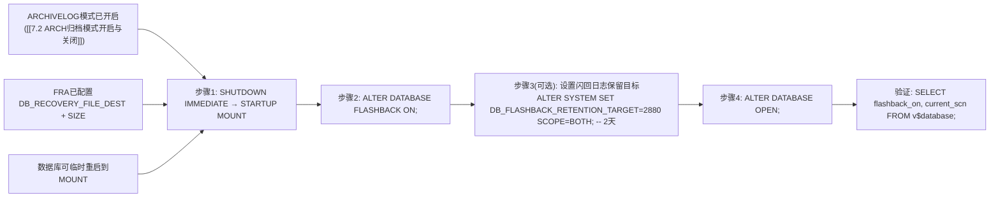

# 8.4 闪回技术基础

> [!note] Oracle 专有：闪回技术（Flashback Family）家族
> Oracle 10g起推出的**七类独有闪回技术**，是对传统备份恢复的革命性补强——传统RMAN不完全恢复需要RESTORE整个库+应用重做（TB级数据库耗时数小时），而闪回技术可在**秒级/分钟级**完成过去时间点的数据查看或回退，**无需还原备份**（除Flashback Database需闪回日志外）。七类技术形成从「查询过去数据」→「回退单表」→「回退整库」→「长期留存审计」的完整能力矩阵：**Flashback Query / Version Query / Transaction Query / Flashback Table / Flashback Drop (回收站) / Flashback Database / Flashback Data Archive (FDA)**。

## 七类闪回技术速览表

| 闪回类型 | 对象级/库级 | 底层依赖 | 典型场景 | 是否需要还原备份 | 速度 |
| ---- | ---- | ---- | ---- | ---- | ---- |
| **Flashback Query** | 表级（只读查询） | UNDO表空间回滚段 | 查询某时刻数据：误UPDATE后查看之前正确值 | 否 | 毫秒级 |
| **Flashback Version Query** | 行级（读版本链） | UNDO | 找出一行数据的所有历史变更与对应事务 | 否 | 秒级 |
| **Flashback Transaction Query** | 事务级 | UNDO + 数据字典视图 | 追查哪个事务做了破坏性操作，生成反向UNDO SQL | 否 | 秒级 |
| **Flashback Table** | 表级（逻辑回退表） | UNDO + ROW MOVEMENT | 误UPDATE/DELETE COMMIT后，把整表闪回过去SCN/时间，保留索引/触发器 | 否 | 分钟级 |
| **Flashback Drop 回收站** | 表级（还原DROP） | RECYCLEBIN逻辑回收站 | 误`DROP TABLE`后10g+一键恢复，含索引/约束/触发器 | 否 | 秒级 |
| **Flashback Database** | 数据库级（物理回退整库） | FRA内闪回日志Flashback Logs | 误DROP TABLESPACE / TRUNCATE大表 / 批量DML误操作，快速回到过去SCN，替代[[8.3 完全恢复与不完全恢复|不完全恢复]] | 否（用闪回日志） | 分钟级（传统不完全恢复小时级） |
| **Flashback Data Archive FDA** | 表级（长期归档查询） | 独立FDA表空间 | 合规审计：查询5~10年前的历史数据，不依赖UNDO保留 | 否 | 秒级 |

---

## 一、Flashback Query 闪回查询

> [!definition] 闪回查询
> `SELECT ... AS OF TIMESTAMP / SCN` 语法，直接查询**表在过去某时刻的版本**，不改变表当前数据。底层依赖UNDO表空间中保留的前像（前滚段Before Image），只要UNDO保留时间（`UNDO_RETENTION`参数）足够，即可闪回查询任意时间点。

### 语法与示例

```sql
-- Oracle 19c: 基于TIMESTAMP的闪回查询
-- 场景：10:00误更新了7369号员工工资，查看10点前的正确值
SELECT empno, ename, sal, deptno
FROM   scott.emp
AS OF  TIMESTAMP TO_TIMESTAMP('2024-01-15 09:59:59', 'YYYY-MM-DD HH24:MI:SS')
WHERE  empno = 7369;

-- Oracle 19c: 基于SCN的闪回查询（更精确，不受时钟漂移影响）
-- 先获取当前SCN：
SELECT current_scn FROM v$database;  -- 假设得到 SCN=123456789
-- 闪回123450000时刻：
SELECT * FROM scott.emp
AS OF SCN 123450000
WHERE empno = 7369;
```

> [!warning] 闪回查询失败常见问题：ORA-01555 Snapshot Too Old
> 若返回 ORA-01555快照过旧，说明UNDO表空间中对应时刻的前像已被覆盖——要么调大 `UNDO_RETENTION`（单位秒，默认900）+ 保证UNDO表空间足够大，要么用FDA/备份查询更早数据。确保表空间UNDO设置 `RETENTION GUARANTEE`（强制保留，宁可报空间满也不覆盖未过期UNDO）。

---

## 二、Flashback Version Query 版本查询

> [!definition] 闪回版本查询
> `SELECT ... VERSIONS BETWEEN TIMESTAMP/SCN MINVALUE AND MAXVALUE` 语法，查询**一行或多行在某段时间内的所有历史变更版本**，包含每次变更的操作类型（I/U/D）、事务ID（XID）、变更前后的SCN与时间戳。用于追溯某行被谁改了、改了几次。

```sql
-- Oracle 19c: 版本查询EMP表7369的所有历史版本
SELECT versions_startscn,
       versions_starttime,
       versions_endscn,
       versions_endtime,
       versions_xid      AS transaction_id,      -- 事务ID，对应FLASHBACK_TRANSACTION_QUERY
       versions_operation AS op,                  -- I=INSERT U=UPDATE D=DELETE
       empno, ename, sal, deptno
FROM   scott.emp
       VERSIONS BETWEEN TIMESTAMP
         TO_TIMESTAMP('2024-01-15 09:00:00', 'YYYY-MM-DD HH24:MI:SS')
         AND MAXVALUE
WHERE  empno = 7369
ORDER  BY versions_startscn;
```

---

## 三、Flashback Transaction Query 事务查询

> [!definition] 闪回事务查询
> 通过 `FLASHBACK_TRANSACTION_QUERY` 视图，结合版本查询得到的 `VERSIONS_XID` 事务ID，**追查完整事务历史**，并自动生成「反向UNDO SQL」——把原事务的操作反执行（原INSERT→DELETE、原DELETE→INSERT、原UPDATE→反向UPDATE），可直接复制反向SQL修复误操作。

```sql
-- Oracle 19c: 事务查询。假设VERSIONS_XID=09001400C7020000（版本查询得到）
SELECT xid, start_scn, commit_scn, commit_timestamp,
       logon_user, operation, undo_sql,
       table_name, table_owner
FROM   flashback_transaction_query
WHERE  xid = HEXTORAW('09001400C7020000')
ORDER  BY start_scn;

-- 结果UNDO_SQL列就是反向SQL，可直接复制执行来撤销原事务！
```

---

## 四、Flashback Table 闪回表

> [!definition] 闪回表
> `FLASHBACK TABLE ... TO TIMESTAMP/SCN` 把**整表逻辑回退到过去时刻**，保留表上所有索引、约束、触发器、权限等附属对象（不需要重建）。底层依赖UNDO表空间重建过去版本的行。**执行前必须ENABLE ROW MOVEMENT。**

```sql
-- Oracle 19c: 闪回表示例（误UPDATE COMMIT后回退整表）

-- > [!warning] 步骤1：必须先开启行移动
ALTER TABLE scott.emp ENABLE ROW MOVEMENT;

-- 步骤2：闪回到10:00前（TIMESTAMP方式）
FLASHBACK TABLE scott.emp
  TO TIMESTAMP TO_TIMESTAMP('2024-01-15 09:59:59', 'YYYY-MM-DD HH24:MI:SS');

-- 或 SCN 方式（更精确）
FLASHBACK TABLE scott.emp TO SCN 123450000;

-- 可选：闪回时忽略触发器影响（默认ENABLE TRIGGERS触发所有触发器）
FLASHBACK TABLE scott.emp TO SCN 123450000 ENABLE TRIGGERS;
FLASHBACK TABLE scott.emp TO SCN 123450000 DISABLE TRIGGERS;

-- 步骤3：验证后可关闭行移动（可选）
ALTER TABLE scott.emp DISABLE ROW MOVEMENT;
```

> [!note] 闪回表 vs 不完全恢复 vs 闪回数据库
> - 闪回表：只回退单个表，其他表不变，数据库不重启，分钟级，UNDO依赖。
> - 闪回数据库：回退整个库到某时刻，需重启到MOUNT，分钟级，依赖闪回日志。
> - 不完全恢复RMAN DBPITR：RESTORE整库+应用重做，小时级，需备份。

---

## 五、Flashback Drop 回收站（Recycle Bin）

> [!definition] 回收站（Recycle Bin）10g+ 默认启用
> 执行 `DROP TABLE ...` 时，Oracle**并不立即物理删除表及关联对象（索引/约束/触发器/LOB段）**，而是逻辑改名后移入回收站（`BIN$...==$0` 格式名）。通过 `FLASHBACK TABLE ... TO BEFORE DROP` 可一键还原DROP误操作。数据库级回收站参数 `recyclebin=on/off` 默认ON。

### 回收站管理

```sql
-- Oracle 19c: 查看当前用户回收站
SHOW RECYCLEBIN;
SELECT object_name, original_name, type, droptime, can_undrop, can_purge, space
FROM   user_recyclebin
ORDER  BY droptime DESC;

-- 查看DBA级所有用户回收站
SELECT owner, object_name, original_name, type, droptime, ts_name
FROM   dba_recyclebin;
```

### 还原 DROP 的表

```sql
-- Oracle 19c: 按原名还原（若回收站里有多个同名表，默认还原最新DROP的那个）
FLASHBACK TABLE scott.emp TO BEFORE DROP;

-- 按回收站内部名精确还原（推荐，无二义）
FLASHBACK TABLE "BIN$abc123def456ghi789jkl==$0" TO BEFORE DROP;

-- 还原时重命名（避免和现有表名冲突）
FLASHBACK TABLE scott.emp TO BEFORE DROP RENAME TO emp_recovered_20240115;
```

### 永久删除（绕过回收站 / 清空回收站）

```sql
-- Oracle 19c: DROP时直接物理删除（不进回收站）> [!danger] 无法恢复！
DROP TABLE scott.emp PURGE;

-- 清空当前用户回收站
PURGE RECYCLEBIN;

-- 清空DBA所有回收站（DBA权限）
PURGE DBA_RECYCLEBIN;

-- 清除指定表空间的回收站内容
PURGE TABLESPACE users;
PURGE TABLESPACE users USER scott;   -- 仅指定用户

-- 永久删除回收站某个对象
PURGE TABLE scott.emp;                               -- 按原名
PURGE INDEX "BIN$index_in_recyclebin==$0";           -- 按内部名
```

> [!danger] PURGE / DROP ... PURGE 后永久无法闪回恢复
> PURGE绕过回收站，等价于真实物理删除段。若删错，只能通过传统RMAN不完全恢复回到DROP前时刻。

---

## 六、Flashback Database 闪回数据库

> [!definition] 闪回数据库
> Oracle专有**物理级整库回退**机制，替代传统[[8.3 完全恢复与不完全恢复|RMAN不完全恢复]]的快速方案：提前启用后，Oracle在FRA中持续写**闪回日志（Flashback Log）**——记录「每个数据块被修改前的旧值」。需要回退时，直接用闪回日志把所有块还原到过去SCN，再用少量重做日志填充到精确点，无需RESTORE备份。**整库闪回通常分钟级完成**（传统不完全恢复小时级）。

> [!warning] 闪回数据库≠备份！> [!danger] 闪回数据库无法替代常规备份
> 闪回日志只保存在FRA且受 `DB_FLASHBACK_RETENTION_TARGET`（默认1440分钟=1天）限制，且闪回日志不保护**介质故障**（磁盘数据文件物理损坏闪回不了）。生产必须保留RMAN完整备份策略，闪回数据库仅作为「近几天内快速回退误操作」的补充。

### 启用闪回数据库前提与步骤



```sql
-- Oracle 19c: 完整启用闪回数据库SQL

-- 前提检查
SELECT log_mode FROM v$database;                      -- 必须ARCHIVELOG
SHOW PARAMETER DB_RECOVERY_FILE_DEST;                 -- 必须配置FRA

-- 启用
SHUTDOWN IMMEDIATE;
STARTUP MOUNT;
ALTER DATABASE FLASHBACK ON;
ALTER SYSTEM SET DB_FLASHBACK_RETENTION_TARGET = 4320 SCOPE=BOTH;  -- 3天，单位分钟
ALTER DATABASE OPEN;

-- 验证
SELECT flashback_on FROM v$database;                  -- 应为 YES
SELECT oldest_flashback_scn,
       oldest_flashback_time,
       retention_target,
       flashback_size / 1024 / 1024 flashback_mb
FROM   v$flashback_database_log;                      -- 查看最早可闪回时间
```

### 闪回数据库执行

```sql
-- Oracle 19c: 闪回数据库操作（到TIMESTAMP/SCN/RESTORE POINT三种方式）
-- 场景：16:00误DROP了USERS表空间，要回到15:59

-- > [!danger] 闪回数据库必须关库MOUNT！！！
SHUTDOWN IMMEDIATE;
STARTUP MOUNT EXCLUSIVE;  -- RAC中需单实例启动

-- 方式1: 基于TIMESTAMP
FLASHBACK DATABASE TO TIMESTAMP
  TO_TIMESTAMP('2024-01-15 15:59:00', 'YYYY-MM-DD HH24:MI:SS');

-- 方式2: 基于SCN（更精确，推荐）
FLASHBACK DATABASE TO SCN 123999999;

-- 方式3: 基于RESTORE POINT保证恢复点（下面详述）
FLASHBACK DATABASE TO RESTORE POINT before_upgrade_20240115;

-- 闪回完成后，验证状态（以READ ONLY先打开检查是否闪回正确）
ALTER DATABASE OPEN READ ONLY;
SELECT count(*) FROM dba_tablespaces WHERE tablespace_name='USERS'; -- 应存在

-- 若验证正确：以 RESETLOGS 打开正式使用，立即做新全备
SHUTDOWN IMMEDIATE;
STARTUP MOUNT;
ALTER DATABASE OPEN RESETLOGS;
BACKUP DATABASE PLUS ARCHIVELOG; -- RMAN立即全备（> [!danger]）

-- 若发现闪回时间点不对：可MOUNT下重新闪回（FLASHBACK更多或RECOVER往前），
-- 直到OPEN RESETLOGS之前都可以无限次调整。
```

### 保证恢复点 Guaranteed Restore Point

> [!note] Oracle专有：保证闪回恢复点
> 普通闪回受 `DB_FLASHBACK_RETENTION_TARGET` 限制，若FRA空间压力大可能自动删除早期闪回日志。**保证恢复点（Guaranteed Restore Point）**强制保留创建该恢复点之后的所有闪回日志——无论FRA空间压力多大，除非显式DROP恢复点，否则永不删除。用于大版本升级、批量变更前的兜底快照。

```sql
-- Oracle 19c: 创建保证恢复点（大升级前执行）
CREATE RESTORE POINT before_19c_upgrade GUARANTEE FLASHBACK DATABASE;

-- 查看所有恢复点
SELECT name, scn, time, guarantee_flashback_database, storage_size/1024/1024 mb
FROM   v$restore_point;

-- 闪回到保证恢复点
FLASHBACK DATABASE TO RESTORE POINT before_19c_upgrade;

-- 使用完且确认不再需要后，必须手动DROP释放FRA空间
DROP RESTORE POINT before_19c_upgrade;
```

> [!danger] 保证恢复点会持续占用FRA空间
> 创建后所有闪回日志永久保留，FRA使用量只会增不会减。长期不删除可能导致FRA满报ORA-19809。大变更验证通过后必须及时DROP。

---

## 七、Flashback Data Archive (FDA) 闪回数据归档（12c+增强）

> [!definition] 闪回数据归档 FDA（11g推出，12c+重大增强）
> 专为**合规审计/长期历史留存**设计：不依赖UNDO（UNDO只保留几小时到几天），为指定表创建独立的FDA归档表空间，Oracle自动把每行的所有历史版本异步写入归档区。可查询**数年甚至10年前**的历史数据，完全满足金融/医疗/政务等法规审计要求。

```sql
-- Oracle 19c: FDA 基础配置示例（DBA操作）
-- 步骤1: 创建FDA表空间（独立专用）
CREATE TABLESPACE fda_audit DATAFILE '/u03/fda/fda_audit01.dbf' SIZE 100G AUTOEXTEND ON NEXT 10G;

-- 步骤2: 创建闪回归档区，配额500G，保留7年
CREATE FLASHBACK ARCHIVE DEFAULT fda_7year
  TABLESPACE fda_audit QUOTA 500G RETENTION 7 YEAR;

-- 步骤3: 给需要审计的表启用FDA
ALTER TABLE hr.employees FLASHBACK ARCHIVE;                -- 使用默认FDA区
ALTER TABLE hr.departments FLASHBACK ARCHIVE fda_7year;    -- 指定FDA区

-- 验证：查询7年前的员工记录（语法和Flashback Query一样，但数据来自FDA不是UNDO）
SELECT * FROM hr.employees
AS OF TIMESTAMP ADD_MONTHS(SYSDATE, -84)  -- 84个月=7年前
WHERE employee_id = 100;

-- 禁用FDA
ALTER TABLE hr.employees NO FLASHBACK ARCHIVE;

-- 查看FDA字典
SELECT * FROM dba_flashback_archive;
SELECT * FROM dba_flashback_archive_tables;
```

## 小结

> [!summary] 本节核心
> - **Oracle专有七类闪回技术**从查询到回退、从表级到库级、从短期UNDO到长期FDA形成完整矩阵：Flashback Query（AS OF查询）、Version Query（VERSIONS BETWEEN版本链）、Transaction Query（XID查事务+生成反向UNDO_SQL）、Flashback Table（整表闪回，需ENABLE ROW MOVEMENT，保留索引/触发器）、Flashback Drop（RECYCLEBIN回收站一键还原DROP TABLE）、Flashback Database（物理整库回退，FRA内闪回日志，分钟级替代RMAN不完全恢复但不替代备份）、Flashback Data Archive FDA（7年+合规长期留存，不依赖UNDO）。
> - Flashback Database前提：ARCHIVELOG模式 + FRA + MOUNT状态开启。DB_FLASHBACK_RETENTION_TARGET分钟。闪回后READ ONLY验证→OPEN RESETLOGS→立即全备。Guaranteed Restore Point强制保留恢复点之后的闪回日志，用于升级兜底。
> - 回收站DROP可还原，PURGE永久删除。闪回查询ORA-01555需调UNDO_RETENTION+RETENTION GUARANTEE。
> - 七类闪回都是**无需还原备份**的快速恢复能力（除闪回数据库需闪回日志外），是Oracle在高可用、DBA操作便捷性上的独有核心竞争力，但**均不能替代RMAN常规备份策略**（介质故障、超过闪回窗口的场景仍需RMAN）。

## 关联

- 本章入口：[[MOC - 第8章]]
- 先修：[[MOC - 第7章]]（FRA、ARCHIVELOG模式是Flashback Database前提）、[[8.3 完全恢复与不完全恢复]]（Flashback Database是不完全恢复的快速替代）
- 后续：[[9.1 PL-SQL块结构|9.1 PL/SQL块结构]]（逻辑错误场景下闪回+PL/SQL编写自动修复脚本）、[[第10章 性能监控与基础优化]]（闪回查询与AWR历史快照结合做性能回溯分析）
