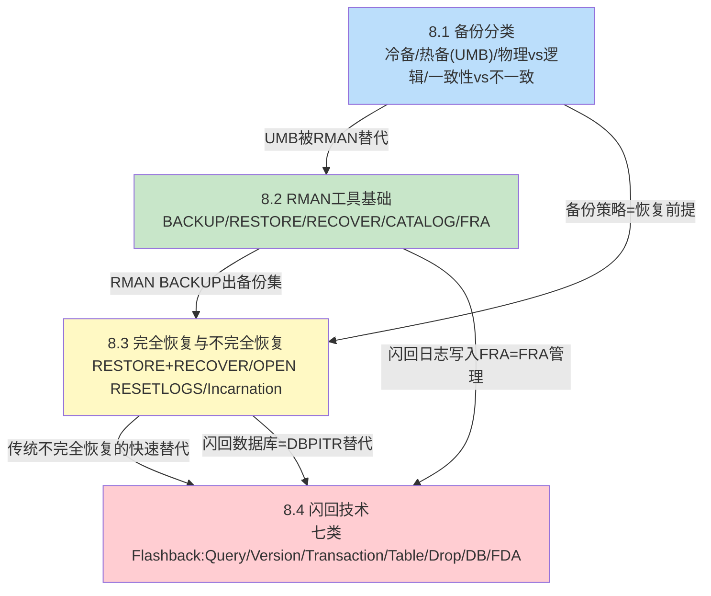

# MOC - 第8章 Oracle备份与恢复

> [!info] 本章定位
> 本章是Oracle数据库DBA核心运维能力的「最终保障环节」：在[[MOC - 第7章]]重做日志+归档模式构成的连续重做流之上，系统讲解备份分类、RMAN工具、完全/不完全恢复、以及Oracle专有七类闪回技术。[[8.1 备份分类：冷备份、热备份]]建立物理备份分类体系，对比冷备份与UMB热备份原理；[[8.2 RMAN工具基础使用]]是本章重点——Oracle专有自动化备份工具替代传统UMB；[[8.3 完全恢复与不完全恢复]]讲解两类核心恢复流程（RESTORE+RECOVER组合与OPEN RESETLOGS）；[[8.4 闪回技术基础]]介绍从Flashback Query到Flashback Database再到FDA的七类快速恢复能力，是传统备份恢复的革命性补充。本章内容覆盖生产数据库「从日常备份策略，到介质故障恢复，再到严重误操作快速回退」的完整能力矩阵。

## 学习路线图

> [!note] 学习顺序说明
> 8.1建立分类框架：必须先理解冷备/热备底层原理，才能明白为何RMAN的Backup Set能自动跳空块+做块校验。8.2是RMAN命令大全，是8.3恢复操作的工具基础——不会BACKUP就不可能RESTORE/RECOVER。8.3在8.2基础上，用RESTORE（还原备份到磁盘）+ RECOVER（应用第7章的重做/归档）组合出完全恢复与四类不完全恢复，引入Incarnation与OPEN RESETLOGS的关键概念。8.4的七类闪回则是「Oracle专有魔法」——在传统RMAN恢复之外，提供秒级/分钟级快速回退能力，Flashback Database直接对标8.3的不完全恢复但速度快数倍。建议按序掌握。

## 知识点导航

| 节 | 主题 | 入口 | 关键概念 |
| ---- | ---- | ---- | ---- |
| 8.1 | 备份分类：冷备份、热备份 | [[8.1 备份分类：冷备份、热备份]] | 全备+增量策略、物理vs逻辑备份、冷备SHUTDOWN IMMEDIATE+OS cp、热备BEGIN/END BACKUP、Oracle专有Whole Block Image防块断裂、一致性vs不一致备份、UMB vs RMAN对比 |
| 8.2 | RMAN工具基础使用 | [[8.2 RMAN工具基础使用]] | TARGET/CATALOG/AUXILIARY连接、NOCATALOG vs CATALOG、BACKUP DATABASE PLUS ARCHIVELOG、增量Level 0/1累计/差异、Backup Set vs Image Copy、CONFIGURE持久化、保留策略、CHANNEL FORMAT符、LIST/CROSSCHECK/DELETE |
| 8.3 | 完全恢复与不完全恢复 | [[8.3 完全恢复与不完全恢复]] | 崩溃vs完全vs不完全三类恢复对比、Oracle专有Incarnation化身、非SYSTEM表空间在线OFFLINE恢复、RESTORE+RECOVER组合、四类UNTIL TIME/SCN/SEQUENCE/CANCEL、OPEN RESETLOGS+立即全备、12c+单表Recover Table PITR |
| 8.4 | 闪回技术基础 | [[8.4 闪回技术基础]] | Oracle专有七类闪回：AS OF查询、VERSIONS BETWEEN版本、FLASHBACK_TRANSACTION_QUERY生成反向SQL、FLASHBACK TABLE需ENABLE ROW MOVEMENT、RECYCLEBIN回收站FLASHBACK DROP、FLASHBACK DATABASE闪回日志+Guaranteed Restore Point、FDA闪回归档7年+合规审计 |

## 核心考点

> [!warning] 8点核心考点warning（必须掌握）
> 1. **冷备vs热备条件对比**：冷备必须SHUTDOWN IMMEDIATE（严禁SHUTDOWN ABORT后冷备，否则不一致），NOARCHIVELOG唯一可用备份方式；热备必须ARCHIVELOG模式，BEGIN BACKUP期间Oracle专有冻结文件头SCN+写Whole Block Image防Fractured Block。
> 2. **一致性备份vs不一致备份恢复差异**：一致性备份（冷备）直接OPEN不需重做；不一致备份（联机热备/RMAN备）必须ARCHIVELOG下应用归档+在线重做同步SCN才能OPEN。
> 3. **RMAN NOCATALOG控制文件自动备份>danger**：NOCATALOG模式所有元数据仅存控制文件，必须 `CONFIGURE CONTROLFILE AUTOBACKUP ON`，否则所有控制文件损坏丢失+无多路复用+无自动备份→RMAN元数据永久丢失→恢复极难。
> 4. **备份集Backup Set vs Image Copy对比**：备份集自动跳空块+压缩+块校验，体积小恢复稳；镜像副本整文件拷贝，可SWITCH DATABASE TO COPY即时切换无需拷贝，适合增量合并备份策略。
> 5. **非SYSTEM表空间在线恢复不停机**：非SYSTEM/UNDO表空间损坏→数据库可保持OPEN→`ALTER DATABASE DATAFILE n OFFLINE`→RESTORE→RECOVER→ONLINE，用户正常访问其他表空间，是生产高可用的核心操作。
> 6. **不完全恢复黄金三步+两次立即全备>danger**：①先备份当前故障态所有文件（防二次破坏）；②RESTORE DATABASE + RECOVER UNTIL ...；③OPEN RESETLOGS后立即做一次全新全备（> [!danger] 旧备份+旧归档在新化身Incarnation下失效）。
> 7. **FLASHBACK DATABASE前提与定位**：必须ARCHIVELOG+FRA配置+MOUNT开启FLASHBACK ON，用FRA内闪回日志分钟级回退整库。> [!warning] 闪回数据库无法替代RMAN备份（介质故障、超保留窗口都做不到），仅为近几天误操作的快速兜底。Guaranteed Restore Point强制保留对应闪回日志，FRA持续占空间。
> 8. **闪回技术速度对比与适用场景选择**：闪回查询（毫秒级，UNDO）→闪回表/闪回删除（秒级~分钟级，UNDO/回收站）→闪回数据库（分钟级，闪回日志=FRA）→单表PITR（RMAN RECOVER TABLE，小时级以内）→RMAN不完全恢复（小时级，备份+重做）。按误操作严重程度从小到大选择对应层级闪回/恢复。

## 自测题

> [!question] 自测题1
> 某DBA在数据库OPEN状态下做了以下操作：①执行`ALTER TABLESPACE sales BEGIN BACKUP`后，OS cp该表空间所有数据文件；②cp过程中数据库被强制`SHUTDOWN ABORT`断电；③重启后再次cp了一遍；④执行`ALTER TABLESPACE sales END BACKUP`。请指出：(1) 该备份最终是否可用？(2) 第②步ABORT断电后重启，Oracle对处于BEGIN BACKUP状态的文件做了什么自动动作？(3) 该备份是一致性备份还是不一致备份？恢复时需不需要应用重做？

> [!check] 答案
> (1) 备份最终可用。因为断电重启后Oracle自动对BEGIN BACKUP状态的文件做了END BACKUP解除冻结，再次cp得到的是完整数据文件。只要BEGIN BACKUP开始时刻到最终END BACKUP期间的重做日志完整可用，就可以用于恢复。
> (2) Oracle 10g+自动检测文件处于热备模式，SMON在实例恢复阶段自动对这些文件执行隐含的END BACKUP（无需DBA手动），然后执行常规前滚+回滚。
> (3) 是不一致备份（因为备份时数据库在OPEN状态，不同数据文件SCN不同）。恢复时必须应用备份开始时刻之后的归档日志+在线重做，把所有文件SCN同步到同一时刻才能OPEN。

> [!question] 自测题2
> 生产数据库运行在RMAN NOCATALOG模式下。某夜所有控制文件多路复用成员全部磁盘损坏（无FRA控制文件自动备份）。请问：(1) RMAN还能RESTORE控制文件吗？为什么？(2) 如果事前启用了`CONFIGURE CONTROLFILE AUTOBACKUP ON`（自动备份路径不在损坏磁盘），恢复流程是怎样的？写出关键RMAN命令。

> [!check] 答案
> (1) 不能。NOCATALOG模式下RMAN所有备份元数据仅存于目标库控制文件，所有控制文件都损坏了，RMAN无法知道自己有哪些备份、备份存在哪里。DBA只能手动查找备份文件路径，用`CREATE CONTROLFILE`重建控制文件（极繁琐且易错）。这就是为什么> [!danger] NOCATALOG模式必须强制开启控制文件自动备份，且自动备份路径与数据文件不在同一块故障域。
> (2) 流程：①SHUTDOWN ABORT→STARTUP NOMOUNT；②`SET DBID = <数据库DBID>`（DBID需事前记录或从自动备份文件名%F中解析）；③`RESTORE CONTROLFILE FROM AUTOBACKUP;`（RMAN按%F格式查找最近的控制文件自动备份并还原）；④`ALTER DATABASE MOUNT;`⑤后续常规RESTORE DATABASE+RECOVER DATABASE流程。

> [!question] 自测题3
> 10:30误执行了`DROP TABLE HR.PAYROLL`（核心薪资表）且立即COMMIT。当前时间10:35，FRA已配置且归档完整。请列出至少三种不同层级的恢复方案，按从简单快速到复杂慢速排序，并说明各自适用前提、关键SQL/RMAN命令、对业务的影响。

> [!check] 答案
> 方案一（最快，秒级，**推荐首选**）：Flashback Drop回收站。前提：`recyclebin=on`默认开启，DROP未加PURGE。命令：`FLASHBACK TABLE hr.payroll TO BEFORE DROP;`。对业务影响=0（其他表正常，DROP瞬间闪回）。
> 方案二（秒级~分钟级，次选）：Oracle 12c+ RMAN单表PITR。前提：12c+，有全备+到10:29的归档。命令：`RECOVER TABLE hr.payroll UNTIL TIME "TO_DATE('... 10:29:59', ...)" AUXILIARY DESTINATION '/u02/aux/';`。对业务影响=0（其他表不受影响，不重启数据库）。
> 方案三（分钟级，12c-或回收站清空时）：Flashback Database整库闪回。前提：提前开启`FLASHBACK ON`+闪回窗口≥6分钟。命令：SHUTDOWN→STARTUP MOUNT→`FLASHBACK DATABASE TO TIMESTAMP ...10:29...;`→READ ONLY验证→OPEN RESETLOGS→立即全备。对业务影响=需重启数据库闪回窗口内所有数据也被回退（10:30~10:29之间其他已提交的其他表操作也会被撤销！这点必须注意）。
> 方案四（小时级，兜底）：RMAN不完全恢复DBPITR。前提：有全备+归档。命令：> [!danger] 先备份当前故障态→SHUTDOWN ABORT→STARTUP MOUNT→`SET UNTIL TIME 10:29:59`→RESTORE DATABASE→RECOVER DATABASE→OPEN RESETLOGS→立即全备。对业务影响=停机时间长（RESTORE+RECOVER数小时），10:29:59之后所有事务全部丢弃。
> 选择优先级：先方案一→不行再方案二→不行方案三→最后方案四。

> [!question] 自测题4
> `ALTER DATABASE OPEN RESETLOGS`后，下列说法哪些正确？说明理由。
> A. 日志序列号重置为1，旧归档日志物理文件可以直接删除，不会有任何风险
> B. 需要立即做一次全新的全库备份，因为OPEN RESETLOGS前的大多数备份/归档在新Incarnation下无法直接用于恢复
> C. 新Incarnation产生，V$DATABASE_INCARNATION中新增一条记录
> D. 控制文件和数据文件中的检查点计数Checkpoint Cnt会重置为0

> [!check] 答案
> **B、C正确，A、D错误。**
> - A错误：OPEN RESETLOGS后的旧归档虽然在新化身下不能直接用于恢复，但在需要「跨化身闪回」或回到旧化身场景（比如OPEN错了RESETLOGS又想回去）时仍可能需要。Oracle 10g+支持通过`RESET DATABASE TO INCARNATION <旧化身号>`切回旧化身用旧备份+旧归档做恢复。直接删旧归档=堵死退路。
> - B正确：> [!danger] 新Incarnation下，之前的备份/归档对新化身的未来恢复几乎无效，必须立即做新化身下的首份全备，否则新化身之后发生介质故障将无可用备份。
> - C正确：每次OPEN RESETLOGS都生成新Incarnation，V$DATABASE_INCARNATION记录所有历史化身链，这是Oracle专有多分支恢复保障机制。
> - D错误：检查点计数（Checkpoint Count）单调递增不重置，这是Oracle专有设计——即使RESETLOGS SCN重置，检查点计数仍继续，用于OPEN时快速判断数据文件是否来自同一数据库祖先（避免错误把旧化身备份和新化身混在一起）。

## 章节导航

- 上级MOC：[[MOC - Oracle数据库管理]]
- 上一章：[[MOC - 第7章]]
- 下一章：[[MOC - 第9章]]
- 本章习题：[[MOC - 第8章习题]]
- 上一章习题：[[MOC - 第7章习题]]
