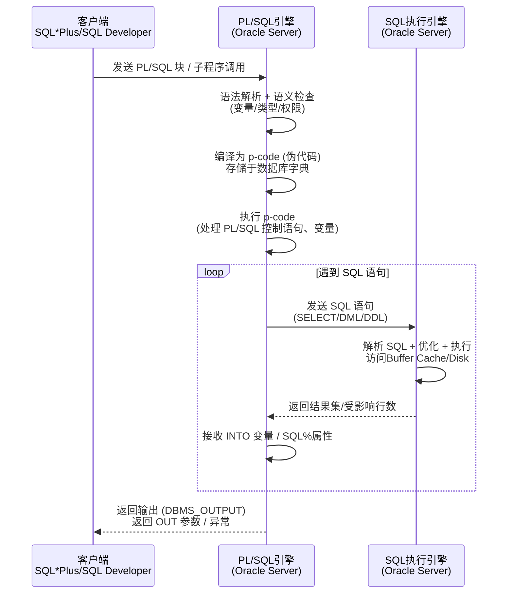

# 9.1 PL/SQL块结构

> [!definition] 定义
> **PL/SQL**（Oracle Procedural Language/SQL）是 Oracle 数据库专有的过程化扩展 SQL 编程语言。它在标准 SQL（非过程化、面向集合）的基础上，增加了变量声明、过程控制（IF/CASE 分支、LOOP 循环）、异常处理、模块化封装等能力，是 Oracle 数据库端编写业务逻辑的唯一语言。PL/SQL 运行于 Oracle 服务器端，由数据库引擎编译后执行；存储过程、函数、包、触发器、对象类型方法均以 PL/SQL 实现；客户端也可通过 SQL*Plus 直接执行匿名块。

> [!note] Oracle PL/SQL 独有
> PL/SQL 是 Oracle 专有语言，不属于 ANSI/ISO SQL 标准，仅在 Oracle 数据库（及兼容产品如 TimesTen）中可用。MySQL 使用存储过程语法与之不同，PostgreSQL 使用 PL/pgSQL，SQL Server 使用 T-SQL，彼此不可通用。

## 一、PL/SQL 特点

| 特点 | 说明 |
| ---- | ---- |
| 块结构 | 以 DECLARE-BEGIN-EXCEPTION-END 为基本单元，支持嵌套块 |
| 变量声明 | 支持标量/复合/引用类型，有 %TYPE/%ROWTYPE 继承表结构 |
| 过程控制 | IF-ELSIF-ELSE、CASE、LOOP/WHILE/FOR、GOTO、CONTINUE（11g+） |
| 异常处理 | EXCEPTION 块统一捕获，预定义/非预定义/自定义三类异常 |
| 模块化 | 子程序（过程/函数）、包（PACKAGE）封装可复用代码 |
| 服务器端执行 | 编译后存储于数据库，减少网络往返，执行效率高 |

## 二、基本块结构（三部分）

一个 PL/SQL 块由三部分组成，其中 DECLARE 和 EXCEPTION 是可选的，BEGIN...END 是必填的：

```
[DECLARE
    声明变量、常量、游标、自定义类型、局部子程序;]
BEGIN
    可执行 SQL 语句 + PL/SQL 控制语句;
[EXCEPTION
    WHEN 异常1 THEN 处理语句;
    WHEN 异常2 THEN 处理语句;
    WHEN OTHERS THEN 兜底处理;]
END;
/
```

> [!tip] `/` 的作用
> SQL*Plus / SQL Developer 中，单独一行的 `/` 表示"执行上面的 PL/SQL 块"。没有 `/` 块不会被执行，只会被缓冲。

### 匿名块示例（Oracle 19c）

```plsql
SET SERVEROUTPUT ON SIZE UNLIMITED;
DECLARE
  v_empno NUMBER(4) := 7369;
  v_ename VARCHAR2(10);
  v_sal   NUMBER(7,2);
  c_pi    CONSTANT NUMBER := 3.1415926;
BEGIN
  SELECT ename, sal INTO v_ename, v_sal FROM emp WHERE empno = v_empno;
  DBMS_OUTPUT.PUT_LINE('员工：' || v_ename || '，工资：' || v_sal);
  DBMS_OUTPUT.PUT_LINE('常量PI = ' || c_pi);
EXCEPTION
  WHEN NO_DATA_FOUND THEN
    DBMS_OUTPUT.PUT_LINE('员工不存在，员工号：' || v_empno);
  WHEN TOO_MANY_ROWS THEN
    DBMS_OUTPUT.PUT_LINE('查询返回多行，员工号不唯一');
END;
/
```

> [!example] 执行预期
> 若 emp 表中存在 empno=7369 的员工（SMITH），输出：
> ```
> 员工：SMITH，工资：800
> 常量PI = 3.1415926
> ```
> 若不存在，输出 "员工不存在，员工号：7369"。

## 三、标识符命名规则与变量声明

### 命名约定（行业惯例）

| 前缀 | 用途 | 示例 |
| ---- | ---- | ---- |
| `v_` | 变量 Variable | `v_ename`, `v_sal` |
| `c_` | 常量 Constant | `c_pi`, `c_tax_rate` |
| `e_` | 异常 Exception | `e_no_emp`, `e_sal_high` |
| `r_` | 记录 Record / ROWTYPE | `r_emp`, `r_dept` |
| `t_` | 自定义类型 Type / TABLE | `t_emp_tab`, `t_name_arr` |
| 无统一前缀 | 游标 Cursor（多直接描述含义） | `c_emp`, `cur_dept` |
| `p_` | 过程/函数参数 Parameter | `p_empno`, `p_rate` |

### 变量声明语法

```plsql
变量名 类型 [NOT NULL] [:= 默认值 | DEFAULT 值];
```

```plsql
DECLARE
  v_name    VARCHAR2(20) NOT NULL := '张三';
  v_age     NUMBER(3) DEFAULT 25;
  v_birth   DATE := SYSDATE - 365 * 25;
  c_tax     CONSTANT NUMBER(4,2) := 0.13;
BEGIN
  DBMS_OUTPUT.PUT_LINE(v_name || ', 年龄 ' || v_age || ', 税率 ' || c_tax);
END;
/
```

### %TYPE — 类型继承（列级）

自动继承表列或已有变量的类型与长度，表结构变更时 PL/SQL 代码自动适配，无需硬编码修改：

```plsql
DECLARE
  v_ename emp.ename%TYPE;
  v_sal   emp.sal%TYPE;
  v_sal2  v_sal%TYPE;  -- 也可继承变量类型
BEGIN
  SELECT ename, sal INTO v_ename, v_sal FROM emp WHERE empno = 7499;
  DBMS_OUTPUT.PUT_LINE(v_ename || ' 工资 ' || v_sal);
END;
/
```

### %ROWTYPE — 行记录类型（表级）

声明一个记录类型变量，字段与表的**所有列一一对应**（列名、类型、顺序一致），适合整行读写：

```plsql
DECLARE
  r_emp emp%ROWTYPE;
BEGIN
  SELECT * INTO r_emp FROM emp WHERE empno = 7521;
  DBMS_OUTPUT.PUT_LINE(r_emp.empno || ' ' || r_emp.ename || ' ' || r_emp.job || ' ' || r_emp.sal);
END;
/
```

> [!tip] 何时用 %TYPE / %ROWTYPE
> - 只涉及表的少数几个列 → 用多个 `%TYPE` 变量；
> - 涉及表的大部分/全部列，或需要在过程间传递整行 → 用 `%ROWTYPE`；
> - 两者均是 Oracle PL/SQL 独有的语法，非标准 SQL。

### 复合类型

```plsql
DECLARE
  -- 自定义RECORD记录类型
  TYPE t_emp_rec IS RECORD (
    empno NUMBER(4),
    ename VARCHAR2(10),
    sal   NUMBER(7,2)
  );
  r_emp t_emp_rec;

  -- INDEX BY表（关联数组，类似哈希/字典，Oracle独有）
  TYPE t_name_tab IS TABLE OF VARCHAR2(10) INDEX BY BINARY_INTEGER;
  tab_names t_name_tab;

  -- VARRAY 变长数组
  TYPE t_num_arr IS VARRAY(10) OF NUMBER;
  arr_nums t_num_arr := t_num_arr(1, 2, 3);
BEGIN
  tab_names(1) := 'SMITH';
  tab_names(2) := 'ALLEN';
  DBMS_OUTPUT.PUT_LINE(tab_names(1) || ' ' || tab_names(2));
  DBMS_OUTPUT.PUT_LINE('VARRAY长度=' || arr_nums.COUNT);
END;
/
```

## 四、PL/SQL 数据类型

```mermaid
flowchart TD
    A[PL/SQL数据类型] --> B[标量类型Scalar]
    A --> C[复合类型Composite]
    A --> D[引用类型Reference]
    A --> E[大对象类型LOB]

    B --> B1[CHAR / VARCHAR2 / NCHAR / NVARCHAR2]
    B --> B2[NUMBER / PLS_INTEGER / BINARY_INTEGER / BINARY_FLOAT / BINARY_DOUBLE]
    B --> B3[DATE / TIMESTAMP / TIMESTAMP WITH TIME ZONE / INTERVAL]
    B --> B4[BOOLEAN(TRUE/FALSE/NULL)]

    C --> C1[RECORD 自定义记录]
    C --> C2[TABLE OF ... INDEX BY 关联数组]
    C --> C3[VARRAY 变长数组]
    C --> C4[Nested Table 嵌套表]

    D --> D1[REF CURSOR 游标变量]
    D --> D2[REF 对象类型引用]

    E --> E1[CLOB / NCLOB 字符大对象]
    E --> E2[BLOB 二进制大对象]
    E --> E3[BFILE 外部文件指针（只读）]
```

> [!note] BOOLEAN 类型
> PL/SQL 的 BOOLEAN 类型（TRUE/FALSE/NULL）是 PL/SQL 独有，**不能直接用于 SQL 列类型**（Oracle 表列没有 BOOLEAN，需用 NUMBER(1) 或 CHAR(1) 模拟）。同样 PLS_INTEGER/BINARY_INTEGER 也是 PL/SQL 专用，效率高于 NUMBER。

## 五、程序控制语句

### 5.1 条件分支

```plsql
DECLARE
  v_sal NUMBER(7,2) := 3000;
BEGIN
  IF v_sal < 1500 THEN
    DBMS_OUTPUT.PUT_LINE('低工资');
  ELSIF v_sal < 5000 THEN
    DBMS_OUTPUT.PUT_LINE('中等工资');
  ELSE
    DBMS_OUTPUT.PUT_LINE('高工资');
  END IF;

  -- CASE语句（PL/SQL专用，区别于SQL中的CASE表达式）
  CASE
    WHEN v_sal < 1500 THEN DBMS_OUTPUT.PUT_LINE('低');
    WHEN v_sal < 5000 THEN DBMS_OUTPUT.PUT_LINE('中');
    ELSE DBMS_OUTPUT.PUT_LINE('高');
  END CASE;
END;
/
```

### 5.2 循环结构

```plsql
DECLARE
  v_i NUMBER := 1;
BEGIN
  -- (1) 基础LOOP + EXIT WHEN
  v_i := 1;
  LOOP
    DBMS_OUTPUT.PUT('LOOP ' || v_i || ' ');
    v_i := v_i + 1;
    EXIT WHEN v_i > 3;
  END LOOP;
  DBMS_OUTPUT.NEW_LINE;

  -- (2) WHILE 条件 LOOP
  v_i := 1;
  WHILE v_i <= 3 LOOP
    DBMS_OUTPUT.PUT('WHILE ' || v_i || ' ');
    v_i := v_i + 1;
  END LOOP;
  DBMS_OUTPUT.NEW_LINE;

  -- (3) FOR 计数器 IN [REVERSE] 下限..上限 LOOP
  FOR i IN 1..3 LOOP
    DBMS_OUTPUT.PUT('FOR ' || i || ' ');
  END LOOP;
  DBMS_OUTPUT.NEW_LINE;

  FOR i IN REVERSE 1..3 LOOP
    DBMS_OUTPUT.PUT('FOR-REV ' || i || ' ');
  END LOOP;
  DBMS_OUTPUT.NEW_LINE;
END;
/
```

> [!tip] CONTINUE（Oracle 11g+）
> 在循环中使用 `CONTINUE;` 跳过本次循环剩余部分，进入下一次迭代；`CONTINUE WHEN 条件;` 条件式跳过。Oracle 10g 及之前没有 CONTINUE，用 GOTO + 标签模拟。

## 六、内嵌 SQL 与动态 SQL

### 6.1 静态 SQL

PL/SQL 中可直接嵌入 DML 语句与 SELECT INTO：

```plsql
DECLARE
  v_deptno NUMBER(2) := 50;
BEGIN
  -- INSERT
  INSERT INTO dept VALUES (v_deptno, 'TEST_DEPT', 'BEIJING');
  -- UPDATE
  UPDATE emp SET sal = sal * 1.1 WHERE deptno = 20;
  -- DELETE（用隐式游标属性 SQL%ROWCOUNT 获取影响行数）
  DELETE FROM emp WHERE empno = 9999;
  DBMS_OUTPUT.PUT_LINE('DELETE影响行数：' || SQL%ROWCOUNT);
  -- MERGE（Oracle专有语法，11g+增强）
  MERGE INTO dept d
    USING (SELECT 60 deptno, 'HR' dname, 'SH' loc FROM dual) s
    ON (d.deptno = s.deptno)
    WHEN MATCHED THEN UPDATE SET d.dname = s.dname
    WHEN NOT MATCHED THEN INSERT VALUES (s.deptno, s.dname, s.loc);
  COMMIT;
END;
/
```

### 6.2 动态 SQL（Native Dynamic SQL）

SQL 语句在运行时拼接生成（表名/列名/DDL 不能静态写死的场景），使用 `EXECUTE IMMEDIATE`：

```plsql
DECLARE
  v_table_name VARCHAR2(30) := 'EMP';
  v_col_name   VARCHAR2(30) := 'SAL';
  v_empno      NUMBER(4)    := 7369;
  v_result     NUMBER(7,2);
  v_sql        VARCHAR2(4000);
BEGIN
  -- 动态SELECT，用 INTO 接收返回值，USING 绑定参数（防止SQL注入）
  v_sql := 'SELECT ' || v_col_name || ' FROM ' || v_table_name || ' WHERE empno = :1';
  EXECUTE IMMEDIATE v_sql INTO v_result USING v_empno;
  DBMS_OUTPUT.PUT_LINE('动态查询结果：' || v_result);

  -- 动态DDL（不能静态写在PL/SQL中的CREATE/DROP/ALTER等）
  EXECUTE IMMEDIATE 'CREATE TABLE test_tab (id NUMBER, name VARCHAR2(20))';
  EXECUTE IMMEDIATE 'DROP TABLE test_tab';
END;
/
```

> [!warning] 动态 SQL 的绑定变量
> 动态 SQL 中传入值必须用 `USING` 绑定参数（占位符 `:1, :2`），禁止直接字符串拼接用户输入，否则存在**SQL 注入**风险。DDL 语句中表名/列名虽需拼接，但必须做白名单校验。

## 七、DBMS_OUTPUT 标准输出包

Oracle 内置包，用于 PL/SQL 块在客户端输出调试信息：

| 子程序 | 作用 |
| ---- | ---- |
| `DBMS_OUTPUT.PUT_LINE(字符串)` | 输出一行（自动加换行） |
| `DBMS_OUTPUT.PUT(字符串)` | 输出不换行 |
| `DBMS_OUTPUT.NEW_LINE` | 输出一个换行符 |
| `DBMS_OUTPUT.ENABLE(n)` | 启用输出，n 为缓冲区大小（字节），默认 20000 |
| `DBMS_OUTPUT.DISABLE` | 禁用输出 |

> [!note] SET SERVEROUTPUT ON
> SQL*Plus / SQL Developer 中默认不显示 DBMS_OUTPUT 的内容，必须先执行 `SET SERVEROUTPUT ON [SIZE UNLIMITED|buffer_size]` 才能看到输出。SIZE 默认 20000 字节，超过会报错 `ORA-20000: ORU-10027: buffer overflow`，建议写 `SIZE UNLIMITED`（10g+ 支持）。

## 八、PL/SQL 编译运行流程



> [!example] 示例：PL/SQL 引擎与 SQL 引擎的交互
> 当 PL/SQL 执行 `SELECT ename INTO v_ename FROM emp WHERE empno = 7369` 时：
> 1. PL/SQL 引擎识别这是 SQL 语句，把它**发送给 SQL 引擎**；
> 2. SQL 引擎解析、优化、执行查询，从 Buffer Cache/磁盘获取行；
> 3. SQL 引擎把单行结果**返回给 PL/SQL 引擎**，赋值给 `v_ename`；
> 4. 如果返回 0 行 → 抛 NO_DATA_FOUND，返回多行 → 抛 TOO_MANY_ROWS。
>
> PL/SQL↔SQL 引擎之间的每次交互称为一次**上下文切换（Context Switch）**，大量逐行操作（如在 LOOP 中逐条 UPDATE）会频繁切换，性能较差，应尽量使用集合化 SQL（单条 UPDATE 处理多行）。

> [!warning] SELECT INTO 的限制
> `SELECT 列 INTO 变量 FROM ...` 必须且只能返回**一行**：
> - 0 行 → `NO_DATA_FOUND` 异常；
> - 多行 → `TOO_MANY_ROWS` 异常；
> - 需要处理多行结果集 → 使用**游标（Cursor）**，见 [[9.3 触发器、游标]]。
