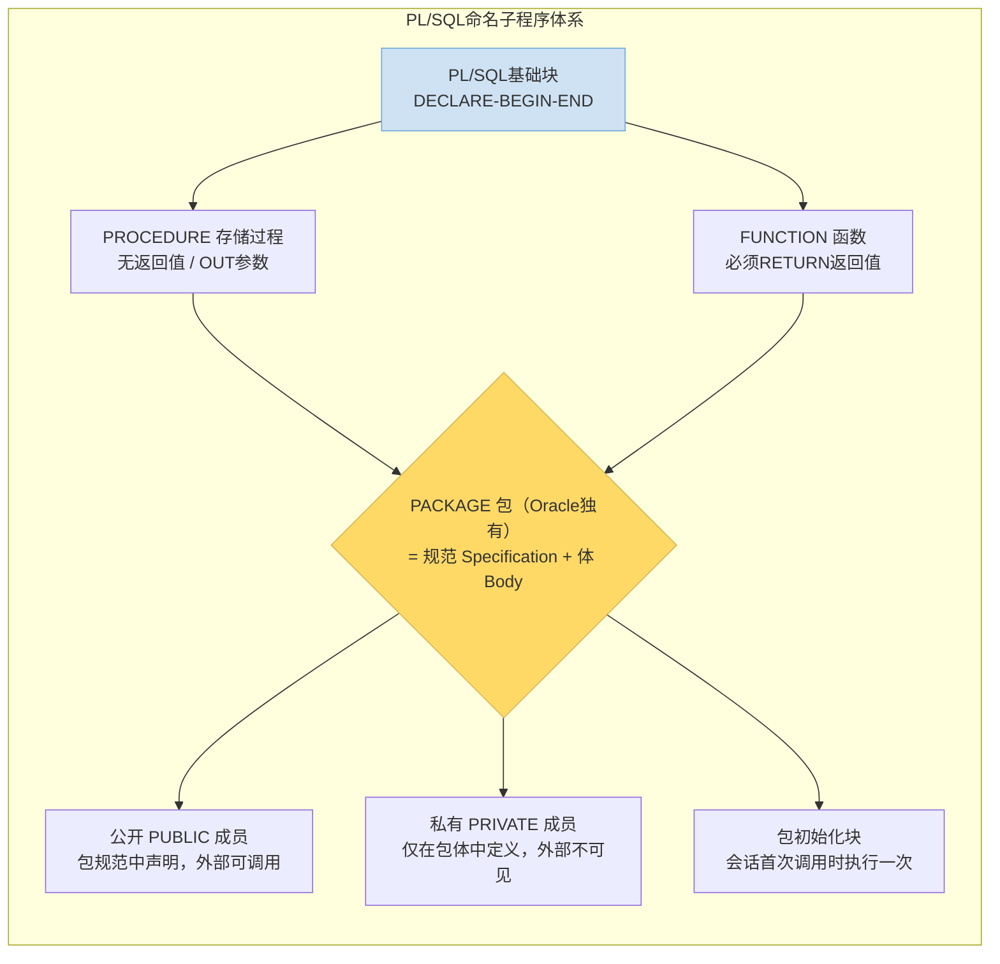

# 9.2 存储过程、函数

> [!definition] 定义
> **存储过程（PROCEDURE）** 与 **函数（FUNCTION）** 合称为 PL/SQL **命名子程序**（Named Subprogram）：它们是具有名称、参数列表的 PL/SQL 块，编译后作为数据库对象存储在 Oracle 数据字典中，可被多次调用执行。存储过程用于执行特定任务（无返回值，通过 OUT 参数传出）；函数必须有 RETURN 返回值，可像内置函数一样用于 SQL 语句（SELECT/WHERE 等）。两者是 Oracle 数据库端模块化、封装复用业务逻辑的核心机制。

## 一、存储过程 PROCEDURE

### 1.1 语法

```plsql
CREATE [OR REPLACE] PROCEDURE 过程名
(
    参数1 [IN|OUT|IN OUT] [NOCOPY] 类型 [:= 默认值 | DEFAULT 值],
    参数2 [IN|OUT|IN OUT] [NOCOPY] 类型,
    ...
)
[AUTHID DEFINER | CURRENT_USER]
[DETERMINISTIC]  -- 过程不常用，函数常用
IS | AS
    -- 声明区：局部变量、常量、类型、游标、局部子程序（无DECLARE关键字）
BEGIN
    -- 主体：可执行语句
EXCEPTION
    -- 异常处理
END [过程名];
/
```

> [!tip] OR REPLACE
> `CREATE OR REPLACE` 表示"如果存在则覆盖，不存在则创建"，修改存储过程时必须加 OR REPLACE，否则报错 ORA-00955: name is already used by an existing object。

### 1.2 示例：涨工资存储过程（Oracle 19c）

```plsql
CREATE OR REPLACE PROCEDURE raise_sal(
    p_empno NUMBER,
    p_rate  NUMBER DEFAULT 10
) AUTHID DEFINER
IS
    e_no_emp EXCEPTION;
BEGIN
    UPDATE emp SET sal = sal * (1 + p_rate/100) WHERE empno = p_empno;
    IF SQL%NOTFOUND THEN
        RAISE e_no_emp;
    END IF;
    COMMIT;
    DBMS_OUTPUT.PUT_LINE('员工' || p_empno || '涨薪' || p_rate || '%成功');
EXCEPTION
    WHEN e_no_emp THEN
        DBMS_OUTPUT.PUT_LINE('错误：员工不存在，编号=' || p_empno);
        ROLLBACK;
    WHEN OTHERS THEN
        DBMS_OUTPUT.PUT_LINE('未知错误：' || SQLERRM);
        ROLLBACK;
END raise_sal;
/
```

### 1.3 调用方式

```plsql
-- 方式1：SQL*Plus EXECUTE 命令（简写 EXEC）
EXECUTE raise_sal(7369, 15);
EXEC raise_sal(7369);   -- 使用默认p_rate=10

-- 方式2：在匿名块/另一个过程中调用（正式写法，推荐）
BEGIN
    raise_sal(7499, 20);
END;
/

-- 命名参数表示法（参数多或不按顺序时清晰）
BEGIN
    raise_sal(p_rate => 30, p_empno => 7521);
END;
/
```

> [!tip] 命名参数 `=>`
> Oracle 支持 `参数名 => 参数值` 的命名参数调用法，不必按定义顺序，参数多且有默认值时推荐使用。

### 1.4 参数模式详解

| 模式 | 默认 | 传值方向 | 过程内行为 | 外部接收 | 典型用途 |
| ---- | ---- | ---- | ---- | ---- | ---- |
| **IN** | ✅ 默认 | 调用者 → 过程 | **只读**，不能被赋值 | 无需接收 | 传入输入参数（员工号、增长率） |
| **OUT** | — | 过程 → 调用者 | 初始为 NULL，可被赋值 | 调用方需声明变量接收 | 传出结果（状态码、消息） |
| **IN OUT** | — | 双向 | 读入初始值，可修改并传出 | 调用方传入变量 | 输入+输出（余额加减、计数器） |
| **NOCOPY** | 修饰 OUT/IN OUT | 引用传递（非值拷贝） | 同 OUT/IN OUT，避免大对象拷贝 | 同 OUT/IN OUT | 集合、LOB、RECORD 等大数据参数 |

#### OUT / IN OUT 参数示例

```plsql
CREATE OR REPLACE PROCEDURE get_emp_info(
    p_empno  IN  NUMBER,
    p_ename  OUT VARCHAR2,
    p_sal    OUT NUMBER,
    p_status IN OUT VARCHAR2  -- 传入OK/FAIL，传出最终状态
)
IS
BEGIN
    SELECT ename, sal INTO p_ename, p_sal FROM emp WHERE empno = p_empno;
    p_status := 'SUCCESS:找到员工';
EXCEPTION
    WHEN NO_DATA_FOUND THEN
        p_ename  := NULL;
        p_sal    := NULL;
        p_status := 'FAIL:员工不存在';
END;
/

-- 调用
DECLARE
    v_name VARCHAR2(10);
    v_sal  NUMBER(7,2);
    v_st   VARCHAR2(50) := 'INIT';
BEGIN
    get_emp_info(7369, v_name, v_sal, v_st);
    DBMS_OUTPUT.PUT_LINE(v_st || ' → ' || v_name || ', ' || v_sal);
END;
/
```

### 1.5 AUTHID 权限模型（DEFINER vs CURRENT_USER）

这是 Oracle 存储过程极其重要的权限模型，面试与实际工作高频考点：

| 维度 | AUTHID DEFINER（定义者权限，默认） | AUTHID CURRENT_USER（调用者权限） |
| ---- | ---- | ---- |
| 执行时的**对象权限来源** | 以**过程创建者（OWNER）**的身份访问对象 | 以**当前调用者**的身份访问对象 |
| 访问 OWNER 的表 | ✅ 无需额外授权，只要 OWNER 自己有权限 | ❌ 调用者必须自己有该表的权限 |
| 访问其他用户的表 | OWNER 需被显式 GRANT（不能通过角色） | 调用者需被显式 GRANT |
| 权限**提升/下降** | 调用者通过 EXECUTE 即可访问 OWNER 的表（等价于权限提升封装） | 不提升权限，调用者有啥权限就干啥 |
| 典型适用场景 | 封装业务逻辑（SCOTT写个过程封装EMP操作，HR用户只需EXECUTE不需直接读EMP表） | 通用工具过程（如DBA工具查询DBA_视图，哪个DBA调就用哪个DBA的权限） |
| 名称解析 | 未指定 Schema 时，默认解析为 OWNER 的对象 | 未指定 Schema 时，默认解析为调用者的对象 |

> [!warning] DEFINER 权限下的角色失效
> Oracle 存储过程（DEFINER 权限）中，**通过角色授予的权限会失效**。必须通过**直接 GRANT**（GRANT SELECT ON emp TO scott;）给 OWNER 的权限才能在过程中生效。例如 SCOTT 拥有 RESOURCE 角色（里面有 CREATE TABLE），但在 DEFINER 过程中执行 CREATE TABLE 会报权限不足——必须直接 GRANT CREATE TABLE TO SCOTT;。CURRENT_USER 模式下角色有效。

## 二、函数 FUNCTION

函数是特殊的子程序，**必须使用 RETURN 子句指定返回类型，并在函数体内至少执行一次 RETURN 语句返回值**。纯函数（无副作用）可用于 SQL 语句的 SELECT/WHERE/ORDER BY 中。

### 2.1 语法

```plsql
CREATE [OR REPLACE] FUNCTION 函数名
(
    参数列表  -- 函数参数习惯只用IN模式（OUT/IN OUT虽允许但不推荐）
)
RETURN 返回值类型
[AUTHID DEFINER | CURRENT_USER]
[DETERMINISTIC]     -- 相同输入必定相同输出，允许结果缓存
[PARALLEL_ENABLE]   -- 允许并行查询中调用
[PIPELINED]         -- 管道化表函数（高级特性）
IS | AS
    -- 声明区
BEGIN
    ...
    RETURN 表达式;   -- 必须，返回类型与RETURN子句一致
[EXCEPTION
    ...
    RETURN 默认值;]  -- 异常分支也建议RETURN
END [函数名];
/
```

### 2.2 示例：查询工资函数（Oracle 19c）

```plsql
CREATE OR REPLACE FUNCTION get_sal(
    p_empno NUMBER
) RETURN NUMBER
DETERMINISTIC   -- 相同empno必定返回相同sal，允许Oracle缓存结果
AUTHID DEFINER
IS
    v_sal emp.sal%TYPE;
BEGIN
    SELECT sal INTO v_sal FROM emp WHERE empno = p_empno;
    RETURN v_sal;
EXCEPTION
    WHEN NO_DATA_FOUND THEN
        RETURN NULL;
END get_sal;
/

-- 在SQL中直接调用！（存储过程不能这样用）
SELECT empno, ename, get_sal(empno) AS salary FROM emp WHERE deptno = 20;
```

> [!tip] DETERMINISTIC
> Oracle 11g+ 关键字，声明该函数是"确定性函数"——**相同输入一定得到相同输出，且无副作用（不修改数据库状态）**。Oracle 可对多次调用缓存结果，提升性能；还可用于基于函数的索引、物化视图刷新。如果函数含 SYSDATE、读 SESSION 上下文或修改表，则绝对不能加 DETERMINISTIC，否则结果错误。

### 2.3 函数的纯度级别（SQL 调用限制）

> [!warning] 函数在 SQL 中调用的限制
> 函数用于 SELECT 等 SQL 语句时，必须满足**纯度规则**（纯度级别 RNDS、WNDS、RNPS、WNPS，Oracle 11g 前需用 PRAGMA RESTRICT_REFERENCES 声明，11g+ 自动检查）：
> - ❌ **不能执行 DML**（INSERT/UPDATE/DELETE/MERGE）—— SQL 查询中途不能改数据；
> - ❌ **不能执行 COMMIT / ROLLBACK / SAVEPOINT**——不能打断当前事务；
> - ❌ **不能执行 DDL**（CREATE/ALTER/DROP）——DDL 隐式提交事务；
> - ❌ 不能调用违反以上规则的其他子程序。
>
> 违反以上任意一条，SQL 中调用时报：`ORA-14551: cannot perform a DML operation inside a query` 或 `ORA-04092: cannot COMMIT in a trigger` 类似错误。
>
> 在 PL/SQL 块内部调用函数则没有这些限制（怎么写都行）。

## 三、存储过程 vs 函数 对比表

| 对比维度 | 存储过程 PROCEDURE | 函数 FUNCTION |
| ---- | ---- | ---- |
| **用途** | 执行一个任务/业务流程（修改数据、批量处理） | 计算并返回一个值（类似数学函数） |
| **RETURN 子句** | ❌ 没有 RETURN 返回类型声明 | ✅ 必须有 `RETURN 类型` |
| **返回方式** | 通过 OUT / IN OUT 参数传出 0~N 个值 | 通过 `RETURN 值` 返回 1 个值（OUT 虽允许但不推荐） |
| **在 SQL 中调用（SELECT 等）** | ❌ **不能**，仅能用 EXEC / PL/SQL 块调用 | ✅ **可以**（纯度规则不违反时），用于 SELECT/WHERE/ORDER BY |
| **DML / 事务操作** | ✅ 可以，是其主要用途之一 | ❌ 作为 SQL 调用时不可以；PL/SQL 中调用可以 |
| **作为表达式赋值** | ❌ 不能 `v_x := proc();` | ✅ 可以 `v_x := func();` |
| **权限模型** | AUTHID DEFINER / CURRENT_USER 均支持 | 同左 |

## 四、删除、查看源代码、编译错误、授权

### 4.1 删除子程序

```plsql
DROP PROCEDURE raise_sal;
DROP FUNCTION get_sal;
```

> [!danger] DROP 过程/函数
> 删除后无法撤销，生产环境删除前必须确认无其他对象依赖（可用 DBA_DEPENDENCIES 视图查看被哪些包/过程/视图引用）。

### 4.2 查看源代码与状态

```sql
-- 查看存储过程/函数/包的源代码（Oracle独有数据字典）
SELECT name, type, line, text
  FROM user_source
 WHERE name IN ('RAISE_SAL', 'GET_SAL')
 ORDER BY type, name, line;

-- 查看对象状态（VALID有效 / INVALID无效，需重编译）
SELECT object_name, object_type, status
  FROM user_objects
 WHERE object_name IN ('RAISE_SAL', 'GET_SAL');

-- 手动重新编译（修改依赖对象后常需要）
ALTER PROCEDURE raise_sal COMPILE;
ALTER FUNCTION get_sal COMPILE;

-- 查看编译错误（极其重要，编译不通过时第一时间查）
SHOW ERRORS PROCEDURE raise_sal;   -- SQL*Plus专用命令
SELECT * FROM user_errors WHERE name = 'RAISE_SAL' ORDER BY sequence;
SELECT * FROM all_errors  WHERE owner = 'SCOTT' AND name = 'GET_SAL';
```

### 4.3 授权与回收执行权限

```sql
-- 授权：允许HR用户执行SCOTT的过程
GRANT EXECUTE ON scott.raise_sal TO hr;
GRANT EXECUTE ON scott.get_sal  TO hr;

-- 授权给角色
GRANT EXECUTE ON scott.raise_sal TO app_role;

-- 回收
REVOKE EXECUTE ON scott.raise_sal FROM hr;
```

> [!note] 执行权限与对象权限
> 当过程使用 DEFINER 权限时，被授权者只需 EXECUTE 权限即可运行，**不需要底层表的 SELECT/UPDATE 权限**（权限由定义者承担）。这是封装业务逻辑、做安全隔离的核心机制——应用账号只有 EXECUTE ON 业务过程的权限，不能直接读写业务表，防止非法 SQL。

## 五、包 PACKAGE（Oracle 独有）

> [!definition] PACKAGE 定义
> **包（PACKAGE）** 是 Oracle PL/SQL 独有的模块化封装机制，它把一组逻辑相关的过程、函数、变量、常量、类型、游标、异常等组织成一个单元，类似 Java 的"类"或 C++ 的"命名空间+类"。包由两部分组成：
> - **包规范（Package Specification / 头部）**：对外公开的接口声明（哪些过程/函数/类型是对外可见的 PUBLIC）；
> - **包体（Package Body）**：包规范中所有声明的实现，还可以定义包私有（PRIVATE）的子程序/变量，仅在包内部可见。
>
> 包是 Oracle PL/SQL 与其他数据库过程化语言最大的区别之一，MySQL/SQL Server 没有对应概念。

### 5.1 包规范（PACKAGE）

```plsql
CREATE OR REPLACE PACKAGE pkg_emp
AUTHID DEFINER
IS
    -- 公开的常量
    c_max_raise_rate CONSTANT NUMBER := 50;

    -- 公开的自定义异常
    e_sal_too_high EXCEPTION;

    -- 公开的类型
    TYPE t_emp_rec IS RECORD (empno NUMBER(4), ename VARCHAR2(10), sal NUMBER(7,2));
    TYPE t_emp_tab IS TABLE OF t_emp_rec INDEX BY BINARY_INTEGER;

    -- 公开的过程声明（只有声明没有实现）
    PROCEDURE raise_sal(p_empno NUMBER, p_rate NUMBER);
    PROCEDURE add_emp(p_empno NUMBER, p_ename VARCHAR2, p_job VARCHAR2,
                      p_sal NUMBER, p_deptno NUMBER);

    -- 公开的函数声明
    FUNCTION get_sal(p_empno NUMBER) RETURN NUMBER;
    FUNCTION list_dept_emp(p_deptno NUMBER) RETURN t_emp_tab;

END pkg_emp;
/
```

### 5.2 包体（PACKAGE BODY）

```plsql
CREATE OR REPLACE PACKAGE BODY pkg_emp
IS
    -- ============== 私有变量/子程序（只在包体内部可见，外部不能调用）==============
    g_counter NUMBER := 0;   -- 包级全局变量（会话级生命周期）

    -- 私有辅助函数：只在包体内被其他过程调用
    FUNCTION validate_sal(p_sal NUMBER) RETURN BOOLEAN
    IS
    BEGIN
        RETURN p_sal >= 0 AND p_sal <= 50000;
    END validate_sal;

    -- ============== 公开子程序的实现（必须与包规范声明一致）==============
    PROCEDURE raise_sal(p_empno NUMBER, p_rate NUMBER)
    IS
    BEGIN
        IF p_rate > c_max_raise_rate THEN
            RAISE_APPLICATION_ERROR(-20001, '涨薪幅度不能超过' || c_max_raise_rate || '%');
        END IF;
        UPDATE emp SET sal = sal * (1 + p_rate/100) WHERE empno = p_empno;
        g_counter := g_counter + SQL%ROWCOUNT;
        COMMIT;
    END raise_sal;

    PROCEDURE add_emp(p_empno NUMBER, p_ename VARCHAR2, p_job VARCHAR2,
                      p_sal NUMBER, p_deptno NUMBER)
    IS
    BEGIN
        IF NOT validate_sal(p_sal) THEN
            RAISE e_sal_too_high;
        END IF;
        INSERT INTO emp(empno, ename, job, sal, deptno, hiredate)
               VALUES (p_empno, p_ename, p_job, p_sal, p_deptno, SYSDATE);
        g_counter := g_counter + 1;
        COMMIT;
    EXCEPTION
        WHEN DUP_VAL_ON_INDEX THEN
            RAISE_APPLICATION_ERROR(-20002, '员工号已存在：' || p_empno);
    END add_emp;

    FUNCTION get_sal(p_empno NUMBER) RETURN NUMBER
    IS
        v_sal emp.sal%TYPE;
    BEGIN
        SELECT sal INTO v_sal FROM emp WHERE empno = p_empno;
        RETURN v_sal;
    EXCEPTION
        WHEN NO_DATA_FOUND THEN RETURN NULL;
    END get_sal;

    FUNCTION list_dept_emp(p_deptno NUMBER) RETURN t_emp_tab
    IS
        v_tab t_emp_tab;
        CURSOR c IS SELECT empno, ename, sal FROM emp WHERE deptno = p_deptno;
        i NUMBER := 0;
    BEGIN
        FOR r IN c LOOP
            i := i + 1;
            v_tab(i).empno := r.empno;
            v_tab(i).ename := r.ename;
            v_tab(i).sal   := r.sal;
        END LOOP;
        RETURN v_tab;
    END list_dept_emp;

-- （可选）包初始化块：会话第一次调用包中任何成员时执行一次
BEGIN
    DBMS_OUTPUT.PUT_LINE('pkg_emp 初始化：会话第一次访问包');
    g_counter := 0;
END pkg_emp;
/
```

### 5.3 调用包成员

```plsql
BEGIN
    pkg_emp.raise_sal(7369, 10);
    DBMS_OUTPUT.PUT_LINE('sal = ' || pkg_emp.get_sal(7369));
END;
/

-- SQL中调用包函数
SELECT empno, ename, pkg_emp.get_sal(empno) FROM emp WHERE deptno = 10;
```

> [!example] 包的六大优点
> 1. **封装性（Encapsulation）**：对外只暴露包规范，实现细节隐藏在包体中（如 `validate_sal` 私有函数外部不可见），修改包体不影响外部调用者。
> 2. **信息隐藏（Information Hiding）**：私有子程序/变量只在包内可见，防止外部误用。
> 3. **逻辑分组**：相关功能集中管理（如所有员工操作都在 `pkg_emp`），避免零散过程难以管理。
> 4. **包级全局状态**：包级变量（如 `g_counter`）在**整个会话期间**保持值，会话断开才消失（慎用全局变量，避免隐式状态）。
> 5. **更好的性能**：整个包首次调用时整体加载到共享池（Shared Pool），后续调用减少重装载；包中子程序互相调用权限检查更少。
> 6. **重载（Overloading）**：包规范中可以声明同名不同参数列表的过程/函数（Oracle 11g+ 支持包内重载），类似 Java 方法重载。

## 六、PROCEDURE / FUNCTION / PACKAGE 关系



> [!warning] 生产环境最佳实践
> 1. **尽量用包，不要零散过程**：业务逻辑应组织到 PACKAGE 中，便于管理、重载、隐藏实现细节；
> 2. **DEFINER 权限 + 直接授权表**：业务过程默认用 DEFINER，只授予应用账号 EXECUTE 权限，不直接授予表权限；
> 3. **COMMIT/ROLLBACK 位置统一**：避免过程深层随意 COMMIT，应由最外层调用者统一控制事务边界；
> 4. **异常不吞没**：`WHEN OTHERS` 不要只写 NULL，必须记录日志（自治事务）或 `RAISE` 再抛出；
> 5. **命名规范统一**：过程 `p_`/动词开头，函数 `f_/get_/calc_` 开头，包 `pkg_` 前缀，常量 `c_`，异常 `e_`。
