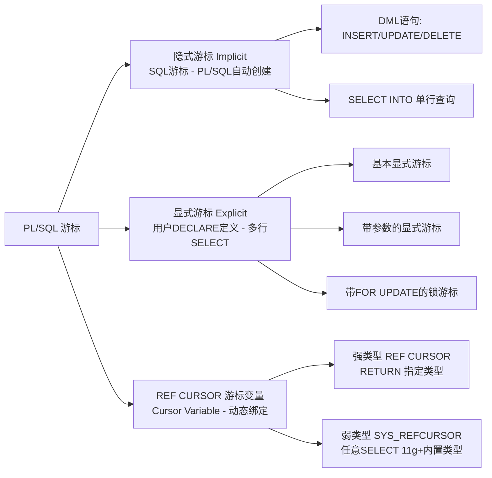
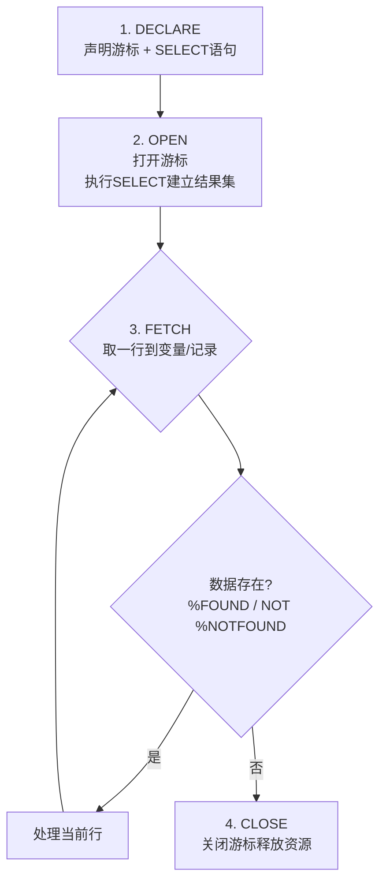

# 9.3 触发器、游标

> [!definition] 触发器 Trigger
> **触发器**是 Oracle 中一种特殊的命名存储过程，它不由用户显式调用，而是当**特定事件**（DML 事件 INSERT/UPDATE/DELETE、DDL 事件 CREATE/ALTER/DROP、数据库事件 LOGON/STARTUP/SERVERERROR 等）发生时，由 Oracle **自动隐式触发执行**。触发器常用于实现复杂业务约束、审计日志、数据同步、自动维护派生字段等场景。
>
> **游标 Cursor** 是 SQL 查询结果集在内存中的工作区指针，PL/SQL 通过游标一行一行地**逐行处理** SELECT 语句返回的多行结果（SELECT INTO 只能处理单行）。分为：显式游标（用户 DECLARE 定义）、隐式游标（PL/SQL 自动为 DML/SELECT INTO 创建的 SQL 游标）、REF CURSOR 游标变量（动态绑定 SELECT，可作为参数传递）。

---

## 第一部分：触发器 Trigger

### 一、触发器分类（按触发事件）

| 类别 | 触发时机 | 触发事件 | 典型用途 |
| ---- | ---- | ---- | ---- |
| **DML 触发器** | BEFORE / AFTER / INSTEAD OF | INSERT / UPDATE [OF 列] / DELETE | 业务约束、审计、自动填字段、同步 |
| **DDL 触发器** | BEFORE / AFTER | CREATE / ALTER / DROP / RENAME / GRANT / REVOKE | DDL 审计、禁止特定对象被 DROP |
| **系统事件触发器** | AFTER | LOGON / LOGOFF、STARTUP / SHUTDOWN、SERVERERROR | 登录审计、启动时初始化、服务器错误记录 |
| **INSTEAD OF 触发器** | 替代执行（无 BEFORE/AFTER） | 视图上的 INSERT/UPDATE/DELETE | 允许对不可直接更新的复杂视图执行 DML |

### 二、DML 触发器语法

```plsql
CREATE [OR REPLACE] TRIGGER trigger_name
{BEFORE | AFTER | INSTEAD OF}
{INSERT | OR UPDATE [OF 列1, 列2...] | OR DELETE}
[OR {INSERT | UPDATE [OF 列] | DELETE}...]
ON table_name_or_view_name
[REFERENCING OLD AS old NEW AS new]          -- 自定义:OLD/:NEW别名（很少用）
[FOR EACH ROW]                                -- 省略=语句级，写了=行级
[WHEN (条件)]                                 -- 行级才可用，行级过滤条件
[FOLLOWS another_trigger_name]                -- 多个触发器时指定执行顺序（11g+）
[ENABLE | DISABLE]                            -- 默认ENABLE
[DECLARE
    声明变量、常量、类型;]
BEGIN
    PL/SQL 执行体（不能 COMMIT/ROLLBACK，除非用自治事务）
EXCEPTION
    异常处理;
END [trigger_name];
/
```

> [!warning] 触发器中不能 COMMIT / ROLLBACK
> DML 触发器运行在触发它的事务内部，触发器中**不允许直接 COMMIT / ROLLBACK / SAVEPOINT**，否则破坏事务原子性（ORA-04092: cannot COMMIT in a trigger）。若必须独立提交（如写审计日志不因主事务回滚而丢失），需用**自治事务** `PRAGMA AUTONOMOUS_TRANSACTION;`，见 [[9.4 异常处理机制]]。

### 三、行级 vs 语句级触发器（FOR EACH ROW 的本质区别）

| 维度 | 行级触发器（FOR EACH ROW） | 语句级触发器（省略 FOR EACH ROW） |
| ---- | ---- | ---- |
| **触发次数** | 每影响 1 行 → 触发 1 次（UPDATE 100 行 → 触发 100 次） | 整条 DML 语句无论影响多少行 → **只触发 1 次** |
| **:OLD / :NEW 伪记录** | ✅ 可以访问旧值/新值 | ❌ 不能访问行级数据（没有行上下文） |
| **WHEN 条件** | ✅ 可用（行级过滤） | ❌ 不可用 |
| **典型用途** | 行级校验（如工资不能降、涨幅不能超50%）、自动填充字段、行级审计 | 表级校验（如某部门员工总数限制）、语句级操作日志、统计汇总 |
| **变异表错误风险** | ⚠️ 高（常见 ORA-04091） | 低 |

#### 3.1 :OLD 与 :NEW 伪记录（行级触发器核心）

行级触发器中可以用 `:OLD.列名` 和 `:NEW.列名` 访问被修改行的旧值与新值：

| DML 操作 | :OLD（旧行） | :NEW（新行） |
| ---- | ---- | ---- |
| **INSERT** | 全部字段为 NULL（该行插入前不存在） | 保存**待插入**的新行值，BEFORE 中可修改 |
| **UPDATE** | 保存**修改前**的原值（只读） | 保存**修改后**的新值，BEFORE 中可修改 |
| **DELETE** | 保存**删除前**的原值（只读） | 全部字段为 NULL（删除后不存在） |

> [!tip] BEFORE vs AFTER 修改 :NEW
> - **BEFORE 行级触发器**中：可以给 `:NEW.列 := 值` 赋值（如 BEFORE INSERT 自动填 `:NEW.create_time := SYSDATE`），修改后的值会真正写入数据库；
> - **AFTER 行级触发器**中：再修改 `:NEW` **无效**，因为 AFTER 时行已写入，改了也不会写回表。

### 四、DML 触发器示例

#### 示例1：工资约束触发器（检查工资不能降 + 涨幅不超 50%）

```plsql
CREATE OR REPLACE TRIGGER trg_check_sal
BEFORE UPDATE OF sal ON emp
REFERENCING OLD AS old NEW AS new
FOR EACH ROW
WHEN (new.sal < old.sal OR new.sal > old.sal * 1.5)   -- 只在触发条件满足时才进入触发器体
BEGIN
    IF :NEW.sal < :OLD.sal THEN
        RAISE_APPLICATION_ERROR(-20001,
            '工资不能降！员工'||:OLD.empno||'：'||:OLD.sal||' → '||:NEW.sal);
    ELSIF :NEW.sal > :OLD.sal * 1.5 THEN
        RAISE_APPLICATION_ERROR(-20002,
            '涨幅不能超过50%！员工'||:OLD.empno||'：'||:OLD.sal||' → '||:NEW.sal);
    END IF;
END;
/
```

#### 示例2：BEFORE INSERT 自动填充主键 + 创建时间

```plsql
CREATE OR REPLACE TRIGGER trg_emp_bi
BEFORE INSERT ON emp
FOR EACH ROW
BEGIN
    -- 若员工号为空，自动从序列取值（假设有 seq_emp 序列）
    IF :NEW.empno IS NULL THEN
        :NEW.empno := seq_emp.NEXTVAL;
    END IF;
    :NEW.hiredate := SYSDATE;         -- 自动填入职时间
    :NEW.ename    := UPPER(:NEW.ename); -- 姓名强制大写规范化
END;
/
```

#### 示例3：审计日志触发器（DELETE/UPDATE 前记录旧值）

```plsql
-- 审计表
CREATE TABLE emp_audit_log (
    log_id     NUMBER PRIMARY KEY,
    op_type    CHAR(1),           -- D=Delete, U=Update
    empno      NUMBER(4),
    old_ename  VARCHAR2(10),
    old_sal    NUMBER(7,2),
    old_deptno NUMBER(2),
    op_user    VARCHAR2(30),
    op_time    DATE
);
CREATE SEQUENCE seq_audit START WITH 1;

CREATE OR REPLACE TRIGGER trg_emp_audit
AFTER UPDATE OR DELETE ON emp
FOR EACH ROW
DECLARE
    PRAGMA AUTONOMOUS_TRANSACTION;  -- 自治事务：日志独立提交，不随主事务回滚
BEGIN
    INSERT INTO emp_audit_log VALUES (
        seq_audit.NEXTVAL,
        CASE WHEN DELETING THEN 'D' ELSE 'U' END,
        :OLD.empno, :OLD.ename, :OLD.sal, :OLD.deptno,
        USER, SYSDATE
    );
    COMMIT;  -- 自治事务中允许COMMIT
END;
/
```

### 五、触发器谓词（INSERTING / UPDATING / DELETING）

同一个触发器同时响应 INSERT + UPDATE + DELETE 时，在触发器体内用三个布尔函数判断当前是哪种操作：

| 谓词函数 | 含义 |
| ---- | ---- |
| `INSERTING` | 当前由 INSERT 触发 → TRUE |
| `UPDATING` | 当前由 UPDATE 触发 → TRUE；`UPDATING('列名')` 判断指定列是否被 UPDATE |
| `DELETING` | 当前由 DELETE 触发 → TRUE |

```plsql
CREATE OR REPLACE TRIGGER trg_emp_all_op
BEFORE INSERT OR UPDATE OR DELETE ON emp
FOR EACH ROW
BEGIN
    IF INSERTING THEN
        DBMS_OUTPUT.PUT_LINE('插入员工：' || :NEW.empno);
    ELSIF UPDATING('SAL') THEN
        DBMS_OUTPUT.PUT_LINE('更新工资：' || :OLD.sal || '→' || :NEW.sal);
    ELSIF DELETING THEN
        DBMS_OUTPUT.PUT_LINE('删除员工：' || :OLD.empno);
    END IF;
END;
/
```

### 六、INSTEAD OF 触发器（视图触发器）

Oracle 中，包含以下情况的视图**不能直接 INSERT/UPDATE/DELETE**：
- 多表连接 JOIN
- 含聚合函数（SUM/AVG/COUNT）、GROUP BY、DISTINCT
- 含集合操作 UNION、CONNECT BY 层次查询

此时用 **INSTEAD OF 触发器**替代默认的视图 DML 操作，把对视图的 DML"翻译"成对基表的正确 DML：

```plsql
-- 复杂连接视图
CREATE OR REPLACE VIEW v_emp_dept AS
    SELECT e.empno, e.ename, e.sal, d.deptno, d.dname, d.loc
      FROM emp e JOIN dept d ON e.deptno = d.deptno;

-- INSTEAD OF INSERT触发器：把视图INSERT翻译成对emp和dept的分别INSERT
CREATE OR REPLACE TRIGGER trg_v_emp_dept_ioi
INSTEAD OF INSERT ON v_emp_dept
FOR EACH ROW
BEGIN
    -- 先插入dept（父表，避免外键错误）
    INSERT INTO dept(deptno, dname, loc)
        VALUES (:NEW.deptno, :NEW.dname, :NEW.loc);
    -- 再插入emp
    INSERT INTO emp(empno, ename, sal, deptno)
        VALUES (:NEW.empno, :NEW.ename, :NEW.sal, :NEW.deptno);
END;
/
```

> [!tip] INSTEAD OF 触发器特点
> - 只能**建在视图上**（不能建在表上）；
> - 必须是**行级**（天然 FOR EACH ROW，不需要写，写了也不报错）；
> - 总是"替代执行"——Oracle 不会尝试真正对视图做 DML，完全由触发器体决定做什么。

### 七、DDL / 系统事件触发器（高级）

```plsql
-- DDL审计：记录所有DROP操作，防止误删
CREATE OR REPLACE TRIGGER trg_no_drop_core_table
BEFORE DROP ON SCHEMA
BEGIN
    IF ORA_DICT_OBJ_OWNER = USER AND
       ORA_DICT_OBJ_NAME IN ('EMP', 'DEPT', 'SALGRADE') THEN
        RAISE_APPLICATION_ERROR(-20100,
            '禁止删除核心业务表：' || ORA_DICT_OBJ_NAME);
    END IF;
END;
/

-- 登录审计触发器（SYSTEM/DBA用户创建，ON DATABASE级）
CREATE OR REPLACE TRIGGER trg_logon_audit
AFTER LOGON ON DATABASE
BEGIN
    INSERT INTO sys.logon_audit VALUES (
        USER, SYSDATE, SYS_CONTEXT('USERENV','IP_ADDRESS'),
        SYS_CONTEXT('USERENV','OS_USER')
    );
    COMMIT;  -- 系统触发器通常用自治事务
END;
/
```

### 八、触发器使用警告

> [!warning] 触发器性能与变异表问题
> 1. **性能影响**：行级触发器每行执行一次，**批量 DML（UPDATE/INSERT 百万行）时极慢**，应优先用约束 + 批量 SQL 逻辑，避免复杂触发器。
> 2. **变异表错误 ORA-04091**：行级触发器中**不能 SELECT 或 DML 自己所在的触发表**（如 emp 上的行级触发器中执行 `SELECT COUNT(*) FROM emp`，会抛 ORA-04091: table SCOTT.EMP is mutating, trigger/function may not see it）。变通方案：① 复合触发器（11g+ COMPOUND TRIGGER）、② 语句级 + 临时表、③ 自治事务。
> 3. **不可预测的执行顺序**：同表上多个 BEFORE/AFTER 触发器默认执行顺序不保证（11g+ 可用 FOLLOWS/PRECEDES 指定），避免写互相依赖逻辑的多个触发器。
> 4. **嵌套/递归触发**：触发器执行的 DML 又触发其他触发器，可能无限递归（Oracle 默认限制 32 层），需加标志位防止。

---

## 第二部分：游标 Cursor

### 九、游标分类与概念



### 十、隐式游标（SQL 游标）

PL/SQL 为每条 DML / SELECT INTO 自动创建一个名为 **SQL** 的隐式游标，通过 `SQL%属性名` 访问：

| 隐式游标属性 | 含义 |
| ---- | ---- |
| `SQL%FOUND` | DML 影响了至少 1 行 → TRUE；SELECT INTO 返回 1 行 → TRUE |
| `SQL%NOTFOUND` | DML 影响 0 行 → TRUE；SELECT INTO 0 行 → TRUE（但此时已抛 NO_DATA_FOUND，属性意义不大） |
| `SQL%ROWCOUNT` | DML 影响的行数（NUMBER）；SELECT INTO 成功则 =1 |
| `SQL%ISOPEN` | 对隐式游标**恒为 FALSE**（PL/SQL 自动打开/关闭） |

```plsql
BEGIN
    UPDATE emp SET sal = sal * 1.1 WHERE deptno = 20;
    DBMS_OUTPUT.PUT_LINE('UPDATE 影响行数：' || SQL%ROWCOUNT);
    IF SQL%FOUND THEN
        DBMS_OUTPUT.PUT_LINE('有员工被涨薪');
    END IF;

    DELETE FROM emp WHERE empno = 9999;
    IF SQL%NOTFOUND THEN
        DBMS_OUTPUT.PUT_LINE('没有员工9999被删除');
    END IF;
END;
/
```

### 十一、显式游标（用户定义，处理多行 SELECT）

#### 11.1 显式游标四步生命周期



#### 11.2 显式游标完整示例（带参数）

```plsql
DECLARE
    -- 声明带参数的游标：按部门编号查询员工
    CURSOR c_emp(p_deptno NUMBER) IS
        SELECT empno, ename, job, sal
          FROM emp
         WHERE deptno = p_deptno
         ORDER BY sal DESC
         FOR UPDATE OF sal NOWAIT;  -- 加行锁，NOWAIT=锁不到立即报错

    r_emp c_emp%ROWTYPE;   -- 游标%ROWTYPE：自动匹配SELECT列的记录类型
BEGIN
    OPEN c_emp(20);         -- 打开游标，传入参数
    LOOP
        FETCH c_emp INTO r_emp;   -- 取一行到记录
        EXIT WHEN c_emp%NOTFOUND; -- 没有更多行就退出

        -- 处理每行：给销售涨20%，其他人涨10%
        IF r_emp.job = 'SALESMAN' THEN
            UPDATE emp SET sal = sal * 1.2 WHERE CURRENT OF c_emp;
        ELSE
            UPDATE emp SET sal = sal * 1.1 WHERE CURRENT OF c_emp;
        END IF;
        DBMS_OUTPUT.PUT_LINE(r_emp.ename || ' 原工资 ' || r_emp.sal);
    END LOOP;
    DBMS_OUTPUT.PUT_LINE('总共处理行数：' || c_emp%ROWCOUNT);
    CLOSE c_emp;            -- 关闭游标
    COMMIT;
END;
/
```

#### 11.3 显式游标属性

| 属性 | 含义 |
| ---- | ---- |
| `%ISOPEN` | 游标已打开 → TRUE（OPEN 后 CLOSE 前） |
| `%FOUND` | 最近一次 FETCH 取到数据 → TRUE；未 FETCH 时 = NULL |
| `%NOTFOUND` | 最近一次 FETCH 没取到 → TRUE（EXIT WHEN 条件常用） |
| `%ROWCOUNT` | 截至目前 FETCH 到的累计行数 |

> [!tip] WHERE CURRENT OF 游标名
> 游标声明时带 `FOR UPDATE [OF 列]`，在 UPDATE/DELETE 语句中可以用 `WHERE CURRENT OF cursor_name` 直接定位到游标当前行，无需再写 `WHERE 主键 = xxx`，更简洁且无歧义。

#### 11.4 游标 FOR 循环（最常用，隐式 OPEN/FETCH/CLOSE）

绝大多数场景不需要手写 OPEN-FETCH-CLOSE 四步，Oracle 提供**游标 FOR 循环**语法，自动隐式声明记录变量、自动打开、循环 FETCH、自动关闭：

```plsql
BEGIN
    -- FOR 循环直接 IN 游标名(参数)，PL/SQL自动完成全部工作
    FOR r IN (SELECT empno, ename, sal, deptno FROM emp WHERE sal > 2000)
    LOOP
        DBMS_OUTPUT.PUT_LINE(r.ename || ' (' || r.deptno || ') - ' || r.sal);
    END LOOP;
    -- 子查询写法更常用，甚至不需要单独DECLARE游标
END;
/

-- 结合已声明的游标参数写法
DECLARE
    CURSOR c_emp(p_dept NUMBER) IS SELECT ename, sal FROM emp WHERE deptno = p_dept;
BEGIN
    FOR r IN c_emp(30) LOOP
        DBMS_OUTPUT.PUT_LINE(RPAD(r.ename,10) || r.sal);
    END LOOP;
END;
/
```

> [!tip] 游标 FOR 循环特点
> - ✅ 不需要 DECLARE 记录变量（r 自动声明，循环外不可见）；
> - ✅ 不需要 OPEN / CLOSE（自动）；
> - ✅ 不需要 EXIT WHEN（循环完自然退出）；
> - ⚠️ 循环体中 r 是只读记录，不能修改（如 `r.sal := 100` 无效），要改表数据还是要 UPDATE 语句。
> - ⚠️ 当数据量极大时（10万+ 行），游标 FOR 循环默认每次只取一行，上下文切换多，性能不如 `BULK COLLECT` 批量处理（Oracle 10g+ 用 BULK COLLECT + FORALL）。

### 十二、REF CURSOR 游标变量

普通显式游标在 DECLARE 时就绑定了固定的 SELECT 语句。**REF CURSOR 游标变量**在运行时才绑定 SELECT，可作为参数/返回值在过程、函数、客户端之间传递结果集。

#### 12.1 强类型 vs 弱类型

```plsql
DECLARE
    -- 强类型 REF CURSOR：必须 RETURN 明确的记录类型，绑定的SELECT列必须匹配
    TYPE t_emp_refcur IS REF CURSOR RETURN emp%ROWTYPE;
    v_rc_emp t_emp_refcur;

    -- 弱类型 SYS_REFCURSOR：Oracle 11g+ 内置，任意SELECT都可绑定，灵活但类型不安全
    v_rc_any SYS_REFCURSOR;

    r_emp emp%ROWTYPE;
    v_job VARCHAR2(9);
BEGIN
    -- 动态绑定SELECT（运行时才决定）
    IF SYSDATE < DATE '2025-01-01' THEN
        OPEN v_rc_emp FOR SELECT * FROM emp WHERE deptno = 10;
    ELSE
        OPEN v_rc_emp FOR SELECT * FROM emp WHERE deptno = 20;
    END IF;

    -- 像普通游标一样FETCH
    LOOP
        FETCH v_rc_emp INTO r_emp;
        EXIT WHEN v_rc_emp%NOTFOUND;
        DBMS_OUTPUT.PUT_LINE(r_emp.ename);
    END LOOP;
    CLOSE v_rc_emp;

    -- 弱类型可绑定任意 SELECT
    OPEN v_rc_any FOR SELECT dname FROM dept;
    FETCH v_rc_any INTO v_job;
    DBMS_OUTPUT.PUT_LINE('第一个部门名：' || v_job);
    CLOSE v_rc_any;
END;
/
```

#### 12.2 函数返回 SYS_REFCURSOR（应用常用）

```plsql
CREATE OR REPLACE FUNCTION f_get_dept_emp(p_deptno NUMBER)
RETURN SYS_REFCURSOR
IS
    v_rc SYS_REFCURSOR;
BEGIN
    OPEN v_rc FOR
        SELECT empno, ename, job, sal, hiredate
          FROM emp
         WHERE deptno = p_deptno
         ORDER BY sal DESC;
    RETURN v_rc;   -- 返回游标变量，由调用方FETCH并CLOSE
END;
/

-- 调用：客户端（JDBC/OCI）或PL/SQL接收REF CURSOR逐行处理
DECLARE
    v_rc SYS_REFCURSOR;
    v_empno NUMBER; v_ename VARCHAR2(10);
    v_job VARCHAR2(9); v_sal NUMBER; v_hire DATE;
BEGIN
    v_rc := f_get_dept_emp(20);
    LOOP
        FETCH v_rc INTO v_empno, v_ename, v_job, v_sal, v_hire;
        EXIT WHEN v_rc%NOTFOUND;
        DBMS_OUTPUT.PUT_LINE(v_empno||' '||RPAD(v_ename,10)||' '||v_sal);
    END LOOP;
    CLOSE v_rc;
END;
/
```

> [!example] 显式游标 vs REF CURSOR 选用建议
> - SELECT 语句编译期就确定，且仅在当前块内部使用 → 普通显式游标（或游标 FOR 循环，90% 场景用这个）；
> - SELECT 语句运行时才确定（条件分支不同 SELECT），或需要把结果集作为参数/返回值传递 → REF CURSOR（优先用 SYS_REFCURSOR，少写 TYPE 声明）。

### 触发器类型对比汇总表

| 触发器类型 | 语法关键字 | 级别 | :OLD/:NEW | 常见场景 |
| ---- | ---- | ---- | ---- | ---- |
| BEFORE 行级 | `BEFORE ... FOR EACH ROW` | 行级 | ✅ 可读可改 :NEW | 字段自动填充、规范化、业务校验 |
| AFTER 行级 | `AFTER ... FOR EACH ROW` | 行级 | ✅ 只读 | 审计日志、数据同步、派生字段更新 |
| BEFORE 语句级 | `BEFORE ...`（无 FOR EACH ROW） | 语句级 | ❌ | 语句级前置检查 |
| AFTER 语句级 | `AFTER ...` | 语句级 | ❌ | 语句级汇总、统计更新 |
| INSTEAD OF 视图触发器 | `INSTEAD OF ... ON view_name` | 行级（天然） | ✅ | 多表连接视图上的 DML 翻译 |
| DDL 触发器 | `BEFORE/AFTER DDL_EVENT ON SCHEMA/DATABASE` | 语句级 | ❌ | DDL 审计、禁止误删对象 |
| 系统事件触发器 | `AFTER LOGON/STARTUP ... ON DATABASE` | 语句级 | ❌ | 登录审计、启动初始化 |
