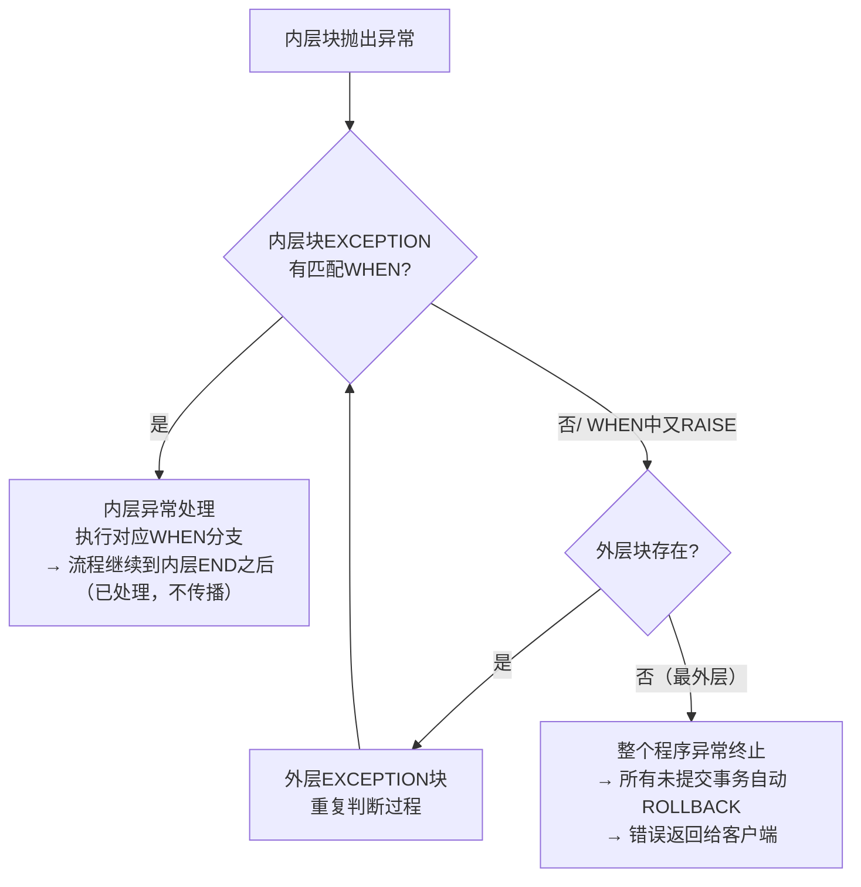

# 9.4 异常处理机制

> [!definition] 异常 Exception
> **异常**是 PL/SQL 程序运行时发生的错误（编译错误由编译器直接报告，不属于异常）。Oracle 把错误封装成"异常对象"，当错误发生时自动**抛出（Raise）**对应异常，程序流程立即跳转到当前块的 EXCEPTION 部分，按顺序匹配 `WHEN 异常名 THEN` 分支执行处理代码。PL/SQL 的异常处理机制实现了**错误处理与正常逻辑分离**，保证程序健壮性。
>
> PL/SQL 异常分三类：**预定义异常**（Oracle 已命名的常见错误，约 20+ 个）、**非预定义异常**（Oracle 有错误号但未命名的标准错误，用 `EXCEPTION_INIT` 关联）、**自定义异常**（用户自己声明并抛出的业务逻辑错误）。

---

## 一、EXCEPTION 块基本语法

```plsql
DECLARE
    -- 声明区：可声明自定义异常
    e_my_exception EXCEPTION;
    v_sal NUMBER(7,2);
BEGIN
    -- 正常业务逻辑
    SELECT sal INTO v_sal FROM emp WHERE empno = 7369;
    IF v_sal < 500 THEN
        RAISE e_my_exception;  -- 手动抛出自定义异常
    END IF;
EXCEPTION
    WHEN NO_DATA_FOUND THEN
        -- 处理特定异常：SELECT INTO 无行
        DBMS_OUTPUT.PUT_LINE('错误：员工不存在');
        INSERT INTO error_log VALUES (USER, SYSDATE, SQLCODE, SQLERRM);
        COMMIT;  -- 自治事务中才独立提交，详见后文
    WHEN TOO_MANY_ROWS THEN
        -- 处理另一特定异常：SELECT INTO 返回多行
        DBMS_OUTPUT.PUT_LINE('错误：员工号不唯一，返回多行');
    WHEN e_my_exception THEN
        -- 处理自定义异常
        DBMS_OUTPUT.PUT_LINE('业务错误：工资低于500');
    WHEN OTHERS THEN
        -- 兜底分支：捕获所有未匹配的异常
        DBMS_OUTPUT.PUT_LINE('未知错误：代码=' || SQLCODE || ', 消息=' || SQLERRM);
        DBMS_OUTPUT.PUT_LINE('错误堆栈：' || DBMS_UTILITY.FORMAT_ERROR_BACKTRACE);
        RAISE;  -- 可选：再次抛出，让外层调用者也能捕获
END;
/
```

> [!warning] WHEN OTHERS 的位置与用法
> - `WHEN OTHERS` 必须放在 EXCEPTION 块的**最后**（放在中间会编译报错），因为它匹配所有异常，前面的分支会失效。
> - **严禁只写 `WHEN OTHERS THEN NULL;`**——把所有异常吞掉不记录不处理，会导致错误完全丢失，极难排查。必须至少记录日志或 `RAISE` 再抛出。

---

## 二、三类异常详解

### 2.1 预定义异常（Predefined Exceptions）

Oracle 在标准包 `STANDARD` 中预声明了约 20 多个常用命名异常，**无需用户 DECLARE，直接 WHEN 捕获即可**：

| 异常名称 | ORA 错误号 | 触发场景 |
| ---- | ---- | ---- |
| `NO_DATA_FOUND` | ORA-01403 | SELECT INTO 没有返回行 / FETCH 到最后一行之后 |
| `TOO_MANY_ROWS` | ORA-01422 | SELECT INTO 返回超过 1 行 |
| `DUP_VAL_ON_INDEX` | ORA-00001 | INSERT/UPDATE 违反唯一约束或主键约束（重复值） |
| `ZERO_DIVIDE` | ORA-01476 | 除数为 0 |
| `VALUE_ERROR` | ORA-06502 | 算术/类型转换/截断错误（字符串太长赋给短变量、数字溢出、字符→数字失败） |
| `INVALID_NUMBER` | ORA-01722 | SQL 中字符转数字失败（如 `WHERE id='abc'` 且 id 是 NUMBER） |
| `INVALID_CURSOR` | ORA-01001 | 非法游标操作（CLOSE 未打开的游标、FETCH 已关闭的游标） |
| `CURSOR_ALREADY_OPEN` | ORA-06511 | 对已打开的游标重复执行 OPEN |
| `LOGIN_DENIED` | ORA-01017 | 用户名/密码错误登录失败 |
| `NOT_LOGGED_ON` | ORA-01012 | 未连接数据库时调用 PL/SQL |
| `PROGRAM_ERROR` | ORA-06501 | PL/SQL 内部错误（一般是 Oracle Bug） |
| `STORAGE_ERROR` | ORA-06500 | 内存溢出 / SGA/PGA 不够 |
| `TIMEOUT_ON_RESOURCE` | ORA-00051 | 等待资源超时 |
| `ROWTYPE_MISMATCH` | ORA-06504 | 游标 FETCH INTO 的变量类型与 SELECT 列不匹配 |
| `SELF_IS_NULL` | ORA-30625 | 对 NULL 对象调用 MEMBER 方法 |
| `ACCESS_INTO_NULL` | ORA-06530 | 给 NULL 对象（未初始化的对象类型）的属性赋值 |
| `COLLECTION_IS_NULL` | ORA-06531 | 调用 NULL 集合（未初始化的 VARRAY/Nested Table）的方法 |
| `SUBSCRIPT_BEYOND_COUNT` | ORA-06533 | 集合下标超过元素总数 |
| `SUBSCRIPT_OUTSIDE_LIMIT` | ORA-06532 | 集合下标超出 VARRAY 声明的上限 |

> [!example] 预定义异常示例
> ```plsql
> DECLARE
>     v_sal NUMBER(7,2);
>     v_num NUMBER := 10;
> BEGIN
>     BEGIN
>         SELECT sal INTO v_sal FROM emp WHERE empno = 9999;
>     EXCEPTION
>         WHEN NO_DATA_FOUND THEN
>             DBMS_OUTPUT.PUT_LINE('捕获到：员工不存在');
>     END;
>
>     v_num := v_num / 0;
> EXCEPTION
>     WHEN ZERO_DIVIDE THEN
>         DBMS_OUTPUT.PUT_LINE('捕获到：除0错误');
>     WHEN VALUE_ERROR THEN
>         DBMS_OUTPUT.PUT_LINE('捕获到：值错误');
>     WHEN OTHERS THEN
>         DBMS_OUTPUT.PUT_LINE('兜底：' || SQLERRM);
> END;
> /
> ```

### 2.2 非预定义异常（Unnamed / Non-predefined Exceptions）

Oracle 有数千种标准错误（如 ORA-00060 死锁、ORA-02291 外键违反、ORA-02292 删除被外键引用的行等），但只有上表中 ~20 多个被**命名**为预定义异常。其余有错误号但无名称的错误，要用三步法处理：

```
1. DECLARE 区：声明一个自定义异常名
   e_deadlock EXCEPTION;
2. DECLARE 区：用 PRAGMA EXCEPTION_INIT 把异常名与 Oracle 错误号关联
   PRAGMA EXCEPTION_INIT(e_deadlock, -60);   -- 注意错误号写正数还是负数？-60对应ORA-00060
3. EXCEPTION 区：WHEN 捕获并处理
   WHEN e_deadlock THEN ...
```

> [!warning] EXCEPTION_INIT 的错误号符号
> `PRAGMA EXCEPTION_INIT(e_name, -err_num)` 第二个参数是**负数**的 ORA 号。如 ORA-00060 → 写 `-60`，ORA-02291 → 写 `-2291`。写正数会关联到错误的错误号！

#### 非预定义异常完整示例

```plsql
DECLARE
    -- 常见的非预定义异常，建议集中声明在包规范中复用
    e_deadlock        EXCEPTION;  PRAGMA EXCEPTION_INIT(e_deadlock,       -60);    -- 死锁
    e_fk_violate      EXCEPTION;  PRAGMA EXCEPTION_INIT(e_fk_violate,     -2291);  -- 违反外键（插入子表无父键）
    e_child_exists    EXCEPTION;  PRAGMA EXCEPTION_INIT(e_child_exists,   -2292);  -- 删除父行还有子行引用
    e_no_privilege    EXCEPTION;  PRAGMA EXCEPTION_INIT(e_no_privilege,   -1031);  -- 权限不足
    e_sess_killed     EXCEPTION;  PRAGMA EXCEPTION_INIT(e_sess_killed,    -0028);  -- 会话被KILL
    e_max_cursors     EXCEPTION;  PRAGMA EXCEPTION_INIT(e_max_cursors,    -1000);  -- 超出OPEN_CURSORS
BEGIN
    DELETE FROM dept WHERE deptno = 10;   -- deptno=10下有员工，触发ORA-02292
EXCEPTION
    WHEN e_child_exists THEN
        DBMS_OUTPUT.PUT_LINE('错误：该部门下仍有员工，不能删除（ORA-02292）');
        ROLLBACK;
    WHEN e_deadlock THEN
        DBMS_OUTPUT.PUT_LINE('错误：检测到死锁，事务已回滚，请重试（ORA-00060）');
    WHEN e_fk_violate THEN
        DBMS_OUTPUT.PUT_LINE('错误：外键违反，插入/更新的父键不存在（ORA-02291）');
    WHEN OTHERS THEN
        RAISE;
END;
/
```

### 2.3 自定义异常（User-Defined Exceptions）

业务层面的逻辑错误（如"工资不能低于最低工资""库存不足""余额不够扣款"等）不是 Oracle 系统错误，Oracle 不会自动抛，需要用户**自己声明、自己抛出、自己捕获**。

#### 方式 A：DECLARE + RAISE（块内局部使用）

```plsql
DECLARE
    e_sal_too_low EXCEPTION;
    e_stock_insufficient EXCEPTION;
    PRAGMA EXCEPTION_INIT(e_stock_insufficient, -20010);  -- 可选：关联自定义错误号(-20000~-20999)
    v_sal NUMBER(7,2) := 300;
BEGIN
    IF v_sal < 500 THEN
        RAISE e_sal_too_low;   -- 抛出
    END IF;
EXCEPTION
    WHEN e_sal_too_low THEN
        DBMS_OUTPUT.PUT_LINE('业务错误：工资' || v_sal || '低于最低工资500');
        RAISE_APPLICATION_ERROR(-20001, '工资不能低于500', TRUE);
END;
/
```

#### 方式 B：RAISE_APPLICATION_ERROR（最常用，跨层级传播错误）

Oracle 内置存储过程，直接抛出一个带自定义错误号、错误消息、错误堆栈标志的应用错误。调用链中任何一层都能捕获到，客户端（JDBC/OCI）也能拿到标准 SQLException：

```plsql
-- 语法
RAISE_APPLICATION_ERROR(
    error_number  IN NUMBER,     -- 必须在 -20999 ~ -20000 之间（共1000个号段，Oracle保留给用户）
    error_message IN VARCHAR2,   -- 错误消息，最长2048字节
    keep_error_stack IN BOOLEAN DEFAULT FALSE   -- TRUE=把本错误追加到现有错误堆栈，FALSE=替换
);
```

```plsql
CREATE OR REPLACE PROCEDURE transfer_money(
    p_from_acc NUMBER, p_to_acc NUMBER, p_amount NUMBER
)
IS
    v_balance NUMBER(12,2);
BEGIN
    SELECT balance INTO v_balance FROM account WHERE id = p_from_acc FOR UPDATE;
    IF v_balance < p_amount THEN
        -- 直接抛出应用错误，不需要DECLARE异常变量
        RAISE_APPLICATION_ERROR(-20100,
            '账户余额不足：账户' || p_from_acc || '余额' || v_balance || ' < ' || p_amount);
    END IF;
    IF p_amount <= 0 THEN
        RAISE_APPLICATION_ERROR(-20101, '转账金额必须为正：' || p_amount);
    END IF;
    UPDATE account SET balance = balance - p_amount WHERE id = p_from_acc;
    UPDATE account SET balance = balance + p_amount WHERE id = p_to_acc;
    COMMIT;
END;
/
```

> [!tip] 自定义异常最佳实践
> - 业务错误优先用 **RAISE_APPLICATION_ERROR(-20xxx, msg)**，错误号全局统一分配（如 -20001 工资类、-20100 资金类、-20200 库存类），客户端能通过错误号精确判断业务类型。
> - DECLARE e_name EXCEPTION + RAISE 方式只适合**同一过程内部**局部使用，跨过程传播时信息少（没有自定义消息），不如 RAISE_APPLICATION_ERROR 实用。
> - 自定义异常集中管理：在包规范（如 `pkg_exception`）中集中 DECLARE 所有公用自定义异常，避免每个过程重复声明。

---

## 三、SQLCODE / SQLERRM / DBMS_UTILITY 格式化错误信息

| 函数 / 过程 | 返回值 / 作用 |
| ---- | ---- |
| `SQLCODE` | 返回当前异常的**错误代码号**（NUMBER）：<br/>- 正常 = 0<br/>- NO_DATA_FOUND = +100（注意是正数！特殊约定）<br/>- 其他 Oracle 错误 = 负数 ORA 号（如 -1, -60, -1403）<br/>- 自定义 RAISE = +1（默认，无号码）<br/>- RAISE_APPLICATION_ERROR = 负数 -20xxx |
| `SQLERRM` | 返回当前异常的**错误消息文本**（VARCHAR2）：<br/>- 正常 = "ORA-0000: normal, successful completion"<br/>- 其他 = "ORA-XXXXX: 错误描述 ..." |
| `DBMS_UTILITY.FORMAT_ERROR_STACK` | 返回**完整错误堆栈**（多层异常嵌套时的完整链），比 SQLERRM 更全 |
| `DBMS_UTILITY.FORMAT_ERROR_BACKTRACE` | 返回**错误发生的调用栈**（具体哪个过程哪一行抛的），调试极其有用！ |
| `DBMS_UTILITY.FORMAT_CALL_STACK` | 返回当前 PL/SQL 的完整调用链（不限于错误） |

> [!example] 完整的错误日志记录示例
> ```plsql
> CREATE TABLE error_log (
>     log_id      NUMBER PRIMARY KEY,
>     log_time    DATE DEFAULT SYSDATE,
>     user_name   VARCHAR2(30),
>     error_code  NUMBER,
>     error_msg   VARCHAR2(2000),
>     error_stack VARCHAR2(4000),
>     backtrace   VARCHAR2(4000)
> );
> CREATE SEQUENCE seq_err START WITH 1;
>
> CREATE OR REPLACE PROCEDURE write_error_log
> IS
>     PRAGMA AUTONOMOUS_TRANSACTION;  -- 自治事务：日志独立提交，不影响主事务回滚
> BEGIN
>     INSERT INTO error_log VALUES (
>         seq_err.NEXTVAL, SYSDATE, USER,
>         SQLCODE,
>         SUBSTR(SQLERRM, 1, 2000),
>         SUBSTR(DBMS_UTILITY.FORMAT_ERROR_STACK, 1, 4000),
>         SUBSTR(DBMS_UTILITY.FORMAT_ERROR_BACKTRACE, 1, 4000)
>     );
>     COMMIT;
> END write_error_log;
> /
>
> -- 任何异常分支调用即可记录日志
> DECLARE
>     v_x NUMBER := 1;
> BEGIN
>     v_x := v_x / 0;
> EXCEPTION
>     WHEN OTHERS THEN
>         write_error_log;          -- 写日志（独立提交，不受后续ROLLBACK影响）
>         RAISE;                    -- 再抛出给调用方
> END;
> /
> ```

---

## 四、自治事务 AUTONOMOUS_TRANSACTION（写日志专用）

> [!definition] 自治事务
> `PRAGMA AUTONOMOUS_TRANSACTION;` 声明当前子程序（过程/函数/触发器）是**独立于主事务的自治事务**。它的 COMMIT/ROLLBACK 只影响自己内部的 DML，不影响外层调用者的主事务；外层主事务的 COMMIT/ROLLBACK 也不影响已提交的自治事务。
>
> **99% 的用途就是写错误日志、审计日志**——无论主事务成功还是回滚，日志必须永久保留，不能随主事务一起 ROLLBACK。

```plsql
CREATE OR REPLACE FUNCTION log_error(p_msg VARCHAR2) RETURN NUMBER
IS
    PRAGMA AUTONOMOUS_TRANSACTION;   -- 声明为自治事务（必须写在声明区第一行位置）
BEGIN
    INSERT INTO error_log(error_msg) VALUES (p_msg);
    COMMIT;   -- 自治事务必须显式COMMIT/ROLLBACK，否则报错
    RETURN 0;
EXCEPTION
    WHEN OTHERS THEN
        ROLLBACK;
        RETURN -1;
END;
/
```

> [!warning] 自治事务使用限制
> 1. 必须显式 COMMIT 或 ROLLBACK，块结束时若事务未结束会抛 ORA-06519: active autonomous transaction detected and rolled back。
> 2. 不要滥用自治事务做业务逻辑（如业务 DML 放自治事务中提交），会破坏事务一致性。仅用于**日志、审计、调试输出**等必须独立提交的场景。
> 3. 触发器中要 COMMIT 必须用自治事务（触发器本身不能直接 COMMIT）。

---

## 五、异常传播机制（嵌套块 / 调用链）

当一个 PL/SQL 块内部抛出异常，且当前块没有 EXCEPTION 分支或者 EXCEPTION 分支中没有匹配的 WHEN 时，异常会**向外层传播**（Propagation），直到被捕获或到达最外层（最外层未捕获则整个程序终止并回滚所有未提交事务）。

### 5.1 异常传播 Mermaid 图



### 5.2 嵌套块 + 调用链异常传播示例

```plsql
-- 场景：主过程 → 调用子过程A → 子过程A中嵌套块抛异常
CREATE OR REPLACE PROCEDURE inner_proc IS
BEGIN
    DBMS_OUTPUT.PUT_LINE('inner_proc 开始');
    DECLARE          -- 内层嵌套块（无EXCEPTION）
        v_x NUMBER := 1;
    BEGIN
        v_x := v_x / 0;   -- 抛ZERO_DIVIDE
    END;                 -- 内层块无EXCEPTION → 向上传播到inner_proc的EXCEPTION
    DBMS_OUTPUT.PUT_LINE('inner_proc 这行不会执行');
EXCEPTION
    WHEN NO_DATA_FOUND THEN   -- 不匹配ZERO_DIVIDE
        DBMS_OUTPUT.PUT_LINE('inner_proc 捕获 NO_DATA_FOUND');
    -- 没有匹配ZERO_DIVIDE的WHEN，继续向外层调用者传播
END inner_proc;
/

CREATE OR REPLACE PROCEDURE outer_proc IS
BEGIN
    DBMS_OUTPUT.PUT_LINE('outer_proc 开始调用 inner_proc');
    inner_proc;          -- 调用子过程，异常从inner_proc传播出来
    DBMS_OUTPUT.PUT_LINE('outer_proc 调用成功');
EXCEPTION
    WHEN ZERO_DIVIDE THEN     -- 在外层捕获
        DBMS_OUTPUT.PUT_LINE('outer_proc 捕获到 ZERO_DIVIDE，处理中...');
        write_error_log('转账失败，除零错误');  -- 写日志
        RAISE;                -- 可选：再次抛出，让调用outer_proc的人继续处理
END outer_proc;
/

BEGIN
    outer_proc;
EXCEPTION
    WHEN OTHERS THEN
        DBMS_OUTPUT.PUT_LINE('最外层块最终捕获：' || SQLERRM);
        ROLLBACK;   -- 回滚所有未提交事务
END;
/
```

> [!note] 异常传播关键结论
> 1. 内层块有匹配 WHEN → 处理完不再传播，流程继续从内层 END 之后往下走（已"消化"）。
> 2. 内层块无匹配 WHEN 或 WHEN 中又 `RAISE` → 异常逐层向外传播，直到被捕获或到客户端。
> 3. 最外层（客户端）未捕获的异常 → **整个事务自动回滚**（未 COMMIT 的所有 DML 都撤销）。
> 4. 多层存储过程调用链中，异常按调用栈**自底向上**传播（最近调用者先捕获）。

---

## 六、异常处理最佳实践（7 条）

> [!tip] 异常处理 checklist
> 1. **最小化异常块覆盖范围**：不要把整个大过程包一个 WHEN OTHERS 就算了。把需要区分错误的逻辑拆成多个 BEGIN...EXCEPTION 小块，精确捕获对应异常。
> 2. **先匹配具体异常，WHEN OTHERS 最后兜底**：依次 WHEN NO_DATA_FOUND / WHEN DUP_VAL_ON_INDEX / ... / WHEN OTHERS。
> 3. **WHEN OTHERS 中绝对不要只写 NULL**：必须记录日志（write_error_log）或 RAISE 再抛出。
> 4. **日志用自治事务独立提交**：错误日志、审计日志是事后排查的唯一依据，必须独立于主事务提交。
> 5. **业务错误用 RAISE_APPLICATION_ERROR(-20xxx, msg)**：不要 RETURN 错误码（-1/-2）让调用方判断，直接抛异常强制调用方处理。错误号段按模块统一分配（可在包规范中用常量集中管理）。
> 6. **不要用异常做正常流程控制**：如"判断记录存在不存在"应该用 SELECT COUNT 或 SELECT 加 MAX，不要靠 SELECT INTO 抛 NO_DATA_FOUND 来判断。异常是"**异常情况**"才用的，正常逻辑路径不要靠异常驱动。
> 7. **在最外层统一捕获 + 记录日志 + 回滚**：对外暴露的顶层过程（入口过程）一般都有 WHEN OTHERS THEN write_error_log + ROLLBACK + RAISE，保证错误不丢且事务一致性。

> [!example] 标准的存储过程异常处理模板
> ```plsql
> CREATE OR REPLACE PROCEDURE p_business_entry(
>     p_param1 NUMBER,
>     p_param2 VARCHAR2
> )
> AUTHID DEFINER
> IS
>     -- 常用非预定义异常声明（也可放到包规范）
>     e_child_exists EXCEPTION; PRAGMA EXCEPTION_INIT(e_child_exists, -2292);
>     v_var NUMBER;
> BEGIN
>     -- ============ 正常业务逻辑 ============
>     SAVEPOINT sp_start;  -- 可选：保存点，支持部分回滚
>
>     -- 业务步骤1
>     BEGIN
>         SELECT col INTO v_var FROM tab WHERE id = p_param1;
>     EXCEPTION
>         WHEN NO_DATA_FOUND THEN
>             -- 局部处理：补默认值 / 友好提示
>             v_var := 0;
>     END;
>
>     -- 业务步骤2：调用其他过程 / DML
>     p_inner_proc(p_param1, v_var);
>
>     COMMIT;
> EXCEPTION
>     WHEN e_child_exists THEN
>         ROLLBACK TO sp_start;  -- 回滚到保存点
>         RAISE_APPLICATION_ERROR(-20010, '有关联子记录，操作失败');
>     WHEN DUP_VAL_ON_INDEX THEN
>         ROLLBACK TO sp_start;
>         RAISE_APPLICATION_ERROR(-20011, '唯一约束冲突，记录已存在');
>     WHEN OTHERS THEN
>         ROLLBACK;              -- 兜底：整个事务回滚
>         write_error_log;       -- 写日志（自治事务）
>         RAISE;                 -- 再抛出，让调用方知道失败
> END p_business_entry;
> /
> ```
