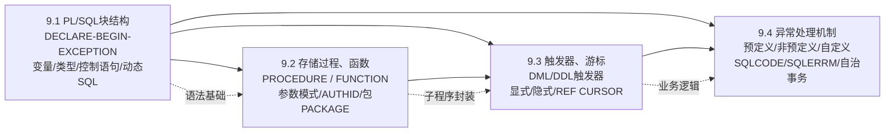

# MOC - 第9章 Oracle PL/SQL程序设计

> [!info] 本章定位
> 本章系统讲授 Oracle 专有的过程化扩展编程语言 **PL/SQL**（Procedural Language/SQL）。它在标准 SQL 之上增加了变量声明、过程控制（分支/循环）、异常处理与模块化封装能力，使数据库端能够承载复杂业务逻辑。本章内容包括：PL/SQL 块结构与基础语法、存储过程与函数的编写及权限管理、触发器（DML/DDL/INSTEAD OF）与显式/隐式/REF 游标、异常处理机制（预定义/非预定义/自定义异常）。PL/SQL 运行于 Oracle 服务器端，编译后执行，是 Oracle DBA 与后端开发者的必备技能——存储过程、触发器、包、对象类型方法均以 PL/SQL 实现。
>
> **前置知识**：[[MOC - 数据库原理]]（事务 ACID、SQL 基础 DML/DDL）、SQL SELECT/INSERT/UPDATE/DELETE 语法；**后续关联**：第10章性能优化中 SQL 调优与 PL/SQL 代码优化密切相关。

## 学习路线图



> [!tip] 路线说明
> 推荐按 9.1 → 9.2 → 9.3 → 9.4 顺序学习。9.1 是 PL/SQL 语言基础（块结构、变量、控制语句、内嵌 SQL）；9.2 在基础之上引入命名子程序（存储过程、函数）与 Oracle 独有的包（PACKAGE）封装机制；9.3 介绍触发器（自动执行的特殊存储过程）与游标（逐行处理查询结果集）；9.4 是所有 PL/SQL 代码都需要的健壮性保障——异常处理机制。每节均配有 plsql 代码块示例，建议在 Oracle 19c 测试库（SCOTT 用户、EMP/DEPT 表）实际运行。

## 知识点导航表

| 节 | 主题 | 核心要点 | 入口链接 |
| ---- | ---- | ---- | ---- |
| 9.1 | PL/SQL块结构 | DECLARE-BEGIN-EXCEPTION 三部分、匿名块示例、标识符命名规则、%TYPE/%ROWTYPE、标量/复合数据类型、IF/CASE/LOOP 控制、SELECT INTO/DML/动态SQL EXECUTE IMMEDIATE、DBMS_OUTPUT | [[9.1 PL-SQL块结构|9.1 PL/SQL块结构]] |
| 9.2 | 存储过程、函数 | CREATE PROCEDURE 语法、IN/OUT/IN OUT/NOCOPY 参数、AUTHID DEFINER/CURRENT_USER、CREATE FUNCTION + RETURN、DETERMINISTIC、过程vs函数对比表、PACKAGE 规范+包体、DBA_SOURCE/USER_ERRORS | [[9.2 存储过程、函数]] |
| 9.3 | 触发器、游标 | DML 触发器 BEFORE/AFTER + FOR EACH ROW/STATEMENT、:OLD/:NEW 伪记录、WHEN 条件、INSTEAD OF 视图触发器、DDL/系统事件触发器、触发器谓词 INSERTING/UPDATING/DELETING、变异表 ORA-04091、显式游标 OPEN-FETCH-CLOSE、游标属性、游标 FOR 循环、REF CURSOR/SYS_REFCURSOR | [[9.3 触发器、游标]] |
| 9.4 | 异常处理机制 | EXCEPTION 块语法、WHEN OTHERS、预定义异常（NO_DATA_FOUND/TOO_MANY_ROWS/DUP_VAL_ON_INDEX/ZERO_DIVIDE 等20+）、非预定义异常 + EXCEPTION_INIT、自定义异常 RAISE/RAISE_APPLICATION_ERROR(-20xxx)、SQLCODE/SQLERRM、DBMS_UTILITY 格式化堆栈、自治事务 AUTONOMOUS_TRANSACTION、异常传播 | [[9.4 异常处理机制]] |

## 核心考点（7 点 warning）

> [!warning] 重点掌握
> 1. **PL/SQL 基本块三部分**：DECLARE（可选）声明变量/常量/类型、BEGIN 可执行语句、EXCEPTION（可选）异常处理、END; 结尾必须写 `/` 在 SQL*Plus 中执行。
> 2. **%TYPE 与 %ROWTYPE 的区别**：%TYPE 继承单个列/变量的类型，%ROWTYPE 继承整行记录（所有列），用于减少对表结构的硬编码依赖。
> 3. **存储过程与函数的本质区别**：函数必须有 RETURN 子句并在 SQL 语句（SELECT）中可调用；存储过程无 RETURN 返回值，通过 OUT 参数传出，不能直接用于 SELECT。
> 4. **AUTHID DEFINER vs CURRENT_USER**：定义者权限（默认）以过程创建者身份执行（如 SCOTT 创建的过程访问 SCOTT.EMP，任何人调用都可以）；调用者权限以当前调用者身份执行（需调用者自己有表权限）。
> 5. **行级触发器 vs 语句级触发器**：FOR EACH ROW 每修改一行触发一次（可访问 :OLD/:NEW），语句级整个 DML 语句只触发一次（不能访问行值）。BEFORE/AFTER 的时机差异。
> 6. **显式游标四步生命周期**：DECLARE CURSOR → OPEN → FETCH（LOOP 中配合 EXIT WHEN %NOTFOUND）→ CLOSE。属性 %ISOPEN/%FOUND/%NOTFOUND/%ROWCOUNT。游标 FOR 循环隐式完成后三步。
> 7. **三类异常及处理方式**：预定义异常直接 WHEN 捕获；非预定义异常用 PRAGMA EXCEPTION_INIT 关联错误号；自定义异常 DECLARE ... EXCEPTION 后 RAISE 或直接 RAISE_APPLICATION_ERROR(-20000~-20999)。WHEN OTHERS 不要只写 NULL 吞掉错误。

## 自测题（4 道）

> [!question] 1. 简述 PL/SQL 块的三部分结构，并说明为什么 PL/SQL 中 SELECT 必须带 INTO？
> > [!check]- 参考答案
> > PL/SQL 块由三部分组成：
> > - **DECLARE（声明区，可选）**：声明变量、常量、游标、自定义类型、局部子程序；
> > - **BEGIN（执行区，必填）**：可执行的 SQL 语句与 PL/SQL 控制语句（IF/LOOP 等）；
> > - **EXCEPTION（异常区，可选）**：捕获并处理运行时错误，WHEN 异常名 THEN 处理语句；
> > - 以 `END;` + 单独一行 `/` 结束（SQL*Plus 中 `/` 表示执行块）。
> >
> > PL/SQL 中 SELECT 必须带 INTO 的原因：PL/SQL 是过程化语言，SELECT 查询结果必须赋值给 PL/SQL 变量才能后续处理，否则结果集无法被 PL/SQL 引擎消费。`SELECT 列 INTO 变量 FROM 表 WHERE 条件` 只能返回单行，多行抛 TOO_MANY_ROWS，零行抛 NO_DATA_FOUND。多行查询需用**游标**逐行 FETCH。

> [!question] 2. 存储过程的参数模式 IN、OUT、IN OUT 有什么区别？AUTHID DEFINER 与 CURRENT_USER 的适用场景各是什么？
> > [!check]- 参考答案
> > **参数模式区别：**
> > | 模式 | 默认 | 传值方向 | 过程内使用 | 示例 |
> > | ---- | ---- | ---- | ---- | ---- |
> > | IN | ✅ 默认 | 调用者→过程 | 只读，不能赋值 | `p_empno NUMBER` |
> > | OUT | — | 过程→调用者 | 可赋值，初始值为 NULL，结束后外部接收 | `p_msg OUT VARCHAR2` |
> > | IN OUT | — | 双向 | 可读入初始值，可赋值修改，结果传出 | `p_balance IN OUT NUMBER` |
> > | NOCOPY | 修饰 OUT/IN OUT | 引用传递（非值拷贝） | 用于大集合/LOB 参数，避免值拷贝开销 | `p_arr IN OUT NOCOPY t_tab` |
> >
> > **AUTHID 权限模型：**
> > - **DEFINER（默认，定义者权限）**：过程以创建者（OWNER）身份执行，访问 OWNER 名下对象不需额外授权。适合封装业务逻辑，用户只需 EXECUTE 权限即可调用，不需直接访问底层表。
> > - **CURRENT_USER（调用者权限）**：过程以当前调用者身份执行，访问对象需调用者自己有权限。适合通用工具过程（如查询 DBA_ 视图的工具），避免提升用户权限。

> [!question] 3. 行级触发器中 :OLD 和 :NEW 分别代表什么？INSERT、UPDATE、DELETE 三种操作中两者的值有什么特点？
> > [!check]- 参考答案
> > :OLD 和 :NEW 是行级触发器中的两个**伪记录**，代表触发该行操作前后的完整行值：
> > - **:OLD**：操作前该行的值（旧值）；
> > - **:NEW**：操作后该行的值（新值）。
> >
> > 三种 DML 中两者的值特点：
> > | 操作 | :OLD | :NEW |
> > | ---- | ---- | ---- |
> > | INSERT | 全为 NULL（插入前不存在） | 保存待插入的新行值 |
> > | UPDATE | 保存修改前的列值 | 保存修改后的列值 |
> > | DELETE | 保存被删除前的行值 | 全为 NULL（删除后不存在） |
> >
> > **注意**：BEFORE 触发器中可以修改 :NEW 的值（如自动填充主键、规范化字段），AFTER 触发器中修改 :NEW 无效；:OLD 始终只读。

> [!question] 4. PL/SQL 中三类异常分别是什么？如何自定义一个错误号 -20001、消息为 "工资不能为负" 的应用错误，并在触发器中抛出？
> > [!check]- 参考答案
> > **三类异常：**
> > 1. **预定义异常**：Oracle 预定义好名称的约 20 多个异常，如 NO_DATA_FOUND、TOO_MANY_ROWS、DUP_VAL_ON_INDEX、ZERO_DIVIDE、VALUE_ERROR、INVALID_CURSOR 等，直接 `WHEN NO_DATA_FOUND THEN` 捕获。
> > 2. **非预定义异常**：Oracle 有错误号但无名称的标准异常（如 ORA-00060 死锁），需用 `PRAGMA EXCEPTION_INIT(e_name, -error_number);` 关联名称后使用。
> > 3. **自定义异常**：用户自己定义的业务异常，`e_sal_neg EXCEPTION;` 声明后 `RAISE e_sal_neg;` 抛出；或直接用 `RAISE_APPLICATION_ERROR(-20000~-20999, '消息')` 抛出带编号的应用错误。
> >
> > **在触发器中抛出工资为负的错误示例：**
> > ```plsql
> > CREATE OR REPLACE TRIGGER trg_check_sal_neg
> > BEFORE INSERT OR UPDATE OF sal ON emp
> > FOR EACH ROW
> > BEGIN
> >   IF :NEW.sal < 0 THEN
> >     RAISE_APPLICATION_ERROR(-20001, '工资不能为负，当前值：' || :NEW.sal);
> >   END IF;
> > END;
> > /
> > ```

## 章节导航

- 上一级：[[MOC - Oracle数据库管理]]
- 上一章：[[MOC - 第8章]]（备份与恢复）
- 下一章：[[MOC - 第10章]]（性能监控与基础优化）
- 本章习题：[[MOC - 第9章习题]]
- 下一章习题：[[MOC - 第10章习题]]
