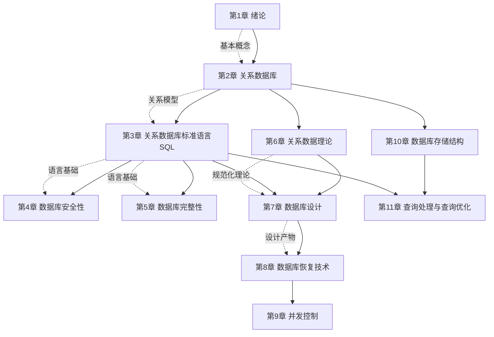

# MOC - 数据库原理

> [!info] 课程定位
> 数据库原理是计算机科学与技术专业的核心专业基础课，以关系数据库为主线，系统讲授数据库系统的基本概念、基本原理和基本方法。它解决的核心问题是：如何用**数据模型**抽象现实世界的信息，如何用**关系代数与 SQL**操作数据，如何用**规范化理论**设计结构合理的数据库模式，如何用**事务与并发控制**保证多用户环境下的数据正确性，以及如何用**恢复技术**应对系统故障。课程为后续 [[MOC - 数据库开发技术]]（应用开发）与 Oracle 数据库管理（运维实践）奠定理论与方法基础。

## 课程摘要

本课程围绕"**模型—语言—理论—设计—保护—实现**"六条主线展开。学生需要掌握：

1. 数据库基本概念、数据模型（层次、网状、关系）、数据库系统三级模式结构与二级映像；
2. 关系数据结构、关系完整性（实体完整性、参照完整性、用户定义完整性）与关系代数（传统集合运算与专门关系运算）；
3. SQL 的数据定义、数据查询（单表/连接/嵌套/集合/分组）、数据更新、视图与嵌入式 SQL；
4. 数据库安全性控制（身份鉴别、存取控制、视图机制、审计、加密）与完整性约束（实体、参照、用户定义、触发器）；
5. 关系数据理论：函数依赖、范式（1NF~BCNF）、多值依赖与 4NF、模式分解的无损连接与保持函数依赖；
6. 数据库设计全过程：需求分析、概念结构设计（E-R 模型）、逻辑结构设计、物理结构设计、实施与运行维护；
7. 事务的 ACID 特性、故障种类、恢复技术（日志、冗余）、检查点机制；
8. 并发控制：封锁、封锁协议、活锁与死锁、意向锁、事务隔离级别；
9. 数据库存储结构：存储介质层次、文件组织、索引（B+ 树、散列）、缓冲区管理；
10. 查询处理步骤、代数优化（等价变换规则）、物理优化与查询优化器原理。

## 章节结构与依赖关系

> [!note] 章节依赖说明
> 第1章建立数据库系统整体认知，是全课程前提。第2章关系模型是第3章 SQL 的数学基础。第3章 SQL 是后续安全性（第4章）与完整性（第5章）的实现语言。第6章关系数据理论是第7章数据库设计的理论核心，指导模式规范化。第7章的设计产物进入运行阶段后，需要第8章恢复技术与第9章并发控制保护数据正确性。第10章存储结构与第11章查询优化属于数据库管理系统内部实现，依赖关系模型与 SQL 基础。

## 章节导航

| 章节 | 主题 | 入口 | 关键概念 |
| ---- | ---- | ---- | -------- |
| 第1章 | 绪论 | [[MOC - 第1章]] | 数据库系统、数据模型、三级模式、二级映像 |
| 第2章 | 关系数据库 | [[MOC - 第2章]] | 关系数据结构、关系完整性、关系代数 |
| 第3章 | 关系数据库标准语言 SQL | [[MOC - 第3章]] | 数据定义、数据查询、数据更新、视图、嵌入式 SQL |
| 第4章 | 数据库安全性 | [[MOC - 第4章]] | 身份鉴别、存取控制、视图机制、审计、数据加密 |
| 第5章 | 数据库完整性 | [[MOC - 第5章]] | 实体完整性、参照完整性、用户定义完整性、触发器 |
| 第6章 | 关系数据理论 | [[MOC - 第6章]] | 函数依赖、范式、多值依赖、模式分解 |
| 第7章 | 数据库设计 | [[MOC - 第7章]] | 需求分析、E-R 模型、逻辑设计、物理设计 |
| 第8章 | 数据库恢复技术 | [[MOC - 第8章]] | 事务 ACID、故障种类、日志、检查点 |
| 第9章 | 并发控制 | [[MOC - 第9章]] | 封锁、封锁协议、死锁、意向锁、隔离级别 |
| 第10章 | 数据库存储结构 | [[MOC - 第10章]] | 存储介质、文件组织、B+ 树索引、缓冲区 |
| 第11章 | 查询处理与查询优化 | [[MOC - 第11章]] | 查询处理步骤、代数优化、物理优化、优化器 |

## 分阶段学习目标

> [!example] 基础概念阶段（第1–2章）
> 建立数据库系统的整体认知：理解数据管理技术的发展、数据库系统的组成与数据模型分类，掌握三级模式结构与二级映像提供的数据独立性；掌握关系数据结构的形式化定义、三类完整性约束与关系代数的传统集合运算和专门关系运算。

> [!example] 语言与保护阶段（第3–5章）
> 掌握 SQL 的数据定义、查询、更新与视图，能用 SQL 实现单表查询、连接查询、嵌套查询与集合查询；理解数据库安全性控制的多种机制与数据库完整性约束的声明与触发器实现，区分安全性与完整性的目标差异。

> [!example] 理论与设计阶段（第6–7章）
> 掌握函数依赖与范式理论，能判断关系模式所属范式并进行模式分解（无损连接、保持函数依赖）；掌握数据库设计六个阶段，能完成 E-R 概念结构设计并转换为关系模型，理解逻辑设计与物理设计的任务差异。

> [!example] 事务与恢复阶段（第8–9章）
> 理解事务的 ACID 特性与故障种类，掌握日志与冗余恢复技术、检查点机制；掌握封锁、封锁协议、活锁与死锁的处理方法、意向锁与事务隔离级别，能在并发场景下分析数据一致性问题。

> [!example] 系统实现阶段（第10–11章）
> 理解数据库存储介质层次、文件组织方式、B+ 树索引与散列索引原理、缓冲区管理策略；掌握查询处理的代数优化与物理优化方法，理解查询优化器的工作原理与启发式规则。

## 先修与关联课程

- **先修**：数据结构与算法（B+ 树、散列、排序的基础）、离散数学（集合论、关系、函数依赖的数学基础）、操作系统（文件系统、并发、内存管理）
- **后续**：[[MOC - 数据库开发技术]]（应用开发：SQL 高级编程、JDBC、ORM、性能优化）、Oracle 数据库管理（运维实践）
- 关联延伸：[[MOC - Web开发技术]]（后端数据持久化场景）、软件工程（数据库设计阶段与软件生命周期对照）

## 学习方法建议

> [!tip] 学习要点
> 1. **概念先行**：数据库原理概念密集，务必先理清数据模型、模式、视图、事务等核心概念定义，再进入具体技术。
> 2. **理论联系实际**：关系代数与 SQL 对照学习，每条代数运算尝试用 SQL 表达；范式理论配合具体关系模式实例理解。
> 3. **重视设计**：E-R 模型设计与模式分解是课程的核心能力点，需通过大量练习掌握。
> 4. **理解而非记忆**：事务 ACID、封锁协议、恢复策略重在理解"为什么这样设计"，而非死记规则。
> 5. **配合实验**：建议同步在 MySQL/PostgreSQL 等数据库上运行 SQL 代码，验证查询结果与约束行为。

## 复习与查询入口

- 概念速查：[[1.1 数据库系统概述]]、[[1.2 数据模型]]、[[1.3 数据库系统结构]]、[[1.4 数据库系统组成]]
- 关系模型速查：[[2.1 关系数据结构及形式化定义]]、[[2.3 关系的完整性]]、[[2.4 关系代数]]
- SQL 速查：[[3.2 数据定义]]、[[3.3 数据查询]]、[[3.4 数据更新]]、[[3.5 视图]]
- 规范化速查：[[6.2 函数依赖]]、[[6.3 范式（1NF、2NF、3NF、BCNF）]]、[[6.5 模式分解]]
- 设计速查：[[7.3 概念结构设计（E-R模型）]]、[[7.4 逻辑结构设计]]
- 事务并发速查：[[8.1 事务基本概念与ACID]]、[[9.2 封锁技术]]、[[9.6 事务隔离级别]]
