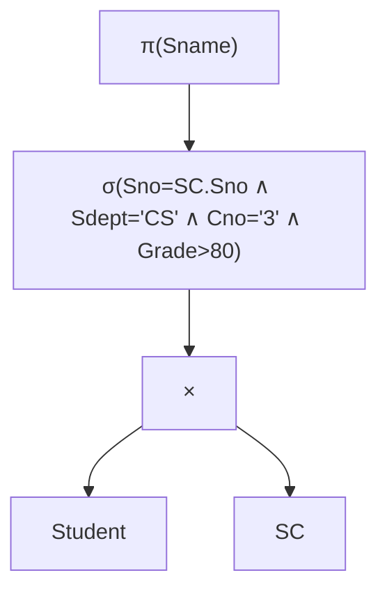

# MOC - 第11章习题

> [!info] 习题说明
> 本章习题覆盖 11.1~11.4 全部小节，共 30 题，分为单选（10）、多选（5）、判断（5）、简答（4）、分析（4，含代数优化语法树转换题）、综合（2，含 EXPLAIN 分析与 SQL 优化）六类。题目按由易到难、由概念到综合的顺序排列，配套答案与解析置于文末 `<details>` 折叠块中。建议先合上答案独立完成，再展开核对。
>
> 配套知识点：[[MOC - 第11章]]、[[11.1 查询处理步骤]]、[[11.2 代数优化]]、[[11.3 物理优化]]、[[11.4 查询优化器原理]]。

## 知识点覆盖表

| 题号 | 题型 | 知识点 | 对应笔记 |
| ---- | ---- | ---- | ---- |
| 单选 1 | 单选 | 查询处理阶段 | [[11.1 查询处理步骤]] |
| 单选 2 | 单选 | 视图消解阶段 | [[11.1 查询处理步骤]] |
| 单选 3 | 单选 | 代数优化核心规则 | [[11.2 代数优化]] |
| 单选 4 | 单选 | 选择与连接交换律 | [[11.2 代数优化]] |
| 单选 5 | 单选 | 笛卡尔积+选择合并 | [[11.2 代数优化]] |
| 单选 6 | 单选 | 散列连接适用 | [[11.3 物理优化]] |
| 单选 7 | 单选 | EXPLAIN type 字段 | [[11.4 查询优化器原理]] |
| 单选 8 | 单选 | CBO 决策依据 | [[11.4 查询优化器原理]] |
| 单选 9 | 单选 | 覆盖索引 Extra | [[11.4 查询优化器原理]] |
| 单选 10 | 单选 | 选择率估算 | [[11.3 物理优化]] |
| 多选 1 | 多选 | 查询处理四阶段 | [[11.1 查询处理步骤]] |
| 多选 2 | 多选 | 代数等价规则 | [[11.2 代数优化]] |
| 多选 3 | 多选 | 连接算法 | [[11.3 物理优化]] |
| 多选 4 | 多选 | EXPLAIN 字段 | [[11.4 查询优化器原理]] |
| 多选 5 | 多选 | 启发式规则 | [[11.2 代数优化]] |
| 判断 1 | 判断 | 代数优化选物理算法 | [[11.2 代数优化]] |
| 判断 2 | 判断 | 选择尽早执行 | [[11.2 代数优化]] |
| 判断 3 | 判断 | 散列连接支持范围 | [[11.3 物理优化]] |
| 判断 4 | 判断 | 统计信息影响 CBO | [[11.4 查询优化器原理]] |
| 判断 5 | 判断 | 投影下推丢连接属性 | [[11.2 代数优化]] |
| 简答 1 | 简答 | 查询处理阶段任务 | [[11.1 查询处理步骤]] |
| 简答 2 | 简答 | 代数优化启发式规则 | [[11.2 代数优化]] |
| 简答 3 | 简答 | 三连接算法对比 | [[11.3 物理优化]] |
| 简答 4 | 简答 | EXPLAIN 关键字段 | [[11.4 查询优化器原理]] |
| 分析 1 | 分析 | 代数优化语法树转换 | [[11.2 代数优化]] |
| 分析 2 | 分析 | 选择与连接交换律应用 | [[11.2 代数优化]] |
| 分析 3 | 分析 | 连接算法代价估算 | [[11.3 物理优化]] |
| 分析 4 | 分析 | 索引失效与改写 | [[11.4 查询优化器原理]] |
| 综合 1 | 综合 | 代数优化完整流程 | [[11.2 代数优化]]、[[11.1 查询处理步骤]] |
| 综合 2 | 综合 | EXPLAIN 分析与 SQL 优化 | [[11.4 查询优化器原理]]、[[11.3 物理优化]]、[[10.3 索引结构（B+树、散列索引）]] |

## 一、单选题（10 题，每题 2 分）

**1.** 查询处理的四个阶段依次是（ ）。

- A. 查询分析 → 查询优化 → 查询检查 → 查询执行
- B. 查询分析 → 查询检查 → 查询优化 → 查询执行
- C. 查询检查 → 查询分析 → 查询优化 → 查询执行
- D. 查询优化 → 查询分析 → 查询检查 → 查询执行

**2.** 视图消解（把视图引用展开为基本表）发生在查询处理的（ ）阶段。

- A. 查询分析
- B. 查询检查
- C. 查询优化
- D. 查询执行

**3.** 代数优化的核心目标是（ ）。

- A. 选择具体的执行算法
- B. 重排关系代数操作的次序，减小中间结果
- C. 维护统计信息
- D. 决定使用哪个索引

**4.** $\sigma_F(E_1 \bowtie E_2) \equiv \sigma_F(E_1) \bowtie E_2$ 成立的条件是（ ）。

- A. $F$ 涉及 $E_1$ 和 $E_2$ 的属性
- B. $F$ 仅涉及 $E_1$ 的属性
- C. $F$ 是等值条件
- D. $E_1, E_2$ 已排序

**5.** 把"笛卡尔积 + 选择"合并为连接的优化原因是（ ）。

- A. 连接比笛卡尔积语法简单
- B. 笛卡尔积中间结果为两表行数之积，可能极大
- C. 连接不需要索引
- D. 选择不能与笛卡尔积交换

**6.** 下列连接算法中，最适合等值连接且内存充足的是（ ）。

- A. 嵌套循环连接
- B. 排序归并连接
- C. 散列连接
- D. 笛卡尔积

**7.** 在 MySQL `EXPLAIN` 输出中，表示全表扫描的 `type` 值是（ ）。

- A. `const`
- B. `ref`
- C. `range`
- D. `ALL`

**8.** CBO（基于代价的优化器）选择执行计划的依据是（ ）。

- A. 固定优先级规则
- B. 代价估算
- C. SQL 语句长度
- D. 表名顺序

**9.** `EXPLAIN` 输出中，表示覆盖索引（无需回表）的 `Extra` 值是（ ）。

- A. `Using where`
- B. `Using index`
- C. `Using filesort`
- D. `Using temporary`

**10.** 设属性 $A$ 有 $V(A,R)=100$ 个不同值，等值选择 $\sigma_{A=c}$ 的选择率估算为（ ）。

- A. 0.01
- B. 0.1
- C. 0.5
- D. 1.0

## 二、多选题（5 题，每题 3 分）

**1.** 查询处理的阶段包括（ ）。

- A. 查询分析
- B. 查询检查
- C. 查询优化
- D. 查询执行

**2.** 下列属于关系代数等价变换规则的有（ ）。

- A. 连接交换律
- B. 连接结合律
- C. 选择与连接交换律
- D. 投影与连接交换律

**3.** 常见的连接算法包括（ ）。

- A. 嵌套循环连接
- B. 排序归并连接
- C. 散列连接
- D. 二分查找连接

**4.** MySQL `EXPLAIN` 输出包含的关键字段有（ ）。

- A. `type`
- B. `key`
- C. `rows`
- D. `Extra`

**5.** 代数优化的启发式规则包括（ ）。

- A. 选择尽早执行
- B. 投影与选择同时下推
- C. 笛卡尔积合并为连接
- D. 提取公共子表达式

## 三、判断题（5 题，每题 2 分，正确填 √，错误填 ×）

**1.** 代数优化阶段需要选择具体的执行算法（如索引扫描或全表扫描）。

**2.** "选择尽早执行"是代数优化最重要的启发式规则之一，因为它能减小连接等后续操作的输入规模。

**3.** 散列连接既支持等值连接也支持范围连接。

**4.** CBO 依赖统计信息，统计信息过期可能导致选择错误的执行计划。

**5.** 投影下推到连接之前时，连接属性可以省略以节省空间。

## 四、简答题（4 题，每题 5 分）

**1.** 简述查询处理四个阶段的任务，并说明代价模型的组成。

**2.** 简述代数优化的启发式规则（至少 4 条）。

**3.** 对比嵌套循环连接、排序归并连接、散列连接的原理与适用条件。

**4.** 简述 MySQL `EXPLAIN` 的关键字段（type、key、rows、Extra）及优化目标。

## 五、分析题（4 题，每题 8 分）

**1.** 给定查询：查找选修 3 号课程且成绩>80 的学生姓名。初始关系代数为 $\pi_{\text{Sname}}(\sigma_{\text{Sno=SC.Sno} \wedge \text{Cno='3'} \wedge \text{Grade>80}}(\text{Student} \times \text{SC}))$。请用等价变换规则将其优化，写出优化后的表达式，并说明每步变换所用的规则与中间结果的改善。

**2.** 对连接 $R \bowtie S$，设 $R$ 有 1000 页 10 万行，$S$ 有 50 页 5000 行，$S$ 在连接属性上有 B+ 树索引（高度 3），缓冲区足够。请分别用索引嵌套循环、排序归并、散列连接估算 I/O 代价（传统机械磁盘），并选择最优算法。

**3.** 设 InnoDB 表 `orders(id PK, user_id, status, created_at)`，建有 `idx_created(created_at)`。慢查询 `SELECT * FROM orders WHERE DATE(created_at)='2024-01-01'` 执行计划为 `type=ALL, key=NULL`。请分析索引失效原因，给出优化后的 SQL，并说明优化前后 `EXPLAIN` 的预期变化。

**4.** 对选择操作 $\sigma_F(R)$，说明在什么条件下用索引扫描优于全表扫描，并解释选择率阈值与磁盘类型的关系。

## 六、综合题（2 题，每题 12 分）

**1.** 代数优化综合题。给定查询：查找计算机系（Sdept='CS'）选修了课程号为 '3' 且成绩>80 的学生姓名。涉及 `Student(Sno, Sname, Ssex, Sage, Sdept)`、`SC(Sno, Cno, Grade)`。请回答：

（1）写出该查询的 SQL；

（2）写出初始关系代数表达式（笛卡尔积形式）；

（3）画出初始语法树（用文字或 Mermaid 描述节点）；

（4）应用等价变换规则逐步优化，写出优化后的关系代数；

（5）说明优化前后中间结果规模的差异（设 Student 1 万行、SC 10 万行、CS 系学生 1000 人、3 号课程成绩>80 的 100 人）。

**2.** EXPLAIN 分析与 SQL 优化综合题。设 MySQL 8.0 InnoDB 表 `employee(id BIGINT PK, name VARCHAR(50), dept_id BIGINT, age INT, salary DECIMAL)`，建有索引 `idx_name(name)`、`idx_dept_age(dept_id, age)`。请回答：

（1）对查询 `SELECT name, age FROM employee WHERE name='张三'`，写出预期 `EXPLAIN` 的 `type`、`key`、`Extra`，并判断是否回表；

（2）对查询 `SELECT dept_id, age FROM employee WHERE dept_id=1 AND age>20`，写出预期 `EXPLAIN`，并判断是否覆盖索引；

（3）对查询 `SELECT * FROM employee WHERE age=25`，分析为何 `idx_dept_age` 失效；

（4）给出一条利用 `EXPLAIN` 诊断慢查询并优化的完整方法论（步骤）。

## 答案与解析

<details>
<summary>点击展开答案与解析</summary>

### 一、单选题答案

**1. B**
查询处理四阶段依次为：查询分析 → 查询检查 → 查询优化 → 查询执行。

**2. B**
视图消解在查询检查阶段进行——把视图名替换为其定义查询，展开为底层基本表的关系代数表达式。

**3. B**
代数优化通过等价变换重排关系代数操作次序，减小中间结果。选择具体执行算法是物理优化的任务。

**4. B**
选择与连接交换律 $\sigma_F(E_1 \bowtie E_2) \equiv \sigma_F(E_1) \bowtie E_2$ 要求 $F$ 仅涉及 $E_1$ 的属性，否则不能下推到 $E_1$ 之前。

**5. B**
笛卡尔积 $E_1 \times E_2$ 的中间结果为 $|E_1| \times |E_2|$，两表各 1 万行则 1 亿行，可能灾难性。把"笛卡尔积+选择"合并为连接可在连接时直接过滤，避免巨大中间结果。

**6. C**
散列连接对等值连接、内存充足时最优，代价约 $b_R + b_S$。排序归并适合有序输入；嵌套循环适合小表驱动+内层有索引。

**7. D**
`type=ALL` 表示全表扫描；`const`/`ref`/`range` 都用索引。

**8. B**
CBO（Cost-Based Optimizer）基于代价估算选择计划；RBO 才基于固定规则。

**9. B**
`Extra: Using index` 表示覆盖索引，无需回表；`Using filesort`/`Using temporary` 需警惕。

**10. A**
等值选择率 $s = 1/V(A,R) = 1/100 = 0.01$。

### 二、多选题答案

**1. ABCD**
查询分析、查询检查、查询优化、查询执行四阶段。

**2. ABCD**
连接交换律、结合律、选择与连接交换律、投影与连接交换律均为等价规则。

**3. ABC**
嵌套循环、排序归并、散列连接是三种主流连接算法；"二分查找连接"不是标准连接算法。

**4. ABCD**
type、key、rows、Extra 均为 EXPLAIN 关键字段。

**5. ABCD**
选择尽早执行、投影与选择同时下推、笛卡尔积合并为连接、提取公共子表达式均为启发式规则。

### 三、判断题答案

**1. ×**
代数优化只重排操作次序与逻辑组合，**不**选择具体执行算法。选择执行算法是物理优化的任务。

**2. √**
选择尽早执行下推到连接前，能减小连接等后续操作的输入规模，是代数优化最重要的规则之一。

**3. ×**
散列连接基于散列函数匹配，**只支持等值连接**，不支持范围连接。范围连接需排序归并。

**4. √**
CBO 依赖统计信息估算代价，统计过期会导致选择率与基数估算错误，进而选错计划。需定期 `ANALYZE TABLE`。

**5. ×**
投影下推到连接前时，**连接属性必须保留**。若省略连接属性，连接无法进行，等价变换失效。

### 四、简答题参考答案

**1. 查询处理阶段与代价模型：**

四阶段：①查询分析（词法/语法分析，构建语法树）；②查询检查（语义检查、视图消解、权限检查，转为关系代数）；③查询优化（代数优化+物理优化，生成执行计划）；④查询执行（执行计划运行产生结果）。
代价模型：$C_{\text{query}} = C_{\text{I/O}} + C_{\text{CPU}}$，传统磁盘下以 I/O 为主。

**2. 代数优化启发式规则：**

1. 选择尽早执行（下推到连接前）；
2. 投影与选择同时下推；
3. 笛卡尔积合并为连接（避免巨大中间结果）；
4. 提取公共子表达式（多次出现只算一次）；
5. 选择率低的选择优先执行（先严后松）。

**3. 三连接算法对比：**

| 算法 | 原理 | 代价 | 适用 |
| ---- | ---- | ---- | ---- |
| 嵌套循环 NLJ | 外层每元组扫内层 | $b_R + n_R b_S$（无索引） | 小表驱动、内层有索引 |
| 排序归并 SMJ | 排序后双指针归并 | 排序 + $b_R + b_S$ | 大表、有序、等值/范围 |
| 散列连接 HJ | 散列表探查 | $\approx b_R + b_S$ | 等值、内存足 |

**4. EXPLAIN 关键字段：**

- `type`：访问类型，优化目标 const > eq_ref > ref > range > index > ALL；
- `key`：实际使用的索引，非 NULL 且符合预期；
- `rows`：预估扫描行数，越小越好；
- `Extra`：附加信息，`Using index`（覆盖索引）为佳，`Using filesort`/`Using temporary` 需警惕。

### 五、分析题参考答案

**1. 代数优化步骤：**

初始：$\pi_{\text{Sname}}(\sigma_{\text{Sno=SC.Sno} \wedge \text{Cno='3'} \wedge \text{Grade>80}}(\text{Student} \times \text{SC}))$。

变换：
- 规则 4（选择串接）：拆分为 $\sigma_{\text{Sno=SC.Sno}}(\sigma_{\text{Cno='3'}}(\sigma_{\text{Grade>80}}(\text{Student} \times \text{SC})))$；
- 规则 6（选择与连接交换）：`Cno='3'`、`Grade>80` 仅涉及 SC，下推；`Sno=SC.Sno` 是连接条件，笛卡尔积+选择合并为连接：
  $\pi_{\text{Sname}}(\sigma_{\text{Cno='3'}}(\sigma_{\text{Grade>80}}(\text{SC})) \bowtie_{\text{Sno=SC.Sno}} \text{Student})$；
- 规则 7（投影与连接交换）：Student 只需 Sno,Sname（保留连接属性 Sno）：
  $\pi_{\text{Sname}}(\sigma_{\text{Cno='3'} \wedge \text{Grade>80}}(\text{SC}) \bowtie_{\text{Sno=SC.Sno}} \pi_{\text{Sno,Sname}}(\text{Student}))$。

改善：初始笛卡尔积中间结果 $|Student| \times |SC|$（巨大）；优化后 SC 经选择仅剩少量行参与连接，中间结果大幅缩小。

**2. 连接算法代价估算：**

设 $R$ 外层 1000 页 10 万行，$S$ 内层 50 页 5000 行，$S$ 索引高度 3：
- 索引嵌套循环 INL：$b_R + n_R \times h = 1000 + 100000 \times 3 = 301000$ 页；
- 排序归并 SMJ：$3 \times (b_R + b_S) = 3 \times 1050 = 3150$ 页；
- 散列连接 HJ（内存足）：$b_R + b_S = 1050$ 页。

最优：散列连接（1050 页）。结论假设：等值连接、内存足够、传统机械磁盘。

**3. 索引失效与改写：**

失效原因：`DATE(created_at)` 对索引列使用函数，导致 B+ 树索引失效，全表扫描。
优化后：`SELECT * FROM orders WHERE created_at >= '2024-01-01' AND created_at < '2024-01-02'`（范围查询，走索引）。
EXPLAIN 变化：优化前 `type=ALL, key=NULL, rows≈全表`；优化后 `type=range, key=idx_created, rows≈当日订单数`。

**4. 索引扫描 vs 全表扫描：**

索引扫描优于全表扫描的条件：①选择率低（命中行少，经验 $< 10\%$~$20\%$）；②查询字段在索引中或可回表；③索引非聚簇时随机 I/O 代价可接受。
选择率阈值与磁盘类型关系：机械磁盘随机 I/O 远贵于顺序 I/O，阈值较低；SSD 随机 I/O 代价低，索引扫描阈值可更高（更大选择率仍划算）。

### 六、综合题参考答案

**1. 代数优化完整流程：**

（1）SQL：
```sql
-- DBMS: 通用关系数据库（SQL 标准）
SELECT Sname
FROM Student, SC
WHERE Student.Sno = SC.Sno AND Student.Sdept = 'CS'
  AND SC.Cno = '3' AND SC.Grade > 80;
```

（2）初始关系代数：
$$\pi_{\text{Sname}}(\sigma_{\text{Sno=SC.Sno} \wedge \text{Sdept='CS'} \wedge \text{Cno='3'} \wedge \text{Grade>80}}(\text{Student} \times \text{SC}))$$

（3）初始语法树（Mermaid 描述）：


（4）优化后关系代数：
$$\pi_{\text{Sname}}(\sigma_{\text{Sdept='CS'}}(\pi_{\text{Sno,Sname}}(\text{Student})) \bowtie_{\text{Sno=SC.Sno}} \sigma_{\text{Cno='3'} \wedge \text{Grade>80}}(\text{SC}))$$
变换：规则 4 拆分选择；规则 6 下推 `Sdept='CS'` 到 Student、`Cno='3' ∧ Grade>80` 到 SC；笛卡尔积+选择合并为连接；规则 7 投影 Sname 下推（保留连接属性 Sno）。

（5）中间结果规模（Student 1 万、SC 10 万、CS 系 1000、3 号课程成绩>80 的 100）：
- 优化前：笛卡尔积 $10000 \times 100000 = 10$ 亿行中间结果；
- 优化后：Student 经 `Sdept='CS'` 过滤剩 1000 行，SC 经 `Cno='3' ∧ Grade>80` 过滤剩 100 行，连接中间结果 $1000 \times 100$ 命中约 100 行（实际更少）。
- 中间结果从 10 亿行降至约 100 行，缩小约 $10^7$ 倍。

**2. EXPLAIN 分析与 SQL 优化：**

（1）`SELECT name, age FROM employee WHERE name='张三'`：
- 走 `idx_name`，`type=ref`，`key=idx_name`；
- `Extra`：通常无 `Using index`（因 age 不在 idx_name 中），需回表取 age；
- 是否回表：**是**，idx_name 叶子含 name 与主键 id，age 不在索引中，需用 id 回表到聚簇索引。

（2）`SELECT dept_id, age FROM employee WHERE dept_id=1 AND age>20`：
- 走 `idx_dept_age`，`type=range`，`key=idx_dept_age`；
- `Extra: Using index`（dept_id、age 均在索引中，主键 id 自动包含）；
- 是否覆盖索引：**是**，查询列全在索引中，无回表。

（3）`SELECT * FROM employee WHERE age=25`：
- `idx_dept_age(dept_id, age)` 是复合索引，最左前缀要求从 dept_id 开始；
- 查询条件 `WHERE age=25` 缺最左列 dept_id，违反最左前缀，索引失效；
- `EXPLAIN`：`type=ALL`，`key=NULL`，全表扫描。
- 优化：若 age 查询高频，可单独建 `INDEX idx_age(age)`。

（4）EXPLAIN 诊断慢查询优化方法论：
1. 执行 `EXPLAIN SELECT ...`，查看执行计划；
2. 检查 `type` 是否为 `ALL`（全表扫描需警惕）、`key` 是否为 NULL（无索引）、`rows` 是否过大、`Extra` 是否有 `Using filesort`/`Using temporary`；
3. 检查 SQL 写法是否有索引失效：函数操作、隐式类型转换、前导通配 `LIKE '%x'`、OR 一侧无索引、计算；
4. 改写 SQL（如 `DATE(col)=...` 改为范围查询）或补建/调整索引（注意复合索引最左前缀、覆盖索引）；
5. 再次 `EXPLAIN` 验证 `type` 改善、`rows` 下降；
6. 大表更新统计信息 `ANALYZE TABLE`，避免 CBO 因统计过期选错计划。
性能结论须以实际 EXPLAIN 输出为准，依赖数据规模、索引与硬件环境。

</details>

## 考点统计表

| 题型 | 题数 | 分值 | 考查重点 | 合计 |
| ---- | ---- | ---- | ---- | ---- |
| 单选 | 10 | 2 | 四阶段、视图消解、等价规则、连接算法、EXPLAIN、CBO、选择率 | 20 |
| 多选 | 5 | 3 | 四阶段、等价规则、连接算法、EXPLAIN 字段、启发式规则 | 15 |
| 判断 | 5 | 2 | 代数与物理边界、选择尽早执行、散列范围、统计信息、连接属性保留 | 10 |
| 简答 | 4 | 5 | 四阶段与代价、启发式规则、三连接算法、EXPLAIN 字段 | 20 |
| 分析 | 4 | 8 | 语法树优化、连接代价估算、索引失效改写、索引选择条件 | 32 |
| 综合 | 2 | 12 | 代数优化完整流程、EXPLAIN 分析与 SQL 优化 | 24 |
| **合计** | **30** | — | 覆盖 11.1~11.4 全部核心考点，重点代数优化与 EXPLAIN | **121** |

## 章节导航

- 上一级：[[MOC - 数据库原理]]
- 本章知识点：[[MOC - 第11章]]
- 上一章习题：[[MOC - 第10章习题]]
- 下一章习题：课程结束（本章为《数据库原理》最后一章）
