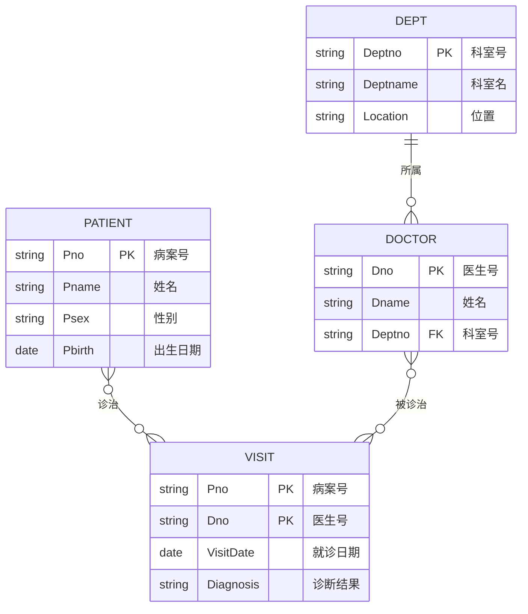
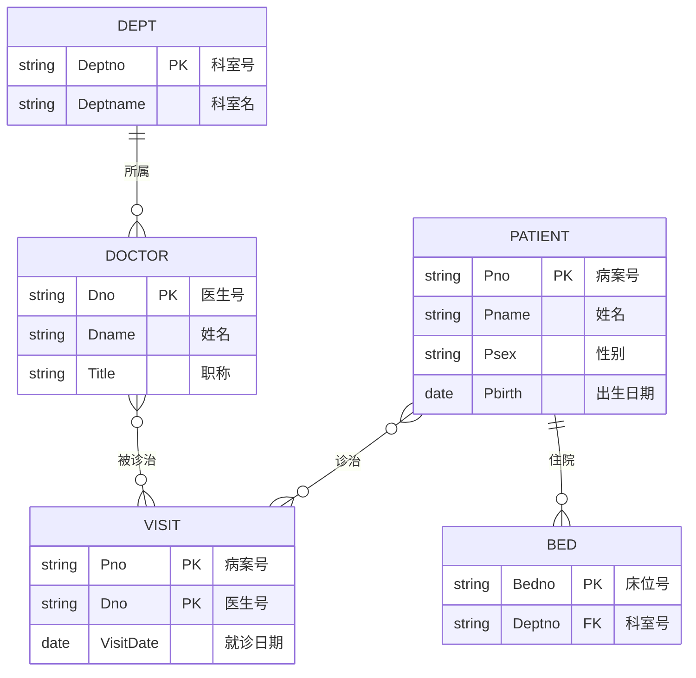
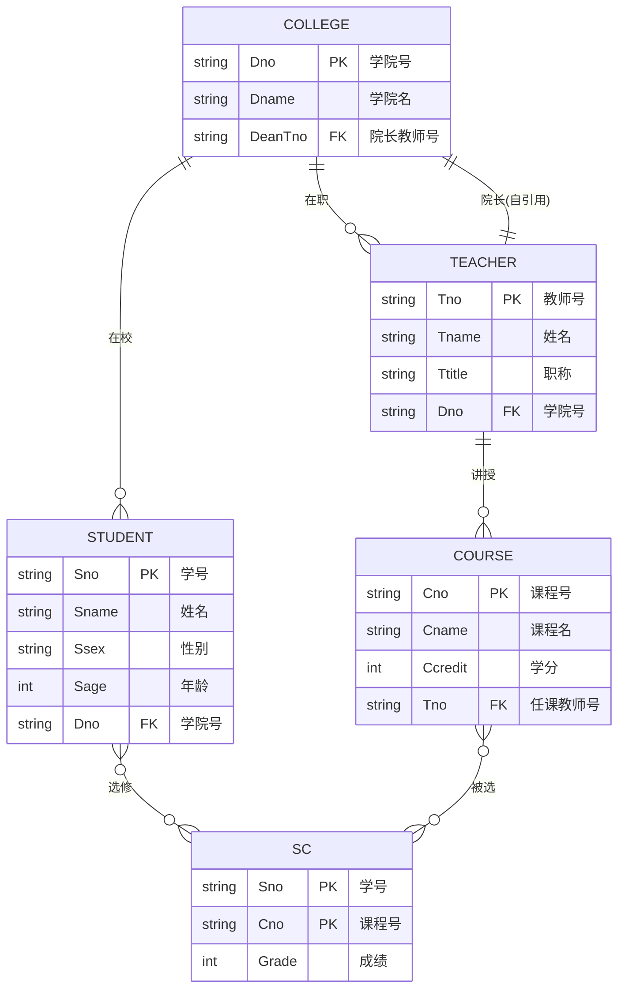
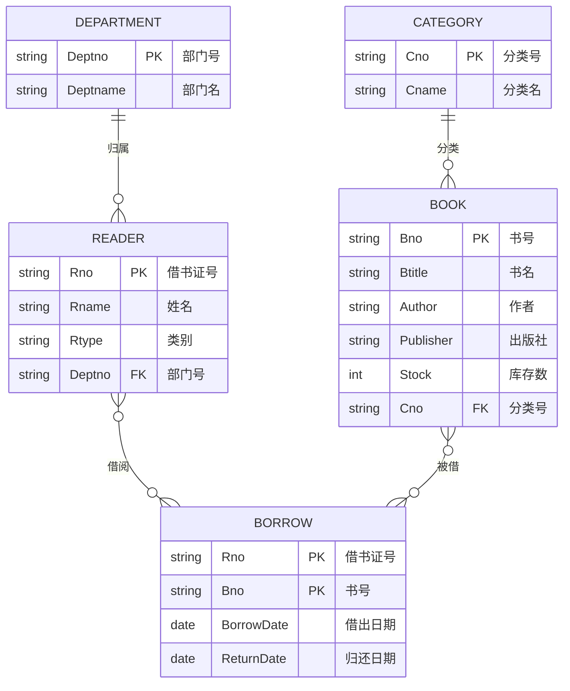

# MOC - 第7章习题

> [!info] 习题说明
> 本习题集覆盖 [[MOC - 第7章]] 全部知识点，共 30 题，分六类：单选 10、多选 5、判断 5、简答 4、分析 4、综合 2。重点考查数据库设计六阶段流程、数据流图与数据字典、E-R 模型设计与冲突解决、E-R 图向关系模式转换、物理设计与索引选择。分析题与综合题给出完整推导过程，配套知识点见各题后链接。E-R 图题用 Mermaid `erDiagram` 描述，关系模式转换给出完整过程。

## 知识点覆盖表

| 题号 | 题型 | 知识点 | 考查层次 |
| ---- | ---- | ---- | ---- |
| 单1 | 单选 | 数据库设计定义 | 概念理解 |
| 单2 | 单选 | 数据库设计特点 | 概念理解 |
| 单3 | 单选 | 新奥尔良法四阶段 | 概念理解 |
| 单4 | 单选 | 数据库设计六阶段 | 概念理解 |
| 单5 | 单选 | 数据流图 DFD 要素 | 概念理解 |
| 单6 | 单选 | 数据字典组成 | 概念理解 |
| 单7 | 单选 | E-R 模型基本概念 | 概念理解 |
| 单8 | 单选 | 联系基数判定 | 概念应用 |
| 单9 | 单选 | 1:n 联系转换规则 | 概念应用 |
| 单10 | 单选 | m:n 联系转换规则 | 概念应用 |
| 多1 | 多选 | 数据库设计特点 | 概念辨析 |
| 多2 | 多选 | 数据流图四要素 | 概念辨析 |
| 多3 | 多选 | 数据字典五部分 | 概念辨析 |
| 多4 | 多选 | E-R 图冲突类型 | 概念辨析 |
| 多5 | 多选 | 索引类型与特性 | 概念辨析 |
| 判1 | 判断 | 三分技术七分管理 | 概念理解 |
| 判2 | 判断 | E-R 模型独立性 | 概念理解 |
| 判3 | 判断 | m:n 联系转换 | 概念理解 |
| 判4 | 判断 | 重组与重构区别 | 概念理解 |
| 判5 | 判断 | 派生属性处理 | 概念理解 |
| 简1 | 简答 | 数据库设计六阶段 | 分析说明 |
| 简2 | 简答 | 数据字典五部分 | 分析说明 |
| 简3 | 简答 | E-R 图冲突类型 | 分析说明 |
| 简4 | 简答 | 重组与重构区别 | 分析说明 |
| 分1 | 分析 | E-R 图设计 | 综合应用 |
| 分2 | 分析 | E-R 图合并冲突解决 | 综合应用 |
| 分3 | 分析 | E-R 图转关系模式 | 综合应用 |
| 分4 | 分析 | 索引选择 | 综合应用 |
| 综1 | 综合 | 完整数据库设计（教务） | 综合应用 |
| 综2 | 综合 | 完整数据库设计（图书借阅） | 综合应用 |

## 一、单选题（每题 2 分，共 10 题）

**1. 数据库设计是在给定 DBMS 环境下，构造（　）的过程。**
A. 一个能运行的应用程序
B. 优化的数据库逻辑模式和物理结构
C. 一个完整的网络系统
D. 一个数据仓库

**2. 下列哪项是数据库设计的特点之一（　）。**
A. 一次性完成
B. 三分技术，七分管理
C. 仅依赖 DBMS
D. 无需用户参与

**3. 新奥尔良法（New Orleans）将数据库设计分为四个阶段，正确顺序是（　）。**
A. 需求分析→逻辑设计→概念设计→物理设计
B. 需求分析→概念设计→逻辑设计→物理设计
C. 概念设计→需求分析→逻辑设计→物理设计
D. 逻辑设计→物理设计→需求分析→概念设计

**4. 数据库设计的六个阶段中，产生"全局 E-R 图"的阶段是（　）。**
A. 需求分析
B. 概念结构设计
C. 逻辑结构设计
D. 物理结构设计

**5. 数据流图（DFD）的四个基本要素是（　）。**
A. 实体、属性、联系、码
B. 数据流、处理、数据存储、外部实体
C. 数据项、数据结构、数据流、数据存储
D. 输入、输出、处理、存储

**6. 数据字典中不包括以下哪部分（　）。**
A. 数据项
B. 数据结构
C. 数据流
D. 程序代码

**7. 在 E-R 模型中，"实体"指的是（　）。**
A. 数据库中的一行记录
B. 客观存在并可相互区别的事物
C. 数据库中的一个表
D. 一个属性值

**8. 设一个班级有多名学生，一名学生只属于一个班级，则班级与学生的联系类型是（　）。**
A. 1:1
B. 1:n
C. m:n
D. n:1

**9. 将 1:n 联系转换为关系模式时，下列做法正确的是（　）。**
A. 必须独立成一个关系模式
B. 将 1 端的码作为外码加入 n 端的关系模式
C. 将 n 端的码作为外码加入 1 端的关系模式
D. 删除该联系

**10. 将 m:n 联系转换为关系模式时，下列说法正确的是（　）。**
A. 可以并入任一端的关系模式
B. 必须独立成一个关系模式，主码为两端码的组合
C. 必须独立成一个关系模式，主码取任一端码
D. 直接删除该联系

## 二、多选题（每题 3 分，共 5 题）

**1. 数据库设计的特点包括（　）。**
A. 三分技术，七分管理
B. 反复性
C. 试探性
D. 分步进行

**2. 数据流图（DFD）的基本要素包括（　）。**
A. 数据流
B. 处理
C. 数据存储
D. 外部实体

**3. 数据字典的组成部分包括（　）。**
A. 数据项
B. 数据结构
C. 数据流
D. 数据存储
E. 处理过程

**4. 局部 E-R 图合并时可能出现的冲突类型有（　）。**
A. 属性冲突
B. 命名冲突
C. 结构冲突
D. 性能冲突

**5. 关于 B+ 树索引，下列说法正确的有（　）。**
A. 支持等值查询和范围查询
B. 叶节点按关键字排序并用链表连接
C. 查询复杂度为 $O(1)$
D. InnoDB 中主键索引即聚簇索引

## 三、判断题（每题 2 分，共 5 题）

**1. "三分技术，七分管理"意味着数据库建设中管理与业务理解比技术本身更重要。**

**2. E-R 模型是独立于具体 DBMS 的概念模型，可以转换为关系、网状或层次数据模型。**

**3. m:n 联系转换为关系模式时，可以并入任一端实体对应的关系模式中。**

**4. 数据库重组会改变数据库的逻辑模式，而数据库重构不改变模式。**

**5. 派生属性（如由出生日期推导的年龄）通常不必显式存储在数据库中。**

## 四、简答题（每题 5 分，共 4 题）

**1. 简述数据库设计的六个阶段及其主要产物。**

**2. 数据字典由哪五部分组成？分别说明各部分的作用。**

**3. 局部 E-R 图合并时会出现哪三类冲突？请各举一例说明解决方法。**

**4. 比较数据库重组与数据库重构的区别。**

## 五、分析题（每题 8 分，共 4 题，需给出完整过程）

**1. E-R 图设计。** 某医院管理系统需求如下：
- 一个病人有唯一的病案号，记录姓名、性别、出生日期；
- 一个病人可由多名医生诊治，一名医生可诊治多名病人，诊治时记录就诊日期与诊断结果；
- 一名医生属于一个科室，一个科室有多名医生；
- 科室记录科室号、科室名、位置。

要求：
- (1) 识别实体、属性与联系；
- (2) 用 Mermaid `erDiagram` 绘制 E-R 图。

**2. E-R 图合并冲突解决。** 设两个局部 E-R 图：
- 局部图 A（门诊视图）：病人—诊治(m:n, 就诊日期)—医生；病人属性 {病案号, 姓名, 性别}；医生属性 {医生号, 姓名}；
- 局部图 B（住院视图）：病人—住院(1:n)—床位；医生—所属(1:n)—科室；病人属性 {病案号, 姓名, 性别, 出生日期}；医生属性 {医生号, 姓名, 职称}。

要求：
- (1) 识别合并时的所有冲突；
- (2) 给出解决方法；
- (3) 描述合并后的全局 E-R 图结构。

**3. E-R 图转关系模式。** 设 E-R 图包含：
- 实体：学生(学号, 姓名)、课程(课程号, 课程名, 学分)；
- 联系：选修(学生—课程 m:n, 带属性:成绩)。

要求：
- (1) 将 E-R 图转换为关系模式；
- (2) 标注各关系模式的主码与外码；
- (3) 检查是否达到 3NF，若未达到则分解。

**4. 索引选择。** 设关系模式 `Order(order_id, user_id, order_date, total_amount, status)`，常见查询：
- 按 `order_id` 查询订单；
- 按 `user_id` 查询某用户所有订单并按 `order_date` 倒序；
- 按 `status` 统计各状态订单数；
- 按 `order_date` 范围查询某时段订单。

要求：
- (1) 为每类查询设计合适的索引（MySQL 8.0）；
- (2) 说明哪些索引是聚簇索引，哪些是二级索引；
- (3) 分析索引对写入性能的影响。

## 六、综合题（每题 10 分，共 2 题）

**1. 完整数据库设计：教务管理系统。** 某高校需建设教务管理系统，需求如下：
- 学校有多个学院，每个学院有多名学生和多名教师；
- 学生选修课程，每门课程由一名教师讲授，每名学生可选多门课，每门课可被多名学生选；
- 需记录学生选课成绩；
- 课程有学分属性，教师有职称属性，学院有院长属性（院长也是教师）。

要求完成完整数据库设计：
- (1) 需求分析：列出主要实体、属性、联系及基数；
- (2) 概念结构设计：用 Mermaid `erDiagram` 绘制 E-R 图；
- (3) 逻辑结构设计：将 E-R 图转换为关系模式，标注主码与外码；
- (4) 规范化：检查各关系模式是否达到 3NF，必要时分解；
- (5) 物理结构设计：给出索引方案（MySQL 8.0），说明理由。

**2. 完整数据库设计：图书借阅管理系统。** 某图书馆需建设借阅管理系统，需求如下：
- 读者有借书证号、姓名、类别（学生/教师/职工）；
- 图书有书号、书名、作者、出版社、库存数；
- 一名读者可借阅多本图书，一本图书可被多名读者借阅，借阅时记录借出日期与归还日期；
- 图书按分类号分类，一个分类号下有多本图书；
- 读者按部门归属，一个部门有多名读者。

要求完成完整数据库设计：
- (1) 需求分析：列出主要实体、属性、联系及基数；
- (2) 概念结构设计：用 Mermaid `erDiagram` 绘制 E-R 图；
- (3) 逻辑结构设计：将 E-R 图转换为关系模式，标注主码与外码；
- (4) 规范化：检查是否达到 3NF，必要时分解；
- (5) 物理结构设计：给出索引方案（MySQL 8.0），并说明借阅记录表的主码选择理由。

## 答案与解析

<details>
<summary>单选题答案与解析</summary>

1. **B**。数据库设计是在给定 DBMS 环境下构造优化的数据库逻辑模式和物理结构，并建立数据库及其应用系统。参见 [[7.1 数据库设计概述]]。
2. **B**。"三分技术，七分管理"是数据库设计的经典论断。其余选项均不是特点：A 错（设计是反复的）；C 错（设计需考虑业务）；D 错（需用户参与）。
3. **B**。新奥尔良法四阶段为：需求分析→概念设计→逻辑设计→物理设计。参见 [[7.1 数据库设计概述]]。
4. **B**。概念结构设计阶段产生全局 E-R 图；需求分析产生 DFD 与数据字典；逻辑设计产生关系模式；物理设计产生索引方案。
5. **B**。DFD 四要素为数据流、处理、数据存储、外部实体。A 是 E-R 模型要素；C 是数据字典的部分内容。参见 [[7.2 需求分析]]。
6. **D**。数据字典包括数据项、数据结构、数据流、数据存储、处理过程五部分，不包括程序代码。参见 [[7.2 需求分析]]。
7. **B**。实体是客观存在并可相互区别的事物。A 是实体集中的一个实例（值）；C 是关系模式；D 是属性值。
8. **B**。一个班级对应多名学生，一名学生只对应一个班级 → 班级:学生 = 1:n。注意描述方向。
9. **B**。1:n 联系转换推荐将 1 端的码作为外码加入 n 端的关系模式。A 错（也可独立成关系）；C 错（方向反了）；D 错（不能删除联系）。
10. **B**。m:n 联系必须独立成一个关系模式，主码为两端码的组合，两端码分别作为外码。参见 [[7.4 逻辑结构设计]]。

</details>

<details>
<summary>多选题答案与解析</summary>

1. **ABCD**。数据库设计特点：三分技术七分管理、反复性、试探性、分步进行、团队协作，四项均正确。参见 [[7.1 数据库设计概述]]。
2. **ABCD**。DFD 四要素：数据流、处理、数据存储、外部实体。
3. **ABCDE**。数据字典五部分：数据项、数据结构、数据流、数据存储、处理过程，五项均正确。
4. **ABC**。局部 E-R 图合并冲突：属性冲突、命名冲突、结构冲突。D 错（性能冲突不是 E-R 图合并冲突类型）。参见 [[7.3 概念结构设计（E-R模型）]]。
5. **ABD**。B+ 树支持等值与范围查询，叶节点用链表连接，InnoDB 主键索引即聚簇索引。C 错（B+ 树查询复杂度为 $O(\log n)$，Hash 才是 $O(1)$）。参见 [[7.5 物理结构设计]]。

</details>

<details>
<summary>判断题答案与解析</summary>

1. **√**。"三分技术，七分管理"强调业务理解与管理的重要性，设计与管理的成败往往取决于对业务的理解程度。
2. **√**。E-R 模型是概念模型，独立于具体 DBMS，可转换为关系、网状、层次等数据模型。这也是概念结构设计的特点之一。
3. **×**。m:n 联系**必须**独立成一个关系模式，不能并入任一端。若并入会违反 1NF 或产生大量冗余。参见 [[7.4 逻辑结构设计]]。
4. **×**。描述反了。**重组**不改逻辑模式（只整理物理存储）；**重构**改逻辑模式（调整结构）。参见 [[7.7 数据库运行与维护]]。
5. **√**。派生属性可由其他属性推导（如年龄由出生日期推导），通常用视图或计算列实现，不必显式存储。参见 [[7.3 概念结构设计（E-R模型）]]。

</details>

<details>
<summary>简答题答案</summary>

**1. 数据库设计六阶段及产物：**

| 阶段 | 主要产物 |
| ---- | ---- |
| 需求分析 | 需求规格说明书、数据流图（DFD）、数据字典（DD） |
| 概念结构设计 | 全局 E-R 图 |
| 逻辑结构设计 | 关系模式（含主码外码）、子模式（视图） |
| 物理结构设计 | 物理结构说明、索引方案、系统配置 |
| 数据库实施 | 可运行的数据库、应用程序、试运行报告 |
| 数据库运行与维护 | 转储副本、性能报告、变更记录 |

参见 [[7.1 数据库设计概述]]。

**2. 数据字典五部分及作用：**
- **数据项**：不可再分的数据单位，描述名称、类型、长度、取值范围；
- **数据结构**：数据项的有意义组合，描述组成与含义；
- **数据流**：数据结构在系统内的流动，描述来源、去向、组成、流量；
- **数据存储**：数据结构停留保存处，描述流入流出数据流、组成、存取频率；
- **处理过程**：对数据的加工，描述输入输出数据流与处理逻辑。

参见 [[7.2 需求分析]]。

**3. E-R 图合并的三类冲突及解决：**
- **属性冲突**：同一属性在不同图中类型/取值范围/单位不一致。例：学号在 A 图为整数、B 图为字符。解决：与用户协商统一为字符型。
- **命名冲突**：同名异义或异名同义。例：A 图"编号"指学号、B 图"编号"指课程号。解决：重新命名为学号、课程号。
- **结构冲突**：同一实体属性个数不同；同一对象在 A 是实体、在 B 是属性；同一联系基数不同。例："所在系"在 A 是学生属性、在 B 是独立实体。解决：升格为实体，并建立联系。

参见 [[7.3 概念结构设计（E-R模型）]]。

**4. 数据库重组与重构的区别：**

| 项目 | 重组 | 重构 |
| ---- | ---- | ---- |
| 层次 | 物理层 | 逻辑层 |
| 是否改模式 | 否 | 是 |
| 触发原因 | 长期增删改产生碎片 | 业务变化或设计调整 |
| 影响应用 | 不影响 | 可能影响 |
| 频率 | 较高（定期） | 较低 |
| 示例 | 重建索引、整理表空间 | 新增字段、拆分表 |

参见 [[7.7 数据库运行与维护]]。

</details>

<details>
<summary>分析题答案与完整过程</summary>

**1. E-R 图设计（医院管理系统）。**

**(1) 识别实体、属性与联系：**
- 实体：
  - 病人 Patient（病案号 Pno, 姓名 Pname, 性别 Psex, 出生日期 Pbirth）
  - 医生 Doctor（医生号 Dno, 姓名 Dname）
  - 科室 Dept（科室号 Deptno, 科室名 Deptname, 位置 Location）
- 联系：
  - 诊治（病人—医生 m:n，带属性：就诊日期 VisitDate, 诊断结果 Diagnosis）
  - 所属（医生—科室 n:1）

**(2) E-R 图（Mermaid erDiagram）：**



参见 [[7.3 概念结构设计（E-R模型）]]。

---

**2. E-R 图合并冲突解决。**

**(1) 识别冲突：**

- **属性冲突**：无（同一属性类型一致）。
- **命名冲突**：医生属性 {医生号, 姓名} 在 A 图与 {医生号, 姓名, 职称} 在 B 图，需合并属性；"姓名"两图同名同义，无冲突。
- **结构冲突**：
  ① 病人属性个数不同：A 图 {病案号, 姓名, 性别}，B 图 {病案号, 姓名, 性别, 出生日期} → 取并集；
  ② 医生属性个数不同：A 图 {医生号, 姓名}，B 图 {医生号, 姓名, 职称} → 取并集；
  ③ 联系类型不同：A 图中病人—医生是 m:n 诊治；B 图中无此联系，但有医生—科室 1:n 与病人—床位 1:n；需各自保留。

**(2) 解决方法：**
- 病人属性合并为 {病案号, 姓名, 性别, 出生日期}；
- 医生属性合并为 {医生号, 姓名, 职称}；
- 保留所有联系：诊治(m:n)、所属(1:n)、住院(1:n)；
- 引入"床位"实体（B 图已有）。

**(3) 合并后的全局 E-R 图结构：**
- 实体：病人、医生、科室、床位；
- 联系：病人—诊治(m:n)—医生；医生—所属(n:1)—科室；病人—住院(1:n)—床位。



参见 [[7.3 概念结构设计（E-R模型）]]。

---

**3. E-R 图转关系模式。**

**(1) 转换为关系模式：**
- 学生实体 → `Student(Sno, Sname)`
- 课程实体 → `Course(Cno, Cname, Ccredit)`
- 选修联系(m:n) → `SC(Sno, Cno, Grade)`

**(2) 主码与外码标注：**
```
Student(Sno, Sname)
        主码: Sno
Course(Cno, Cname, Ccredit)
       主码: Cno
SC(Sno, Cno, Grade)
    主码: (Sno, Cno)
    外码: Sno → Student(Sno)
          Cno → Course(Cno)
```

**(3) 规范化检查：**
- `Student`：`Sno → Sname`，码为 `Sno`，决定因素含码 → BCNF ✓
- `Course`：`Cno → Cname, Ccredit`，码为 `Cno`，决定因素含码 → BCNF ✓
- `SC`：`(Sno, Cno) → Grade`，码为 `(Sno, Cno)`，决定因素含码 → BCNF ✓

所有关系模式均达到 3NF（甚至 BCNF），无需进一步分解。参见 [[7.4 逻辑结构设计]]。

---

**4. 索引选择（Order 表）。**

**(1) 索引方案（MySQL 8.0）：**

```sql
-- 主键（聚簇索引）
ALTER TABLE `Order` ADD PRIMARY KEY (order_id);

-- 按 user_id 查询并按 order_date 倒序：复合索引
CREATE INDEX idx_order_user_date ON `Order`(user_id, order_date DESC);

-- 按 status 统计：单列索引
CREATE INDEX idx_order_status ON `Order`(status);

-- 按 order_date 范围查询：单列索引
CREATE INDEX idx_order_date ON `Order`(order_date);
```

**(2) 索引类型：**
- `PRIMARY KEY (order_id)`：聚簇索引（InnoDB 中主键即聚簇索引，叶节点存整行数据）；
- `idx_order_user_date`、`idx_order_status`、`idx_order_date`：二级索引（叶节点存主键值，查询非索引字段需回表）。

**(3) 对写入性能的影响：**
- 每增一个索引，INSERT/UPDATE/DELETE 都需同步维护索引 B+ 树，写入代价增加；
- `idx_order_user_date` 复合索引覆盖"按用户查订单并按日期排序"的查询，可避免回表（若只查这些字段）；
- `status` 区分度低（订单状态通常只有几种），单列索引效果有限，但用于 `GROUP BY status` 统计仍有效；
- 总体上 4 个索引（含主键）对中等规模订单表是合理的，若写入非常频繁可考虑去掉 `idx_order_status`。

参见 [[7.5 物理结构设计]]。

</details>

<details>
<summary>综合题答案与完整设计</summary>

**1. 完整数据库设计：教务管理系统。**

**(1) 需求分析：**
- 实体：学院、学生、教师、课程；
- 属性：
  - 学院（学院号 Dno, 学院名 Dname, 院长号 DeanTno）
  - 学生（学号 Sno, 姓名 Sname, 性别 Ssex, 年龄 Sage）
  - 教师（教师号 Tno, 姓名 Tname, 职称 Ttitle）
  - 课程（课程号 Cno, 课程名 Cname, 学分 Ccredit）
- 联系：
  - 学院—学生 1:n（一个学院多名学生）
  - 学院—教师 1:n（一个学院多名教师）
  - 教师—课程 1:n（一名教师讲授多门课程）
  - 学生—课程 m:n（选修，带成绩 Grade）
  - 学院—院长 1:1（院长也是教师，可由学院.院长号引用教师实现）

**(2) 概念结构设计（E-R 图）：**



**(3) 逻辑结构设计（关系模式）：**

```
College(Dno, Dname, DeanTno)
        主码: Dno
        外码: DeanTno → Teacher(Tno)

Student(Sno, Sname, Ssex, Sage, Dno)
        主码: Sno
        外码: Dno → College(Dno)

Teacher(Tno, Tname, Ttitle, Dno)
        主码: Tno
        外码: Dno → College(Dno)

Course(Cno, Cname, Ccredit, Tno)
        主码: Cno
        外码: Tno → Teacher(Tno)

SC(Sno, Cno, Grade)
    主码: (Sno, Cno)
    外码: Sno → Student(Sno), Cno → Course(Cno)
```

**(4) 规范化检查：**
- `College`：`Dno → Dname, DeanTno`，码为 `Dno` → BCNF ✓
  - 注意 `DeanTno` 引用 `Teacher`，而 `Teacher` 又引用 `College`，形成循环引用。工程上允许（通过延迟约束），但需注意插入顺序。
- `Student`、`Teacher`、`Course`、`SC`：每个模式仅一个非平凡函数依赖，决定因素含码 → BCNF ✓
- 所有模式均达到 3NF，无需进一步分解。

**(5) 物理结构设计（MySQL 8.0）：**

```sql
-- 主键自动建聚簇索引
-- 外键建二级索引加速 JOIN
CREATE INDEX idx_student_dno ON Student(Dno);
CREATE INDEX idx_teacher_dno ON Teacher(Dno);
CREATE INDEX idx_course_tno ON Course(Tno);
CREATE INDEX idx_sc_cno ON SC(Cno);        -- 加速按课程统计
CREATE INDEX idx_sc_grade ON SC(Grade);    -- 加速按成绩范围查询

-- 学院院长查询频繁，可建覆盖索引
CREATE INDEX idx_college_dean ON College(DeanTno);
```

索引理由：
- 主键 `Dno/Sno/Tno/Cno/(Sno,Cno)` 自动成为聚簇索引，等值查询高效；
- 外键索引加速 JOIN 与参照完整性检查；
- `idx_sc_grade` 支持成绩范围查询；
- `idx_college_dean` 支持"查询某教师是否为院长"。

参见 [[7.4 逻辑结构设计]]、[[7.5 物理结构设计]]。

---

**2. 完整数据库设计：图书借阅管理系统。**

**(1) 需求分析：**
- 实体：读者 Reader、图书 Book、分类号 Category、部门 Department；
- 属性：
  - 读者（借书证号 Rno, 姓名 Rname, 类别 Rtype）
  - 图书（书号 Bno, 书名 Btitle, 作者 Author, 出版社 Publisher, 库存数 Stock）
  - 分类号（分类号 Cno, 分类名 Cname）
  - 部门（部门号 Deptno, 部门名 Deptname）
- 联系：
  - 读者—图书 m:n（借阅，带借出日期 BorrowDate, 归还日期 ReturnDate）
  - 图书—分类号 n:1（一个分类号下多本图书）
  - 读者—部门 n:1（一个部门多名读者）

**(2) 概念结构设计（E-R 图）：**



**(3) 逻辑结构设计（关系模式）：**

```
Department(Deptno, Deptname)
           主码: Deptno

Reader(Rno, Rname, Rtype, Deptno)
       主码: Rno
       外码: Deptno → Department(Deptno)

Category(Cno, Cname)
         主码: Cno

Book(Bno, Btitle, Author, Publisher, Stock, Cno)
     主码: Bno
     外码: Cno → Category(Cno)

Borrow(Rno, Bno, BorrowDate, ReturnDate)
       主码: (Rno, Bno, BorrowDate)
       外码: Rno → Reader(Rno), Bno → Book(Bno)
```

**(4) 规范化检查：**
- `Department`、`Category`：单一依赖，BCNF ✓
- `Reader`：`Rno → Rname, Rtype, Deptno`，码为 `Rno` → BCNF ✓
- `Book`：`Bno → Btitle, Author, Publisher, Stock, Cno`，码为 `Bno` → BCNF ✓
- `Borrow`：见下方主码选择说明
- 所有模式均达到 3NF，无需进一步分解。

**(5) 物理结构设计与主码选择理由：**

**借阅记录表 `Borrow` 主码选择理由：**
- 若主码为 `(Rno, Bno)`，则一名读者对同一本书只能借阅一次，无法记录"借了还、还了再借"的多次借阅；
- 应主码为 `(Rno, Bno, BorrowDate)`，即"读者+书+借出日期"三元组唯一标识一次借阅记录，允许同一读者多次借阅同一本书；
- 若还需支持"同一天借同一本书多次"（罕见），可加自增列 `BorrowID` 作为代理主码。

**索引方案（MySQL 8.0）：**

```sql
-- 主键（聚簇索引）
-- Reader.Rno, Book.Bno, Department.Deptno, Category.Cno 自动聚簇
-- Borrow 主键 (Rno, Bno, BorrowDate) 自动聚簇

-- 外键索引
CREATE INDEX idx_reader_deptno ON Reader(Deptno);
CREATE INDEX idx_book_cno ON Book(Cno);

-- 借阅记录查询索引
CREATE INDEX idx_borrow_rno ON Borrow(Rno);          -- 查询某读者借阅历史
CREATE INDEX idx_borrow_bno ON Borrow(Bno);          -- 查询某书被谁借过
CREATE INDEX idx_borrow_date ON Borrow(BorrowDate);  -- 按时间段统计借阅

-- 图书检索
CREATE FULLTEXT INDEX ft_book_title ON Book(Btitle);  -- 按书名全文检索
CREATE INDEX idx_book_author ON Book(Author);          -- 按作者查询
```

索引理由：
- 外键索引加速 JOIN 与参照完整性；
- `idx_borrow_rno` 与 `idx_borrow_bno` 分别支持"读者借阅历史"与"图书借阅历史"两类高频查询；
- `idx_borrow_date` 支持按时间段统计借阅量；
- 全文索引支持书名模糊检索。

参见 [[7.4 逻辑结构设计]]、[[7.5 物理结构设计]]、[[7.6 数据库实施]]。

</details>

## 考点统计表

| 题型 | 题数 | 分值 | 考查重点 |
| ---- | ---- | ---- | ---- |
| 单选 | 10 | 20 | 数据库设计定义、特点、新奥尔良法、六阶段、DFD 要素、数据字典、E-R 概念、联系基数、1:n/m:n 转换规则 |
| 多选 | 5 | 15 | 设计特点、DFD 四要素、数据字典五部分、冲突类型、B+ 树特性 |
| 判断 | 5 | 10 | 三分技术七分管理、E-R 独立性、m:n 转换、重组与重构、派生属性 |
| 简答 | 4 | 20 | 六阶段产物、数据字典五部分、E-R 冲突类型、重组与重构区别 |
| 分析 | 4 | 32 | E-R 图设计、E-R 合并冲突解决、E-R 转关系模式、索引选择 |
| 综合 | 2 | 20 | 完整数据库设计（教务管理）、完整数据库设计（图书借阅） |
| 合计 | 30 | 117 | 覆盖第 7 章全部核心考点，重 E-R 设计与关系模式转换 |

## 章节导航

- 上级 MOC：[[MOC - 数据库原理]]
- 本章知识点：[[MOC - 第7章]]（[[7.1 数据库设计概述]]、[[7.2 需求分析]]、[[7.3 概念结构设计（E-R模型）]]、[[7.4 逻辑结构设计]]、[[7.5 物理结构设计]]、[[7.6 数据库实施]]、[[7.7 数据库运行与维护]]）
- 上一章习题：[[MOC - 第6章习题]]
- 下一章习题：[[MOC - 第8章习题]]
