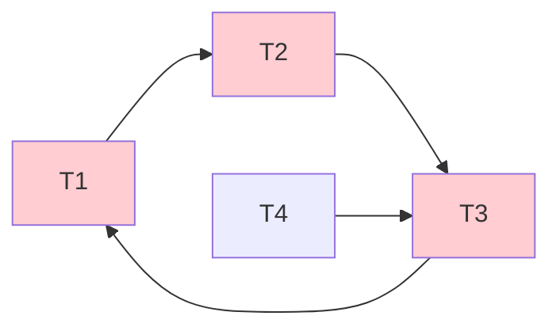

# MOC - 第9章习题

> [!info] 习题说明
> 本习题集覆盖 [[MOC - 第9章]] 全部知识点，共 30 题，分六类：单选 10、多选 5、判断 5、简答 4、分析 4（含并发问题分析给定事务执行序列判断）、综合 2（含死锁检测与 2PL 分析）。重点考查三类不一致分析、X/S 锁相容性矩阵、三级封锁协议、死锁检测与解除、意向锁加锁规则、隔离级别对照。分析题与综合题给出完整推导过程。

## 知识点覆盖表

| 题号 | 题型 | 知识点 | 考查层次 |
| ---- | ---- | ---- | ---- |
| 单1 | 单选 | 三类不一致问题 | 概念理解 |
| 单2 | 单选 | X 锁含义 | 概念理解 |
| 单3 | 单选 | S 锁含义 | 概念理解 |
| 单4 | 单选 | 一级封锁协议 | 概念理解 |
| 单5 | 单选 | 三级封锁协议 | 概念理解 |
| 单6 | 单选 | 2PL 保证 | 概念理解 |
| 单7 | 单选 | 死锁定义 | 概念理解 |
| 单8 | 单选 | 意向锁作用 | 概念理解 |
| 单9 | 单选 | InnoDB 默认隔离级别 | 概念理解 |
| 单10 | 单选 | 隔离级别与防脏读 | 综合应用 |
| 多1 | 多选 | 三类不一致现象 | 概念辨析 |
| 多2 | 多选 | X/S 锁相容性 | 概念辨析 |
| 多3 | 多选 | 三级封锁协议保证 | 概念辨析 |
| 多4 | 多选 | 死锁预防方法 | 概念辨析 |
| 多5 | 多选 | 意向锁类型 | 概念辨析 |
| 判1 | 判断 | 三级封锁协议保证可串行化 | 概念理解 |
| 判2 | 判断 | 2PL 防死锁 | 概念理解 |
| 判3 | 判断 | 动态转储与意向锁关系 | 概念理解 |
| 判4 | 判断 | InnoDB 默认 RR 防幻读 | 概念理解 |
| 判5 | 判断 | FCFS 防活锁 | 概念理解 |
| 简1 | 简答 | 三类不一致分析 | 分析说明 |
| 简2 | 简答 | 三级封锁协议 | 分析说明 |
| 简3 | 简答 | 死锁检测与解除 | 分析说明 |
| 简4 | 简答 | 四种隔离级别对照 | 分析说明 |
| 分1 | 分析 | 并发问题序列判断 | 综合应用 |
| 分2 | 分析 | X/S 锁相容性矩阵分析 | 综合应用 |
| 分3 | 分析 | 意向锁加锁流程 | 综合应用 |
| 分4 | 分析 | 三级封锁协议分析 | 综合应用 |
| 综1 | 综合 | 死锁检测与解除 | 综合应用 |
| 综2 | 综合 | 2PL 调度分析 | 综合应用 |

## 一、单选题（每题 2 分，共 10 题）

**1. 下列并发问题中，属于"丢失修改"的是（　）。**
A. 事务 $T_1$ 读数据后，$T_2$ 修改并提交，$T_1$ 再读得到不同值
B. $T_1$、$T_2$ 同时读同一数据并各自修改，后写的覆盖先写的
C. $T_1$ 修改数据未提交，$T_2$ 读取，$T_1$ 回滚
D. $T_1$ 查询后，$T_2$ 插入新行满足 $T_1$ 的查询条件，$T_1$ 再查询多出行

**2. 关于 X 锁（排他锁），下列正确的是（　）。**
A. 多个事务可同时持有同一数据的 X 锁
B. X 锁与 S 锁相容
C. 加 X 锁后只允许持有者读写，其他事务不能加任何锁
D. X 锁只用于读操作

**3. 关于 S 锁（共享锁），下列正确的是（　）。**
A. 只允许一个事务持有
B. 多个事务可同时持有同一数据的 S 锁
C. S 锁用于写操作
D. S 锁与 X 锁相容

**4. 一级封锁协议要求（　）。**
A. 修改前加 X 锁至事务结束
B. 读前加 S 锁至事务结束
C. 修改前加 X 锁、读前加 S 锁
D. 所有操作前都加 X 锁

**5. 三级封锁协议能防止的问题是（　）。**
A. 仅丢失修改
B. 仅丢失修改与读脏
C. 丢失修改、读脏与不可重复读
D. 全部并发问题包括幻读

**6. 关于两阶段封锁协议 2PL，下列正确的是（　）。**
A. 保证可串行化且防死锁
B. 保证可串行化但不防死锁
C. 不保证可串行化但防死锁
D. 既不保证可串行化也不防死锁

**7. 死锁是指（　）。**
A. 事务因等待锁而延迟，但能继续
B. 事务因系统故障无法执行
C. 多个事务循环等待对方持有的锁
D. 事务被回滚

**8. 意向锁的主要作用是（　）。**
A. 替代 X/S 锁
B. 提高多粒度封锁下加锁检查效率
C. 防止死锁
D. 实现可串行化

**9. MySQL InnoDB 默认的事务隔离级别是（　）。**
A. Read Uncommitted
B. Read Committed
C. Repeatable Read
D. Serializable

**10. 下列隔离级别中，能防止脏读的是（　）。**
A. 仅 Read Uncommitted
B. Read Committed 及以上
C. 仅 Serializable
D. 仅 Repeatable Read

## 二、多选题（每题 3 分，共 5 题）

**1. 并发操作可能产生的数据不一致问题包括（　）。**
A. 丢失修改
B. 不可重复读
C. 读脏数据
D. 幻读

**2. 下列锁的组合中，不相容的是（　）。**
A. S 与 S
B. S 与 X
C. X 与 S
D. X 与 X

**3. 关于三级封锁协议，下列正确的有（　）。**
A. 一级封锁协议防止丢失修改
B. 二级封锁协议加防读脏
C. 三级封锁协议加防不可重复读
D. 三级封锁协议保证可串行化

**4. 死锁的预防方法包括（　）。**
A. 一次封锁法
B. 顺序封锁法
C. 等待图检测法
D. FCFS 先来先服务

**5. 意向锁的类型包括（　）。**
A. IS 意向共享锁
B. IX 意向排他锁
C. SIX 共享意向排他锁
D. SX 排他意向共享锁

## 三、判断题（每题 2 分，共 5 题）

**1. 三级封锁协议能保证并发调度的可串行化。**

**2. 两阶段封锁协议 2PL 能防止死锁。**

**3. 意向锁是替代 X/S 锁的新型锁机制。**

**4. MySQL InnoDB 在 Repeatable Read 隔离级别下通过间隙锁也能防止幻读。**

**5. 采用 FCFS（先来先服务）排队策略可以有效预防活锁。**

## 四、简答题（每题 5 分，共 4 题）

**1. 简述并发操作产生的三类数据不一致问题，并各举一例。**

**2. 列出三级封锁协议的加锁要求与各自能解决的问题。**

**3. 简述死锁的检测与解除方法。**

**4. 列出 SQL 标准的四种事务隔离级别，并说明各级别能解决的并发问题。**

## 五、分析题（每题 8 分，共 4 题，需给出完整推导）

**1. 并发问题序列判断。** 设有事务 $T_1$、$T_2$ 并发执行，账户 A 初始余额为 1000：

| 时刻 | $T_1$ | $T_2$ |
| ---- | ---- | ---- |
| $t_1$ | 读 A=1000 | — |
| $t_2$ | — | 读 A=1000 |
| $t_3$ | 写 A=1100 | — |
| $t_4$ | — | 写 A=1200 |
| $t_5$ | COMMIT | — |
| $t_6$ | — | COMMIT |

请：
- (1) 指出该调度存在哪类不一致问题；
- (2) 说明 A 的最终值与正确值；
- (3) 用何种封锁协议可解决该问题？说明加锁过程。

**2. X/S 锁相容性矩阵分析。** 设有事务 $T_1$、$T_2$、$T_3$ 对数据项 R 的加锁请求序列如下：
- $T_1$ 请求 R 上的 S 锁（被授予）
- $T_2$ 请求 R 上的 S 锁
- $T_3$ 请求 R 上的 X 锁
- $T_1$ 释放 S 锁
- $T_2$ 释放 S 锁

请：
- (1) 给出每个请求时刻的授予/等待状态；
- (2) 解释 X 锁为何必须等待两个 S 锁都释放；
- (3) 若 $T_3$ 改为请求 S 锁，会怎样？

**3. 意向锁加锁流程分析。** 设事务 $T$ 要读取 `account` 表全部数据，并修改其中 id=100 和 id=200 的两行。请：
- (1) 给出加锁流程（按层次与顺序）；
- (2) 说明每步加什么锁（意向锁或实际锁）；
- (3) 解释为何需要意向锁而不直接对行加锁。

**4. 三级封锁协议分析。** 设有事务 $T_1$、$T_2$ 在三级封锁协议下并发访问数据 R：
- $T_1$ 读 R 后要修改 R
- $T_2$ 也要读 R 并修改 R

请：
- (1) 给出三级封锁协议下 $T_1$、$T_2$ 的加锁与执行顺序；
- (2) 说明该协议如何防止不可重复读；
- (3) 解释为何三级封锁协议不能保证可串行化。

## 六、综合题（每题 10 分，共 2 题）

**1. 死锁检测与解除。** 设系统中有五个事务 $T_1$、$T_2$、$T_3$、$T_4$、$T_5$，它们持有的锁与等待的锁如下：
- $T_1$ 持有 R1 的 X 锁，等待 R2 的 X 锁（被 $T_2$ 持有）
- $T_2$ 持有 R2 的 X 锁，等待 R3 的 X 锁（被 $T_3$ 持有）
- $T_3$ 持有 R3 的 X 锁，等待 R1 的 X 锁（被 $T_1$ 持有）
- $T_4$ 持有 R4 的 X 锁，等待 R3 的 X 锁（被 $T_3$ 持有）
- $T_5$ 持有 R5 的 X 锁，无等待

各事务已执行时间（已做更新量）如下：
| 事务 | 已执行时间 |
| ---- | ---- |
| $T_1$ | 5 秒 |
| $T_2$ | 8 秒 |
| $T_3$ | 3 秒 |
| $T_4$ | 10 秒 |
| $T_5$ | 1 秒 |

请：
- (1) 画出等待图；
- (2) 判断是否发生死锁，并指出哪些事务在死锁环中；
- (3) 选择哪个事务作为牺牲事务（按撤销代价最小原则）？说明理由；
- (4) 说明解除死锁后的等待图状态。

**2. 2PL 调度分析。** 设有事务 $T_1$、$T_2$ 遵循两阶段封锁协议，访问数据项 A、B：
- $T_1$：读 A → 写 B
- $T_2$：读 B → 写 A

请：
- (1) 给出 $T_1$、$T_2$ 在 2PL 下的加锁与释放顺序；
- (2) 分析是否可能发生死锁？若可能，给出一个死锁调度；
- (3) 给出一个可串行化的 2PL 调度；
- (4) 说明 2PL 为何能保证可串行化但不防死锁。

## 答案与解析

单选题答案与解析

1. **B**。两个事务同读同写，后写覆盖先写——这是丢失修改。A 是不可重复读；C 是读脏数据；D 是幻读。
2. **C**。X 锁是排他锁，加 X 锁后只允许持有者读写，其他事务不能加任何锁。参见 [[9.2 封锁技术]]。
3. **B**。S 锁是共享锁，多个事务可同时持有同一数据的 S 锁。
4. **A**。一级封锁协议要求修改前加 X 锁至事务结束。B 是三级协议的读锁要求。
5. **C**。三级封锁协议防止丢失修改、读脏、不可重复读三类问题，但不防幻读也不保证可串行化。
6. **B**。2PL 保证可串行化但不防死锁。参见 [[9.3 封锁协议]]。
7. **C**。死锁是多个事务循环等待对方持有的锁。A 描述的是活锁。
8. **B**。意向锁用于多粒度封锁场景，提高加锁检查效率。参见 [[9.5 意向锁]]。
9. **C**。InnoDB 默认 Repeatable Read。参见 [[9.6 事务隔离级别]]。
10. **B**。Read Committed 及以上级别都防止脏读。Read Uncommitted 不防；Serializable 防但不是唯一。

多选题答案与解析

1. **ABCD**。三类经典不一致（丢失修改、不可重复读、读脏）加上幻读，都是并发可能产生的问题。
2. **BCD**。S/S 相容；S/X、X/S、X/X 都不相容。参见 [[9.2 封锁技术]] 相容性矩阵。
3. **ABC**。三级封锁协议分别防止丢失修改、加防读脏、加防不可重复读。D 错——三级协议不保证可串行化。
4. **AB**。死锁预防方法是一次封锁法与顺序封锁法。C 是检测方法；D 是活锁预防方法。
5. **ABC**。意向锁有 IS、IX、SIX 三种。D 选项不存在 SX 锁。

判断题答案与解析

1. **×**。三级封锁协议针对单条数据项约定加锁，不保证多数据项交错的可串行化。保证可串行化的是 2PL。
2. **×**。2PL 在增长阶段不释放锁，可能形成循环等待，不防死锁。需死锁检测机制。
3. **×**。意向锁不是替代 X/S 锁，而是与 X/S 锁配合的多粒度封锁优化机制。
4. **√**。InnoDB 在 RR 级别下用间隙锁（Gap Lock）/ Next-Key Lock 防止幻读，这是对 SQL 标准的加强。
5. **√**。FCFS 排队保证事务按申请顺序获得锁，避免活锁。

简答题答案

**1. 三类不一致问题及举例：**
- **丢失修改**：两事务同读同写同一数据，后写覆盖先写。例：$T_1$、$T_2$ 同时读 A=100，各自加 100 写回，最终 A=200 而非 300。
- **不可重复读**：事务两次读同一数据得到不同值。例：$T_1$ 读 A=1000，$T_2$ 改 A=800 并提交，$T_1$ 再读 A=800。
- **读脏数据**：事务读到另一事务未提交的修改，后者回滚。例：$T_1$ 改 A=1500（未提交），$T_2$ 读 A=1500，$T_1$ 回滚 A=1000，$T_2$ 读到脏数据。
参见 [[9.1 并发引发的数据不一致问题]]。

**2. 三级封锁协议：**
| 协议 | 加锁要求 | 解决问题 |
| ---- | ---- | ---- |
| 一级 | 修改前加 X 锁至事务结束 | 丢失修改 |
| 二级 | 一级 + 读前加 S 锁读完释放 | 丢失修改 + 读脏 |
| 三级 | 一级 + 读前加 S 锁至事务结束 | 丢失修改 + 读脏 + 不可重复读 |

参见 [[9.3 封锁协议]]。

**3. 死锁检测与解除：**
- **检测**：构建等待图，事务 $T_i$ 等待 $T_j$ 持有的锁时画有向边 $T_i\to T_j$。等待图中存在环即死锁。
- **解除**：选择撤销代价最小的事务（如已做更新最少、已执行时间最短）回滚，释放其所有锁，打破循环等待。被撤销的事务可重启。
- 工程上也可用超时法：事务等待超过阈值即回滚。
参见 [[9.4 活锁、死锁处理]]。

**4. 四种隔离级别：**
| 级别 | 防脏读 | 防不可重复读 | 防幻读 |
| ---- | ---- | ---- | ---- |
| Read Uncommitted | 否 | 否 | 否 |
| Read Committed | 是 | 否 | 否 |
| Repeatable Read | 是 | 是 | 否（SQL 标准）/ 是（InnoDB） |
| Serializable | 是 | 是 | 是 |

参见 [[9.6 事务隔离级别]]。

分析题答案与完整推导

**1. 并发问题序列判断。**

**(1) 存在的问题**：**丢失修改**。$T_1$、$T_2$ 同时读 A=1000，各自加 100 / 加 200 写回，$T_2$ 的写（1200）覆盖了 $T_1$ 的写（1100）。

**(2) 最终值与正确值**：
- 实际最终值：A=1200（$T_2$ 最后写入）
- 正确值：A=1000+100+200=1300（两事务都生效）

**(3) 解决方案**：用**一级封锁协议**——修改前加 X 锁至事务结束。加锁过程：
1. $T_1$ 读 A 前，先对 A 加 X 锁（或读时不加锁，仅修改前加 X 锁）。
2. $T_1$ 修改 A 写回（A=1100），保持 X 锁。
3. $T_2$ 想修改 A，申请 X 锁，因与 $T_1$ 的 X 锁不相容，等待。
4. $T_1$ COMMIT，释放 X 锁。
5. $T_2$ 获得 X 锁，读 A=1100，修改 A=1300 写回。
6. $T_2$ COMMIT。

最终 A=1300，正确。

---

**2. X/S 锁相容性矩阵分析。**

**(1) 各请求时刻状态：**
| 时刻 | 请求 | 状态 |
| ---- | ---- | ---- |
| 1 | $T_1$ 请求 S 锁 | 授予（R 无锁） |
| 2 | $T_2$ 请求 S 锁 | 授予（S/S 相容） |
| 3 | $T_3$ 请求 X 锁 | 等待（X 与 S 不相容） |
| 4 | $T_1$ 释放 S 锁 | $T_3$ 仍等待（$T_2$ 仍持 S 锁） |
| 5 | $T_2$ 释放 S 锁 | $T_3$ 授予 X 锁 |

**(2) X 锁必须等待两个 S 锁都释放的原因**：
- X 锁与 S 锁不相容（相容性矩阵中 X/S = ✗）。
- $T_3$ 加 X 锁前，R 上不能有任何其他锁。
- 故 $T_3$ 必须等待 $T_1$、$T_2$ 都释放 S 锁后才能获得 X 锁。

**(3) 若 $T_3$ 改为请求 S 锁**：
- S 锁与 $T_1$、$T_2$ 持有的 S 锁相容（S/S 相容）。
- $T_3$ 立即被授予 S 锁，三个事务可同时读 R。
- 这正是 S 锁"共享"的语义——读读可并发。

---

**3. 意向锁加锁流程分析。**

**(1) 加锁流程：**
1. 在表 `account` 上加 SIX 锁（声明：读全表 + 修改部分行）。
2. 在 id=100 的行上加 X 锁。
3. 在 id=200 的行上加 X 锁。
4. 执行读全表操作。
5. 执行修改 id=100、id=200 操作。
6. 释放两行上的 X 锁。
7. 释放表上的 SIX 锁（按事务结束统一释放）。

**(2) 每步加锁类型：**
- 表级：SIX 锁（共享意向排他锁）
- 行级：X 锁（实际修改锁）

**(3) 为何需要意向锁**：
若没有意向锁，每个行级 X 锁申请时，DBMS 需逐行检查或检查表锁——开销大。意向锁在表级声明"下层有锁"，其他事务想加表级锁时只检查表级意向锁即可判断，无需逐行扫描。意向锁大幅提高了多粒度封锁的加锁效率。

---

**4. 三级封锁协议分析。**

**(1) 加锁与执行顺序**：
设 $T_1$ 先执行。
1. $T_1$ 读 R：加 S 锁（保持到事务结束）。
2. $T_1$ 修改 R：加 X 锁（保持到事务结束）。但此时 $T_1$ 已持 S 锁，需升级——若 $T_2$ 未持任何锁则升级成功；若 $T_2$ 持有 R 的 S 锁则等待。
3. $T_2$ 读 R：申请 S 锁。若 $T_1$ 已升级为 X 锁，$T_2$ 等待。
4. $T_1$ COMMIT 释放所有锁。
5. $T_2$ 获得 S 锁，读 R。
6. $T_2$ 修改 R：升级为 X 锁。
7. $T_2$ COMMIT。

**(2) 防止不可重复读**：
三级封锁协议要求读前加 S 锁并保持到事务结束。$T_1$ 读 R 后持 S 锁不释放，$T_2$ 想"修改 R"必须加 X 锁，但与 $T_1$ 的 S 锁不相容，必须等待 $T_1$ 结束。所以 $T_1$ 事务内多次读 R 都得到相同值。

**(3) 为何不能保证可串行化**：
三级封锁协议只针对**单条数据项**的读写约定加锁，未约束事务对**多个数据项**交错操作的顺序。例如 $T_1$ 读 A、$T_2$ 读 B、$T_1$ 写 B、$T_2$ 写 A——每个数据项的加锁都符合三级协议，但整体调度可能不可串行化。保证可串行化需要 2PL。

综合题答案与完整推导

**1. 死锁检测与解除。**

**(1) 等待图：**

节点：$T_1, T_2, T_3, T_4, T_5$。
边：
- $T_1 \to T_2$（$T_1$ 等待 $T_2$ 持有的 R2）
- $T_2 \to T_3$（$T_2$ 等待 $T_3$ 持有的 R3）
- $T_3 \to T_1$（$T_3$ 等待 $T_1$ 持有的 R1）
- $T_4 \to T_3$（$T_4$ 等待 $T_3$ 持有的 R3）
- $T_5$ 无出边（无等待）

**(2) 死锁判定：**
等待图中存在环 $T_1 \to T_2 \to T_3 \to T_1$——**发生死锁**。
- 死锁环中的事务：$T_1, T_2, T_3$。
- $T_4$ 虽在等待 $T_3$，但不在环上，不直接死锁（但因 $T_3$ 死锁而间接阻塞）。
- $T_5$ 无等待，正常执行。

**(3) 选择牺牲事务：**
按撤销代价最小（已执行时间最短）原则：
| 事务 | 已执行时间 | 是否在环中 |
| ---- | ---- | ---- |
| $T_1$ | 5 秒 | 是 |
| $T_2$ | 8 秒 | 是 |
| $T_3$ | 3 秒 | 是（最短） |
| $T_4$ | 10 秒 | 否 |
| $T_5$ | 1 秒 | 否 |

在死锁环 $\{T_1, T_2, T_3\}$ 中，**$T_3$ 已执行时间最短（3 秒）**，撤销代价最小。选择 $T_3$ 作为牺牲事务回滚。

**(4) 解除后的等待图：**
$T_3$ 被回滚，释放其持有的 R3 锁。
- $T_2$ 之前等待 R3（被 $T_3$ 持有），现 $T_3$ 释放，$T_2$ 获得 R3 锁，继续执行。
- $T_4$ 之前等待 R3，现按 FCFS 排队（若 $T_2$ 先到则 $T_2$ 先获，$T_4$ 继续等 $T_2$）。

新的等待图：
- $T_1 \to T_2$（仍等待 R2）
- $T_2$：获得 R3，无出边（继续执行后 COMMIT 释放 R2）
- $T_4 \to T_2$（若 $T_2$ 获得 R3 后 $T_4$ 等 $T_2$，或 $T_4$ 直接获 R3）
- $T_3$：已回滚，从图中移除
- $T_5$：无等待

环 $T_1 \to T_2 \to T_3 \to T_1$ 被打破（$T_3$ 移除），死锁解除。

---

**2. 2PL 调度分析。**

**(1) 2PL 下的加锁与释放顺序：**

$T_1$（读 A → 写 B）：
- 增长阶段：申请 A 的 S 锁 → 申请 B 的 X 锁
- 封锁点：获得 B 的 X 锁
- 收缩阶段：释放 A 的 S 锁 → 释放 B 的 X 锁（或保持到事务结束，若是 S2PL）

$T_2$（读 B → 写 A）：
- 增长阶段：申请 B 的 S 锁 → 申请 A 的 X 锁
- 封锁点：获得 A 的 X 锁
- 收缩阶段：释放 B 的 S 锁 → 释放 A 的 X 锁

**(2) 是否可能死锁：**
**可能死锁**。考虑以下调度：
1. $T_1$ 申请 A 的 S 锁，授予。
2. $T_2$ 申请 B 的 S 锁，授予。
3. $T_1$ 申请 B 的 X 锁，因 $T_2$ 持 B 的 S 锁，等待。
4. $T_2$ 申请 A 的 X 锁，因 $T_1$ 持 A 的 S 锁，等待。

此时 $T_1$ 等 $T_2$ 释放 B，$T_2$ 等 $T_1$ 释放 A，形成循环等待 $T_1 \to T_2 \to T_1$——死锁。

**(3) 可串行化的 2PL 调度：**
设 $T_1$ 先完成增长阶段：
1. $T_1$ 申请 A 的 S 锁，授予。
2. $T_1$ 申请 B 的 X 锁，授予（B 无锁）。
3. $T_1$ 达到封锁点，进入收缩阶段，释放 A 的 S 锁。
4. $T_2$ 申请 B 的 S 锁，因 $T_1$ 仍持 B 的 X 锁（若 S2PL 则到事务结束），等待。
5. $T_1$ COMMIT 释放所有锁。
6. $T_2$ 申请 B 的 S 锁，授予。
7. $T_2$ 申请 A 的 X 锁，授予（A 无锁）。
8. $T_2$ 达到封锁点，COMMIT。

该调度等价于串行执行 $T_1 < T_2$，可串行化。

**(4) 2PL 为何保证可串行化但不防死锁：**

- **保证可串行化**：2PL 要求事务的封锁点（最后加锁时刻）存在。可以证明：按事务封锁点的顺序串行执行各事务，结果与 2PL 并发调度相同。故 2PL 调度必然可串行化。
- **不防死锁**：2PL 的增长阶段允许事务不断申请新锁而不释放。多个事务增长阶段交错时，可能形成"我持有 A 等 B、你持有 B 等 A"的循环等待——死锁。2PL 本身不包含死锁预防机制，需配合 [[9.4 活锁、死锁处理]] 的检测与解除。

## 考点统计表

| 题型 | 题数 | 分值 | 考查重点 |
| ---- | ---- | ---- | ---- |
| 单选 | 10 | 20 | 三类不一致、X/S 锁含义、三级封锁协议、2PL、死锁、意向锁、InnoDB 默认级别、隔离级别 |
| 多选 | 5 | 15 | 三类不一致、X/S 相容性、三级协议保证、死锁预防、意向锁类型 |
| 判断 | 5 | 10 | 三级协议可串行化、2PL 防死锁、意向锁本质、InnoDB 防幻读、FCFS 防活锁 |
| 简答 | 4 | 20 | 三类不一致举例、三级封锁协议、死锁检测解除、四种隔离级别 |
| 分析 | 4 | 32 | 并发序列判断、相容性矩阵分析、意向锁加锁流程、三级协议分析 |
| 综合 | 2 | 20 | 死锁检测与解除（等待图+牺牲选择）、2PL 调度分析（死锁+可串行化） |
| 合计 | 30 | 117 | 覆盖第 9 章全部核心考点，重并发问题分析与死锁检测 |

## 章节导航

- 上级 MOC：[[MOC - 数据库原理]]
- 本章知识点：[[MOC - 第9章]]（[[9.1 并发引发的数据不一致问题]]、[[9.2 封锁技术]]、[[9.3 封锁协议]]、[[9.4 活锁、死锁处理]]、[[9.5 意向锁]]、[[9.6 事务隔离级别]]）
- 上一章习题：[[MOC - 第8章习题]]
- 下一章习题：[[MOC - 第10章习题]]
