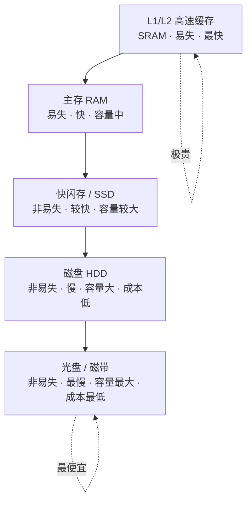
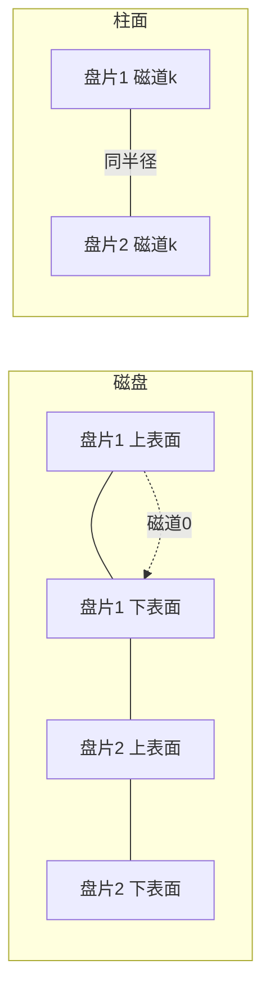
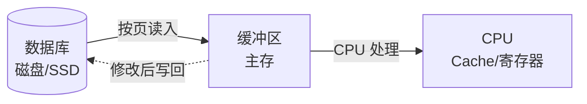

# 10.1 存储介质

本节解决的核心问题是：**数据库中的数据最终存放在什么物理介质上，这些介质的速度、容量、成本与易失性如何权衡**。数据库系统的性能瓶颈几乎总是磁盘 I/O，理解存储介质的层次结构与磁盘的物理特性，是后续学习文件组织（[[10.2 文件组织]]）、索引结构（[[10.3 索引结构（B+树、散列索引）]]）和缓冲区管理（[[10.4 缓冲区管理]]）的物理基础。

## 10.1.1 存储介质的层次结构

计算机系统中存在多种存储介质，它们在速度、容量、成本和易失性上呈现明显的层次差异。数据库管理系统通过这种层次结构，将热数据放高速介质、冷数据放低速大容量介质。

### 各级存储介质对比

| 层级 | 介质 | 典型存取时间 | 容量级别 | 每字节成本 | 易失性 | 数据库用途 |
| ---- | ---- | ---- | ---- | ---- | ---- | ---- |
| 1 | 高速缓存（Cache） | ns 级（$10^{-9}$s） | KB~MB | 极高 | 易失 | DBMS 不可直接控制 |
| 2 | 主存（RAM） | 10~100 ns | GB | 高 | 易失 | 缓冲区、工作区 |
| 3 | 快闪存 / SSD | 10~100 μs | 百 GB~TB | 中 | 非易失 | 数据库主存储（新硬件） |
| 4 | 磁盘（HDD） | ms 级（$10^{-3}$s） | TB | 低 | 非易失 | 传统数据库主存储 |
| 5 | 光盘 / 磁带 | 秒~分钟 | TB~PB | 极低 | 非易失 | 归档、备份、冷数据 |

> [!note] 易失性与持久性
> - **易失性存储**（Volatile）：断电后数据丢失，如高速缓存、主存。数据库运行时数据须先读入主存才能被 CPU 处理。
> - **非易失性存储**（Non-volatile）：断电后数据保留，如 SSD、磁盘、光盘、磁带。数据库的持久化存储依赖于非易失性介质。
> - 数据库系统通过将主存中的修改**写回**非易失性介质（并配合日志，见 [[MOC - 第8章]]）来保证持久性。

> [!tip] 性能结论的尺度
> 访问主存约 100 ns，访问磁盘约 10 ms，二者相差约 **$10^5$~$10^6$ 倍**。因此数据库设计的核心目标之一是**减少磁盘 I/O 次数**——这正是 B+ 树多路索引、缓冲区管理存在的根本原因。结论假设：传统机械磁盘环境；SSD 下随机访问代价显著降低，但 I/O 仍远高于主存。

## 10.1.2 磁盘结构

磁盘（HDD）是传统数据库最重要的二级存储介质。理解其物理结构有助于理解磁盘 I/O 代价的构成。

### 1. 磁盘的物理组成

> [!definition] 磁盘的主要部件
> - **盘片（Platter）**：磁盘的物理载体，两面涂有磁性材料。
> - **磁道（Track）**：盘片上的同心圆环，每个盘面有大量磁道。
> - **扇区（Sector）**：磁道被划分为固定大小的扇区，是磁盘读写的最小单位（通常 512 字节，现代磁盘可达 4 KB）。
> - **柱面（Cylinder）**：所有盘面上同一半径磁道的集合。磁头沿半径移动一次可访问同一柱面上的所有磁道。
> - **读写磁头（Read/Write Head）**：每个盘面一个磁头，安装在磁头臂上共同移动。

### 2. 数据块与磁盘地址

磁盘上的数据以**块（Block）**为单位进行读写，一个块通常包含若干连续扇区。数据库系统通常将块大小配置为 4 KB、8 KB 或 16 KB。每个块有一个唯一的**磁盘地址**（柱面号、盘面号、扇区号），DBMS 据此定位数据。

## 10.1.3 磁盘 I/O 性能指标

磁盘访问一个数据块的时间由三部分组成：

> [!theorem] 磁盘 I/O 时间的构成
> $$T_{\text{access}} = T_{\text{seek}} + T_{\text{rotation}} + T_{\text{transfer}}$$
> 其中：
> - $T_{\text{seek}}$ **寻道时间**：磁头移动到目标柱面所需时间，通常 4~10 ms，是磁盘访问代价的主要来源；
> - $T_{\text{rotation}}$ **旋转延迟**：盘片旋转使目标扇区到达磁头下方的时间，平均为旋转一周时间的一半，约 2~6 ms；
> - $T_{\text{transfer}}$ **传输时间**：读写数据本身的时间，与数据量和转速有关，通常远小于前两者。

| 组成 | 时间量级 | 可优化性 |
| ---- | ---- | ---- |
| 寻道时间 | ms 级（主要） | 顺序访问可大幅减少 |
| 旋转延迟 | ms 级 | 难以优化 |
| 传输时间 | μs~ms 级 | 块大则摊薄寻道成本 |

> [!tip] 顺序访问 vs 随机访问
> 顺序访问相邻块时寻道时间几乎为 0，磁盘吞吐量可达 100 MB/s 以上；而随机访问每块都需寻道，每秒只能完成数百次 I/O。这就是数据库倾向于将相关数据**物理聚簇存放**、用预读策略连续读取的物理原因。

## 10.1.4 固态硬盘 SSD

> [!definition] 固态硬盘（Solid State Drive, SSD）
> SSD 基于闪存（NAND Flash）芯片存储数据，没有机械运动部件，由控制器和闪存芯片组成。

### SSD 的特点

| 特性 | HDD 机械磁盘 | SSD 固态硬盘 |
| ---- | ---- | ---- |
| 访问方式 | 机械寻道+旋转 | 电子寻址 |
| 随机访问 | 慢（ms 级） | 快（μs 级，相差 1~2 个数量级） |
| 顺序访问 | 较快 | 很快 |
| 机械部件 | 有（易损） | 无（抗震） |
| 写入限制 | 无 | 有擦写次数限制（磨损） |
| 写放大 | 无 | 存在（需垃圾回收、磨损均衡） |
| 成本/GB | 低 | 较高 |

> [!warning] SSD 下的存储结论变化
> SSD 随机读性能接近顺序读，因此部分基于"随机 I/O 极慢"的传统结论需调整：例如随机 B+ 树查找的代价在 SSD 上显著下降。但**写**仍有擦写寿命与写放大问题，LSM-Tree 等写优化结构在 SSD 上更受重视。结论随硬件变化，须标注环境。

## 10.1.5 数据库存储与内存层次关系

数据库的数据最终在三层介质间流动：

- **磁盘 / SSD**：数据库的持久存储，数据以**页（Page）**为单位组织；
- **主存缓冲区**：DBMS 在内存中开辟的缓冲池，存放最近使用的页，命中则免磁盘 I/O（详见 [[10.4 缓冲区管理]]）；
- **CPU 缓存 / 寄存器**：运算时临时存放，由硬件管理，DBMS 不直接控制。

> [!note] 局部性原理
> 程序访问数据具有**时间局部性**（刚访问的还会被访问）和**空间局部性**（相邻数据可能被访问）。缓冲区管理（LRU 等）和预读机制正是利用局部性减少磁盘 I/O。

## 小结

本节阐述了存储介质的层次结构、磁盘的物理组成与 I/O 代价构成、SSD 的特性及其对存储结论的影响。数据库性能优化的物理起点就是减少慢速介质的访问：让热数据驻留缓冲区、用索引缩小扫描范围、用聚簇组织相关数据。这些机制在后续三节中展开。

## 关联

- 上一级：[[MOC - 第10章]]
- 下一节：[[10.2 文件组织]]
- 相关概念：[[10.3 索引结构（B+树、散列索引）]]（索引减少 I/O）、[[10.4 缓冲区管理]]（缓冲区弥合主存与磁盘速度差）、[[MOC - 第8章]]（日志写盘策略）、[[7.03.05 B+ 树]]（数据结构视角的 B+ 树）
