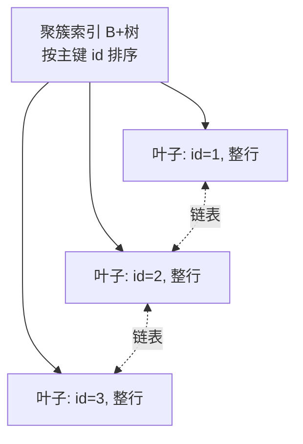

# 10.3 索引结构（B+树、散列索引）

本节解决的核心问题是：**如何为关系表建立高效的存取路径，使查询不必扫描全表而快速定位记录**。索引是数据库性能的关键：在 $n$ 条记录中找一条，全表扫描代价 $O(n)$ 次 I/O，而 B+ 树索引代价约 $O(\log_m n)$ 次 I/O。本节是第10章的**重点**，涵盖索引分类、B+ 树、散列索引及 MySQL InnoDB 的索引实现，是理解第11章查询优化（[[11.3 物理优化]]）的前提。

## 10.3.1 索引的基本概念

> [!definition] 索引（Index）
> 索引是建立在表的一列或多列上的**辅助数据结构**，用于加速按该列的查询。索引项由**索引码（搜索码, search key）**和**指针**组成，指针指向对应记录的物理位置。

### 1. 主索引与辅助索引

按索引码是否为表的排序码/主码划分：

| 类型 | 别名 | 索引码 | 与数据关系 | InnoDB 表现 |
| ---- | ---- | ---- | ---- | ---- |
| **主索引（Primary Index）** | 聚簇索引 | 主码/排序码 | 索引顺序与记录物理顺序一致 | 即聚簇索引，叶子存整行 |
| **辅助索引（Secondary Index）** | 二级索引 | 非主码字段 | 索引顺序与记录物理顺序无关 | 叶子存主键值，需回表 |

### 2. 稠密索引与稀疏索引

按索引项是否对应每条记录划分：

> [!definition] 稠密索引（Dense Index）
> 为**每条记录**建立一个索引项，索引码值与记录一一对应。查找快，但索引项多、占用空间大。

> [!definition] 稀疏索引（Sparse Index）
> 只为每个**块的起始记录**（或每组的首记录）建立索引项。索引项少、省空间，但查找需先定位块再在块内扫描。

| 维度 | 稠密索引 | 稀疏索引 |
| ---- | ---- | ---- |
| 索引项数 | $n$（每记录一项） | $n/B$（每块一项，$B$ 为块因子） |
| 查找 | 直接命中 | 定位块后块内扫描 |
| 空间 | 大 | 小 |
| 前提 | 任意文件 | 记录按索引码有序（顺序文件/聚簇索引） |

### 3. 聚簇索引与非聚簇索引

> [!definition] 聚簇索引（Clustered Index）
> 索引项的顺序**与数据记录的物理存储顺序一致**的索引。一个表只能有一个聚簇索引（因为物理顺序唯一）。聚簇索引通常是主索引。

> [!definition] 非聚簇索引（Non-clustered Index / Secondary Index）
> 索引项顺序与记录物理顺序不一致的索引，索引叶子存放的是指向记录的指针（或主键值）。一个表可建立多个非聚簇索引。

| 维度 | 聚簇索引 | 非聚簇索引 |
| ---- | ---- | ---- |
| 物理/逻辑顺序一致 | 是 | 否 |
| 每表数量 | 1 个 | 多个 |
| 叶子节点存放 | 完整行数据 | 行指针 / 主键值 |
| 范围查询 | 快（叶子链表连续） | 需多次回表 |
| InnoDB | 主键即聚簇索引 | 辅助索引存主键值 |

> [!warning] 易错点：聚簇 vs 稠密
> - **聚簇/非聚簇**描述的是索引顺序与数据物理顺序是否一致；
> - **稠密/稀疏**描述的是索引项是否覆盖每条记录。
> 二者是不同维度的分类。聚簇索引既可稠密也可稀疏，非聚簇索引通常为稠密。

## 10.3.2 B+ 树索引

B+ 树是数据库索引的事实标准，几乎所有主流 DBMS 的默认索引结构。它由 B- 树演变而来，更适合外存索引。

### 1. B+ 树的定义与性质

> [!definition] B+ 树
> 一棵 $m$ 阶 B+ 树是满足以下性质的多路平衡查找树：
> 1. 每个非叶子节点（内部节点）最多有 $m$ 棵子树；
> 2. 每个非叶子节点（除根外）至少有 $\lceil m/2 \rceil$ 棵子树；根节点至少有 2 棵子树（或为叶子）；
> 3. 有 $k$ 棵子树的节点有 $k$ 个关键字（索引码），关键字是其子树中记录码值的上界（或下界，视实现）；
> 4. **所有数据都存放在叶子节点**，非叶子节点只存放索引码用于路由；
> 5. **所有叶子节点按索引码有序，并通过链表相连**，支持范围扫描。

> [!note] B+ 树与 B- 树的关键差异
> - B- 树：非叶子节点和叶子都存数据；B+ 树：只有叶子存数据。
> - B- 树：叶子不链表；B+ 树：叶子有序链表相连。
> - B+ 树非叶子节点只是索引（路由），单节点可容纳更多关键字，树更矮，I/O 更少。
> 数据结构视角详见 [[7.03.05 B+ 树]]。

### 2. B+ 树结构示例

```mermaid
flowchart TD
    ROOT[根节点<br/>键: 30 | 60] --> N1[内部节点<br/>键: 10 | 20]
    ROOT --> N2[内部节点<br/>键: 40 | 50]
    ROOT --> N3[内部节点<br/>键: 70 | 80]

    N1 --> L1[叶子: 5,10<br/>→记录]
    N1 --> L2[叶子: 15,20<br/>→记录]
    N1 --> L3[叶子: 25,30<br/>→记录]
    N2 --> L4[叶子: 35,40<br/>→记录]
    N2 --> L5[叶子: 45,50<br/>→记录]
    N2 --> L6[叶子: 55,60<br/>→记录]
    N3 --> L7[叶子: 65,70<br/>→记录]
    N3 --> L8[叶子: 75,80<br/>→记录]

    L1 <-.叶子链表.-> L2
    L2 <-.叶子链表.-> L3
    L3 <-.叶子链表.-> L4
    L4 <-.叶子链表.-> L5
    L5 <-.叶子链表.-> L6
    L6 <-.叶子链表.-> L7
    L7 <-.叶子链表.-> L8

    style ROOT fill:#bbdefb
    style N1 fill:#c8e6c9
    style N2 fill:#c8e6c9
    style N3 fill:#c8e6c9
    style L1 fill:#fff9c4
    style L2 fill:#fff9c4
    style L3 fill:#fff9c4
    style L4 fill:#fff9c4
    style L5 fill:#fff9c4
    style L6 fill:#fff9c4
    style L7 fill:#fff9c4
    style L8 fill:#fff9c4
```

> [!note] 节点与页的对应
> 在 DBMS 实现中，**一个 B+ 树节点通常对应一个磁盘页**（InnoDB 默认 16 KB）。这样一次 I/O 读入一个节点即可获得其全部路由信息，最大化每页利用率。

### 3. B+ 树的查找

> [!algorithm] B+ 树查找
> 1. 从根节点开始；
> 2. 在当前节点中查找大于等于待查码值的最小关键字 $K_i$；
> 3. 沿 $K_i$ 对应的子树指针下行到下一层节点；
> 4. 直到到达**叶子节点**；
> 5. 在叶子节点中顺序查找，命中则通过指针取出记录。

> [!warning] 与 B- 树查找的区别
> B- 树在非叶子节点命中即可终止；B+ 树无论是否在内部节点匹配到码值，都必须**下行到叶子**才能取到数据。B+ 树每次查找路径长度相同（根到叶），便于分析。

### 4. B+ 树的插入

> [!algorithm] B+ 树插入
> 1. 通过查找定位到目标叶子节点；
> 2. 将新记录插入叶子（保持有序）；
> 3. 若插入后叶子节点关键字数 $> m$（超出上限），则**分裂**：
>    - 将叶子分成两半；
>    - 把分裂后的最大（或最小）关键字上提到父节点；
>    - 调整叶子链表指针；
> 4. 若父节点也溢出，递归向上分裂；
> 5. 若根节点分裂，产生新根，**树高加 1**。

> [!example] B+ 树插入示例（3 阶）
> 设 3 阶 B+ 树叶子最多 3 个关键字，当前某叶子为 `[10, 20, 30]`（已满）。插入 `25`：
> 1. 定位到该叶子，插入后为 `[10, 20, 25, 30]`，超出上限 3；
> 2. 分裂为 `[10, 20]` 与 `[25, 30]`，将 `20`（或 `25`，视实现）上提到父节点；
> 3. 父节点新增关键字并维护子树指针。

### 5. B+ 树的删除

> [!algorithm] B+ 树删除
> 1. 查找定位到目标叶子节点；
> 2. 删除该记录（与索引项）；
> 3. 若删除后叶子关键字数 $< \lceil m/2 \rceil$（低于下限）：
>    - 先尝试与**兄弟节点合并**；
>    - 若兄弟节点能借出关键字，则**借调**并调整父节点索引码；
>    - 否则**合并**两个叶子，并删除父节点中多余的索引码；
> 4. 若合并导致父节点低于下限，递归向上调整；
> 5. 若根节点仅剩一个子节点，删除根，树高减 1。

> [!note] 删除时索引码的保留
> B+ 树非叶子节点的索引码仅用于路由，删除叶子记录后即使该码值消失，**其在内部节点仍可保留**作为分界关键字（不影响正确性）。这也是 B+ 树删除比 B- 树简单的原因之一。

### 6. B+ 树高度与查询效率分析

> [!theorem] B+ 树的高度与 I/O 代价
> 设 $m$ 阶 B+ 树有 $n$ 个记录（叶子节点总数约 $n$），每个内部节点最少有 $\lceil m/2 \rceil$ 棵子树。最坏情况下树高 $h$ 满足：
> $$n \geq 2 \cdot \lceil m/2 \rceil^{h-1} \implies h \leq 1 + \log_{\lceil m/2 \rceil}\left(\frac{n}{2}\right)$$
> 查找一次记录的 I/O 次数等于从根到叶的路径长度，即 $O(\log_m n)$。

> [!example] B+ 树高度估算（InnoDB 默认配置）
> 假设主键为 BIGINT（8 字节），指针 6 字节，单页 16 KB。
> - 内部节点可容纳关键字数约 $16384 / (8+6) \approx 1170$；
> - 叶子节点假设存 1 KB 行，单页约 16 行；
> - 3 层 B+ 树可存 $1170 \times 1170 \times 16 \approx 2190$ 万行；
> - 4 层可存 $1170^3 \times 16 \approx 256$ 亿行。
>
> 因此**千万级数据用 3 层 B+ 树即可**，每次查找仅需 3 次 I/O（根节点常驻缓冲区则 2~3 次）。这是 B+ 树成为数据库索引标准的根本原因。环境：MySQL 8.0 InnoDB，16 KB 页。

> [!tip] 为什么不用二叉平衡树
> 二叉树高度 $\log_2 n$，千万级数据高约 24 层，需 24 次 I/O；B+ 树多路特性使高度降至 3~4，I/O 减少 5~8 倍。磁盘 I/O 是性能瓶颈，**降低树高 = 减少 I/O** 是 B+ 树的核心优势。

## 10.3.3 散列索引

散列索引用散列函数将码值映射到桶地址，适合等值查询。

### 1. 静态散列

> [!definition] 静态散列（Static Hashing）
> 桶数目固定，散列函数 $h(K)$ 将码值 $K$ 映射到 $[0, B-1]$ 的桶号。当桶满时产生**溢出桶**，用链表连接。

- 优点：等值查找接近 $O(1)$；
- 缺点：桶数固定，数据增长时溢出链变长，性能下降；删减时桶空闲浪费。**数据库数据规模动态变化，静态散列不适应**。

### 2. 动态散列

为克服静态散列的缺陷，发展出动态散列结构：

> [!definition] 可扩展散列（Extendable Hashing）
> 使用**目录（directory）**和**可变长度的散列前缀**。当桶溢出时，只分裂该桶并调整目录指针，目录深度（前缀位数）按需增长。目录小且查找只需一次目录访问+一次桶访问。

> [!definition] 线性散列（Linear Hashing）
> 不维护目录，桶按线性顺序分裂。当负载因子超过阈值时，按预定义顺序分裂下一个桶，散列函数随分裂轮数动态扩展。分裂不针对溢出桶，但溢出用链表处理。

| 维度 | 静态散列 | 可扩展散列 | 线性散列 |
| ---- | ---- | ---- | ---- |
| 桶数 | 固定 | 动态（按需分裂） | 动态（线性分裂） |
| 目录 | 无 | 有（可增长） | 无 |
| 分裂触发 | 不分裂 | 桶溢出 | 负载因子阈值 |
| 查找 | 一次 | 一次（查目录+桶） | 一次或带溢出链 |
| 适用 | 数据规模稳定 | 等值查询、规模变化 | 规模增长平稳 |

> [!note] 散列索引不支持范围查询
> 散列将相邻码值散列到不同桶，无法按码值顺序遍历，因此**不支持范围查询、排序、前缀匹配**。这是散列索引相对 B+ 树的根本局限。

## 10.3.4 B+ 树索引 vs 散列索引适用场景对比

| 维度 | B+ 树索引 | 散列索引 |
| ---- | ---- | ---- |
| 等值查询 | 快（$O(\log_m n)$） | 最快（约 $O(1)$） |
| 范围查询 | 支持（叶子链表） | 不支持 |
| 排序 / ORDER BY | 支持 | 不支持 |
| 前缀匹配 / LIKE 'x%' | 支持（最左前缀） | 不支持 |
| 插入/删除 | 分裂/合并，$O(\log_m n)$ | 简单，但需处理溢出 |
| 空间 | 较大（含内部节点） | 较小 |
| 主流 DBMS | 默认（MySQL/PG/Oracle） | 内存表、自适应哈希 |

> [!tip] 选择依据
> - 需要**范围查询、排序、分组** → B+ 树；
> - 仅**等值查询**且内存数据 → 散列索引；
> - 数据库默认索引结构选 **B+ 树**（通用性强）。

## 10.3.5 MySQL InnoDB 的索引实现

InnoDB 的索引设计是 B+ 树的工程化典范，理解它对查询优化（[[11.4 查询优化器原理]]、[[6.1 索引设计与优化]]）至关重要。

### 1. 聚簇索引：按主键组织

> [!note] InnoDB 聚簇索引
> InnoDB 表数据**本身就是聚簇索引**——一棵按主键排序的 B+ 树，叶子节点存放**完整行数据**。一张表只有一个聚簇索引。



### 2. 辅助索引：存主键值

> [!note] InnoDB 辅助索引（二级索引）
> 辅助索引是按非主键字段建立的 B+ 树，叶子节点存放的是**该字段值 + 对应行的主键值**，而非行指针。通过辅助索引查找需先用主键值**回表**到聚簇索引取整行。


> [!warning] 回表与覆盖索引
> - **回表**：辅助索引叶子只存主键值，取整行需再查聚簇索引，产生**两次 B+ 树查找**；
> - **覆盖索引（Covering Index）**：若查询列已全部包含在辅助索引中（含主键），则无需回表，`EXPLAIN` 的 `Extra` 显示 `Using index`。
> 这就是为什么"主键尽量短"——辅助索引存主键值，主键越长，辅助索引越大。

### 3. 复合索引与最左前缀

复合索引 `(a, b, c)` 在 B+ 树中按 `a, b, c` 顺序排列，能利用索引的前提是查询条件从最左列开始连续使用。详见 [[6.1 索引设计与优化]]。

```sql
-- DBMS: MySQL 8.0 InnoDB
CREATE TABLE employee (
    id      BIGINT PRIMARY KEY AUTO_INCREMENT,
    name    VARCHAR(50) NOT NULL,
    dept_id BIGINT NOT NULL,
    age     INT,
    INDEX idx_name(name),
    INDEX idx_dept_age(dept_id, age)
) ENGINE=InnoDB;

-- 走 idx_name 但需回表取 age
EXPLAIN SELECT id, name, age FROM employee WHERE name = '张三';

-- 走 idx_dept_age，且列为覆盖索引（dept_id+age 已含，主键 id 自动包含）
EXPLAIN SELECT dept_id, age FROM employee WHERE dept_id = 1;
-- Extra: Using index（覆盖索引，无回表）
```

> [!warning] 索引失效的常见写法
> - 对索引列使用函数：`WHERE YEAR(created_at) = 2024`
> - 隐式类型转换：字符串列传数字 `WHERE phone = 13800138000`
> - 前导通配：`WHERE name LIKE '%张'`
> - OR 一侧无索引：`WHERE dept_id = 1 OR salary > 10000`（salary 无索引则整体退化为全表）
> - 计算：`WHERE age + 1 = 18`
> 详见 [[6.1 索引设计与优化]]，**用 EXPLAIN 验证是唯一可靠方法**。

## 小结

本节是第10章的核心。索引通过辅助数据结构将查询从 $O(n)$ 降为 $O(\log_m n)$。B+ 树凭借多路平衡、叶子链表、与页的契合成为主流索引结构，支持等值与范围查询；散列索引等值查询更快但不支持范围。InnoDB 的"表即聚簇索引"+"辅助索引存主键值"设计是理解回表、覆盖索引、最左前缀的基础，也是第11章物理优化选择存取路径的依据。

## 关联

- 上一级：[[MOC - 第10章]]
- 上一节：[[10.2 文件组织]]（文件组织决定索引能否稀疏）
- 下一节：[[10.4 缓冲区管理]]（索引节点也需缓冲）
- 相关概念：[[7.03.05 B+ 树]]（数据结构视角）、[[6.1 索引设计与优化]]（应用层调优）、[[11.3 物理优化]]（索引扫描 vs 全表扫描）、[[11.4 查询优化器原理]]（EXPLAIN 解读）
