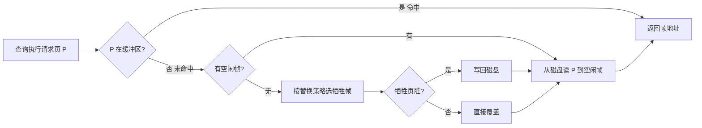
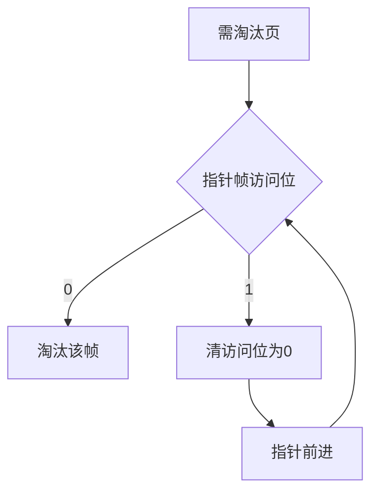

# 10.4 缓冲区管理

本节解决的核心问题是：**如何用有限的内存缓冲池弥合主存速度与磁盘速度之间 $10^5$~$10^6$ 倍的差距**。数据库每次读写都以页为单位（[[10.2 文件组织]]），若每次都直接访问磁盘则性能不可接受。缓冲区管理器在内存中维护页的缓存，命中则免去磁盘 I/O；替换策略决定哪些页被淘汰，直接影响命中率与整体性能。

## 10.4.1 缓冲区管理器的职责

> [!definition] 缓冲区管理器（Buffer Manager）
> 缓冲区管理器是 DBMS 中负责在主存与磁盘之间搬运数据页的软件模块。它在内存中维护一组**缓冲帧（buffer frame）**，每个缓冲帧存放一个磁盘页的副本，并提供页的请求、淘汰、刷盘接口。

### 核心流程



> [!note] 缓冲区与磁盘 I/O 的关系
> - **命中（hit）**：请求页已在缓冲区，无需磁盘 I/O；
> - **未命中（miss）**：需从磁盘读入，若缓冲区满则还需先淘汰一页（脏页要写回）。
> 缓冲区命中率 = 命中次数 / 总请求次数，是衡量缓冲效率的核心指标。

## 10.4.2 缓冲区替换策略

当缓冲区满且需读入新页时，必须淘汰某页。替换策略决定淘汰谁，目标是最大化命中率。

### 1. LRU（最近最少使用）

> [!definition] LRU 替换策略
> 淘汰**最长时间未被访问**的页。维护一个按最近访问时间排序的链表，每次访问把页移到表头，淘汰时取表尾。

- 优点：符合时间局部性，命中率较高；
- 缺点：维护代价（每次访问都要移动链表节点）；对**顺序扫描**整个表的情况会被污染——一次全表扫描把缓冲区原有热页全部冲掉。

### 2. MRU（最近最多使用）

> [!definition] MRU 替换策略
> 淘汰**最近刚被访问**的页。在顺序扫描场景下，刚读过的页短期内不会再被访问，故优先淘汰。

- 适用：顺序扫描表时，避免扫描污染缓冲区；
- 缺点：对随机访问命中率差，单独使用较少。

### 3. Clock 时钟算法

> [!definition] Clock 算法
> LRU 的近似实现。为每个缓冲帧设一个**访问位（reference bit）**，访问时置 1。维护一个循环指针（时钟指针）扫描帧：
> - 淘汰时若指针指向帧的访问位为 0，淘汰它；
> - 若为 1，则清 0 并前进指针（给"第二次机会"）；
> - 直到找到访问位为 0 的帧淘汰。



- 优点：实现简单（仅需一个访问位），性能接近 LRU；
- 缺点：精确性不如 LRU；二次机会算法是 Clock 的变体。

| 策略 | 淘汰依据 | 实现复杂度 | 命中率 | 顺序扫描适应 |
| ---- | ---- | ---- | ---- | ---- |
| LRU | 最久未访问 | 高（链表维护） | 较高 | 差（易污染） |
| MRU | 最近访问 | 高 | 一般 | 较好 |
| Clock | 访问位为 0 | 低 | 接近 LRU | 一般 |

> [!tip] 实际系统的混合策略
> 实际 DBMS（如 InnoDB）采用改良 LRU（midpoint insertion LRU）：新读入的页插入 LRU 中段（`innodb_old_blocks_pct` 默认 37%），只有再次被访问才提升到新页端，从而过滤一次性扫描的页，避免热页被冲刷。

## 10.4.3 预读与延迟写

### 预读（Prefetch）

> [!definition] 预读
> 在实际请求某页之前，**提前将其从磁盘读入缓冲区**，利用空间局部性减少后续等待。

- **顺序预读**：检测到顺序访问模式时，预读后续若干页；
- **随机预读**：InnoDB 还会预读同一区（extent，64 页）中超过阈值的页。

### 延迟写（Deferred Write）

> [!definition] 延迟写
> 修改后的页**不立即写回磁盘**，而是标记为脏页（dirty），保留在缓冲区。写回时机：
> - 被替换策略选中淘汰时；
> - 后台刷脏线程定期写回；
> - 检查点（checkpoint）强制写回。

> [!warning] 延迟写与持久性的张力
> 延迟写提高性能，但若系统崩溃，缓冲区未刷盘的修改会丢失。DBMS 通过**日志（WAL，Write-Ahead Logging）**保证：先写日志后写数据页，崩溃后用日志重做（详见 [[MOC - 第8章]]）。这是性能与持久性的核心权衡。

## 10.4.4 缓冲区命中率对性能的影响

> [!theorem] 命中率与平均访问代价
> 设磁盘访问代价 $T_d$（含寻道+旋转+传输，约 ms 级），内存访问代价 $T_m$（ns~μs 级），命中率 $h$，则一次页请求的平均代价：
> $$T_{\text{avg}} = h \cdot T_m + (1-h) \cdot (T_d + T_m) \approx (1-h) \cdot T_d$$
> 命中率越高，平均代价越接近内存速度；命中率每提高 1%，可显著减少磁盘 I/O。

> [!example] 命中率对吞吐量的影响
> 假设 $T_d = 10$ ms，$T_m = 0.1$ μs（忽略），单线程：
> - 命中率 90%：$T_{\text{avg}} = 1$ ms，每秒约 1000 次页访问；
> - 命中率 99%：$T_{\text{avg}} = 0.1$ ms，每秒约 10000 次；
> - 命中率 99.9%：$T_{\text{avg}} = 0.01$ ms，每秒约 100000 次。
>
> 命中率从 90% → 99%（提升 9 个百分点），吞吐量提升 **10 倍**。结论假设：单线程、固定页大小、传统机械磁盘。

## 10.4.5 MySQL InnoDB 缓冲池简介

> [!definition] InnoDB Buffer Pool
> InnoDB 缓冲池（Buffer Pool）是主存中预分配的区域，缓存数据页与索引页，是 InnoDB 性能的核心。环境：MySQL 8.0。

```sql
-- 查看缓冲池大小
SHOW VARIABLES LIKE 'innodb_buffer_pool_size';
-- 查看缓冲池状态（命中率等）
SHOW STATUS LIKE 'Innodb_buffer_pool%';
```

### InnoDB Buffer Pool 关键参数

| 参数 | 含义 | 典型建议 |
| ---- | ---- | ---- |
| `innodb_buffer_pool_size` | 缓冲池总大小 | 物理内存的 50%~70% |
| `innodb_buffer_pool_instances` | 缓冲池实例数（减少锁竞争） | 大池设多个 |
| `innodb_old_blocks_pct` | LRU 老区占比 | 默认 37% |
| `innodb_old_blocks_time` | 老区停留毫秒数（防扫描污染） | 默认 1000ms |

> [!note] 改良 LRU：新旧区
> InnoDB 将 LRU 分为**新区（young）**与**老区（old）**：
> 1. 新读入的页插入老区头部（而非新区）；
> 2. 老区页若在 `innodb_old_blocks_time`（默认 1 秒）内被再次访问，才提升到新区；
> 3. 否则停留在老区，被淘汰时优先淘汰。
> 这样一次性全表扫描的页不会冲掉新区的热页。

> [!warning] 缓冲池配置的代价
> 缓冲池越大命中率越高，但占用主存，挤压其他进程；过大的池在崩溃恢复时回填时间长。配置须结合物理内存、并发连接数、数据热度综合权衡，性能结论须附数据规模与硬件环境。

## 小结

缓冲区管理器通过在内存缓存磁盘页，将平均访问代价从磁盘级降为内存级（与命中率相关）。LRU/MRU/Clock 等替换策略决定命中率，预读与延迟写进一步优化 I/O 模式。InnoDB 的改良 LRU（新旧区）有效防止顺序扫描污染，是工程上对朴素 LRU 的重要改进。缓冲区管理与索引、文件组织共同构成数据库存储子系统的核心。

## 关联

- 上一级：[[MOC - 第10章]]
- 上一节：[[10.3 索引结构（B+树、散列索引）]]（索引节点也驻留缓冲池）
- 相关概念：[[10.1 存储介质]]（速度差异是缓冲区存在的根因）、[[10.2 文件组织]]（页是缓冲单位）、[[MOC - 第8章]]（日志与延迟写的配合）、[[MOC - 第9章]]（并发控制也依赖缓冲区）
