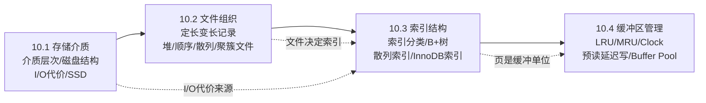

# MOC - 第10章 数据库存储结构

> [!info] 本章定位
> 本章是《数据库原理》课程的**系统实现篇首章**，解决"数据在物理介质上如何组织与存取"这一根本问题。前九章关注逻辑层（数据模型、SQL、范式、事务），本章下探到 DBMS 内部：存储介质的层次与磁盘 I/O 代价（[[10.1 存储介质]]）、关系表到文件-块-记录的映射（[[10.2 文件组织]]）、加速查询的索引结构——重点 B+ 树与散列（[[10.3 索引结构（B+树、散列索引）]]）、弥合主存与磁盘速度差的缓冲区（[[10.4 缓冲区管理]]）。
>
> 本章是第11章 [[MOC - 第11章]]（查询处理与查询优化）的物理基础：查询优化的代价估算、索引选择、连接算法都建立在本章的存储结构与 I/O 模型之上。InnoDB 的"表即聚簇索引"与"辅助索引存主键值"是贯穿后续 SQL 调优的关键事实。

## 学习路线图

> [!tip] 路线说明
> 推荐按 10.1 → 10.2 → 10.3 → 10.4 顺序学习。10.1 建立存储层次与 I/O 代价的物理直觉；10.2 将逻辑关系映射到物理文件；10.3 是本章**重点**，B+ 树索引是数据库性能的核心；10.4 用缓冲区弥合速度差。每节均配 Callout 定义、Mermaid 图与对比表，建议结合 [[7.03.05 B+ 树]]（数据结构视角）与 [[6.1 索引设计与优化]]（应用层视角）对照学习。

## 知识点导航

| 节 | 主题 | 核心要点 | 入口链接 |
| ---- | ---- | ---- | ---- |
| 10.1 | 存储介质 | 存储层次、磁盘结构（盘片/柱面/磁道/扇区）、I/O 代价三组成、SSD 特性 | [[10.1 存储介质]] |
| 10.2 | 文件组织 | 定长/变长记录、跨块/非跨块、堆/顺序/散列/聚簇文件、InnoDB 页 16KB | [[10.2 文件组织]] |
| 10.3 | 索引结构（B+树、散列索引） | 索引分类、B+ 树定义/查找/插入/删除/高度分析、散列索引、InnoDB 聚簇+辅助索引 | [[10.3 索引结构（B+树、散列索引）]] |
| 10.4 | 缓冲区管理 | 缓冲区管理器职责、LRU/MRU/Clock、预读延迟写、命中率、InnoDB Buffer Pool | [[10.4 缓冲区管理]] |

## 核心考点

> [!warning] 重点掌握
> 1. **存储介质层次结构**与速度/容量/成本/易失性权衡，磁盘 I/O 代价三组成（寻道/旋转/传输）。
> 2. **定长记录与变长记录**的存储方式、跨块/非跨块记录的区别。
> 3. **四种文件组织**（堆/顺序/散列/聚簇）的特点、适用场景与对比。
> 4. **索引分类**：主/辅助、稠密/稀疏、聚簇/非聚簇三组分类的含义与区别。
> 5. **B+ 树的定义、性质、查找、插入（分裂）、删除（合并/借调）过程**，B+ 树与 B- 树的差异，B+ 树高度与 I/O 代价 $O(\log_m n)$ 分析。
> 6. **散列索引**（静态/可扩展/线性）特点及与 B+ 树的适用场景对比；为何不支持范围查询。
> 7. **InnoDB 索引实现**：聚簇索引按主键组织、辅助索引存主键值、回表与覆盖索引、缓冲区替换策略（LRU/Clock）与命中率影响。

## 自测题

> [!question] 1. 数据库设计的核心目标之一是减少磁盘 I/O，根本原因是什么？B+ 树多路索引如何实现这一目标？
> > [!check]- 参考答案
> > 根本原因是访问主存（约 100 ns）与访问磁盘（约 10 ms）相差约 $10^5$~$10^6$ 倍，磁盘 I/O 是数据库性能瓶颈。B+ 树作为多路平衡查找树，每个节点对应一个磁盘页（InnoDB 默认 16 KB），单节点可容纳上千个关键字，使千万级数据只需 3 层 B+ 树即可覆盖，每次查找仅 3 次 I/O（$O(\log_m n)$）。同时叶子节点链表相连支持范围查询，避免了 B- 树的中序回溯。

> [!question] 2. 简述聚簇索引与非聚簇索引、稠密索引与稀疏索引两组分类的区别，并说明它们是否互斥。
> > [!check]- 参考答案
> > - **聚簇 vs 非聚簇**：描述索引顺序与数据物理存储顺序是否一致。聚簇索引叶子节点存整行数据，每表仅 1 个；非聚簇索引叶子存指针或主键值，每表可多个。
> > - **稠密 vs 稀疏**：描述索引项是否覆盖每条记录。稠密索引每记录一项；稀疏索引每块一项（前提是记录按索引码有序）。
> > 二者**不互斥**，是不同维度的分类。聚簇索引既可稠密也可稀疏，非聚簇索引通常为稠密。

> [!question] 3. 给定一棵 3 阶 B+ 树，叶子节点最多存 3 个关键字。若某叶子为 [10, 20, 30]，现插入 25，描述插入与分裂过程。
> > [!check]- 参考答案
> > 1. 查找定位到目标叶子节点（含 10,20,30，已满）；
> > 2. 插入 25，叶子变为 [10, 20, 25, 30]，超出 3 阶上限 3；
> > 3. 分裂：分成 [10, 20] 与 [25, 30] 两个叶子，调整叶子链表指针；
> > 4. 将 20（分裂点的关键字，视实现为左叶最大值或右叶最小值）上提到父节点；
> > 5. 父节点新增索引码并维护指向两个新叶子的子树指针；
> > 6. 若父节点也溢出，递归向上分裂；若根分裂则产生新根，树高加 1。

> [!question] 4. 为什么 InnoDB 辅助索引查找常需要"回表"？什么是覆盖索引？如何用 EXPLAIN 判断？
> > [!check]- 参考答案
> > InnoDB 表数据按主键组织为聚簇索引，辅助索引叶子节点只存"索引字段值 + 主键值"。通过辅助索引查到主键后，要取整行还须再到聚簇索引查找一次，称为**回表**，产生两次 B+ 树查找。
> > 若查询所需的列已全部包含在辅助索引中（含自动包含的主键），则无需回表，称为**覆盖索引**。用 `EXPLAIN` 查看 `Extra` 字段，显示 `Using index` 即覆盖索引，无回表；若仅显示索引扫描而无 `Using index` 则可能需回表。设计高频查询时应尽量构造覆盖索引以避免回表代价。

## 章节导航

- 上一级：[[MOC - 数据库原理]]
- 上一章：[[MOC - 第9章]]
- 下一章：[[MOC - 第11章]]
- 本章习题：[[MOC - 第10章习题]]
