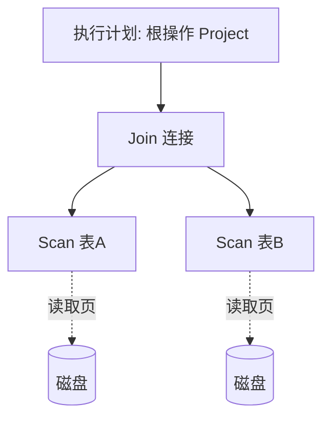

# 11.1 查询处理步骤

本节解决的核心问题是：**用户提交的一条 SQL 语句，DBMS 内部经历哪些阶段才能返回结果**。查询处理是连接高级声明式 SQL 与底层物理执行操作的桥梁，理解其四个阶段为代数优化（[[11.2 代数优化]]）与物理优化（[[11.3 物理优化]]）奠定整体框架。本节关联 [[2.4 关系代数]]（查询的数学表示）与 [[3.3 数据查询]]（SQL 的工程实现）。

## 11.1.1 查询处理的定义与任务

> [!definition] 查询处理（Query Processing）
> 查询处理是 DBMS 接受用户的 SQL 查询语句，经过分析、检查、优化，最终生成可执行计划并交付执行引擎产生结果的全过程。其任务是在保证结果正确的前提下，选择一个**执行代价最小**的执行计划。

## 11.1.2 查询处理的四个阶段

### 阶段 1：查询分析

> [!definition] 查询分析（Query Parsing）
> 对 SQL 语句进行**词法分析**和**语法分析**，构建查询树（语法树）。词法分析识别关键字、标识符、常量；语法分析依据 SQL 语法规则检查语句结构是否合法。

- 输出：语法树（parse tree）；
- 错误处理：词法/语法错误（如拼写错误、括号不匹配）在此阶段报错。

### 阶段 2：查询检查

> [!definition] 查询检查（Query Check）
> 对语法树进行**语义检查**：验证表名、列名是否存在，数据类型是否匹配，权限是否允许；并对视图进行**视图消解**（将视图引用展开为底层基本表），最后转换为关系代数表达式。

- 语义检查：对象存在性、列类型、表达式合法性；
- 视图消解：把视图名替换为其定义查询，详见 [[3.5 视图]]；
- 权限检查：用户是否有相应表的查询权限，详见 [[4.3 存取控制]]；
- 输出：关系代数表达式（查询树）。

> [!note] 视图消解的代价
> 视图消解可能使查询树膨胀（视图嵌套视图时尤其明显），是后续优化需要处理的对象。这也是为什么"视图越多越慢"的常见误区——优化器面对膨胀的表达式可能难以找到最优计划。

### 阶段 3：查询优化

> [!definition] 查询优化（Query Optimization）
> 查询优化是查询处理的核心阶段，选择一个高效的执行计划。它分为两步：
> - **代数优化**（逻辑优化）：对关系代数表达式进行等价变换，重排操作的次序以减小中间结果，详见 [[11.2 代数优化]]；
> - **物理优化**：为每个操作选择合适的存取路径与执行算法（索引扫描/全表扫描、嵌套循环/排序归并/散列连接），详见 [[11.3 物理优化]]。

- 输入：关系代数表达式；
- 输出：**查询执行计划**（query execution plan）。

### 阶段 4：查询执行

> [!definition] 查询执行（Query Execution）
> 执行引擎按照查询执行计划调用底层操作（扫描、连接、投影、聚合等），产生结果集返回给用户。

执行方式分为：

- **自顶向下（volcano 模型）**：父操作请求子操作产生数据，按需驱动；
- **自底向上**：从叶子操作开始产生数据向上推送。

## 11.1.3 查询执行计划

> [!definition] 查询执行计划
> 查询执行计划是一棵由**物理操作符**组成的树，描述 DBMS 如何执行查询：每个节点是一个操作（如表扫描、索引扫描、连接、排序、聚合），节点间的数据流向构成执行顺序。每个节点标注所用算法与存取路径。

| 计划层次 | 描述 | 产生阶段 |
| ---- | ---- | ---- |
| 逻辑计划 | 关系代数表达式对应的操作树 | 代数优化输出 |
| 物理计划 | 含具体算法与存取路径的操作树 | 物理优化输出，即执行计划 |

> [!note] 查看执行计划
> 在 MySQL 中用 `EXPLAIN` 查看执行计划，详见 [[11.4 查询优化器原理]]。`EXPLAIN` 输出的每行对应执行计划的一个节点。

## 11.1.4 查询代价模型

> [!theorem] 查询代价的组成
> 查询执行代价主要由两部分构成：
> $$C_{\text{query}} = C_{\text{I/O}} + C_{\text{CPU}}$$
> - $C_{\text{I/O}}$：磁盘 I/O 代价，包括读入数据页与中间结果写盘的代价；
> - $C_{\text{CPU}}$：CPU 处理代价，包括计算、比较、连接匹配等。

> [!note] 代价的主导项
> 在传统机械磁盘环境下，$C_{\text{I/O}}$ 通常远大于 $C_{\text{CPU}}$（ms vs μs），故查询优化以**最小化 I/O 次数**为主要目标。SSD 下 I/O 与 CPU 代价差距缩小，CPU 代价占比上升。性能结论须标注磁盘类型与数据规模。

代价估算依赖统计信息：

| 统计信息 | 含义 | 用途 |
| ---- | ---- | ---- |
| 关系基数 $n_R$ | 关系 $R$ 的元组数 | 估算扫描代价 |
| 元组大小 $l_R$ | 单条元组字节数 | 估算页数 |
| 块因子 $B_R$ | 每块可容纳元组数，$B_R = \lfloor \text{块大小}/l_R \rfloor$ | 页数 $b_R = \lceil n_R/B_R \rceil$ |
| 选择率 $s$ | 选择条件命中的比例 | 估算选择结果大小 |
| 索引高度 $h$ | B+ 树层数 | 索引扫描代价 |
| 可用缓冲区数 $M$ | 内存缓冲帧数 | 影响连接算法选择 |

> [!tip] 选择率的估算
> 选择率是物理优化的关键输入。常见估算：等值选择 $s = 1/V(A)$（$V(A)$ 为属性 $A$ 的不同值数）；范围选择 $s \approx \text{范围}/\text{全域}$。详见 [[11.3 物理优化]]。

## 小结

查询处理经历分析、检查、优化、执行四阶段。优化阶段将关系代数表达式转换为物理执行计划，是性能的核心。代价由 I/O 与 CPU 两部分构成，传统环境下以 I/O 为主。代价估算依赖统计信息，是代数与物理优化的共同输入。后续两节分别展开代数优化与物理优化。

## 关联

- 上一级：[[MOC - 第11章]]
- 下一节：[[11.2 代数优化]]
- 相关概念：[[2.4 关系代数]]（查询的数学基础）、[[3.3 数据查询]]（SQL 查询）、[[3.5 视图]]（视图消解）、[[4.3 存取控制]]（权限检查）、[[10.4 缓冲区管理]]（执行时的缓冲区使用）、[[11.4 查询优化器原理]]（EXPLAIN 查看执行计划）
