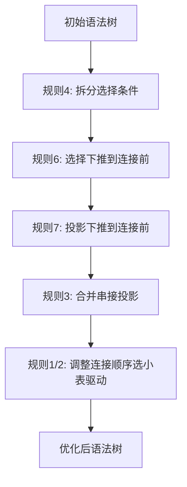
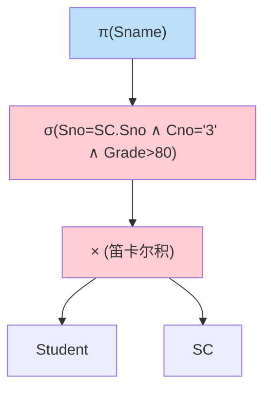
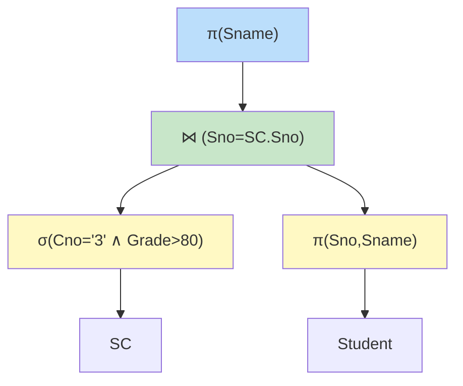

# 11.2 代数优化

本节解决的核心问题是：**如何通过等价变换重排关系代数表达式的操作次序，使中间结果最小、查询代价最低**。代数优化是查询优化的第一步（逻辑层优化），不涉及具体执行算法，只关注"先做什么、后做什么"。它是 [[11.1 查询处理步骤]] 的核心环节，以 [[2.4 关系代数]] 的等价规则为理论基础，为 [[11.3 物理优化]] 提供优化的逻辑骨架。本节是第11章的**重点**。

## 11.2.1 代数优化的概念

> [!definition] 代数优化（Algebraic Optimization）
> 代数优化是利用**关系代数等价变换规则**，将查询的关系代数表达式变换为等价但执行代价更小的形式。其核心思想是：**尽早执行选择与投影**，减小中间结果规模，从而减少后续连接、笛卡尔积的处理量。

代数优化的特点：

- 只改变操作的**逻辑次序与组合**，不选择具体执行算法；
- 基于**启发式规则**（heuristic rules），不依赖精确代价估算，故又称**启发式优化**或**规则优化**；
- 是物理优化（[[11.3 物理优化]]）的前置步骤：先得到优化的逻辑表达式，再为每个操作选物理算法。

## 11.2.2 关系代数等价变换规则

设 $E_1, E_2$ 为关系代数表达式，"$\equiv$" 表示等价。以下规则是代数优化的理论基础，详见 [[2.4 关系代数]]。

### 规则 1：连接与笛卡尔积的交换律

> [!theorem] 连接/笛卡尔积交换律
> $$E_1 \times E_2 \equiv E_2 \times E_1$$
> $$E_1 \bowtie E_2 \equiv E_2 \bowtie E_1$$

含义：连接的两边可以交换。用于把小关系放在外层（驱动表），减少嵌套循环连接的扫描次数。

> [!example] 示例
> `Student ⋈ SC` $\equiv$ `SC ⋈ Student`。若 Student 小、SC 大，做嵌套循环连接时 Student 作外层表扫描次数少。

### 规则 2：连接与笛卡尔积的结合律

> [!theorem] 连接/笛卡尔积结合律
> $$(E_1 \times E_2) \times E_3 \equiv E_1 \times (E_2 \times E_3)$$
> $$(E_1 \bowtie E_2) \bowtie E_3 \equiv E_1 \bowtie (E_2 \bowtie E_3)$$

含义：多个连接的执行顺序可调整。用于选择中间结果最小的连接顺序。

> [!example] 示例
> 三表连接 `Student ⋈ SC ⋈ Course` 可先连 `Student ⋈ SC`，也可先连 `SC ⋈ Course`。选结果小的那对先连。

### 规则 3：投影的串接律

> [!theorem] 投影串接律
> $$\pi_{L_1}(\pi_{L_2}(E)) \equiv \pi_{L_1}(E) \quad (L_1 \subseteq L_2)$$

含义：连续投影可合并为一次投影。

> [!example] 示例
> $\pi_{\text{Sno,Sname}}(\pi_{\text{Sno,Sname,Sdept}}(\text{Student})) \equiv \pi_{\text{Sno,Sname}}(\text{Student})$。

### 规则 4：选择的串接律

> [!theorem] 选择串接律
> $$\sigma_{F_1 \wedge F_2}(E) \equiv \sigma_{F_1}(\sigma_{F_2}(E))$$

含义：合取条件的选择可拆分为多个串接的选择。用于把不同条件下推到不同位置（如先做选择限制最严的条件）。

> [!example] 示例
> $\sigma_{\text{Sdept='CS'} \wedge \text{Sage>20}}(\text{Student}) \equiv \sigma_{\text{Sdept='CS'}}(\sigma_{\text{Sage>20}}(\text{Student}))$。可优先执行选择率低（更严格）的条件。

### 规则 5：选择与投影的交换律

> [!theorem] 选择与投影交换律
> $$\sigma_F(\pi_L(E)) \equiv \pi_L(\sigma_F(E)) \quad (F \text{ 仅涉及 } L \text{ 中的属性})$$

含义：当选择条件只用到投影后的属性时，选择与投影可交换。用于把选择下推到投影之前。

> [!example] 示例
> $\sigma_{\text{Sage>20}}(\pi_{\text{Sno,Sname,Sage}}(\text{Student})) \equiv \pi_{\text{Sno,Sname,Sage}}(\sigma_{\text{Sage>20}}(\text{Student}))$。条件 Sage 只涉及投影列，可下推。

### 规则 6：选择与连接的交换律

> [!theorem] 选择与连接交换律
> $$\sigma_F(E_1 \bowtie E_2) \equiv \sigma_F(E_1) \bowtie E_2 \quad (F \text{ 仅涉及 } E_1 \text{ 的属性})$$

含义：若选择条件只涉及连接一边的属性，可将选择下推到连接之前，先过滤再连接，减小连接输入规模。**这是代数优化最重要的规则之一**。

> [!example] 示例
> $\sigma_{\text{Student.Sdept='CS'}}(\text{Student} \bowtie \text{SC}) \equiv \sigma_{\text{Sdept='CS'}}(\text{Student}) \bowtie \text{SC}$。先筛选 CS 系学生再连接 SC，比先连接全部学生再筛选的中间结果小得多。

### 规则 7：投影与连接的交换律

> [!theorem] 投影与连接交换律
> $$\pi_L(E_1 \bowtie E_2) \equiv \pi_{L_1}(E_1) \bowtie \pi_{L_2}(E_2)$$
> 其中 $L_1, L_2$ 分别为 $L$ 涉及 $E_1, E_2$ 的属性，**外加连接属性**。

含义：把投影下推到连接之前，只保留连接所需与结果所需的列，减小连接输入。

> [!example] 示例
> $\pi_{\text{Sname,Grade}}(\text{Student} \bowtie \text{SC}) \equiv \pi_{\text{Sno,Sname}}(\text{Student}) \bowtie \pi_{\text{Sno,Grade}}(\text{SC})$。注意连接属性 Sno 必须保留在投影中，否则无法连接。

> [!warning] 易错点：连接属性不可丢
> 投影下推到连接前时，**连接属性必须保留**。若 $\pi$ 把连接属性也去掉，则连接无法进行，等价变换失效。

### 规则汇总表

| 序号 | 规则名 | 形式化 | 优化用途 |
| ---- | ---- | ---- | ---- |
| 1 | 连接/笛卡尔积交换律 | $E_1 \bowtie E_2 \equiv E_2 \bowtie E_1$ | 选小表作驱动 |
| 2 | 连接/笛卡尔积结合律 | $(E_1 \bowtie E_2) \bowtie E_3 \equiv E_1 \bowtie (E_2 \bowtie E_3)$ | 选最优连接顺序 |
| 3 | 投影串接律 | $\pi_{L_1}(\pi_{L_2}(E)) \equiv \pi_{L_1}(E)$ | 合并投影 |
| 4 | 选择串接律 | $\sigma_{F_1 \wedge F_2}(E) \equiv \sigma_{F_1}(\sigma_{F_2}(E))$ | 拆分条件下推 |
| 5 | 选择与投影交换律 | $\sigma_F(\pi_L(E)) \equiv \pi_L(\sigma_F(E))$ | 选择下推到投影前 |
| 6 | 选择与连接交换律 | $\sigma_F(E_1 \bowtie E_2) \equiv \sigma_F(E_1) \bowtie E_2$ | **选择下推到连接前** |
| 7 | 投影与连接交换律 | $\pi_L(E_1 \bowtie E_2) \equiv \pi_{L_1}(E_1) \bowtie \pi_{L_2}(E_2)$ | 投影下推到连接前 |

## 11.2.3 代数优化的启发式规则

基于上述等价规则，归纳出启发式优化策略，按优先级排列：

> [!theorem] 代数优化启发式规则
> 1. **选择尽早执行**（最重要）：用规则 6 把选择下推到连接之前，大幅减小连接输入。
> 2. **投影与选择同时进行**：下推选择时配合投影，只保留所需列。
> 3. **把笛卡尔积合并为连接**：笛卡尔积后紧跟选择等价于连接，应合并以避免产生巨大中间结果。
> 4. **提取公共子表达式**：多次出现的相同子表达式只计算一次。

> [!warning] 笛卡尔积的代价陷阱
> $E_1 \times E_2$ 的结果大小为 $|E_1| \times |E_2|$，两表各 1 万行则中间结果 1 亿行。务必把"笛卡尔积 + 选择"合并为连接，避免灾难性中间结果。



## 11.2.4 代数优化的步骤

代数优化按以下步骤进行：

> [!algorithm] 代数优化步骤
> 1. **将 SQL 查询转换为关系代数表达式**（语法树）；
> 2. **应用等价变换规则**重排操作：
>    - 选择串接（规则 4）拆分合取条件；
>    - 选择下推（规则 5、6）到投影、连接之前；
>    - 投影下推（规则 7）到连接之前（保留连接属性）；
>    - 合并串接投影（规则 3）；
>    - 用交换律/结合律（规则 1、2）选最优连接顺序；
>    - 把笛卡尔积+选择合并为连接；
> 3. **生成优化后的语法树**。

## 11.2.5 代数优化完整示例

### 场景

查询：**查找选修了 3 号课程且成绩大于 80 的学生姓名**。涉及关系：`Student(Sno, Sname, Ssex, Sage, Sdept)`、`SC(Sno, Cno, Grade)`。

```sql
-- DBMS: 通用关系数据库（SQL 标准）
SELECT Sname
FROM Student, SC
WHERE Student.Sno = SC.Sno AND SC.Cno = '3' AND SC.Grade > 80;
```

### 步骤 1：转换为关系代数（初始语法树）

原始关系代数表达式（直接翻译 SQL）：

$$\pi_{\text{Sname}}(\sigma_{\text{Student.Sno=SC.Sno} \wedge \text{SC.Cno='3'} \wedge \text{SC.Grade>80}}(\text{Student} \times \text{SC}))$$



> [!warning] 初始树的问题
> - 笛卡尔积 `Student × SC` 中间结果为 $|Student| \times |SC|$，巨大；
> - 选择条件在最外层，笛卡尔积后才过滤，浪费严重；
> - 投影在最外层，整行参与中间计算。

### 步骤 2：等价变换

**变换 a：拆分选择条件（规则 4）**

把合取条件拆为三个串接的选择：

$$\sigma_{\text{Sno=SC.Sno}}(\sigma_{\text{Cno='3'}}(\sigma_{\text{Grade>80}}(\text{Student} \times \text{SC})))$$

**变换 b：选择下推到连接前（规则 6）**

`Cno='3'` 与 `Grade>80` 只涉及 SC，下推到 SC；`Sno=SC.Sno` 是连接条件，与笛卡尔积合并为连接：

$$\pi_{\text{Sname}}(\sigma_{\text{Cno='3'}}(\sigma_{\text{Grade>80}}(\text{SC})) \bowtie_{\text{Sno=SC.Sno}} \text{Student})$$

**变换 c：投影下推（规则 7）**

最终只需 Sname，连接需 Sno。Student 侧只投影 Sno, Sname：

$$\pi_{\text{Sname}}(\sigma_{\text{Cno='3'} \wedge \text{Grade>80}}(\text{SC}) \bowtie_{\text{Sno=SC.Sno}} \pi_{\text{Sno,Sname}}(\text{Student}))$$

### 步骤 3：优化后语法树



### 优化前后对比

| 维度 | 优化前 | 优化后 |
| ---- | ---- | ---- |
| 笛卡尔积 | `Student × SC`（全表笛卡尔积） | 无（笛卡尔积+选择合并为连接） |
| 选择时机 | 笛卡尔积后 | 下推到 SC 之前，先过滤 |
| 中间结果 | $|Student| \times |SC|$ | $\sigma_{\text{Cno='3'}}(\text{SC})$ 很小 |
| 投影时机 | 最外层 | 下推到 Student 前，只取 Sno,Sname |

> [!tip] 优化效果
> 设 Student 1 万行、SC 10 万行，选修 3 号课程的仅 200 行且成绩>80 的 100 行。优化前笛卡尔积 10 亿行中间结果；优化后 SC 经选择仅 100 行参与连接，中间结果缩小 **数千万倍**。这正是代数优化的威力，且无需精确代价估算即可获得。

## 小结

代数优化利用关系代数等价变换规则，重排操作次序使中间结果最小。核心启发式是**选择尽早执行、投影与选择同时下推、笛卡尔积合并为连接、提取公共子表达式**。七条等价规则（连接交换/结合、投影/选择串接、选择与投影/连接交换、投影与连接交换）是理论基础。代数优化不依赖代价估算，是查询优化的第一步，为物理优化提供优化的逻辑骨架。

## 关联

- 上一级：[[MOC - 第11章]]
- 上一节：[[11.1 查询处理步骤]]（代数优化是查询优化阶段的第一步）
- 下一节：[[11.3 物理优化]]（在代数优化基础上选物理算法）
- 相关概念：[[2.4 关系代数]]（等价规则的数学基础）、[[3.3 数据查询]]（SQL 查询）、[[10.3 索引结构（B+树、散列索引）]]（物理优化存取路径的基础）、[[11.4 查询优化器原理]]（CBO 与代数优化结合）
