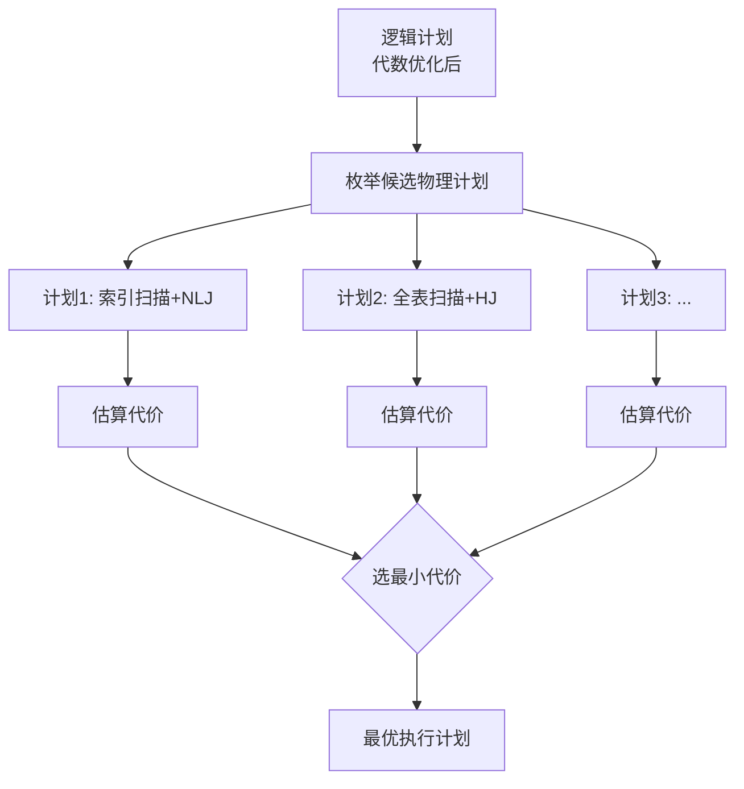

# 11.4 查询优化器原理

本节解决的核心问题是：**查询优化器如何工作、如何用 EXPLAIN 查看与诊断执行计划、如何优化慢查询**。本节是第11章的落地环节，将 [[11.2 代数优化]] 与 [[11.3 物理优化]] 的理论整合到优化器架构中，并以 MySQL EXPLAIN 为工具展示实战分析。掌握本节才能把第10章存储结构（[[10.3 索引结构（B+树、散列索引）]]）与本章优化理论用于真实调优。

## 11.4.1 查询优化器的分类

> [!definition] 查询优化器（Query Optimizer）
> 查询优化器是 DBMS 中负责为查询选择最优执行计划的组件，输入关系代数表达式，输出代价最小的物理执行计划。

按决策依据分两类：

| 类型 | 决策依据 | 优点 | 缺点 | 代表 |
| ---- | ---- | ---- | ---- | ---- |
| **规则驱动（RBO）** | 固定优先级规则 | 简单、可预测、不依赖统计信息 | 不一定最优，无法适应数据变化 | 早期 Oracle |
| **代价驱动（CBO）** | 代价估算 | 自适应数据分布，更优计划 | 依赖统计信息准确性，计算开销大 | MySQL、现代 Oracle/PG |

> [!note] RBO 与 CBO 的关系
> 现代 DBMS 多以 **CBO 为主**，辅以 RBO 规则。如 MySQL 8.0 默认 CBO，但仍有规则优先（如主键等值查询必走聚簇索引）。RBO 用于兜底，CBO 用于在多候选计划中择优。

## 11.4.2 CBO 工作原理

> [!theorem] CBO 工作流程
> 1. **枚举执行计划**：对逻辑表达式（代数优化后）生成多种候选物理计划——不同连接顺序、不同存取路径、不同算法组合；
> 2. **估算代价**：基于统计信息估算每个候选的 $C_{\text{I/O}} + C_{\text{CPU}}$（[[11.3 物理优化]]）；
> 3. **选择最优**：取代价最小的计划。



> [!warning] 计划空间的爆炸
> 连接 $n$ 个表的可能顺序约 $n!$ 种，CBO 难以穷举。优化器采用**动态规划**（如 System R 的 left-deep 树枚举）或**贪心/遗传算法**（连接表多时）剪枝。MySQL 对连接表数有上限（`optimizer_switch` 控制）。

## 11.4.3 查询执行计划：逻辑计划 vs 物理计划

| 层次 | 内容 | 来源 |
| ---- | ---- | ---- |
| 逻辑计划 | 关系代数操作树（选择/投影/连接） | 代数优化 |
| 物理计划 | 物理操作符树（索引扫描/Hash Join/Sort） | 物理优化 = 执行计划 |

EXPLAIN 输出的就是物理计划。

## 11.4.4 EXPLAIN 命令

`EXPLAIN` 是查看 MySQL 执行计划的命令，是调优的第一工具。

### EXPLAIN 关键字段

| 字段 | 含义 | 优化目标 |
| ---- | ---- | ---- |
| `id` | 执行序号，相同 id 同级，大 id 先执行 | — |
| `select_type` | 查询类型（SIMPLE/PRIMARY/SUBQUERY 等） | 避免复杂子查询 |
| `table` | 当前行操作的表 | — |
| `type` | **访问类型** | `const` > `eq_ref` > `ref` > `range` > `index` > `ALL` |
| `possible_keys` | 可能选用的索引 | 为空说明无可用索引 |
| `key` | **实际使用的索引** | 非 NULL 且符合预期 |
| `key_len` | 索引使用的字节数 | 反映复合索引用了几列 |
| `ref` | 索引比较的常量或列 | — |
| `rows` | **预估扫描行数** | 越小越好 |
| `Extra` | 附加信息 | `Using index`（覆盖索引）为佳；`Using filesort`/`Using temporary` 需警惕 |

> [!note] type 字段级别
> - `const`：主键/唯一索引等值，最多 1 行；
> - `eq_ref`：唯一索引等值连接，每外层行匹配 1 行；
> - `ref`：非唯一索引等值；
> - `range`：索引范围扫描；
> - `index`：扫描整个索引（不回表）；
> - `ALL`：**全表扫描**，通常需优化。

### EXPLAIN 示例

```sql
-- DBMS: MySQL 8.0 InnoDB
CREATE TABLE employee (
    id      BIGINT PRIMARY KEY AUTO_INCREMENT,
    name    VARCHAR(50) NOT NULL,
    dept_id BIGINT NOT NULL,
    age     INT,
    INDEX idx_name(name),
    INDEX idx_dept_age(dept_id, age)
) ENGINE=InnoDB;

-- 示例1: 走 idx_name 但需回表
EXPLAIN SELECT id, name, age FROM employee WHERE name = '张三';
-- 期望: type=ref, key=idx_name, Extra 无 Using index（回表取 age）

-- 示例2: 覆盖索引，无回表
EXPLAIN SELECT dept_id, age FROM employee WHERE dept_id = 1;
-- 期望: type=ref, key=idx_dept_age, Extra: Using index

-- 示例3: 全表扫描（需警惕）
EXPLAIN SELECT * FROM employee WHERE age = 25;
-- idx_dept_age 违反最左前缀，退化: type=ALL, key=NULL

-- 示例4: 范围查询
EXPLAIN SELECT * FROM employee WHERE dept_id = 1 AND age > 20;
-- 期望: type=range, key=idx_dept_age
```

## 11.4.5 影响查询优化的因素

> [!warning] 影响优化的关键因素
> 1. **统计信息准确性**：CBO 依赖统计信息估算代价。统计过期会导致选错计划。MySQL 用 `ANALYZE TABLE` 更新统计信息。
> 2. **索引设计**：索引缺失或设计不当导致全表扫描。详见 [[6.1 索引设计与优化]]。
> 3. **SQL 写法**：函数操作、隐式类型转换、OR、前导通配等导致索引失效。
> 4. **参数配置**：缓冲区大小、连接算法开关（`optimizer_switch`）影响计划选择。

```sql
-- 更新统计信息
ANALYZE TABLE employee;

-- 查看优化器开关
SHOW VARIABLES LIKE 'optimizer_switch';
-- 含 hash_join=on, block_nested_loop=on 等开关
```

## 11.4.6 查询优化示例

### 场景：慢查询分析与优化

某订单表 `orders(id BIGINT PK, user_id BIGINT, status TINYINT, created_at DATETIME)`，数据 5000 万行。慢查询：

```sql
SELECT * FROM orders WHERE DATE(created_at) = '2024-01-01';
-- 执行计划: type=ALL, key=NULL, rows≈5000万 → 全表扫描
```

**分析**：`DATE(created_at)` 对索引列使用函数，导致 `idx_created` 失效，全表扫描 5000 万行。

**优化方案**：改写 SQL 避免函数，并确认索引：

```sql
-- 优化后: 范围查询，走索引
SELECT * FROM orders
WHERE created_at >= '2024-01-01' AND created_at < '2024-01-02';
-- 执行计划: type=range, key=idx_created, rows≈当日订单数
```

### 优化前后对比

| 维度 | 优化前 | 优化后 |
| ---- | ---- | ---- |
| SQL | `WHERE DATE(created_at)='2024-01-01'` | `WHERE created_at>=... AND created_at<...` |
| type | ALL（全表） | range（索引范围） |
| key | NULL | idx_created |
| rows | ≈5000 万 | ≈当日订单数（如 10 万） |
| I/O | 顺序扫全表 | 索引扫描 |

> [!tip] 优化方法论
> 1. 用 `EXPLAIN` 查看执行计划，定位 `type=ALL`、`key=NULL`、`Using filesort`；
> 2. 检查 SQL 写法是否有索引失效（函数、类型转换、前导通配、OR）；
> 3. 改写 SQL 或补建索引；
> 4. 再次 `EXPLAIN` 验证；
> 5. 大表更新统计信息 `ANALYZE TABLE`。

> [!warning] 优化的前提
> 优化结论须基于实际执行计划与统计信息，且依赖数据规模、索引、硬件环境。同样的 SQL 在不同数据分布下可能选不同计划。**永远以 EXPLAIN 实际输出为准**，而非凭经验断言。

## 小结

查询优化器分 RBO（规则）与 CBO（代价）两类，现代 DBMS 以 CBO 为主。CBO 枚举候选计划、估算代价、择最优，依赖统计信息。EXPLAIN 是查看执行计划的核心工具，关键字段 `type`/`key`/`rows`/`Extra` 反映是否走索引、是否回表。慢查询优化方法论是：EXPLAIN 定位 → 检查 SQL 写法 → 改写或补索引 → 再验证。本章与前一章存储结构共同构成数据库内部实现的核心。

## 关联

- 上一级：[[MOC - 第11章]]
- 上一节：[[11.3 物理优化]]（CBO 的代价估算基础）
- 相关概念：[[11.1 查询处理步骤]]（查询处理全流程）、[[11.2 代数优化]]（CBO 前的逻辑优化）、[[10.3 索引结构（B+树、散列索引）]]（存取路径）、[[6.1 索引设计与优化]]、[[6.3 慢查询分析基础]]（应用层调优）、[[3.3 数据查询]]（SQL 查询）
