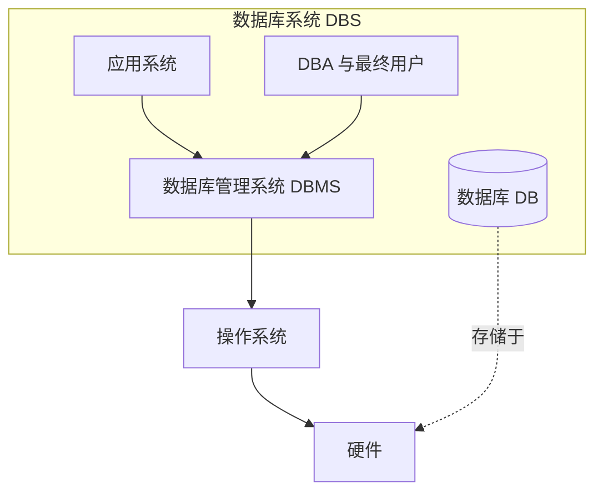

# 1.1 数据库系统概述

本节解决的核心问题是：**什么是数据库，为什么需要数据库**。它从数据管理技术的演进出发，说明文件系统在数据共享、冗余控制和独立性方面的根本缺陷，进而引出数据库系统（DBS）作为现代数据管理主流形态的必然性。理解本节是掌握后续 [[1.2 数据模型]]、[[1.3 数据库系统结构]] 与 [[1.4 数据库系统组成]] 的前提。

## 1.1.1 数据管理技术的产生与发展

数据处理（Data Processing）是指对数据进行收集、组织、存储、加工和传播的一系列活动的总和，其中**数据管理**（Data Management）是其核心环节——研究如何对数据进行分类、组织、编码、存储、检索和维护。数据管理技术的需求催生了数据库技术。

按硬件能力与软件方法的演进，数据管理技术大致经历了三个发展阶段：**人工管理阶段 → 文件系统阶段 → 数据库系统阶段**。

### 1. 人工管理阶段

> [!note] 历史背景
> 20 世纪 50 年代中期以前，计算机主要用于科学计算。硬件上外存只有磁带、卡片、纸带，没有磁盘；软件上没有操作系统，更没有专门的数据管理软件。

人工管理阶段的特点：

- 数据不保存：计算时输入数据，用完即撤，数据不长期驻留计算机。
- 应用程序管理数据：数据由程序自行定义、组织和存取，没有专用软件介入。
- 数据不共享：数据面向应用，一组数据只能对应一个程序。
- 数据**不独立**：程序与数据强耦合，修改数据结构必须修改程序。

### 2. 文件系统阶段

> [!note] 历史背景
> 20 世纪 50 年代后期至 60 年代后期，计算机开始大量用于数据管理。硬件出现了磁盘、磁鼓等直接存取存储设备；软件出现了操作系统，其中包含文件系统，数据以**文件**形式长期保存。

文件系统阶段的进步：

- 数据可以长期保存：文件存储在磁盘上，可反复处理。
- 由文件系统提供数据存取接口：程序通过文件名访问数据，逻辑结构与物理结构之间由文件系统提供一定的转换。

> [!warning] 文件系统的根本缺陷
> 尽管文件系统比人工管理前进了一步，但仍然存在以下严重问题：
>
> 1. **数据共享性差，冗余度大**：文件仍由应用独占，相同数据在多个文件中重复存储。
> 2. **数据独立性差**：文件系统本质上只是"按文件名存取"，逻辑结构改变时仍需修改应用程序。
> 3. **数据联系弱**：文件之间相互独立，缺乏对数据间内在联系的描述。

### 3. 数据库系统阶段

> [!note] 历史背景
> 20 世纪 60 年代后期以来，数据量急剧增长，共享需求强烈。磁盘容量大幅提升，价格下降。为解决多用户、多应用共享数据的需求，数据库技术应运而生。其标志是出现了专门的数据管理软件——**数据库管理系统（DBMS）**。

数据库系统阶段的特点：

- 数据结构化：数据不再面向单个应用，而是面向整个组织，建立整体的数据结构。
- 数据共享性高、冗余度低、易扩充：数据为多用户、多应用共享，减少了不必要冗余。
- 数据独立性高：通过三级模式与二级映像（见 [[1.3 数据库系统结构]]）实现逻辑独立性与物理独立性。
- 数据由 DBMS 统一管理和控制：提供安全性、完整性、并发控制和恢复能力。

### 三个阶段对比

| 特征 | 人工管理 | 文件系统 | 数据库系统 |
| ---- | -------- | -------- | ---------- |
| 数据是否长期保存 | 否 | 是 | 是 |
| 数据管理者 | 应用程序 | 文件系统 | DBMS |
| 数据面向对象 | 某一应用 | 某一应用 | 整个组织（现实世界） |
| 数据共享程度 | 无共享，冗余极大 | 共享性差，冗余大 | 共享性高，冗余低 |
| 数据独立性 | 不独立 | 差（逻辑独立/物理独立均差） | 高（逻辑独立、物理独立） |
| 数据结构化 | 无结构 | 记录内有结构，整体无结构 | 整体结构化（数据模型描述） |
| 数据控制能力 | 无 | 由应用程序自行处理 | DBMS 提供安全性、完整性、并发控制、恢复 |

## 1.1.2 数据库基本概念

> [!definition] 数据（Data）
> 数据是描述事物的符号记录。数据与其语义是不可分的——同一符号串在不同语境下可以表示完全不同的含义。例如 `90` 在学生表中可能是"成绩 90 分"，在仓库表中可能是"库存 90 件"。

> [!definition] 数据库（Database, DB）
> 数据库是长期储存在计算机内、**有组织的**、**可共享的**大量数据的集合。数据库中的数据按一定的数据模型组织、描述和储存，具有较小冗余度、较高数据独立性和易扩展性，可为各种用户共享。

> [!definition] 数据库管理系统（Database Management System, DBMS）
> DBMS 是位于用户与操作系统之间的一层数据管理软件，是**基础软件**，属于大型复杂的软件系统。其基本功能包括：数据定义、数据操纵、数据库运行管理、数据库建立与维护、数据组织存储与管理、数据通信接口（详见 [[1.4 数据库系统组成]]）。

> [!definition] 数据库系统（Database System, DBS）
> 数据库系统是在计算机系统中引入数据库后的系统，通常由**数据库（DB）、数据库管理系统（DBMS）及其开发工具、应用系统、数据库管理员（DBA）和最终用户**构成。
>
> 在不引起混淆时，数据库系统常被简称为"数据库"。

> [!tip] 概念辨析
> - **DB** 是数据本身；
> - **DBMS** 是管理数据的软件；
> - **DBS** 是包含 DB、DBMS、应用系统、人员和硬件的整体。
> 日常口语"我用数据库"通常指 DBS。

## 1.1.3 数据库系统的特点

> [!theorem] 数据库系统的核心特征
> 数据库系统区别于文件系统的根本特征可以归纳为四点：**数据结构化、数据共享性高冗余度低、数据独立性高、数据由 DBMS 统一管理和控制**。

### 1. 数据结构化

数据库中的数据不再像文件系统那样只面向某一应用，而是面向整个组织或现实世界，建立**整体的数据结构**。数据库不仅要描述数据本身，还要描述数据之间的联系。

- 文件系统：记录内部有结构，但整体无结构，文件之间无联系。
- 数据库系统：整体结构化，数据之间用数据模型描述联系。

> [!example] 数据结构化的体现
> 在学校管理数据库中，学生记录、课程记录、选课记录之间通过**学号、课程号**建立联系。文件系统只能各自孤立地保存这三种文件；数据库系统则能完整描述这种联系，并支持诸如"查询选修某门课程的所有学生"之类的跨文件查询。

### 2. 数据共享性高、冗余度低、易扩充

- **共享性高**：数据面向整个系统，可被多个用户、多个应用同时使用。
- **冗余度低**：相同数据无需在多处重复存储，减少存储空间和更新异常。
- **易扩充**：由于数据结构化且与应用程序解耦，增加新应用时通常无需修改已有数据结构。

> [!warning] 数据冗余的危害
> 冗余不仅浪费存储，更严重的是会引起**更新异常**：当一处数据修改而另一处未同步修改时，数据出现不一致，导致数据库处于错误状态。

### 3. 数据独立性高

> [!definition] 数据独立性（Data Independence）
> 数据独立性是指应用程序与数据库的数据结构之间相互独立，互不影响。它通过 [[1.3 数据库系统结构]] 中的**二级映像**实现，分为两层：

| 独立性层次 | 实现机制 | 含义 |
| ---------- | -------- | ---- |
| **物理独立性** | 模式/内模式映像 | 当数据库的**物理存储结构或存取方法**改变时（如换索引、改变存储设备），只需修改模式/内模式映像，**模式**保持不变，从而应用程序不变。 |
| **逻辑独立性** | 外模式/模式映像 | 当数据库的**逻辑结构**（模式）改变时（如增加新的关系、修改字段），只需修改外模式/模式映像，**外模式**保持不变，从而应用程序不变。 |

> [!tip] 独立性的意义
> 数据独立性是数据库技术追求的核心目标之一，它使得数据库与应用程序解耦，降低了维护成本。文件系统做不到这一点。

### 4. 数据由 DBMS 统一管理和控制

DBMS 提供以下数据控制功能（详见 [[1.4 数据库系统组成]]）：

- **数据安全性（Security）保护**：防止不合法用户访问或破坏数据。
- **数据完整性（Integrity）检查**：保证数据正确性、有效性和相容性。
- **并发控制（Concurrency Control）**：多用户并发访问时防止相互干扰，避免数据不一致。
- **数据库恢复（Recovery）**：在系统故障、介质故障或事务故障后，将数据库恢复到一致状态。

## 小结

本节回顾了数据管理技术从人工管理、文件系统到数据库系统的三个发展阶段，引出了数据库（DB）、数据库管理系统（DBMS）、数据库系统（DBS）三个基本概念，并归纳了数据库系统的四大特点：数据结构化、共享性高冗余度低、独立性高、由 DBMS 统一管理和控制。其中**数据独立性**通过二级映像实现，是数据库技术区别于文件系统的核心特征，将在 [[1.3 数据库系统结构]] 中详细展开。

## 关联

- 上一级：[[MOC - 第1章]]
- 上一节：—（本章首节）
- 下一节：[[1.2 数据模型]]
- 相关概念：[[1.3 数据库系统结构]]（数据独立性的实现）、[[1.4 数据库系统组成]]（DBMS 功能与 DBS 组成）、[[MOC - 数据库原理]]
