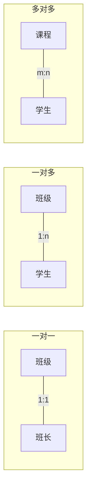

# 1.2 数据模型

本节解决的核心问题是：**如何用抽象的模型来描述和组织现实世界中的数据**。数据模型是数据库系统的**核心与基础**，各种 DBMS 都基于某种数据模型实现，理解数据模型的分类与组成要素是后续学习关系模型（第2章）、E-R 设计（第7章）的前提。

数据模型本质上是一种**工具**，用于抽象、表示和处理现实世界中的数据和信息。它将现实世界的对象转化为机器世界可以存储和处理的形式。

## 1.2.1 数据模型的概念与组成要素

> [!definition] 数据模型（Data Model）
> 数据模型是对现实世界**数据特征**的抽象，是用来描述数据、组织数据和对数据进行操作的框架。数据模型应满足三方面要求：能比较真实地模拟现实世界、容易为人所理解、便于在计算机上实现。

### 1. 数据模型的两个层次

按应用层次，数据模型可分为两类：

| 类型 | 别名 | 作用 | 面向对象 |
| ---- | ---- | ---- | ---- |
| **概念模型** | 信息模型 | 按用户观点对数据和信息建模，用于数据库设计 | 用户、设计者 |
| **逻辑模型 + 物理模型** | — | 按计算机系统观点对数据建模，用于 DBMS 实现 | DBMS、机器 |

### 2. 数据模型的三要素

> [!theorem] 数据模型的组成要素
> 任何数据模型都由三个要素组成：**数据结构**、**数据操作**、**数据的完整性约束条件**。

| 要素 | 描述 | 反映的内容 |
| ---- | ---- | ---- |
| **数据结构** | 描述数据库的**组成对象**以及对象之间的联系 | 系统的**静态特性**，是数据模型最基本的部分 |
| **数据操作** | 描述对数据库中各种对象实例允许执行的操作及有关的操作规则 | 系统的**动态特性**，包括检索与更新（插入、删除、修改） |
| **数据的完整性约束条件** | 一组完整性规则的集合，规定数据模型必须遵守的约束 | 系统的**约束特性**，保证数据的正确、有效、相容 |

> [!tip] 数据结构是数据模型分类的依据
> 通常按**数据结构**的特点来命名和区分数据模型，例如层次模型（树结构）、网状模型（图结构）、关系模型（二维表结构）。

## 1.2.2 概念模型

概念模型用于信息世界的建模，独立于具体的 DBMS，是用户与设计者交流的桥梁。它涉及以下基本术语：

### 1. 信息世界的基本概念

> [!definition] 实体（Entity）
> 客观存在并可相互区别的事物称为实体。可以是具体的人、事、物（如一名学生、一辆汽车），也可以是抽象的概念或联系（如一门课、一次选课）。

> [!definition] 属性（Attribute）
> 实体所具有的某一特性称为属性。一个实体可以由若干属性刻画。例如学生实体可以由学号、姓名、性别、出生年份、系、入学时间等属性组成。

> [!definition] 码（Key）
> 唯一标识实体的属性集称为码。例如学号是学生实体的码。

> [!definition] 域（Domain）
> 属性的取值范围称为该属性的域。例如性别的域为 {男, 女}，年龄的域为某个整数区间。

> [!definition] 实体型（Entity Type）
> 用**实体名及其属性名集合**来抽象和刻画同类实体，称为实体型。例如 `学生（学号, 姓名, 性别, 出生年份, 系, 入学时间）` 就是一个实体型。

> [!definition] 实体集（Entity Set）
> 同型实体的集合称为实体集。例如全体学生就是一个实体集。

> [!definition] 联系（Relationship）
> 现实世界的事物内部以及事物之间是有联系的，这种联系在信息世界中反映为实体（型）内部的联系和实体（型）之间的联系。实体内部的联系指各属性之间的联系；实体之间的联系指不同实体集之间的联系。

### 2. 实体之间的联系

两个实体型之间的联系可分为三类：

| 联系类型 | 含义 | 示例 |
| ---- | ---- | ---- |
| **一对一（1:1）** | 对于实体集 A 中的每一个实体，实体集 B 中至多有一个实体与之联系，反之亦然 | 班级与班长、学校与校长 |
| **一对多（1:n）** | 对于 A 中每一个实体，B 中有多个实体与之联系；反之，B 中每个实体只与 A 中一个实体联系 | 班级与学生、部门与员工 |
| **多对多（m:n）** | A 中每个实体与 B 中多个实体联系，反之亦然 | 课程与学生、图书与读者 |

### 3. E-R 模型

> [!definition] 实体-联系模型（Entity-Relationship Model, E-R 模型）
> E-R 模型是 P.P.S.Chen 于 1976 年提出的最著名的概念模型，它用**实体、属性、联系**三个基本概念刻画现实世界，并提供了一种直观的图形表示方法——E-R 图（Entity-Relationship Diagram）。

E-R 图的图形约定：

| 图形元素 | 表示含义 |
| ---- | ---- |
| **矩形** | 实体型，矩形框内写实体名 |
| **椭圆** | 属性，并用无向边将其与所属实体连接 |
| **菱形** | 联系，菱形框内写联系名，用无向边分别与有关实体连接，并在边上标明联系类型（1:1, 1:n, m:n） |
| **无向边** | 连接上述图形，边上可标注联系类型 |
| **连线** | 属性若为**主码**属性，则在属性名下加下划线 |

> [!note] E-R 图示例
> 学生选课系统的简化 E-R 图：学生实体（属性：学号、姓名、性别）与课程实体（属性：课程号、课程名、学分）之间通过"选修"联系（m:n），选修联系自身可有"成绩"属性。详细 E-R 图绘制与转换见 [[MOC - 第7章]]。

## 1.2.3 逻辑模型

逻辑模型是 DBMS 实际支持的数据模型，用于机器世界。主要的逻辑模型有：**层次模型、网状模型、关系模型**（早期数据库的三大经典模型），以及后来发展的面向对象模型、对象关系模型等。本节重点介绍三大经典模型。

### 1. 层次模型（Hierarchical Model）

> [!definition] 层次模型
> 层次模型用**树形结构**来表示各类实体以及实体间的联系。它满足两个条件：① 有且仅有一个结点没有双亲结点，称为**根结点**；② 根以外的其他结点有且只有一个双亲结点。

层次模型的表示：

- 上层结点称为**双亲**（Parent），下层结点称为**子女**（Child）。
- 结点之间的联系是 1:n 的，且只能体现 1:n 联系。
- 任何一个给定的记录值只有按其路径查看时才有意义。

> [!example] 层次模型示例
> 学校行政机构的层次结构：学校 → 院系 → 教研室 → 教师，是一棵典型的层次树。

> [!note] 层次模型的优缺点
> **优点**：
> - 数据结构简单清晰。
> - 查询效率高（基于路径检索）。
> - 提供良好的完整性支持。
>
> **缺点**：
> - 只能表示 1:n 联系，无法直接表示 m:n 联系（需用冗余结点或虚拟结点拆解）。
> - 对插入、删除限制多，操作不灵活。
> - 查询子女结点必须通过双亲结点。
> - 数据独立性较差，受物理存储影响大。

### 2. 网状模型（Network Model）

> [!definition] 网状模型
> 网状模型用**有向图结构**表示实体及实体间联系。它满足两个条件：① 允许一个以上的结点无双亲；② 一个结点可以有多于一个的双亲。

> [!tip] 层次模型与网状模型的判别
> - 层次模型：每个非根结点**有且仅有一个**双亲；
> - 网状模型：允许一个结点有**多个**双亲，或多个无父结点。
> 层次模型本质上是网状模型的特例。

> [!note] 网状模型的优缺点
> **优点**：
> - 能直接描述现实世界的 m:n 联系（通过两个 1:n 联系实现）。
> - 性能良好，存取效率较高。
>
> **缺点**：
> - 数据结构复杂，DDL/DML 语言嵌入高级语言使用困难。
> - 数据独立性差（用户需了解物理存储细节）。

### 3. 关系模型（Relational Model）

> [!definition] 关系模型
> 关系模型由 E.F.Codd 于 1970 年提出，用**二维表格**来表示实体及实体间联系。一个关系对应一张二维表，表中每一行称为一个**元组**（Tuple），每一列称为一个**属性**（Attribute），能够唯一标识元组的属性或属性组称为**候选码**，选定一个为主码。

关系模型的核心要点：

- 数据结构是一张规范化的二维表，**不分层、不连网**，无指针导航。
- 实体及实体间的联系**统一用关系（表）**来表示，例如学生—课程的 m:n 联系通过一张"选课关系表"实现。
- 建立在严格的数学概念——**集合论与关系代数**之上。

> [!example] 关系模型示例
> 学生关系 `Student(Sno, Sname, Ssex, Sage, Sdept)` 用一张表表示；选课关系 `SC(Sno, Cno, Grade)` 表达学生与课程的多对多联系。其中 `Sno`、`Cno` 是外码，详见第 2 章。

### 4. 三种逻辑模型对比

| 特性 | 层次模型 | 网状模型 | 关系模型 |
| ---- | ---- | ---- | ---- |
| 数据结构 | 树 | 有向图 | 二维表 |
| 联系表示 | 1:n（仅父母-子女） | 1:n（多对多需拆解） | 任意联系，统一用表 |
| 数据独立性 | 差 | 较差 | 高（用户无需了解物理存储） |
| 理论基础 | 树论 | 图论 | 集合论、关系代数 |
| 查询语言 | 过程性 | 过程性 | 非过程性（SQL） |
| 学习难度 | 中 | 较高 | 简单，概念单一 |
| 完整性支持 | 较强 | 一般 | 强（实体、参照、用户定义） |
| 典型 DBMS | IMS | DBTG / CODASYL | Oracle、MySQL、PostgreSQL、SQL Server |

> [!warning] 易错点
> 关系模型中**没有**显式的指针或物理链接，元组之间的联系通过**外码（Foreign Key）** 与主码的逻辑引用实现。这是关系模型与层次/网状模型的关键区别。

## 1.2.4 物理模型

> [!definition] 物理模型（Physical Model）
> 物理模型是对数据最底层的抽象，描述数据在**存储介质**上的组织结构与存取方法，包括记录的存储格式、文件组织方式（堆文件、顺序文件、散列文件、聚集文件）、索引结构（B+ 树、散列索引）、存取路径、压缩与加密方案等。

物理模型属于 DBMS 实现层面的内容，对用户是透明的，本课程在第 10 章 [[MOC - 第10章]] 详述。普通用户与数据库设计者通常不直接操作物理模型，由 DBMS 自动处理。

## 小结

本节介绍了数据模型的概念、组成要素（数据结构、数据操作、完整性约束）与分类。概念模型中 E-R 模型用实体、属性、联系刻画信息世界，是数据库设计的核心工具。逻辑模型中的关系模型由于结构简单、理论基础扎实、数据独立性高，已成为主流，是本课程后续章节的核心内容。物理模型则在存储层处理数据组织与存取。

## 关联

- 上一级：[[MOC - 第1章]]
- 上一节：[[1.1 数据库系统概述]]
- 下一节：[[1.3 数据库系统结构]]
- 相关概念：[[MOC - 第2章]]（关系模型详解）、[[MOC - 第7章]]（E-R 模型与数据库设计）、[[MOC - 第10章]]（物理存储）
