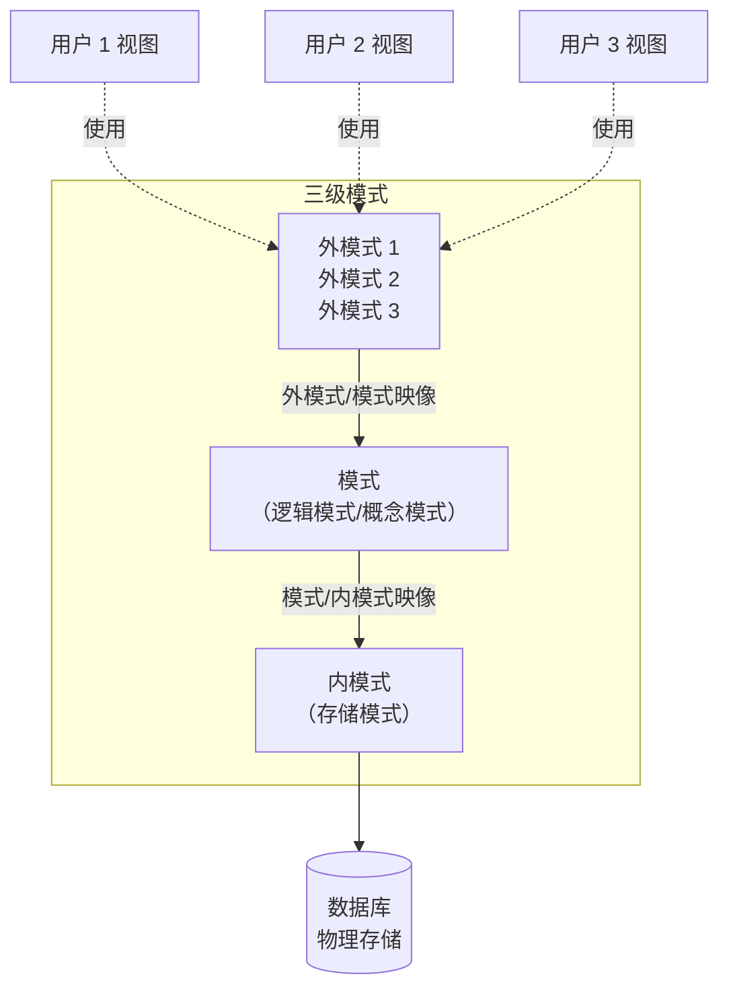
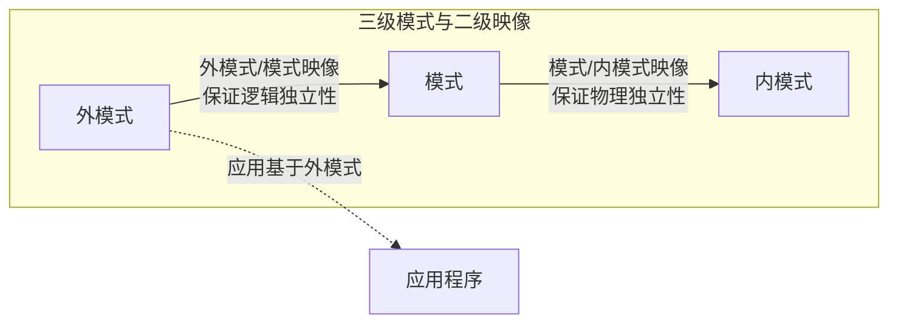

# 1.3 数据库系统结构

本节解决的核心问题是：**数据库内部是如何组织的，数据独立性是如何实现的**。数据库系统的结构可以从不同层次考察：从 DBMS 最终用户角度看是**数据库系统体系结构**（单用户、主从式、分布式、客户/服务器、浏览器/应用服务器/数据库服务器等），从数据库管理系统内部看是经典的**三级模式结构**。本节聚焦后者——三级模式结构与二级映像机制，它是 [[1.1 数据库系统概述]] 中数据独立性的实现原理，也是数据库系统的核心理论之一。

## 1.3.1 数据库系统模式的概念

> [!definition] 模式（Schema）
> 模式是数据库中**全体数据**的逻辑结构和特征的描述，它仅仅涉及**型的描述**，不涉及具体的值。模式是相对**稳定**的。

> [!definition] 实例（Instance）
> 实例是数据库在某一时刻**实际存储的数据**的集合，是模式的一个具体值。实例是相对**变动**的。

> [!tip] 模式与实例的关系
> - 模式 = "型"（Type），如 `Student(Sno, Sname, Sage)` 是模式；
> - 实例 = "值"（Value），如某个时刻学生表中所有记录构成的集合是实例。
> 同一模式在不同时刻可以有不同的实例，随数据库数据的更新而变化。

## 1.3.2 三级模式结构

> [!theorem] 数据库的三级模式结构
> 数据库系统的三级模式结构是指数据库系统由**外模式、模式、内模式**三级构成。这是数据库系统在体系结构上的核心特征，由 ANSI/SPARC 报告确立。

### 1. 模式（Schema）

> [!definition] 模式（也称逻辑模式 / 概念模式）
> 模式是数据库中**全体数据**的逻辑结构和特征的描述，是所有用户的公共数据视图。它是数据库系统三级模式结构的**中间层**，既不涉及数据的物理存储细节和硬件环境，也与具体的应用程序、程序设计语言或开发工具无关。
>
> 一个数据库**只有一个模式**。模式以某一种数据模型为基础，统一描述数据的逻辑结构（数据项的名字、类型、取值范围等）、数据之间的联系、与数据有关的安全性、完整性要求。

> [!note] 模式的核心地位
> 模式是数据库的"心脏"——数据库模式设计是数据库设计的核心任务（详见 [[MOC - 第7章]]）。定义模式时不仅要定义数据的逻辑结构，还要定义数据之间的联系、安全性和完整性要求。

### 2. 外模式（External Schema）

> [!definition] 外模式（也称子模式 / 用户模式）
> 外模式是数据库**用户**（包括应用程序员和最终用户）能够看见和使用的**局部数据**的逻辑结构和特征的描述，是数据库用户的数据视图，是与某一应用有关的数据的逻辑表示。
>
> 一个数据库**可以有多个外模式**。一个外模式可以被多个应用系统使用，但一个应用程序只能使用一个外模式。

> [!note] 外模式的作用
> - **屏蔽**了模式中用户不需要的部分，简化了用户视图；
> - 提供**数据安全性**：用户只能访问外模式允许的数据；
> - 一定程度地支持**逻辑数据独立性**：当模式改变时，可修改外模式/模式映像，使外模式不变。

### 3. 内模式（Internal Schema）

> [!definition] 内模式（也称存储模式）
> 内模式是数据在数据库系统内部的**物理存储结构**和**物理存取方法**的描述。一个数据库**只有一个内模式**。
>
> 内模式规定数据如何组织、如何存储、如何建立索引、使用何种存取路径等，例如记录是顺序存储还是按 B+ 树存储、是否压缩、是否加密等。

### 4. 三级模式对比

| 模式级别 | 别名 | 描述对象 | 数量 | 与用户/机器的关系 |
| ---- | ---- | ---- | ---- | ---- |
| **外模式** | 子模式、用户模式 | 局部数据的逻辑结构 | 多个 | 面向用户与应用 |
| **模式** | 逻辑模式、概念模式 | 全体数据的逻辑结构 | 1 个 | 中间层，公共数据视图 |
| **内模式** | 存储模式 | 物理存储结构与存取方法 | 1 个 | 面向 DBMS 与物理存储 |

> [!warning] 易错辨析
> - "模式"是特指中间层"逻辑模式"，与"三级模式"中的"模式"同义；
> - "外模式"和"内模式"各自独立，不是模式的子集；
> - **一个数据库只有一个模式，也只有一个内模式，但可以有多个外模式**。

## 1.3.3 数据库的二级映像与数据独立性

三级模式结构本身并不能直接提供数据独立性，**数据独立性**是通过三级模式之间的**二级映像**机制实现的：

- **外模式 / 模式映像**：保证**逻辑数据独立性**；
- **模式 / 内模式映像**：保证**物理数据独立性**。

### 1. 外模式 / 模式映像 — 逻辑独立性

> [!theorem] 外模式/模式映像与逻辑数据独立性
> 当**模式**改变时（例如增加新的关系、改变属性、修改联系），数据库管理员（DBA）只需修改**外模式/模式映像**，使**外模式保持不变**。应用程序基于外模式编写，因此应用程序可以不动，这就是**数据与程序的逻辑独立性**，简称**逻辑独立性**。

> [!note] 映像的位置
> 每一个外模式都对应一个外模式/模式映像。因此一个数据库中通常存在多个外模式/模式映像。

### 2. 模式 / 内模式映像 — 物理独立性

> [!theorem] 模式/内模式映像与物理数据独立性
> 当数据库的**存储结构**或**存取方法**改变时（例如更换存储设备、改变索引结构、由顺序文件改为 B+ 树文件），DBA 只需修改**模式/内模式映像**，使**模式保持不变**，从而外模式、应用程序都不变。这就是**数据与程序的物理独立性**，简称**物理独立性**。

> [!note] 映像的数量
> 因为一个数据库只有一个模式和一个内模式，所以**模式/内模式映像是唯一的**。

### 3. 二级映像的意义

| 映像 | 修改时机 | 不变的层 | 提供的独立性 |
| ---- | ---- | ---- | ---- |
| 外模式/模式映像 | 模式（逻辑结构）变化时 | 外模式、应用程序 | 逻辑独立性 |
| 模式/内模式映像 | 内模式（物理存储）变化时 | 模式、外模式、应用程序 | 物理独立性 |

> [!tip] 二级映像为何不向用户暴露
> 二级映像由 DBMS 自动维护，对用户透明。用户只需关心外模式（自己看到的视图），无需关心模式如何组织、数据如何物理存储。这种"接口分层"思想与操作系统的虚拟内存、文件系统抽象一致。

> [!warning] 常见考点
> - 三级模式：1 个模式、1 个内模式、**多个**外模式；
> - 二级映像：外模式/模式映像**多个**，模式/内模式映像**唯一**；
> - 逻辑独立性对应外模式/模式映像；物理独立性对应模式/内模式映像；
> - 二级映像是**数据独立性**的**实现机制**，三级模式是结构框架。

## 小结

数据库系统内部采用三级模式结构（外模式、模式、内模式）组织数据，并通过二级映像（外模式/模式映像、模式/内模式映像）实现逻辑数据独立性和物理数据独立性。这一机制使得应用程序与数据的逻辑结构和物理存储相互隔离，是数据库技术区别于文件系统的核心特征。模式描述"型"，实例描述某一时刻的"值"，二者相对独立。

## 关联

- 上一级：[[MOC - 第1章]]
- 上一节：[[1.2 数据模型]]
- 下一节：[[1.4 数据库系统组成]]
- 相关概念：[[1.1 数据库系统概述]]（数据独立性是数据库系统的特点）、[[3.5 视图]]（外模式的 SQL 实现）、[[MOC - 第7章]]（模式设计）
