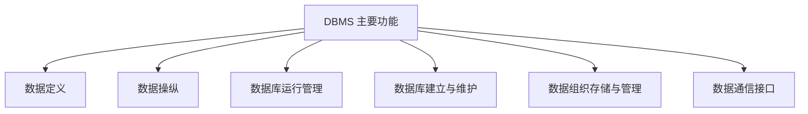
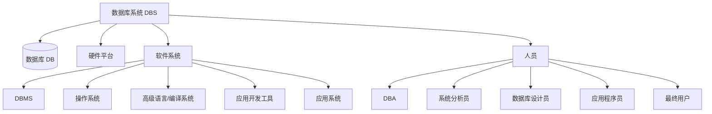

# 1.4 数据库系统组成

本节解决的核心问题是：**一个完整的数据库系统由哪些部分组成，DBMS 提供哪些功能，DBA 扮演什么角色**。本节从系统视角出发，说明数据库系统不仅包含数据和软件，还包含人员与管理，是 [[1.1 数据库系统概述]] 中 DBS 概念的展开。

## 1.4.1 数据库管理系统（DBMS）的功能

> [!definition] DBMS 的定位
> DBMS 是位于**用户与操作系统之间**的一层数据管理软件，是数据库系统的核心组成部分。它屏蔽了数据物理存储的细节，向上为用户和应用程序提供数据定义与操纵接口，向下管理存储资源。

DBMS 的主要功能可概括为以下六个方面：



### 1. 数据定义功能

DBMS 提供**数据定义语言（DDL）**，定义数据库的三级模式结构、二级映像、完整性约束和安全性约束：

- 定义外模式、模式、内模式；
- 定义数据项的类型、长度、取值范围；
- 定义主码、外码、唯一约束、检查约束；
- 定义索引、视图等。

> [!example] DDL 示例（MySQL 8.0）
> 最小表结构：学生表 `Student(Sno CHAR(9), Sname CHAR(20), Sage INT)`，其中 `Sno` 为主码。
>
> ```sql
> -- DBMS: MySQL 8.0；存储引擎：InnoDB
> CREATE TABLE Student (
>     Sno   CHAR(9)     NOT NULL,
>     Sname CHAR(20)    NOT NULL,
>     Sage  INT         CHECK (Sage > 0),
>     PRIMARY KEY (Sno)
> );
> ```
>
> 该语句通过 DDL 定义了模式的逻辑结构及实体完整性约束。

### 2. 数据操纵功能

DBMS 提供**数据操纵语言（DML）**，实现对数据库中数据的检索、插入、修改和删除：

- **检索（查询）**：从数据库中取出满足条件的数据。
- **更新**：插入、删除、修改数据。

DML 分为两类：

| 类型 | 使用方式 | 特点 |
| ---- | ---- | ---- |
| **宿主型 DML** | 嵌入高级语言（如 C、Java）中使用 | 必须由宿主语言编译执行 |
| **自含型 DML** | 独立交互使用，如 SQL 的 SELECT/INSERT/UPDATE/DELETE | 可独立执行，非过程性 |

> [!example] DML 示例（PostgreSQL 16）
> 最小表结构：学生表 `Student(Sno, Sname, Sage)`。
>
> ```sql
> -- DBMS: PostgreSQL 16
> INSERT INTO Student(Sno, Sname, Sage) VALUES ('20240001', '张三', 20);
> UPDATE Student SET Sage = Sage + 1 WHERE Sno = '20240001';
> DELETE FROM Student WHERE Sno = '20240001';
> SELECT Sname, Sage FROM Student WHERE Sage > 18;
> ```

### 3. 数据库运行管理功能

这是 DBMS 运行时的核心功能，也是与文件系统区别最显著的能力：

- **并发控制**：协调多用户的并发操作，防止相互干扰；
- **安全性控制**：身份认证、存取控制、视图机制、审计；
- **完整性检查**：执行实体完整性、参照完整性、用户定义完整性约束；
- **恢复管理**：在故障时将数据库恢复到一致状态；
- **事务管理**：保证事务的 ACID 特性。

### 4. 数据库建立与维护功能

包括数据库初始数据的装载、转换，以及运行期间的维护工作：

- 数据库的**载入、转换、转储、恢复**；
- 数据库的**重组织与重构造**；
- **性能监控、分析、调优**；
- 日志管理与统计报告。

通常由 DBMS 提供的实用程序（utility）完成，由 DBA 调用。

### 5. 数据组织与存储管理功能

DBMS 负责分类组织、存储和管理各种数据：

- 数据字典（系统目录）维护；
- 文件组织（堆文件、顺序文件、散列文件、聚集文件）；
- 索引结构（B+ 树、散列索引）；
- 存储路径、缓冲区管理；
- 数据压缩、加密。

目标：提高存储空间利用率和存取效率。

### 6. 数据通信接口功能

DBMS 提供与操作系统、网络通信软件的接口，支持：

- 与其他 DBMS 或文件系统的数据交换；
- 远程终端通过 TCP/IP 访问数据库；
- ODBC、JDBC 等标准接口；
- 应用程序通过 API 访问数据库。

## 1.4.2 数据库系统（DBS）的组成

> [!definition] 数据库系统的组成
> 数据库系统（DBS）是一个完整的可运行的存储、管理、维护数据的系统，通常由以下五个部分组成：
>
> 1. **数据库（DB）**：长期储存、有组织、可共享的数据集合；
> 2. **硬件平台**：计算机硬件系统，包括 CPU、内存、大容量磁盘、磁带、I/O 通道等；
> 3. **软件系统**：DBMS、支持 DBMS 运行的操作系统、具有数据库接口的高级语言及其编译系统、以 DBMS 为核心的应用开发工具、为特定应用开发的数据库应用系统；
> 4. **人员**：数据库管理员（DBA）、系统分析员和数据库设计人员、应用程序员、最终用户；
> 5. **(可选)网络环境**：在分布式或客户/服务器系统中，通信网络与协议。



### 1. 数据库（DB）

数据库是 DBS 的核心数据资源。它的物理形态是存储在磁盘上的若干数据文件、日志文件、控制文件等（DBMS 实现细节）；逻辑形态是按数据模型组织的、可共享的数据集合。

### 2. 硬件平台

由于数据库数据量大、并发访问频繁、对 I/O 性能要求高，硬件平台应满足：

- 足够大的**内存**：缓存数据字典、活跃数据块、查询执行计划；
- 足够大的**磁盘**：存储数据库及日志；
- 较高的**通道带宽**：支持并发 I/O；
- 系统的**可扩充性**与**高可用性**。

### 3. 软件系统

软件系统包括：

- **DBMS**：核心软件，负责数据管理；
- **操作系统**：为 DBMS 提供进程、内存、文件、网络支持；
- **高级语言与编译系统**：与 DBMS 接口，开发应用系统；
- **应用开发工具**：如 Oracle 的 Developer/2000、PowerBuilder、Delphi、各种 IDE；
- **数据库应用系统**：为特定应用领域开发的系统，如教务管理系统、银行系统。

### 4. 人员

DBS 中的人员是关键的"软"组成部分，按角色分为五类：

| 角色 | 主要职责 |
| ---- | ---- |
| **数据库管理员（DBA）** | 全面管理和控制数据库系统（详见下文） |
| **系统分析员** | 负责系统需求分析、规格说明，与用户及 DBA 协调确定软硬件配置 |
| **数据库设计员** | 参与需求分析，负责数据库的概念、逻辑、物理结构设计 |
| **应用程序员** | 设计与编写应用程序，进行调试与安装 |
| **最终用户** | 通过应用系统界面或 DBMS 查询语言访问数据库 |

## 1.4.3 数据库管理员（DBA）的职责

> [!definition] 数据库管理员（Database Administrator, DBA）
> DBA 是全面负责管理和控制数据库系统的**人员**（不是软件或角色账号）。DBA 在 DBS 中具有最高权限，对数据库系统的性能、安全、可用性负最终责任。

DBA 的核心职责包括：

### 1. 决定数据库的信息内容与结构

- 决定数据库中要存放哪些信息、组织成怎样的逻辑结构；
- 参与数据库的概念设计与逻辑设计；
- 决定数据库的模式与外模式。

### 2. 决定数据库的存储结构和存取策略

- 决定数据在磁盘上的物理组织、文件结构；
- 决定索引方案、聚簇方案、分区策略；
- 决定内模式及其与模式之间的映像。

### 3. 定义数据的安全性要求和完整性约束条件

- 定义用户身份鉴别、访问权限矩阵；
- 定义完整性约束（实体完整性、参照完整性、用户定义完整性）；
- 监控安全性与完整性策略的执行。

### 4. 监控数据库的使用和运行

- 监控数据库运行状态、性能指标；
- 处理运行中出现的问题；
- 及时调整存储空间、参数；
- 制定并执行**转储与恢复**策略。

### 5. 数据库的改进和重组重构

- 根据运行情况改进数据库设计；
- 进行数据库**重组织**（不改变模式，仅整理存储空间）；
- 必要时进行**重构造**（修改模式或内模式，适应新需求）。

### 6. 定义数据库用户与权限

- 创建用户、角色；
- 分配权限（GRANT / REVOKE）；
- 维护审计日志。

> [!tip] DBA 的能力要求
> DBA 既要熟悉业务、又要精通 DBMS 内部原理、操作系统、存储与网络。一个优秀的 DBA 是数据库系统稳定运行的"守护者"，本课程后续章节的安全性、完整性、恢复、并发控制、查询优化都是 DBA 应掌握的核心知识。

## 小结

本节介绍了 DBMS 的六大功能（数据定义、数据操纵、运行管理、建立与维护、数据组织存储与管理、数据通信接口），以及 DBS 的组成（DB、硬件、软件、人员），并重点说明了 DBA 的六大类职责。数据库系统是数据、软件、硬件和人员的有机结合，DBA 是其中关键的"软"因素，DBMS 是核心软件。一个 DBS 是否能高效、安全、稳定运行，取决于 DBMS 的能力与 DBA 的管理水平。

## 关联

- 上一级：[[MOC - 第1章]]
- 上一节：[[1.3 数据库系统结构]]
- 下一节：—（本章末节）
- 相关概念：[[1.1 数据库系统概述]]（DB/DBMS/DBS 概念）、[[MOC - 第4章]]（安全性控制）、[[MOC - 第5章]]（完整性约束）、[[MOC - 第8章]]（恢复）、[[MOC - 第9章]]（并发控制）
