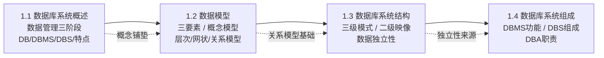

# MOC - 第1章 绪论

> [!info] 本章定位
> 本章是《数据库原理》课程的**入门章**，解决"什么是数据库、为什么需要数据库、数据库由什么组成"这三个根本问题。它从数据管理技术的发展历程出发，引出数据库系统的基本概念（DB、DBMS、DBS），介绍数据模型的分类与组成要素（重点是 E-R 概念模型与关系逻辑模型），阐明数据库系统的三级模式结构与二级映像机制如何实现数据独立性，最后说明数据库系统的组成与 DBA 的职责。
>
> 本章是后续章节的概念基础：[[MOC - 第2章]]（关系模型）建立在本章对关系模型的初步介绍之上；[[MOC - 第7章]]（数据库设计）的 E-R 方法源自本章的概念模型；二级映像与数据独立性贯穿安全性、完整性、恢复与并发控制的所有章节。

## 学习路线图

> [!tip] 路线说明
> 推荐按 1.1 → 1.2 → 1.3 → 1.4 顺序学习。1.1 建立整体认知；1.2 引入数据模型这一数据库核心抽象；1.3 揭示数据库内部组织与独立性机制；1.4 回到系统视角，说明 DBMS 与人员角色。每节均配有 Callout 定义、Mermaid 图与对比表，建议结合第2章关系模型一起理解。

## 知识点导航

| 节 | 主题 | 核心要点 | 入口链接 |
| ---- | ---- | ---- | ---- |
| 1.1 | 数据库系统概述 | 数据管理三阶段、DB/DBMS/DBS 定义、数据库四大特点、数据独立性 | [[1.1 数据库系统概述]] |
| 1.2 | 数据模型 | 数据模型三要素、概念模型（E-R）、逻辑模型（层次/网状/关系）对比、物理模型 | [[1.2 数据模型]] |
| 1.3 | 数据库系统结构 | 三级模式（外/模式/内模式）、二级映像、逻辑/物理独立性 | [[1.3 数据库系统结构]] |
| 1.4 | 数据库系统组成 | DBMS 六大功能、DBS 五大组成、DBA 六类职责 | [[1.4 数据库系统组成]] |

## 核心考点

> [!warning] 重点掌握
> 1. **数据管理技术三个发展阶段**及各阶段特点对比（人工管理 / 文件系统 / 数据库系统）。
> 2. **数据库系统的四大特点**：数据结构化、共享性高冗余度低、数据独立性高、由 DBMS 统一管理和控制。
> 3. **数据模型的三个组成要素**：数据结构、数据操作、数据的完整性约束条件。
> 4. **概念模型（E-R）的基本概念**：实体、属性、码、域、实体型、实体集、联系（1:1 / 1:n / m:n）。
> 5. **层次模型、网状模型、关系模型**的数据结构、优缺点及对比。
> 6. **三级模式结构**：外模式、模式、内模式的定义、数量与作用。
> 7. **二级映像与数据独立性**：外模式/模式映像 → 逻辑独立性；模式/内模式映像 → 物理独立性。
> 8. **DBMS 的功能**与 **DBS 的组成**、**DBA 的职责**。

## 自测题

> [!question] 1. 数据库系统相比文件系统，最根本的特征是什么？
> > [!check]- 参考答案
> > 数据库系统的根本特征是**数据结构化**——数据不再面向单个应用，而是面向整个组织，建立整体的数据结构并描述数据之间的联系。同时配合数据共享性高冗余度低、数据独立性高、由 DBMS 统一管理和控制等特点。其中**数据独立性**通过二级映像实现，是数据库区别于文件系统的核心机制。

> [!question] 2. 数据模型由哪三个要素组成？为什么数据结构是数据模型分类的依据？
> > [!check]- 参考答案
> > 数据模型的三要素是：**数据结构**（描述对象及联系，反映静态特性）、**数据操作**（描述允许的操作及规则，反映动态特性）、**数据的完整性约束条件**（保证数据正确、有效、相容）。
> > 由于数据操作和完整性约束通常依附于数据结构，因此通常按数据结构的特点来命名和区分数据模型，例如层次模型（树）、网状模型（图）、关系模型（二维表）。

> [!question] 3. 数据库的三级模式分别是什么？二级映像如何实现数据独立性？
> > [!check]- 参考答案
> > 三级模式为：**外模式**（用户视图，多个）、**模式**（全局逻辑结构，1 个）、**内模式**（物理存储结构，1 个）。
> > - **外模式/模式映像**：当模式改变时，修改此映像使外模式不变 → 应用程序不变 → **逻辑独立性**；
> > - **模式/内模式映像**：当物理存储改变时，修改此映像使模式不变 → 外模式、应用程序不变 → **物理独立性**。
> > 二级映像是数据独立性的**实现机制**。

> [!question] 4. 简述 DBA 的主要职责。
> > [!check]- 参考答案
> > DBA 全面负责管理和控制数据库系统，主要职责包括：
> > 1. 决定数据库的**信息内容与结构**（参与概念设计与逻辑设计）；
> > 2. 决定数据库的**存储结构和存取策略**（内模式设计）；
> > 3. 定义数据**安全性要求**和**完整性约束**条件；
> > 4. **监控数据库的使用和运行**，处理故障，执行转储与恢复；
> > 5. 数据库的**改进和重组重构**；
> > 6. 定义**数据库用户与权限**（GRANT/REVOKE、审计）。

## 章节导航

- 上一级：[[MOC - 数据库原理]]
- 下一章：[[MOC - 第2章]]
- 本章习题：[[MOC - 第1章习题]]
