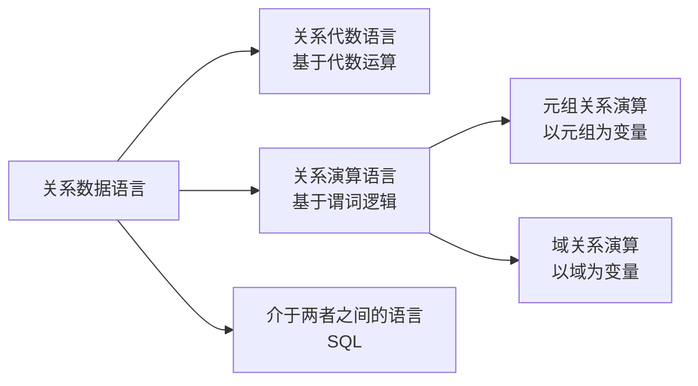

# 2.2 关系操作

关系模型给出了关系操作的能力和特点，但并不限定具体的语言形式。本节说明关系操作包含哪些基本能力、关系操作的集合运算特点，以及关系数据语言的主要分类，为[[2.4 关系代数|关系代数]]和后续 SQL 学习建立整体认知。

## 2.2.1 基本关系操作

> [!definition] 关系操作分类
> 关系模型中常用的关系操作包括**查询**（query）操作和**插入**（insert）、**删除**（delete）、**修改**（update）操作两大部分。

关系操作的组成如下表所示：

| 操作类别 | 操作名称 | 功能说明 |
| -------- | -------- | -------- |
| 查询     | 选择（selection）、投影（projection）、连接（join）、除（division）、并（union）、差（except）、交（intersection）、笛卡尔积（Cartesian product） | 从数据库中检索满足条件的数据 |
| 数据更新 | 插入、删除、修改 | 对数据库中的数据进行增删改 |

> [!info] 查询操作的表达
> 查询操作是关系操作中最主要的部分。查询操作又可以分为三块：
> 1. **选择、投影、连接、除**：专门的关系运算；
> 2. **并、差、交、笛卡尔积**：传统的集合运算；
> 3. 查询操作可以分解为上述基本运算的组合。

## 2.2.2 关系操作的特点

> [!theorem] 关系操作的两大特点
> 1. **集合操作方式**：关系操作采用**一次一集合**（set-at-a-time）的方式，操作对象和操作结果都是集合（即关系）。
> 2. **非过程化**：用户只需提出"做什么"，而不必指明"怎么做"，存取路径的选择由 DBMS 的优化器完成。

| 比较维度     | 关系操作（一次一集合）           | 非关系操作（如文件系统，一次一记录）   |
| ------------ | -------------------------------- | -------------------------------------- |
| 操作对象     | 集合（关系）                     | 单条记录                               |
| 操作结果     | 集合（关系）                     | 单条记录                               |
| 处理方式     | 集合运算，非过程化               | 逐条处理，需指明存取路径               |
| 用户负担     | 只需描述"做什么"                 | 需描述"怎么做"                         |

> [!tip] 集合操作方式的含义
> "一次一集合"是关系操作区别于早期网状模型、层次模型（"一次一记录"）的核心特征。这使得关系语言高度非过程化，也使查询优化器有较大的优化空间。

## 2.2.3 关系数据语言的分类

> [!definition] 关系数据语言
> 关系数据语言是用来对关系模型进行定义和操作的语言。按照其所依据的理论基础不同，可以分为三类：**关系代数语言**、**关系演算语言**以及介于两者之间的**具有关系代数和关系演算双重特点的语言**（SQL）。

### 1. 关系代数语言

> [!definition] 关系代数语言
> 关系代数语言是用对关系的**运算**来表达查询的语言。它以集合代数为基础，运算对象是关系，运算结果也是关系。

关系代数运算分为：

- **传统的集合运算**：并、差、交、笛卡尔积；
- **专门的关系运算**：选择、投影、连接、除。

典型代表：ISBL（Information System Base Language）。关系代数是**过程化**语言，需要指明运算的先后顺序。详见[[2.4 关系代数]]。

### 2. 关系演算语言

> [!definition] 关系演算语言
> 关系演算语言是用**谓词演算**（predicate calculus）来表达查询的语言。它以数理逻辑中的谓词演算为基础。

关系演算按谓词变元的不同分为两类：

| 类型           | 谓词变元 | 含义                                   | 典型代表 |
| -------------- | -------- | -------------------------------------- | -------- |
| 元组关系演算   | 元组变量 | 以元组为变量，谓词描述元组应满足的条件 | ALPHA、QUEL |
| 域关系演算     | 域变量   | 以域（属性值）为变量，谓词描述条件     | QBE      |

关系演算是**非过程化**语言，只需描述查询结果应满足的条件，不必指明运算过程。

### 3. 介于两者之间的语言——SQL

> [!info] SQL 的定位
> SQL（Structured Query Language）介于关系代数和关系演算之间，它既有关系代数的特点（可用运算组合表达查询），又有关系演算的特点（可描述查询条件）。SQL 是集**数据定义语言（DDL）**、**数据操纵语言（DML）**、**数据控制语言（DCL）**功能于一体的数据库标准语言，详见[[3.1 SQL概述]]。

三类语言的特点对比：

| 语言类型     | 表达基础     | 过程化程度 | 典型代表 |
| ------------ | ------------ | ---------- | -------- |
| 关系代数语言 | 集合代数运算 | 过程化     | ISBL     |
| 关系演算语言 | 谓词演算     | 非过程化   | ALPHA、QUEL、QBE |
| SQL          | 代数+演算    | 半过程化   | SQL 标准 |

## 2.2.4 关系代数与关系演算的表达能力

> [!theorem] 关系完备性
> 关系代数、元组关系演算和域关系演算三者在**表达能力上是等价的**。任何一种语言能表达的查询，另外两种也能表达。

这一结论称为关系的**表达能力等价性**或**关系完备性**。它保证了无论采用哪种理论模型设计查询语言，其表达能力上限是一致的。

> [!tip] 实际应用
> - 关系代数常用于查询优化（代数等价变换规则）和查询执行计划表示；
> - 关系演算思想体现在 SQL 的 WHERE 子句条件表达中；
> - 实际数据库系统中，SQL 被翻译为关系代数表达式，再经查询优化器优化后执行。详见[[11.2 代数优化]]。

## 小结

关系操作以**集合操作方式**为核心特征，包含查询与数据更新两大类操作。关系数据语言按理论基础分为关系代数语言（基于运算）、关系演算语言（基于谓词逻辑，又分元组关系演算和域关系演算）以及介于两者之间的 SQL。三者表达能力等价，构成了关系数据库查询语言的理论基础。其中关系代数是查询处理与优化的核心工具，将在[[2.4 关系代数]]中详细展开。

## 关联

- 本章导航：[[MOC - 第2章]]
- 课程总览：[[MOC - 数据库原理]]
- 上一节：[[2.1 关系数据结构及形式化定义]]
- 下一节：[[2.3 关系的完整性]]
- 相关概念：[[2.4 关系代数]]、[[3.1 SQL概述]]、[[11.2 代数优化]]
