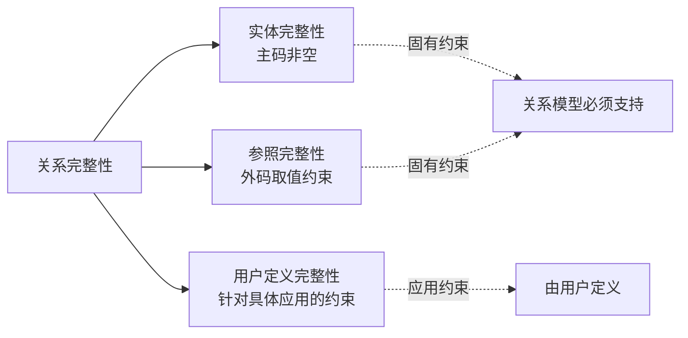
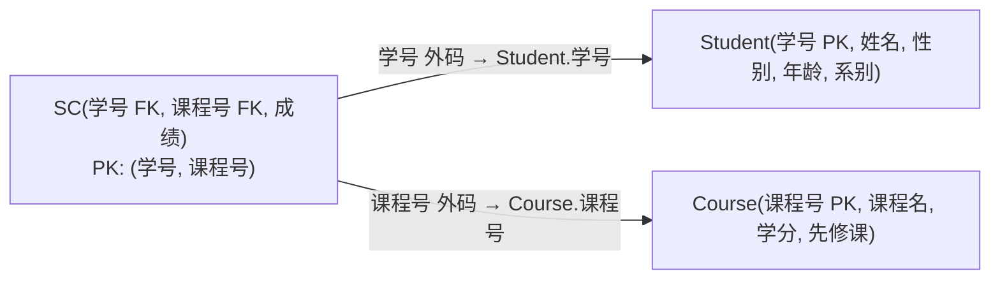

# 2.3 关系的完整性

关系完整性是关系模型对关系施加的约束条件，用以保证数据库中数据的**正确性**、**有效性和相容性**。本节介绍关系模型的三类完整性约束：实体完整性、参照完整性和用户定义完整性。前两者是关系模型必须满足的、固有的完整性约束，任何关系数据库管理系统都必须自动支持；后者则针对具体应用领域由用户定义。



## 2.3.1 实体完整性

> [!definition] 实体完整性规则
> 若属性 $A$ 是基本关系 $R$ 的**主属性**（即主码的组成部分），则 $A$ **不能取空值**（NULL）。

实体完整性规则规定：**主码的任何一部分都不能为空**。

> [!theorem] 实体完整性的必要性
> 关系对应现实世界中的实体集，主码用于唯一标识实体。若主码取空值，就意味着存在某个无法标识的实体，这与"实体必须可区分"的现实语义矛盾。因此主属性不能取空值。

**示例**：在学生关系 `Student(学号, 姓名, 性别, 年龄, 系别)` 中，`学号` 是主码。根据实体完整性：

- `学号` 不能取空值（NULL）；
- 若主码由多个属性组成（如选课关系 `SC(学号, 课程号, 成绩)` 中 `(学号, 课程号)` 为主码），则 `学号` 和 `课程号` 都不能取空值。

> [!warning] 区分主属性与非主属性
> 实体完整性约束的是**主属性**（候选码中的属性），而非所有属性。非主属性（如 `姓名`、`年龄`）在允许的情况下可以取空值。空值表示"未知"或"不存在"，不同于零或空字符串。

## 2.3.2 参照完整性

### 外码的定义

> [!definition] 外码
> 设 $F$ 是基本关系 $R$ 的一个或一组属性，但不是 $R$ 的码。若 $F$ 与基本关系 $S$ 的主码 $K_s$ 相对应（即 $F$ 的取值要么为空，要么等于 $S$ 中某个元组的主码值），则称 $F$ 是 $R$ 的**外码**（foreign key）。
>
> - $R$ 称为**参照关系**（referencing relation）；
> - $S$ 称为**被参照关系**（referenced relation）。
>
> $R$ 和 $S$ 可以是同一个关系，也可以是不同的关系。

### 参照完整性规则

> [!definition] 参照完整性规则
> 若属性（或属性组）$F$ 是基本关系 $R$ 的外码，它与基本关系 $S$ 的主码 $K_s$ 相对应，则对于 $R$ 中每个元组在 $F$ 上的取值必须满足：
>
> 1. 或者取**空值**（NULL）；
> 2. 或者等于 $S$ 中某个元组的**主码值**。

这两种情况分别对应：

1. 取空值：表示该参照关系中的元组尚未确定被参照对象（如学生尚未选课）；
2. 取被参照关系中存在的主码值：表示参照一个确实存在的被参照实体。

### 外码参照关系示意

以学生-课程-选课为例，三张基本关系模式如下：

- `Student(学号, 姓名, 性别, 年龄, 系别)`，主码：`学号`
- `Course(课程号, 课程名, 学分, 先修课)`，主码：`课程号`
- `SC(学号, 课程号, 成绩)`，主码：`(学号, 课程号)`

其中 `SC` 关系通过 `学号` 参照 `Student`，通过 `课程号` 参照 `Course`：



> [!example] 参照完整性应用
> 在 `SC` 关系中：
> - `学号` 是外码（参照 `Student.学号`），`课程号` 是外码（参照 `Course.课程号`）；
> - 但 `(学号, 课程号)` 是 `SC` 的主码，根据实体完整性，`学号` 和 `课程号` 作为主属性都不能为空；
> - 因此在 `SC` 中，`学号` 必须等于 `Student` 中某个已存在学生的学号，`课程号` 必须等于 `Course` 中某门已存在课程的课程号，**两者都不能取空值**。
>
> 如果外码所在属性是非主属性，则允许取空值。例如在 `Student` 关系中若增加 `系别负责人` 外码参照 `Teacher` 表，当学生尚无确定负责人时该字段可为空。

### 参照完整性的 SQL 实现

> [!info] SQL 中的外码声明
> DBMS 通过外码约束自动实现参照完整性检查。声明外码后，对被参照关系的删除或主码修改会触发相应处理策略。

DBMS：MySQL 8.0 / PostgreSQL 14+ 通用语法

```sql
-- 最小表结构：学生-课程-选课
CREATE TABLE Student (
    Sno   CHAR(9) PRIMARY KEY,       -- 学号，主码
    Sname VARCHAR(20) NOT NULL,
    Ssex  CHAR(2),
    Sage  INT,
    Sdept VARCHAR(20)
);

CREATE TABLE Course (
    Cno     CHAR(4) PRIMARY KEY,     -- 课程号，主码
    Cname   VARCHAR(40) NOT NULL,
    Credit  INT,
    Cpno    CHAR(4),                 -- 先修课，外码（自参照）
    FOREIGN KEY (Cpno) REFERENCES Course(Cno)
);

CREATE TABLE SC (
    Sno   CHAR(9),
    Cno   CHAR(4),
    Grade INT,
    PRIMARY KEY (Sno, Cno),          -- 联合主码
    FOREIGN KEY (Sno) REFERENCES Student(Sno)
        ON DELETE CASCADE            -- 删除学生时级联删除选课记录
        ON UPDATE CASCADE,
    FOREIGN KEY (Cno) REFERENCES Course(Cno)
        ON DELETE NO ACTION          -- 有选课时禁止删除课程
        ON UPDATE CASCADE
);
```

外码违约时的处理策略：

| 策略        | 含义                                                               |
| ----------- | ------------------------------------------------------------------ |
| `RESTRICT` / `NO ACTION` | 拒绝执行导致违约的删除或更新操作            |
| `CASCADE`   | 级联操作，被参照元组删除/更新时，参照元组同步删除/更新             |
| `SET NULL`  | 被参照元组删除/更新时，将参照元组的外码置空（前提是外码允许为空）  |

## 2.3.3 用户定义完整性

> [!definition] 用户定义完整性
> 用户定义完整性是针对**某一具体应用领域**的数据约束条件，反映具体应用中数据的语义要求。它通常包括：属性值是否允许为空、属性取值范围、属性间的函数依赖关系等。

用户定义完整性不是关系模型本身固有的，而是由应用领域决定的。例如：

- 学生年龄必须在 15~45 之间；
- 性别只能取"男"或"女"；
- 成绩必须在 0~100 之间；
- 职工工资不能低于最低工资标准。

> [!tip] 三类完整性的对比
> | 完整性类型       | 约束对象           | 约束来源           | DBMS 支持方式                     |
> | ---------------- | ------------------ | ------------------ | --------------------------------- |
> | 实体完整性       | 主属性（主码）     | 关系模型固有       | PRIMARY KEY 约束，自动检查        |
> | 参照完整性       | 外码               | 关系模型固有       | FOREIGN KEY 约束，自动检查        |
> | 用户定义完整性   | 任意属性           | 具体应用语义       | NOT NULL、UNIQUE、CHECK、触发器   |

### 用户定义完整性的 SQL 实现

DBMS：MySQL 8.0（CHECK 约束自 8.0.16 起强制执行）/ PostgreSQL 14+

```sql
-- 在 Student 表上添加用户定义完整性约束
CREATE TABLE Student (
    Sno   CHAR(9) PRIMARY KEY,
    Sname VARCHAR(20) NOT NULL,                  -- 姓名不允许为空
    Ssex  CHAR(2) CHECK (Ssex IN ('男', '女')),  -- 性别只取男或女
    Sage  INT CHECK (Sage BETWEEN 15 AND 45),    -- 年龄范围 15~45
    Sdept VARCHAR(20) DEFAULT '计算机系'          -- 默认值约束
);
```

> [!note] 与第5章的关系
> 关系模型的三类完整性在数据库系统中通过完整性约束机制实现，详见[[5.1 实体完整性]]、[[5.2 参照完整性]]、[[5.3 用户定义完整性]]与[[5.4 触发器]]。本节聚焦于完整性规则的**语义定义**，第5章聚焦于完整性约束的**实现机制**。

## 小结

关系完整性是保证数据库数据正确性和相容性的约束机制，包含三类：

1. **实体完整性**：主属性不能取空值，保证每个实体可被唯一标识；
2. **参照完整性**：外码取值必须为空或等于被参照关系中某主码值，保证关系间引用的有效性；
3. **用户定义完整性**：针对具体应用的语义约束，如取值范围、非空、默认值等。

前两类是关系模型的固有约束，任何关系 DBMS 都必须自动支持；第三类则由用户根据应用语义定义。理解三类完整性的语义和实现机制，是设计结构合理、数据可靠的数据库的基础。

## 关联

- 本章导航：[[MOC - 第2章]]
- 课程总览：[[MOC - 数据库原理]]
- 上一节：[[2.2 关系操作]]
- 下一节：[[2.4 关系代数]]
- 相关概念：[[2.1 关系数据结构及形式化定义]]（主码、候选码定义）、[[5.1 实体完整性]]、[[5.2 参照完整性]]、[[5.3 用户定义完整性]]、[[5.4 触发器]]
