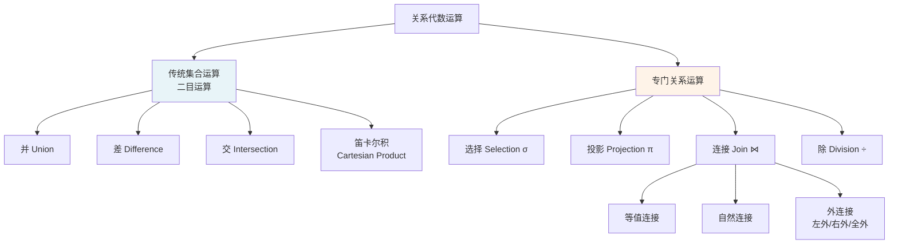
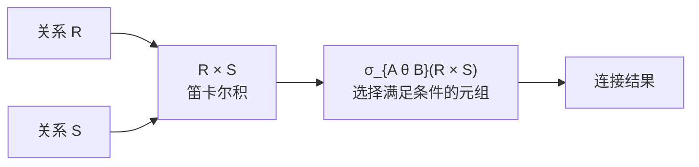

# 2.4 关系代数

关系代数是一种抽象的查询语言，它用对关系的运算来表达查询。关系代数的运算对象是关系，运算结果也是关系，因此关系代数运算可以嵌套组成复杂的表达式。本节系统讲解传统集合运算（并、差、交、笛卡尔积）和专门关系运算（选择、投影、连接、除），并给出每种运算的形式化定义与具体示例。关系代数是 SQL 查询处理与优化的理论基础。

## 2.4.1 关系代数运算分类

关系代数运算符总览：

| 运算符     | 名称       | 表达式示例      | 说明                       |
| ---------- | ---------- | --------------- | -------------------------- |
| $\cup$     | 并         | $R \cup S$      | 传统集合运算               |
| $-$        | 差         | $R - S$         | 传统集合运算               |
| $\cap$     | 交         | $R \cap S$      | 传统集合运算（可由差导出） |
| $\times$   | 笛卡尔积   | $R \times S$    | 传统集合运算               |
| $\sigma$   | 选择       | $\sigma_F(R)$   | 专门关系运算               |
| $\pi$      | 投影       | $\pi_A(R)$      | 专门关系运算               |
| $\bowtie$  | 连接       | $R \bowtie S$   | 专门关系运算               |
| $\div$     | 除         | $R \div S$      | 专门关系运算               |

## 2.4.2 传统的集合运算

传统集合运算把关系看作元组的集合，进行二目运算。除笛卡尔积外，**并、差、交**运算要求两个关系满足**相容（兼容）条件**。

> [!definition] 关系相容条件
> 两个关系 $R$ 和 $S$ 若满足以下两个条件，则称它们是**相容的**（compatible）：
> 1. **目相同**：$R$ 和 $S$ 都有 $n$ 个属性（同目关系）；
> 2. **属性对应域相同**：$R$ 的第 $i$ 个属性和 $S$ 的第 $i$ 个属性来自同一个域。

### 示例关系

为演示各类运算，定义以下两张关系 $R$ 和 $S$（均为 3 目关系，属性 $A, B, C$ 对应域相同）：

**关系 $R$**

| A   | B   | C   |
| --- | --- | --- |
| a1  | b1  | c1  |
| a1  | b2  | c2  |
| a2  | b2  | c1  |

**关系 $S$**

| A   | B   | C   |
| --- | --- | --- |
| a1  | b2  | c2  |
| a2  | b2  | c1  |
| a2  | b3  | c2  |

### 1. 并

> [!definition] 并
> 设关系 $R$ 和 $S$ 相容，则它们的**并**运算结果仍为 $n$ 目关系，由属于 $R$ 或属于 $S$ 的所有元组组成，**去重**：
> $$R \cup S = \{ t \mid t \in R \lor t \in S \}$$

**$R \cup S$ 结果**：

| A   | B   | C   |
| --- | --- | --- |
| a1  | b1  | c1  |
| a1  | b2  | c2  |
| a2  | b2  | c1  |
| a2  | b3  | c2  |

### 2. 差

> [!definition] 差
> 设关系 $R$ 和 $S$ 相容，则 $R - S$ 的结果仍为 $n$ 目关系，由属于 $R$ 但不属于 $S$ 的所有元组组成：
> $$R - S = \{ t \mid t \in R \land t \notin S \}$$

**$R - S$ 结果**：

| A   | B   | C   |
| --- | --- | --- |
| a1  | b1  | c1  |

### 3. 交

> [!definition] 交
> 设关系 $R$ 和 $S$ 相容，则 $R \cap S$ 的结果仍为 $n$ 目关系，由既属于 $R$ 又属于 $S$ 的所有元组组成：
> $$R \cap S = \{ t \mid t \in R \land t \in S \}$$

**$R \cap S$ 结果**：

| A   | B   | C   |
| --- | --- | --- |
| a1  | b2  | c2  |
| a2  | b2  | c1  |

> [!tip] 交运算可由差运算导出
> 交运算可以用差运算表示：$R \cap S = R - (R - S)$。因此交运算不是基本运算，但为了表达方便常单独使用。

### 4. 笛卡尔积

> [!definition] 笛卡尔积
> 设 $R$ 为 $n$ 目关系，$S$ 为 $m$ 目关系（不要求相容），则 $R \times S$ 是一个 $n + m$ 目关系，由 $R$ 中每个元组与 $S$ 中每个元组拼接而成。若 $R$ 有 $k_1$ 个元组，$S$ 有 $k_2$ 个元组，则结果有 $k_1 \times k_2$ 个元组：
> $$R \times S = \{ \overbrace{t_r t_s} \mid t_r \in R \land t_s \in S \}$$
> 其中 $t_r t_s$ 表示元组 $t_r$ 和 $t_s$ 拼接成的新元组。

**$R \times S$ 结果**（3 + 3 = 6 目，共 $3 \times 3 = 9$ 个元组）：

| A   | B   | C   | A   | B   | C   |
| --- | --- | --- | --- | --- | --- |
| a1  | b1  | c1  | a1  | b2  | c2  |
| a1  | b1  | c1  | a2  | b2  | c1  |
| a1  | b1  | c1  | a2  | b3  | c2  |
| a1  | b2  | c2  | a1  | b2  | c2  |
| a1  | b2  | c2  | a2  | b2  | c1  |
| a1  | b2  | c2  | a2  | b3  | c2  |
| a2  | b2  | c1  | a1  | b2  | c2  |
| a2  | b2  | c1  | a2  | b2  | c1  |
| a2  | b2  | c1  | a2  | b3  | c2  |

> [!warning] 笛卡尔积的属性命名
> 当 $R$ 和 $S$ 有同名属性时，结果关系中会出现重名列。通常在属性名前加上关系名前缀加以区分，如 `R.A`、`S.A`。笛卡尔积在实际查询中很少直接使用，往往结合选择运算形成连接。

## 2.4.3 专门的关系运算

专门关系运算是关系代数特有的运算，用于表达实际查询需求。本节使用以下示例关系进行演示。

### 示例关系：学生-课程-选课

**Student**

| Sno  | Sname | Ssex | Sage | Sdept   |
| ---- | ----- | ---- | ---- | ------- |
| 95001 | 李勇 | 男   | 20   | CS      |
| 95002 | 刘晨 | 女   | 19   | IS      |
| 95003 | 王敏 | 女   | 18   | MA      |
| 95004 | 张立 | 男   | 19   | IS      |

**Course**

| Cno  | Cname     | Cpno | Ccredit |
| ---- | --------- | ---- | ------- |
| 1    | 数据库    | 5    | 4       |
| 2    | 数学      |      | 2       |
| 3    | 信息系统  | 1    | 4       |
| 4    | 操作系统  | 6    | 3       |
| 5    | 数据结构  | 7    | 4       |
| 6    | 数据处理  |      | 2       |
| 7    | PASCAL语言 | 6    | 4       |

**SC**

| Sno  | Cno | Grade |
| ---- | --- | ----- |
| 95001 | 1  | 92    |
| 95001 | 2  | 85    |
| 95001 | 3  | 88    |
| 95002 | 2  | 90    |
| 95002 | 3  | 80    |

### 1. 选择

> [!definition] 选择
> 选择又称**限制**（restriction），在关系 $R$ 中选择满足给定条件的诸元组，记作：
> $$\sigma_F(R) = \{ t \mid t \in R \land F(t) = \text{true} \}$$
> 其中 $F$ 是选择条件，是一个布尔表达式，由属性名（或属性序号）、比较运算符（$>, \geq, <, \leq, =, \neq$）和逻辑运算符（$\land, \lor, \lnot$）组成。

选择运算是从行的角度进行的运算，即**水平方向**选择满足条件的元组。

**例 1**：查询信息系（IS）全体学生。

$$\sigma_{\text{Sdept} = \text{'IS'}}(\text{Student})$$

结果：

| Sno  | Sname | Ssex | Sage | Sdept |
| ---- | ----- | ---- | ---- | ----- |
| 95002 | 刘晨 | 女   | 19   | IS    |
| 95004 | 张立 | 男   | 19   | IS    |

**例 2**：查询年龄小于 20 岁的男学生。

$$\sigma_{\text{Sage} < 20 \land \text{Ssex} = \text{'男'}}(\text{Student})$$

结果：

| Sno  | Sname | Ssex | Sage | Sdept |
| ---- | ----- | ---- | ---- | ----- |
| 95004 | 张立 | 男   | 19   | IS    |

### 2. 投影

> [!definition] 投影
> 从关系 $R$ 中选出若干属性列组成新的关系，记作：
> $$\pi_A(R) = \{ t[A] \mid t \in R \}$$
> 其中 $A$ 是 $R$ 中的属性组，$t[A]$ 表示元组 $t$ 在属性组 $A$ 上的取值。

投影运算是从列的角度进行的运算，即**垂直方向**选取属性列。投影后可能产生重复元组，由于关系是集合，**应取消重复元组**。

**例 3**：查询学生的姓名和所在系。

$$\pi_{\text{Sname}, \text{Sdept}}(\text{Student})$$

结果：

| Sname | Sdept |
| ----- | ----- |
| 李勇  | CS    |
| 刘晨  | IS    |
| 王敏  | MA    |
| 张立  | IS    |

**例 4**：查询学生关系 Student 中都有哪些系。

$$\pi_{\text{Sdept}}(\text{Student})$$

结果（注意去重）：

| Sdept |
| ----- |
| CS    |
| IS    |
| MA    |

### 3. 连接

> [!definition] 连接
> 连接（join，又称 $\theta$ 连接）是从两个关系的笛卡尔积中选取属性间满足一定条件的元组，记作：
> $$R \underset{A \theta B}{\bowtie} S = \{ \overbrace{t_r t_s} \mid t_r \in R \land t_s \in S \land t_r[A] \, \theta \, t_s[B] \}$$
> 其中 $A$ 和 $B$ 分别为 $R$ 和 $S$ 上度数相等且可比的属性组，$\theta$ 是比较运算符。

连接运算的含义可分解为两步：

#### 等值连接

> [!definition] 等值连接
> 当 $\theta$ 为 $=$ 时的连接称为**等值连接**（equijoin）。它从笛卡尔积中选取 $R$ 的属性 $A$ 与 $S$ 的属性 $B$ 值相等的元组：
> $$R \underset{A = B}{\bowtie} S = \sigma_{A = B}(R \times S)$$

**例 5**：查询每个学生及其选修课程的情况（等值连接 `Student.Sno = SC.Sno`）。

$$\text{Student} \underset{\text{Student.Sno} = \text{SC.Sno}}{\bowtie} \text{SC}$$

结果（前两列 `Sno` 来自不同关系，均保留）：

| Student.Sno | Sname | Ssex | Sage | Sdept | SC.Sno | Cno | Grade |
| ----------- | ----- | ---- | ---- | ----- | ------ | --- | ----- |
| 95001       | 李勇  | 男   | 20   | CS    | 95001  | 1   | 92    |
| 95001       | 李勇  | 男   | 20   | CS    | 95001  | 2   | 85    |
| 95001       | 李勇  | 男   | 20   | CS    | 95001  | 3   | 88    |
| 95002       | 刘晨  | 女   | 19   | IS    | 95002  | 2   | 90    |
| 95002       | 刘晨  | 女   | 19   | IS    | 95002  | 3   | 80    |

#### 自然连接

> [!definition] 自然连接
> 自然连接（natural join）是一种特殊的等值连接，要求两个关系中进行比较的分量**必须是相同的属性组**（同名属性），并且在结果中**把重复的属性列去掉**。记作：
> $$R \bowtie S$$
>
> 若 $R$ 和 $S$ 具有相同的属性组 $A_1, A_2, \cdots, A_k$，则：
> $$R \bowtie S = \pi_{\text{去重}} \left( \sigma_{R.A_1 = S.A_1 \land \cdots \land R.A_k = S.A_k}(R \times S) \right)$$

**例 6**：用自然连接查询每个学生及其选修课程的情况。

$$\text{Student} \bowtie \text{SC}$$

结果（`Sno` 为公共属性，连接后只保留一列）：

| Sno  | Sname | Ssex | Sage | Sdept | Cno | Grade |
| ---- | ----- | ---- | ---- | ----- | --- | ----- |
| 95001 | 李勇 | 男   | 20   | CS    | 1   | 92    |
| 95001 | 李勇 | 男   | 20   | CS    | 2   | 85    |
| 95001 | 李勇 | 男   | 20   | CS    | 3   | 88    |
| 95002 | 刘晨 | 女   | 19   | IS    | 2   | 90    |
| 95002 | 刘晨 | 女   | 19   | IS    | 3   | 80    |

> [!warning] 等值连接与自然连接的区别
> | 比较维度       | 等值连接                       | 自然连接                                 |
> | -------------- | ------------------------------ | ---------------------------------------- |
> | 连接条件       | 任意属性组值相等（不要求同名） | 必须是**同名属性组**值相等               |
> | 重复列处理     | 保留所有列（含重复的同名列）   | 去掉重复的同名列                         |
> | 一般性         | 更一般                         | 是等值连接的特例                         |

#### 悬浮元组与外连接

> [!definition] 悬浮元组
> 在做自然连接时，被舍弃的元组称为**悬浮元组**（dangling tuple）。被舍弃的原因是该元组在另一个关系的公共属性上没有匹配值。

> [!definition] 外连接
> 如果把悬浮元组也保留在结果关系中，而在其他属性上填空值（NULL），这种连接称为**外连接**（outer join）。外连接分为三类：

| 类型         | 保留方式                                         | 符号表示                 |
| ------------ | ------------------------------------------------ | ------------------------ |
| 左外连接     | 只保留左边关系 $R$ 的悬浮元组                    | $R \bowtie S$（左）      |
| 右外连接     | 只保留右边关系 $S$ 的悬浮元组                    | $R \bowtie S$（右）      |
| 全外连接     | 保留两边所有悬浮元组                             | $R \bowtie S$（全）      |

**例 7**：以 `Student` 左外连接 `SC`，保留所有学生（包括未选课的 95003 王敏、95004 张立）。

| Sno  | Sname | Ssex | Sage | Sdept | Cno  | Grade |
| ---- | ----- | ---- | ---- | ----- | ---- | ----- |
| 95001 | 李勇 | 男   | 20   | CS    | 1    | 92    |
| 95001 | 李勇 | 男   | 20   | CS    | 2    | 85    |
| 95001 | 李勇 | 男   | 20   | CS    | 3    | 88    |
| 95002 | 刘晨 | 女   | 19   | IS    | 2    | 90    |
| 95002 | 刘晨 | 女   | 19   | IS    | 3    | 80    |
| 95003 | 王敏 | 女   | 18   | MA    | NULL | NULL  |
| 95004 | 张立 | 男   | 19   | IS    | NULL | NULL  |

### 4. 除运算

> [!definition] 除运算
> 设关系 $R$ 为 $n$ 目关系，关系 $S$ 为 $m$ 目关系（$n > m$，且 $S$ 的所有属性都是 $R$ 的属性），则 $R \div S$ 是一个 $n - m$ 目关系，记作：
> $$R \div S = \{ t_r[X] \mid t_r \in R \land \pi_Y(S) \subseteq Y_{t_r} \}$$
> 其中 $X$ 是 $R$ 中除去与 $S$ 相同属性后剩余的属性组，$Y$ 是 $R$ 和 $S$ 的公共属性组。$Y_{t_r}$ 表示 $R$ 中在 $X$ 上取值为 $t_r[X]$ 的所有元组在 $Y$ 上的投影集合。

除运算的含义是：在 $R$ 中找出那些在 $X$ 上的取值 $x$，使得 $x$ 对应的 $Y$ 值集合**包含** $S$ 中所有的 $Y$ 值。除运算常用于"查询……包含了全部……"这类问题。

**例 8**：查询至少选修了 1 号课程和 3 号课程的学生的学号。

设关系 $R = \pi_{\text{Sno}, \text{Cno}}(\text{SC})$，关系 $S$ 为：

| Cno |
| --- |
| 1   |
| 3   |

则 $R \div S$ 的结果为：

**$R$（SC 上 Sno、Cno 投影）**：

| Sno  | Cno |
| ---- | --- |
| 95001 | 1  |
| 95001 | 2  |
| 95001 | 3  |
| 95002 | 2  |
| 95002 | 3  |

**$R \div S$ 结果**：

| Sno  |
| ---- |
| 95001|

> [!tip] 除运算的理解方式
> 学生 95001 选修了课程 {1, 2, 3}，包含 $S$ 中的 {1, 3}，所以出现在结果中；学生 95002 选修了课程 {2, 3}，不包含课程 1，所以不出现在结果中。

> [!example] 除运算计算步骤
> 1. 找出 $R$ 与 $S$ 的公共属性组 $Y$（本例为 `Cno`）和 $R$ 的剩余属性组 $X$（本例为 `Sno`）。
> 2. 对 $R$ 在 $X$ 上投影去重，得到所有候选的 $X$ 值：{95001, 95002}。
> 3. 对每个 $x$，找出其对应的 $Y$ 值集合：
>    - 95001 → {1, 2, 3}，包含 {1, 3} ✓
>    - 95002 → {2, 3}，不包含 {1, 3} ✗
> 4. 结果为满足条件的 $x$：{95001}。

## 2.4.4 关系代数表达式

关系代数运算经有限次复合后形成的式子称为**关系代数表达式**，其运算结果仍是一个关系。可以用表达式表达复杂的查询需求。

**例 9**：查询选修了 2 号课程的学生的姓名。

$$\pi_{\text{Sname}}(\sigma_{\text{Cno} = 2}(\text{Student} \bowtie \text{SC}))$$

**例 10**：查询至少选修了一门其直接先修课为 6 号课程的学生学号和姓名。

$$\pi_{\text{Sno}, \text{Sname}}(\text{Student} \bowtie (\pi_{\text{Sno}}(\text{SC} \bowtie \sigma_{\text{Cpno}=6}(\text{Course}))))$$

**例 11**：查询选修了全部课程的学生学号和姓名。

$$\pi_{\text{Sno}, \text{Sname}}(\text{Student} \bowtie (\pi_{\text{Sno}, \text{Cno}}(\text{SC}) \div \pi_{\text{Cno}}(\text{Course})))$$

> [!info] 关系代数与 SQL 的对应
> 关系代数表达式的运算可以直接对应到 SQL 语句：
> - 选择 $\sigma_F$ ↔ `WHERE F`
> - 投影 $\pi_A$ ↔ `SELECT A`
> - 自然连接 $\bowtie$ ↔ `FROM R NATURAL JOIN S` 或 `FROM R, S WHERE R.A = S.A`
> - 除 $\div$ ↔ `NOT EXISTS ... NOT EXISTS`（双重否定）
>
> 详见[[3.3 数据查询]]与[[11.2 代数优化]]。

## 小结

关系代数是关系数据语言的数学基础，分为传统集合运算和专门关系运算：

- **传统集合运算**（并、差、交、笛卡尔积）以关系为元组集合进行二目运算，并/差/交要求关系相容，用于表达关系的合并、删除、公共部分提取与组合；
- **专门关系运算**（选择、投影、连接、除）表达实际的查询语义：选择取行、投影取列、连接合并关系、除运算表达"包含全部"语义；
- 连接中最重要的是**自然连接**（等值连接且去重复列），其变体**外连接**保留悬浮元组；
- **除运算**用于"至少包含全部……"类查询，是关系代数中较难掌握但表达力重要的运算。

关系代数表达式可嵌套组合表达复杂查询，是 SQL 查询处理与代数优化的理论基础。掌握每种运算的形式化定义、操作方向（行/列）和结果关系，是写出正确关系代数表达式的前提。

## 关联

- 本章导航：[[MOC - 第2章]]
- 课程总览：[[MOC - 数据库原理]]
- 上一节：[[2.3 关系的完整性]]
- 下一节：[[3.1 SQL概述]]（第3章 SQL）
- 相关概念：[[2.1 关系数据结构及形式化定义]]（域、笛卡尔积）、[[2.2 关系操作]]、[[3.3 数据查询]]、[[11.2 代数优化]]、[[MOC - 第2章习题]]
