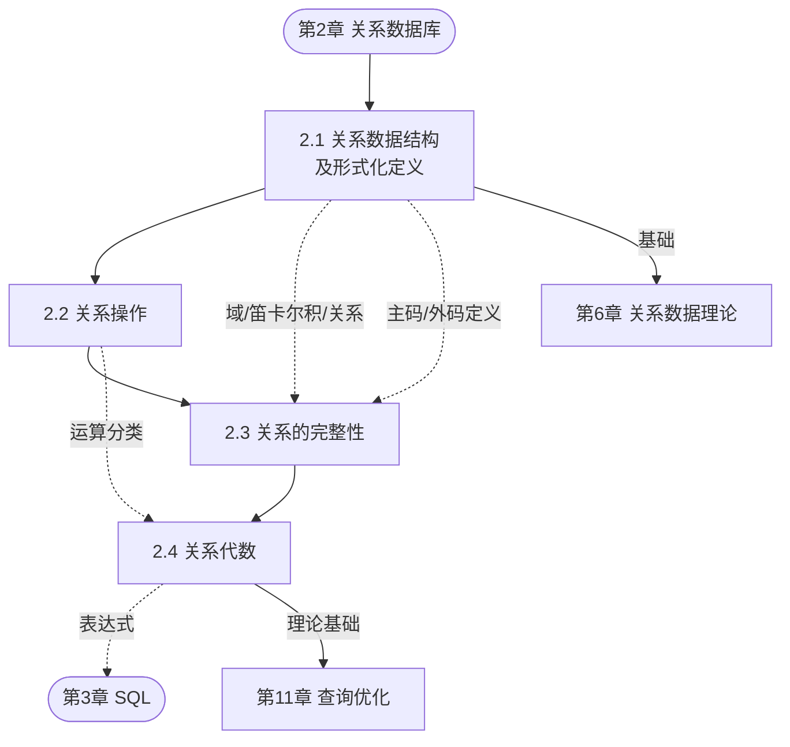

# MOC - 第2章 关系数据库

> [!info] 本章定位
> 第2章是全课程的理论基石。关系数据库以关系模型为基础，本节系统讲解关系模型的三要素：**数据结构**（关系）、**关系操作**（关系代数/关系演算）和**关系完整性约束**（实体完整性、参照完整性、用户定义完整性）。本章承上启下：它把第1章建立的"数据模型"概念落实到关系这一具体结构，又为第3章 SQL 提供数学语言基础，为第6章关系数据理论（规范化）提供关系模式与函数依赖的入口。

## 学习路线图

## 知识点导航

| 小节 | 主题 | 入口 | 核心内容 |
| ---- | ---- | ---- | -------- |
| 2.1 | 关系数据结构及形式化定义 | [[2.1 关系数据结构及形式化定义]] | 域、笛卡尔积、关系、关系性质、关系模式 $R(U,D,DOM,F)$、关系数据库模式 |
| 2.2 | 关系操作 | [[2.2 关系操作]] | 基本关系操作、集合操作方式、关系数据语言分类（代数/演算/SQL） |
| 2.3 | 关系的完整性 | [[2.3 关系的完整性]] | 实体完整性、参照完整性、外码、用户定义完整性 |
| 2.4 | 关系代数 | [[2.4 关系代数]] | 传统集合运算（并差交笛卡尔积）、专门关系运算（选择投影连接除）、关系代数表达式 |

> [!tip] 习题入口
> 本章配套习题见 [[MOC - 第2章习题]]，含 30 道题（单选 10、多选 5、判断 5、简答 4、分析 4、综合 2），覆盖关系形式化定义、完整性约束与关系代数运算。

## 核心考点

> [!warning] 核心考点清单（7 项）
> 1. **域、笛卡尔积、关系的形式化定义**：能写出 $R \subseteq D_1 \times D_2 \times \cdots \times D_n$ 并计算笛卡尔积基数 $\prod m_i$；理解关系是笛卡尔积的有意义子集。
> 2. **关系的六条性质**：尤其是列同质性、元组唯一性（集合性质）、分量原子性（第一范式 1NF）。
> 3. **关系模式五元组 $R(U, D, DOM, F)$**：区分关系模式（型）与关系（值），理解五元组各分量含义。
> 4. **候选码、主码、外码**：能从给定关系模式中识别候选码、主属性、外码，区分主属性与非主属性。
> 5. **实体完整性与参照完整性规则**：主属性不能取空值；外码取值必须为空或等于被参照关系某主码值；能判断给定操作是否违约。
> 6. **关系代数专门运算的形式化定义与计算**：选择 $\sigma$、投影 $\pi$、自然连接 $\bowtie$、除运算 $\div$ 的定义、操作方向（行/列）及结果。
> 7. **关系代数表达式书写**：能用关系代数表达式表达"查询选修某课程的学生姓名""至少选修全部课程的学生"等典型查询，掌握除运算表达"包含全部"语义。

## 自测题

> [!question] 自测 1
> 关系模式和关系分别描述什么？关系模式五元组 $R(U, D, DOM, F)$ 中 $F$ 的含义是什么？
> > [!check]- 答案
> > 关系模式是关系的"型"，描述关系的静态结构；关系是关系模式在某一时刻的"值"（当前元组集合）。$F$ 是属性间数据的依赖关系集合（主要是函数依赖），是规范化和模式分解的理论依据，详见[[6.2 函数依赖]]。

> [!question] 自测 2
> 在选课关系 `SC(学号, 课程号, 成绩)` 中，主码是 `(学号, 课程号)`。那么 `学号` 既是主属性又是外码，它在 SC 中能否取空值？为什么？
> > [!check]- 答案
> > 不能取空值。`学号` 是主码的一部分，根据**实体完整性**，主属性不能取空值；同时 `学号` 是参照 Student 表的外码，根据**参照完整性**，其取值要么为空要么等于 Student 中某主码值。两条规则同时作用，取并集（更严格者），因此 `学号` 必须非空且等于已存在学生的学号。

> [!question] 自测 3
> 等值连接和自然连接有何区别？给定 $R(A,B)$ 和 $S(B,C)$，写出 $R \bowtie S$（自然连接）的结果属性。
> > [!check]- 答案
> > 等值连接是任意属性组值相等即可，保留所有列（含重复同名列）；自然连接要求比较的是**同名属性组**且**去掉重复列**。$R(A,B) \bowtie S(B,C)$ 的结果属性为 $A, B, C$（B 只保留一列）。

> [!question] 自测 4
> 设 $R = \pi_{\text{Sno}, \text{Cno}}(\text{SC})$，$S = \{1, 3\}$（Cno 集合），$R \div S$ 的语义是什么？
> > [!check]- 答案
> > 语义为"至少选修了 1 号和 3 号课程的学生学号"。除运算结果为在 Sno 上取值使得其对应 Cno 集合包含 $S$ 中所有 Cno 的学生学号。详见[[2.4 关系代数#4. 除运算]]。

## 章节导航

- 上一级：[[MOC - 数据库原理]]
- 上一章：[[MOC - 第1章]]（绪论）
- 本章习题：[[MOC - 第2章习题]]
- 下一章：[[MOC - 第3章]]（关系数据库标准语言 SQL）
