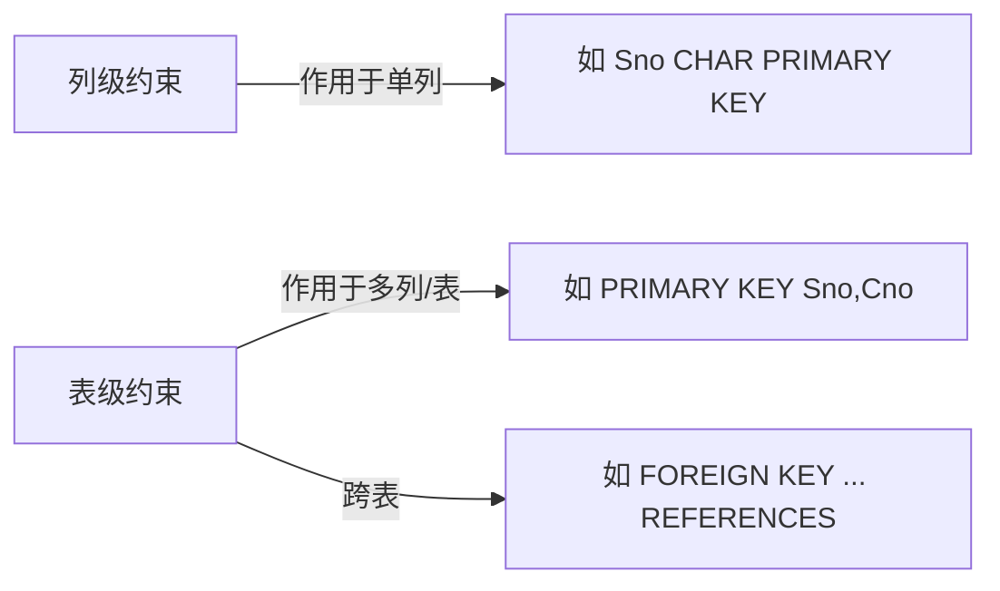
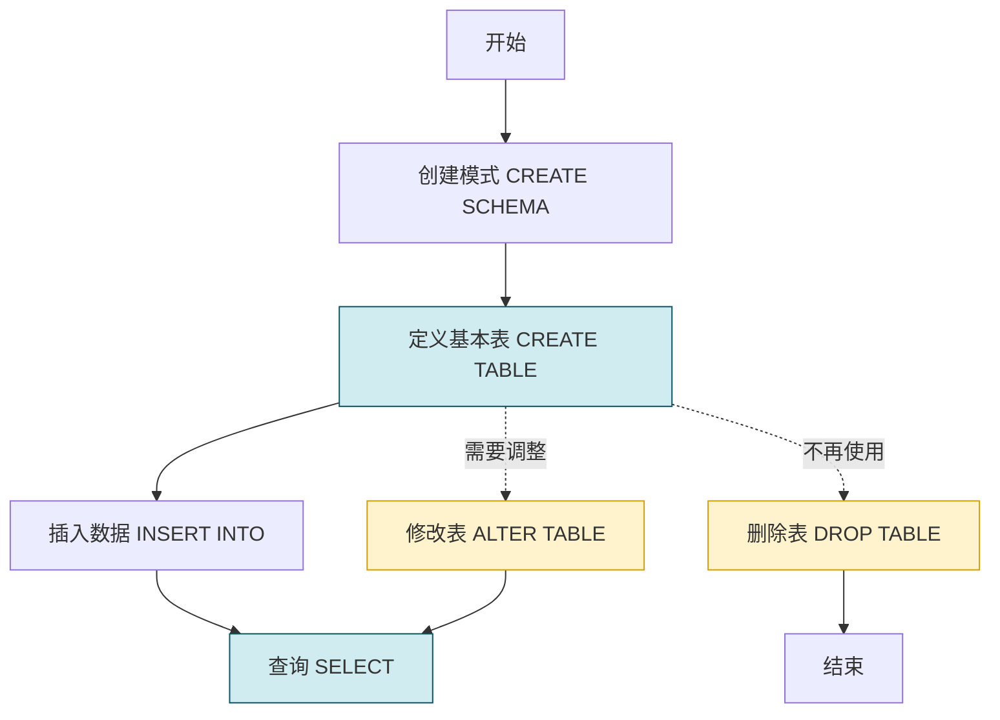

# 3.2 数据定义

SQL 的数据定义功能（DDL）解决的问题是：如何在数据库中建立、修改和删除**模式、基本表、视图与索引**等对象，并通过列级/表级完整性约束保证数据的正确性。本节是后续 [[3.3 数据查询]] 与 [[3.4 数据更新]] 的结构前提。

## SQL 数据定义的对象与动词

SQL 数据定义包括**模式、表、视图和索引**的定义与删除（部分对象支持修改），核心动词为 `CREATE`、`DROP`、`ALTER`。

| 操作对象 | 创建 | 删除 | 修改 |
| -------- | ---- | ---- | ---- |
| 模式（Schema） | `CREATE SCHEMA` | `DROP SCHEMA` | — |
| 基本表（Table） | `CREATE TABLE` | `DROP TABLE` | `ALTER TABLE` |
| 视图（View） | `CREATE VIEW` | `DROP VIEW` | — |
| 索引（Index） | `CREATE INDEX` | `DROP INDEX` | — |

> [!note] 视图与索引的处理位置
> 视图定义见 [[3.5 视图]]；索引在《数据库系统概论》中常归入数据定义，但 MySQL 8.0 已支持 `ALTER TABLE ... ADD/DROP INDEX`，也常与表结构一起讨论。

## 模式的定义与删除

### 1. 定义模式

> [!definition] 模式
> **模式（Schema）** 是数据库对象（表、视图等）的命名空间，用于逻辑分组。模式由模式名、拥有者（用户）标识。

```sql
-- MySQL 8.0：CREATE SCHEMA 等价于 CREATE DATABASE
CREATE SCHEMA <模式名> AUTHORIZATION <用户名>;
-- 示例：为用户 U1 创建模式 S_T
CREATE SCHEMA S_T AUTHORIZATION U1;
```

可以在创建模式的同时进一步定义该模式包含的表、视图等对象：

```sql
CREATE SCHEMA TEST AUTHORIZATION U1
    CREATE TABLE TAB1 (COL1 SMALLINT,
                      COL2 INT,
                      COL3 DECIMAL(10,3),
                      COL4 CHAR(20),
                      COL5 VARCHAR(50));
```

> [!tip] MySQL 方言差异
> MySQL 把 `SCHEMA` 视为 `DATABASE` 的同义词，且不支持 `AUTHORIZATION` 子句指定属主（属主由服务器权限系统决定）。标准 SQL 中若未指定 `<用户名>`，默认属主为当前用户。

### 2. 删除模式

```sql
DROP SCHEMA <模式名> <CASCADE|RESTRICT>;
```

- `CASCADE`：级联删除，删除模式的同时删除该模式中所有数据库对象（表、视图等）。
- `RESTRICT`：限制删除，仅当模式中没有任何对象时才能删除。

```sql
-- 示例：删除模式 S_T 及其中所有对象
DROP SCHEMA S_T CASCADE;
```

> [!warning] MySQL 不支持级联删除数据库
> MySQL 的 `DROP DATABASE` 等价于 `DROP SCHEMA`，默认即级联删除所有对象，**不提供 RESTRICT 选项**。这是危险操作，执行前务必确认。

## 基本表的定义、修改与删除

### 1. 定义基本表

> [!definition] 基本表定义语法
> ```sql
> CREATE TABLE <表名>(
>     <列名> <数据类型> [列级完整性约束],
>     ...
>     [表级完整性约束]
> );
> ```

定义基本表时需逐列给出列名、数据类型及列级约束，并可附加表级约束（如多列主键、外键、CHECK 等）。

#### 示例数据：学生—课程—选课三表

以下三表是贯穿 3.3、3.4、3.5 节的标准示例，结构与数据如下：

**Student**（学生表）：学号 Sno、姓名 Sname、性别 Ssex、年龄 Sage、所在系 Sdept。

| Sno | Sname | Ssex | Sage | Sdept |
| --- | --- | --- | --- | --- |
| 2024001 | 李勇 | 男 | 20 | CS |
| 2024002 | 刘晨 | 女 | 19 | IS |
| 2024003 | 王敏 | 女 | 18 | MA |
| 2024004 | 张立 | 男 | 21 | IS |
| 2024005 | 陈玲 | 女 | 20 | CS |

**Course**（课程表）：课程号 Cno、课程名 Cname、先行课 Cpno、学分 Ccredit。

| Cno | Cname | Cpno | Ccredit |
| --- | --- | --- | --- |
| 1 | 数据库 | 5 | 4 |
| 2 | 数学 | NULL | 2 |
| 3 | 信息系统 | 1 | 4 |
| 4 | 操作系统 | 6 | 3 |
| 5 | 数据结构 | 7 | 4 |
| 6 | 数据处理 | NULL | 2 |
| 7 | PASCAL语言 | 6 | 4 |

**SC**（选课表）：学号 Sno、课程号 Cno、成绩 Grade。

| Sno | Cno | Grade |
| --- | --- | --- |
| 2024001 | 1 | 92 |
| 2024001 | 2 | 85 |
| 2024001 | 3 | 88 |
| 2024002 | 2 | 90 |
| 2024002 | 3 | 80 |
| 2024003 | 1 | 78 |
| 2024004 | 1 | 95 |
| 2024004 | 4 | 70 |

#### 建表 SQL

```sql
-- 创建学生表 Student
CREATE TABLE Student(
    Sno   CHAR(7)        PRIMARY KEY,           -- 学号, 主键约束(列级)
    Sname VARCHAR(20)    NOT NULL,              -- 姓名, 非空约束
    Ssex  CHAR(2)        CHECK (Ssex IN ('男','女')),  -- 性别, 取值约束
    Sage  SMALLINT       CHECK (Sage > 0),      -- 年龄
    Sdept VARCHAR(20)                            -- 所在系
);

-- 创建课程表 Course(含表级外键自引用)
CREATE TABLE Course(
    Cno     CHAR(2)     PRIMARY KEY,            -- 课程号, 主键
    Cname   VARCHAR(40) NOT NULL,                -- 课程名
    Cpno    CHAR(2),                             -- 先行课
    Ccredit SMALLINT    CHECK (Ccredit > 0),     -- 学分
    -- 表级外键: 先行课 Cpno 引用本表 Cno
    FOREIGN KEY (Cpno) REFERENCES Course(Cno)
       ON DELETE SET NULL ON UPDATE CASCADE
);

-- 创建选课表 SC(含复合主键与双外键)
CREATE TABLE SC(
    Sno   CHAR(7)     NOT NULL,
    Cno   CHAR(2)     NOT NULL,
    Grade DECIMAL(4,1) CHECK (Grade BETWEEN 0 AND 100),
    -- 表级主键: 学号+课程号 唯一标识一条选课记录
    PRIMARY KEY (Sno, Cno),
    -- 表级外键: Sno 引用 Student(Sno)
    FOREIGN KEY (Sno) REFERENCES Student(Sno)
       ON DELETE CASCADE ON UPDATE CASCADE,
    -- 表级外键: Cno 引用 Course(Cno)
    FOREIGN KEY (Cno) REFERENCES Course(Cno)
       ON DELETE CASCADE ON UPDATE CASCADE
);
```

> [!tip] 插入示例数据
> ```sql
> INSERT INTO Student VALUES
>   ('2024001','李勇','男',20,'CS'),
>   ('2024002','刘晨','女',19,'IS'),
>   ('2024003','王敏','女',18,'MA'),
>   ('2024004','张立','男',21,'IS'),
>   ('2024005','陈玲','女',20,'CS');
>
> INSERT INTO Course VALUES
>   ('1','数据库','5',4),
>   ('2','数学',NULL,2),
>   ('3','信息系统','1',4),
>   ('4','操作系统','6',3),
>   ('5','数据结构','7',4),
>   ('6','数据处理',NULL,2),
>   ('7','PASCAL语言','6',4);
>
> INSERT INTO SC VALUES
>   ('2024001','1',92),
>   ('2024001','2',85),
>   ('2024001','3',88),
>   ('2024002','2',90),
>   ('2024002','3',80),
>   ('2024003','1',78),
>   ('2024004','1',95),
>   ('2024004','4',70);
> ```

### 2. 修改基本表

```sql
ALTER TABLE <表名>
    [ADD [COLUMN] <新列名> <数据类型> [完整性约束]]   -- 增加新列
    [ADD <表级完整性约束>]
    [DROP [COLUMN] <列名> [CASCADE|RESTRICT]]       -- 删除列
    [DROP CONSTRAINT <完整性约束名> [RESTRICT|CASCADE]] -- 删除约束
    [ALTER COLUMN <列名> <数据类型>]                 -- 修改列定义
    [MODIFY COLUMN <列名> <新数据类型>];            -- MySQL 方言修改列类型
```

> [!warning] 方言差异：修改列类型
> 标准 SQL 用 `ALTER COLUMN ... TYPE`；MySQL 用 `MODIFY COLUMN ...`；SQL Server 用 `ALTER COLUMN`。以下示例使用 MySQL 8.0 语法。

```sql
-- 例1：向 Student 表增加"入学时间"列, 数据类型为日期
ALTER TABLE Student ADD S_entrance DATE;

-- 例2：将 Sage 的数据类型改为 INT
ALTER TABLE Student MODIFY COLUMN Sage INT;

-- 例3：删除"入学时间"列
ALTER TABLE Student DROP COLUMN S_entrance;

-- 例4：为 Course 表的 Cname 列增加唯一约束(命名 UQ_Cname)
ALTER TABLE Course ADD CONSTRAINT UQ_Cname UNIQUE (Cname);

-- 例5：删除约束 UQ_Cname
ALTER TABLE Course DROP CONSTRAINT UQ_Cname;
-- MySQL 中删除 UNIQUE 约束的写法为: ALTER TABLE Course DROP INDEX UQ_Cname;
```

### 3. 删除基本表

```sql
DROP TABLE <表名> [RESTRICT|CASCADE];
```

- `RESTRICT`：默认行为，仅当该表没有依赖对象（视图、约束、触发器等）时才删除。
- `CASCADE`：级联删除，删除表的同时删除该表上的所有依赖对象（视图、引用它的约束等）。

```sql
-- 删除 Student 表及其所有依赖对象
DROP TABLE Student CASCADE;
```

> [!danger] 不可逆操作
> `DROP TABLE` 会永久删除表结构与数据，且 `CASCADE` 会牵连视图等。执行前务必备份。

## 数据类型

定义列时必须指定数据类型。SQL 标准与各 DBMS 提供丰富的类型，常用类型分三类：

### 1. 数值类型

| 类型 | 含义 | MySQL 示例 |
| ---- | ---- | ---------- |
| `INT` / `INTEGER` | 4 字节整数 | 取值 ±21 亿 |
| `SMALLINT` | 2 字节短整数 | 取值 ±32767 |
| `BIGINT` | 8 字节大整数 | 大规模计数 |
| `DECIMAL(p, s)` / `NUMERIC(p, s)` | 精确小数，p 为精度，s 为小数位 | `DECIMAL(10,3)` 表示共 10 位，小数 3 位 |
| `FLOAT` | 单精度浮点 | 4 字节 |
| `DOUBLE` / `REAL` | 双精度浮点 | 8 字节 |

### 2. 字符类型

| 类型 | 含义 | 长度特性 |
| ---- | ---- | -------- |
| `CHAR(n)` | 定长字符串 | 不足 n 补空格，n 上限 255 |
| `VARCHAR(n)` | 变长字符串 | 按实际长度存储，n 上限较大 |
| `TEXT` | 长文本 | MySQL 大文本类型 |
| `NCHAR(n)` / `NVARCHAR(n)` | 国家字符集 | Unicode 字符串 |

> [!tip] CHAR 与 VARCHAR 的选择
> 长度固定（如性别、学号、课程号）用 `CHAR`，节省存储访问开销；长度变化大（如姓名、地址）用 `VARCHAR`，避免空格浪费。

### 3. 日期时间类型

| 类型 | 含义 | 示例 |
| ---- | ---- | ---- |
| `DATE` | 日期 | `'2026-08-02'` |
| `TIME` | 时间 | `'14:30:00'` |
| `DATETIME` | 日期+时间 | `'2026-08-02 14:30:00'` |
| `TIMESTAMP` | 时间戳（含时区） | 自动更新 |

## 完整性约束在数据定义中的体现

> [!definition] 完整性约束
> **完整性约束**是 SQL 用以维护数据正确性与一致性的规则，对应 [[2.3 关系的完整性|关系的三类完整性]]。可在列级或表级声明，DBMS 在数据更新时自动检查。

### 三类完整性 → SQL 约束对照

| 关系完整性 | SQL 约束 | 关键字 | 适用层级 |
| ---------- | -------- | ------ | -------- |
| 实体完整性 | 主键约束 | `PRIMARY KEY` | 列级或表级 |
| 参照完整性 | 外键约束 | `FOREIGN KEY ... REFERENCES` | 表级（含 `ON DELETE` / `ON UPDATE` 选项） |
| 用户定义完整性 | 非空、唯一、检查 | `NOT NULL`、`UNIQUE`、`CHECK` | 列级或表级 |

### 主要约束详解

> [!definition] PRIMARY KEY（主键）
> 主键唯一标识表中的元组，值非空且唯一。一个表只能有一个主键（可由多列组成）。`PRIMARY KEY` 等价于 `NOT NULL UNIQUE`。

> [!definition] FOREIGN KEY（外键）
> 外键用于在两表之间建立参照关系，外键值必须匹配被引用表的主键值或为空。
> ```sql
> FOREIGN KEY (外键列) REFERENCES 被引用表(被引用列)
>    [ON DELETE {RESTRICT|CASCADE|SET NULL|NO ACTION|SET DEFAULT}]
>    [ON UPDATE {RESTRICT|CASCADE|SET NULL|NO ACTION|SET DEFAULT}]
> ```
> 参照动作含义：
> - `CASCADE`：主表记录被删/改时，从表对应记录同步删/改；
> - `SET NULL`：将从表外键置空（要求该列为可空）；
> - `RESTRICT`/`NO ACTION`：禁止主表操作（默认）；
> - `SET DEFAULT`：置为默认值。

> [!definition] NOT NULL（非空）
> 限制列值不能为 `NULL`。主键列隐含 `NOT NULL`。

> [!definition] UNIQUE（唯一）
> 限制列（或列组合）取值唯一，但允许 `NULL`（多个 NULL 视为不同）。一个表可以有多个 `UNIQUE`。

> [!definition] CHECK（检查）
> 定义布尔表达式作为列或元组的合法性条件，更新时若结果为假则拒绝。
> ```sql
> CHECK (Ssex IN ('男','女'))              -- 列级
> CHECK (Grade BETWEEN 0 AND 100)         -- 列级
> CHECK (Sage >= 16 AND Sage <= 60)       -- 表级, 涉及多列
> ```

### 列级约束 vs 表级约束



> [!warning] 多列主键必须用表级
> 当主键由多个列组成（如 SC 表的 `Sno, Cno`）时，**不能在列级写 `PRIMARY KEY`**，必须在表级单独声明：
> ```sql
> PRIMARY KEY (Sno, Cno)
> ```

## 数据定义流程



## 小结

- SQL 数据定义涵盖模式、表、视图、索引的创建与删除，核心动词为 `CREATE`、`DROP`、`ALTER`。
- 模式是命名空间，`CREATE SCHEMA ... AUTHORIZATION ...` 定义；`DROP SCHEMA ... CASCADE/RESTRICT` 删除。
- 基本表用 `CREATE TABLE` 定义，含列级与表级完整性约束；`ALTER TABLE` 支持 `ADD`/`DROP`/`MODIFY`；`DROP TABLE ... CASCADE/RESTRICT` 删除。
- 数据类型分数值、字符、日期时间三类；`CHAR`/`VARCHAR` 选择取决于长度稳定性。
- 完整性约束对应关系的三类完整性：`PRIMARY KEY`（实体）、`FOREIGN KEY`（参照）、`NOT NULL`/`UNIQUE`/`CHECK`（用户定义）。
- 多列主键必须表级声明；外键可指定 `ON DELETE/UPDATE` 的级联或置空动作。

## 关联

- 先修：[[3.1 SQL概述]]、[[2.3 关系的完整性]]
- 后续：[[3.3 数据查询]]（基于本节建立的 Student/Course/SC 三表）、[[3.4 数据更新]]（结合约束讨论更新行为）、[[3.5 视图]]（视图定义在基本表上）
- 完整性扩展：[[MOC - 第5章]]（触发器与断言）
- 本章导航：[[MOC - 第3章]]
