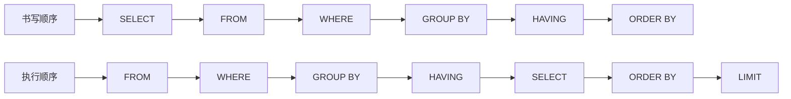
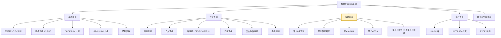
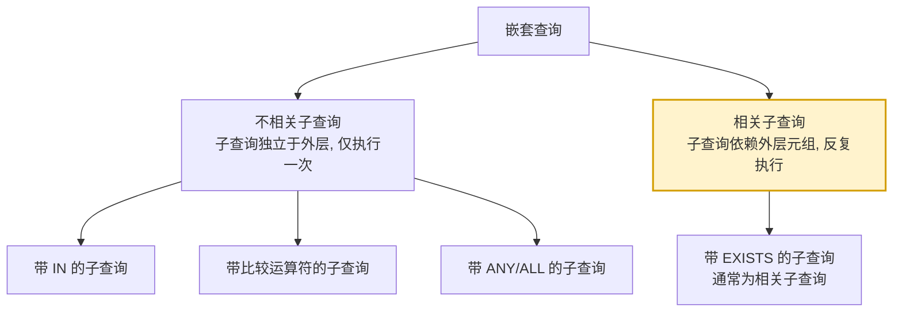
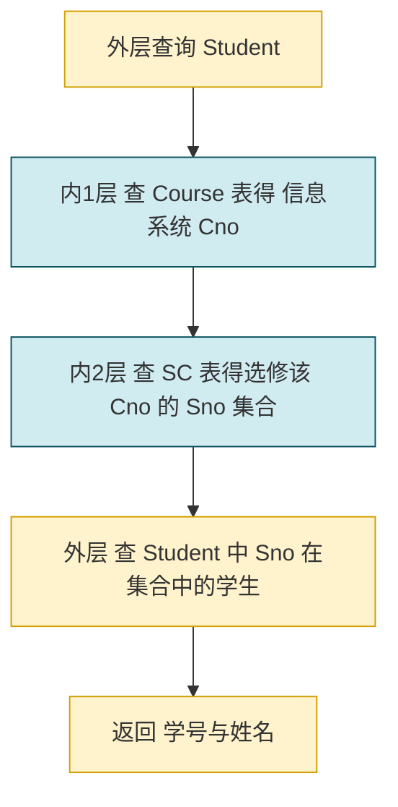

# 3.3 数据查询

数据查询是 SQL 的核心功能，也是数据库使用中最频繁、最复杂的操作。本节解决的问题是：给定一组表，如何用 `SELECT` 语句按各种方式从表中提取所需数据。它是关系代数（选择、投影、连接、笛卡尔积、除、并、交、差）的工程化实现。本节按"单表查询 → 连接查询 → 嵌套查询 → 集合查询 → 派生表查询"五条主线展开。

> [!info] 示例数据库
> 本节所有示例均使用 [[3.2 数据定义]] 中定义的 Student / Course / SC 三表，数据见该节。

## SELECT 语句的一般格式

> [!definition] SELECT 语句语法
> ```sql
> SELECT [ALL|DISTINCT] <目标列表达式> [, <目标列表达式>] ...
> FROM   <表名或视图名> [AS <别名>] [, <表名或视图名> [AS <别名>]] ...
> [WHERE <条件表达式>]
> [GROUP BY <列名1> [HAVING <条件表达式>]]
> [ORDER BY <列名2> [ASC|DESC]];
> ```
> 含义：从 `FROM` 指定的表/视图出发，按 `WHERE` 选择满足条件的元组，按 `GROUP BY` 分组并经 `HAVING` 筛选，按 `SELECT` 指定列投影输出，最后由 `ORDER BY` 排序。

### 子句执行顺序与书写顺序



| 顺序 | 子句 | 作用 |
| ---- | ---- | ---- |
| 1 | `FROM` | 确定数据来源（表、视图、派生表） |
| 2 | `WHERE` | 元组级过滤 |
| 3 | `GROUP BY` | 按列分组 |
| 4 | `HAVING` | 组级过滤（可使用聚集函数） |
| 5 | `SELECT` | 投影输出列 |
| 6 | `ORDER BY` | 排序输出 |
| 7 | `LIMIT` | 限制行数（MySQL 方言） |

> [!warning] WHERE 与 HAVING 的关键区别
> - `WHERE` 作用于**元组**，在分组前过滤，**不能**使用聚集函数；
> - `HAVING` 作用于**分组**，在分组后过滤，**可以**使用聚集函数。

## 查询分类树



## 单表查询

单表查询仅涉及一个表，是最基本的查询形式。

### 1. 选择表中的若干列（投影）

#### 查询指定列

```sql
-- 例1：查询全体学生的学号与姓名
SELECT Sno, Sname FROM Student;
```

#### 查询全部列

```sql
-- 例2：查询全体学生的详细记录
SELECT * FROM Student;
```

#### 查询经过计算的值

```sql
-- 例3：查询全体学生姓名及其出生年份
SELECT Sname, 2026 - Sage AS BirthYear FROM Student;
-- 结果列名默认为表达式, 用 AS 指定别名 BirthYear
```

> [!tip] 别名
> 用 `AS` 给列或表起别名，`AS` 关键字可省略：`Sname 姓名`。别名含空格时需用反引号（MySQL）或双引号包裹。

#### 消除取值重复的行（DISTINCT）

```sql
-- 例4：查询选修了课程的学生学号（不去重）
SELECT Sno FROM SC;
-- 结果含重复学号

-- 例5：查询选修了课程的学生学号（去重）
SELECT DISTINCT Sno FROM SC;
-- DISTINCT 必须紧跟 SELECT 之后, 默认为 ALL 可省略
```

### 2. 选择表中的若干元组（选择）

`WHERE` 子句常用的查询条件如下表：

| 查询条件 | 谓词 |
| -------- | ---- |
| 比较 | `=`, `>`, `<`, `>=`, `<=`, `!=`, `<>`, `!>`, `!<`；`NOT + 比较运算符` |
| 确定范围 | `BETWEEN AND`、`NOT BETWEEN AND` |
| 确定集合 | `IN`、`NOT IN` |
| 字符匹配 | `LIKE`、`NOT LIKE` |
| 空值 | `IS NULL`、`IS NOT NULL` |
| 多重条件 | `AND`、`OR`、`NOT` |

#### 比较大小

```sql
-- 例6：查询计算机科学系(CS)全体学生名单
SELECT Sname FROM Student WHERE Sdept = 'CS';
-- 结果: 李勇, 陈玲

-- 例7：查询所有年龄在20岁以下的学生姓名及其年龄
SELECT Sname, Sage FROM Student WHERE Sage < 20;
```

#### 确定范围（BETWEEN）

```sql
-- 例8：查询年龄在18~20岁(含)之间的学生姓名、系别和年龄
SELECT Sname, Sdept, Sage
FROM Student
WHERE Sage BETWEEN 18 AND 20;

-- 例9：查询年龄不在18~20岁之间的学生姓名、系别和年龄
SELECT Sname, Sdept, Sage
FROM Student
WHERE Sage NOT BETWEEN 18 AND 20;
```

> [!warning] BETWEEN 是闭区间
> `BETWEEN a AND b` 含两端点，等价于 `>= a AND <= b`。

#### 确定集合（IN）

```sql
-- 例10：查询计算机系(CS)、数学系(MA)和信息系(IS)学生的姓名和性别
SELECT Sname, Ssex
FROM Student
WHERE Sdept IN ('CS', 'MA', 'IS');

-- 例11：查询既不是计算机系、数学系、也不是信息系的学生
SELECT Sname, Ssex
FROM Student
WHERE Sdept NOT IN ('CS', 'MA', 'IS');
```

#### 字符匹配（LIKE）

> [!definition] LIKE 通配符
> ```sql
> [NOT] LIKE '<匹配串>' [ESCAPE '<换码字符>']
> ```
> - `%`：匹配**任意长度**（可为 0）的字符串；
> - `_`：匹配**任意单个**字符；
> - 若要匹配 `%` 或 `_` 本身，使用 `ESCAPE` 转义。

```sql
-- 例12：查询学号以 2024 开头的学生
SELECT * FROM Student WHERE Sno LIKE '2024%';

-- 例13：查询姓"刘"且全名为2个汉字的学生
SELECT Sname, Sno, Ssex
FROM Student
WHERE Sname LIKE '刘_';

-- 例14：查询课程名中包含"数据"两字的课程
SELECT Cno, Cname FROM Course WHERE Cname LIKE '%数据%';
-- 结果: 数据库, 数据结构, 数据处理

-- 例15：查询以 DB_ 开头且第三字符为任意字符的课程名(使用 ESCAPE 转义 _)
SELECT Cname FROM Course WHERE Cname LIKE 'DB\_%' ESCAPE '\';
```

> [!warning] NULL 不能用 = 比较
> 空值判断必须用 `IS NULL` / `IS NOT NULL`，**不能**写成 `= NULL`：
> ```sql
> -- 错误: SELECT * FROM Course WHERE Cpno = NULL;
> SELECT * FROM Course WHERE Cpno IS NULL;   -- 正确: 查无先行课的课程
> SELECT * FROM Course WHERE Cpno IS NOT NULL;
> ```

#### 多重条件（AND / OR）

```sql
-- 例16：查询计算机系年龄在20岁以下的学生姓名
SELECT Sname
FROM Student
WHERE Sdept = 'CS' AND Sage < 20;

-- 例17：查询计算机系或年龄在20岁以下的学生
SELECT Sname
FROM Student
WHERE Sdept = 'CS' OR Sage < 20;
```

> [!tip] AND 优先级高于 OR
> `A AND B OR C` 等价于 `(A AND B) OR C`，需用括号改变优先级。

### 3. ORDER BY 子句（排序）

```sql
-- 例18：查询选修了3号课程的学生学号及成绩, 按成绩降序排列
SELECT Sno, Grade
FROM SC
WHERE Cno = '3'
ORDER BY Grade DESC;
-- 结果: 2024001(88), 2024002(80)

-- 例19：查询全体学生情况, 按所在系升序, 同系按年龄降序
SELECT * FROM Student
ORDER BY Sdept ASC, Sage DESC;
```

| 排序方式 | 关键字 | 默认 |
| -------- | ------ | ---- |
| 升序 | `ASC` | 默认值，可省略 |
| 降序 | `DESC` | 须显式指定 |

> [!warning] ORDER BY 不能出现在视图定义中（部分 DBMS 限制）
> 标准 SQL 限制 `ORDER BY` 在视图/派生表中需配合 `LIMIT` 使用。MySQL 8.0 已允许视图内 `ORDER BY`，但行为依赖实现。

### 4. 聚集函数（Aggregate Functions）

> [!definition] 聚集函数
> 聚集函数对一组值进行计算，返回单一值。常用于统计。

| 函数 | 含义 | 是否忽略 NULL |
| ---- | ---- | -------------- |
| `COUNT(*)` | 统计元组个数 | 不忽略 |
| `COUNT([DISTINCT] <列名>)` | 统计列值个数 | 忽略 |
| `SUM(<列名>)` | 求列值总和（数值） | 忽略 |
| `AVG(<列名>)` | 求列值平均（数值） | 忽略 |
| `MAX(<列名>)` | 求列值最大 | 忽略 |
| `MIN(<列名>)` | 求列值最小 | 忽略 |

```sql
-- 例20：查询学生总人数
SELECT COUNT(*) FROM Student;            -- 结果: 5

-- 例21：查询选修了课程的学生人数(去重)
SELECT COUNT(DISTINCT Sno) FROM SC;       -- 结果: 4

-- 例22：计算1号课程的学生平均成绩
SELECT AVG(Grade) FROM SC WHERE Cno = '1';
-- 结果: (92+78+95)/3 = 88.3333

-- 例23：查询1号课程的最高分与最低分
SELECT MAX(Grade), MIN(Grade) FROM SC WHERE Cno = '1';

-- 例24：查询2024001号学生选修课程的总学分
SELECT SUM(Ccredit)
FROM SC JOIN Course ON SC.Cno = Course.Cno
WHERE Sno = '2024001';
```

> [!warning] COUNT(*) vs COUNT(列名)
> - `COUNT(*)` 统计**所有行**（含 NULL）；
> - `COUNT(列名)` 仅统计该列**非空**值个数。
> 注意区分。

### 5. GROUP BY 与 HAVING

> [!definition] GROUP BY
> `GROUP BY` 子句按一列或多列的值分组，使聚集函数分别作用于每组。HAVING 对分组后的结果施加条件。

```sql
-- 例25：求各个课程号及相应的选课人数
SELECT Cno, COUNT(Sno)
FROM SC
GROUP BY Cno;
/*
结果:
Cno | COUNT(Sno)
1   | 3
2   | 2
3   | 2
4   | 1
*/

-- 例26：查询选修了3门以上课程的学生学号
SELECT Sno
FROM SC
GROUP BY Sno
HAVING COUNT(*) > 3;
```

```sql
-- 例27：查询平均成绩大于等于85分的学生学号和平均成绩
SELECT Sno, AVG(Grade)
FROM SC
GROUP BY Sno
HAVING AVG(Grade) >= 85;
/*
结果:
Sno     | AVG(Grade)
2024001 | 88.3333
2024002 | 85.0000
2024004 | 82.5000  -- 不满足, 被过滤
*/
```

> [!warning] WHERE 与 HAVING 的对比（高频考点）
> | 子句 | 作用对象 | 执行时机 | 能否用聚集函数 |
> | ---- | -------- | -------- | -------------- |
> | `WHERE` | 元组 | 分组前 | 否 |
> | `HAVING` | 分组 | 分组后 | 是 |
>
> 例：`SELECT Sno FROM SC WHERE Grade >= 80 GROUP BY Sno HAVING COUNT(*) >= 2`
> 含义：先按 `WHERE` 过滤成绩 ≥80 的选课记录，再按学号分组，最后保留选课数 ≥2 的学号。

## 连接查询

涉及多个表的查询称为连接查询，是 SQL 对关系代数**连接运算**的实现。

### 1. 等值连接与非等值连接

> [!definition] 连接条件
> 连接查询的 `WHERE` 子句中用来连接两个表的条件称为**连接条件**或**连接谓词**，一般格式：
> ```sql
> [<表名1>.]<列名1> <比较运算符> [<表名2>.]<列名2>
> ```
> 当比较运算符为 `=` 时称为**等值连接**，其他为非等值连接。

```sql
-- 例28：查询每个学生及其选修课程的情况
SELECT Student.*, SC.*
FROM Student, SC
WHERE Student.Sno = SC.Sno;
-- 注: 这是隐式连接写法, 也可用 JOIN 显式写法
```

> [!tip] 推荐使用显式 JOIN
> 现代 SQL 推荐使用 `INNER JOIN ... ON` 显式写法，语义更清晰，且与外连接写法一致：
> ```sql
> SELECT Student.*, SC.*
> FROM Student INNER JOIN SC ON Student.Sno = SC.Sno;
> ```

### 2. 自然连接

> [!definition] 自然连接
> 若等值连接的连接字段同名，并在结果中**去掉重复的列**，则称为**自然连接**。

```sql
-- 例29：用自然连接查询每个学生及其选课情况(去重复 Sno 列)
SELECT Student.Sno, Sname, Ssex, Sage, Sdept, Cno, Grade
FROM Student JOIN SC ON Student.Sno = SC.Sno;
```

### 3. 自身连接

> [!definition] 自身连接
> 一个表与其自己进行连接，称为**自身连接**。需为同一表取不同**别名**以区分。

```sql
-- 例30：查询每一门课的间接先修课(即先修课的先修课)
-- Course.Cpno 是直接先行课, 再以 Cpno 作 Cno 查找其先行课
SELECT FIRST.Cno, SECOND.Cpno AS PreCpno
FROM Course FIRST, Course SECOND
WHERE FIRST.Cpno = SECOND.Cno;
/*
结果:
Cno | PreCpno
1   | 7    (1的直接先修5, 5的先修7)
3   | 7    (3的直接先修1, 1的先修5... 实际结果依赖数据)
5   | 6
7   | NULL
*/
```

### 4. 外连接

> [!definition] 外连接
> 普通连接（内连接）只输出匹配的元组；**外连接**还输出不匹配的元组，缺失部分以 `NULL` 填充。

| 类型 | 含义 |
| ---- | ---- |
| **左外连接** `LEFT [OUTER] JOIN` | 保留左表全部行，右表无匹配填 NULL |
| **右外连接** `RIGHT [OUTER] JOIN` | 保留右表全部行，左表无匹配填 NULL |
| **全外连接** `FULL [OUTER] JOIN` | 保留两表全部行，缺失填 NULL |

```sql
-- 例31：查询每个学生及其选课情况(包括未选课学生)
SELECT Student.Sno, Sname, Cno, Grade
FROM Student LEFT JOIN SC ON Student.Sno = SC.Sno;
-- 2024005 陈玲因未选课, Cno 和 Grade 为 NULL

-- 例32：右外连接
SELECT Sno, Cno, Grade, Cname
FROM SC RIGHT JOIN Course ON SC.Cno = Course.Cno;
-- 未被选修的课程其 Sno、Grade 为 NULL
```

> [!warning] MySQL 不支持 FULL JOIN
> MySQL 8.0 不直接支持 `FULL OUTER JOIN`，可用 `LEFT JOIN UNION RIGHT JOIN` 模拟：
> ```sql
> SELECT a.*, b.* FROM a LEFT JOIN b ON a.id=b.id
> UNION
> SELECT a.*, b.* FROM a RIGHT JOIN b ON a.id=b.id;
> ```

### 5. 复合条件连接

`WHERE` 子句中含多个连接条件或其他条件时，称为复合条件连接。

```sql
-- 例33：查询选修2号课程且成绩在90分以上的所有学生
SELECT Student.Sno, Sname
FROM Student JOIN SC ON Student.Sno = SC.Sno
WHERE SC.Cno = '2' AND SC.Grade > 90;
```

### 6. 多表连接

两个以上表的连接。

```sql
-- 例34：查询每个学生的学号、姓名、选修课程名及成绩(三表连接)
SELECT Student.Sno, Sname, Cname, Grade
FROM Student
    JOIN SC   ON Student.Sno = SC.Sno
    JOIN Course ON SC.Cno = Course.Cno;
/*
结果:
Sno     | Sname | Cname   | Grade
2024001 | 李勇  | 数据库  | 92
2024001 | 李勇  | 数学    | 85
2024001 | 李勇  | 信息系统| 88
2024002 | 刘晨  | 数学    | 90
2024002 | 刘晨  | 信息系统| 80
2024003 | 王敏  | 数据库  | 78
2024004 | 张立  | 数据库  | 95
2024004 | 张立  | 操作系统| 70
*/
```

## 嵌套查询

> [!definition] 嵌套查询
> 在 SQL 语句中嵌入一个 `SELECT-FROM-WHERE` 子块称为**子查询**或**嵌套查询**。包含子查询的语句称为父查询或外层查询。



> [!tip] 子查询的使用位置
> - 不能用于 `GROUP BY`；
> - 可用于 `SELECT` 目标列（标量子查询）、`FROM`（派生表）、`WHERE`/`HAVING`（最常见）。

### 1. 带 IN 的子查询

`IN` 子查询常用于**集合成员资格**判断，子查询返回一个集合，外层查询判断某值是否在集合中。

```sql
-- 例35：查询与"刘晨"在同一个系学习的学生
-- 步骤1(子查询): 确定"刘晨"所在系
SELECT Sdept FROM Student WHERE Sname = '刘晨';   -- 结果: IS
-- 步骤2(外查询): 查询 IS 系的学生
SELECT Sno, Sname, Sdept
FROM Student
WHERE Sdept IN (SELECT Sdept FROM Student WHERE Sname = '刘晨');
/*
结果: 学号, 姓名, 系
2024002 刘晨 IS
2024004 张立 IS
*/
```

```sql
-- 例36：查询选修了课程名为"信息系统"的学生学号和姓名
SELECT Sno, Sname
FROM Student
WHERE Sno IN (
    SELECT Sno FROM SC
    WHERE Cno IN (
        SELECT Cno FROM Course WHERE Cname = '信息系统'
    )
);
-- 这是典型三层嵌套, 层层推进
-- 结果: 2024001 李勇, 2024002 刘晨
```

### 2. 带有比较运算符的子查询

当能确定子查询返回**单值**时，可用 `=`、`>`、`<` 等比较运算符。

```sql
-- 例37：查询与"刘晨"同系学生(子查询返回单值)
SELECT Sno, Sname, Sdept
FROM Student
WHERE Sdept = (SELECT Sdept FROM Student WHERE Sname = '刘晨');

-- 例38：查询每个学生超过他选修课程平均成绩的课程号
-- 相关子查询: 子查询依赖外层 Sno
SELECT Sno, Cno
FROM SC x
WHERE Grade >= (
    SELECT AVG(Grade)
    FROM SC y
    WHERE y.Sno = x.Sno
);
/*
对每个学生计算其平均成绩, 再筛选其高于平均的选课:
2024001 平均 88.33, 课程3(88)不满足, 课程1(92)满足, 课程2(85)不满足
*/
```

### 3. 带有 ANY 或 ALL 的子查询

子查询返回多值时，配合 `ANY` 或 `ALL` 使用比较运算符。

| 谓词 | 语义 | 等价关系 |
| ---- | ---- | -------- |
| `> ANY` | 大于子查询结果中的某个值（即大于最小值） | `> MIN(子查询)` |
| `> ALL` | 大于子查询结果中的所有值（即大于最大值） | `> MAX(子查询)` |
| `< ANY` | 小于某个值（即小于最大值） | `< MAX(子查询)` |
| `< ALL` | 小于所有值（即小于最小值） | `< MIN(子查询)` |
| `= ANY` | 等于某个值 | `IN` |
| `<> ALL` | 不等于任何值 | `NOT IN` |

```sql
-- 例39：查询非计算机科学系中比计算机科学系任意一个学生年龄小的学生姓名和年龄
SELECT Sname, Sage
FROM Student
WHERE Sdept <> 'CS'
  AND Sage < ANY (SELECT Sage FROM Student WHERE Sdept = 'CS');
-- 子查询返回 CS 系年龄集合(20, 20), ANY 即小于其中任一
-- 等价于: Sage < MAX(...)

-- 例40：查询非计算机科学系中比计算机科学系所有学生年龄都小的学生姓名和年龄
SELECT Sname, Sage
FROM Student
WHERE Sdept <> 'CS'
  AND Sage < ALL (SELECT Sage FROM Student WHERE Sdept = 'CS');
-- 等价于: Sage < MIN(...)
```

> [!warning] ANY/ALL 与聚集函数等价转换
> `> ANY` ⟺ `> (SELECT MIN(...) ...)`；`> ALL` ⟺ `> (SELECT MAX(...) ...)`。后者效率通常更高，DBMS 优化器更易处理。

### 4. 带 EXISTS 的子查询

> [!definition] EXISTS 谓词
> `EXISTS` 子查询不返回任何数据，只产生逻辑真值 `TRUE` / `FALSE`：
> - 若子查询结果**非空**，返回 `TRUE`；
> - 若子查询结果为**空**，返回 `FALSE`。
> `NOT EXISTS` 与之相反。

`EXISTS` 子查询的目标列通常用 `SELECT *`，因为列名无关紧要，只关心是否有行返回。它常是**相关子查询**。

```sql
-- 例41：查询所有选修了1号课程的学生姓名
SELECT Sname
FROM Student
WHERE EXISTS (
    SELECT * FROM SC
    WHERE Sno = Student.Sno AND Cno = '1'
);
-- 子查询依赖外层 Student.Sno, 对每个外层学生判断是否选了1号课
-- 结果: 李勇, 王敏, 张立
```

#### 用 NOT EXISTS 实现全称量化

SQL 中没有 `FORALL` 全称量词，但可用 `NOT EXISTS` 双重否定表示"**不存在不...的**"。

```sql
-- 例42: 查询选修了全部课程的学生姓名(关系代数的"除"运算)
-- 逻辑: 不存在一门课程是该学生没有选修的
SELECT Sname
FROM Student
WHERE NOT EXISTS (
    SELECT * FROM Course
    WHERE NOT EXISTS (
        SELECT * FROM SC
        WHERE Sno = Student.Sno AND Cno = Course.Cno
    )
);
```

> [!example] 全称量化的转换逻辑
> "选修全部课程" ⟺ "不存在一门课程他没选"。
> - 外层 `NOT EXISTS`：判断"不存在"；
> - 中间查询所有课程；
> - 内层 `NOT EXISTS`：判断"学生 S 没选修课程 C"。
> 整体含义：不存在这样一门课 C，使得 S 没选修 C。
> 这是 SQL 中**最难但最重要**的查询模式之一，对应关系代数的除运算。详见 [[2.4 关系代数#除运算]]。

```sql
-- 例43：查询至少选修了学生2024002选修的全部课程的学生学号
-- 逻辑: 不存在2024002选过而该学生没选的课
SELECT Sno
FROM Student S
WHERE Sno <> '2024002' AND NOT EXISTS (
    SELECT * FROM SC X
    WHERE Sno = '2024002' AND NOT EXISTS (
        SELECT * FROM SC Y
        WHERE Y.Sno = S.Sno AND Y.Cno = X.Cno
    )
);
```

### 相关子查询 vs 不相关子查询

| 类型 | 子查询是否依赖外层 | 执行次数 | 示例 |
| ---- | ---------------- | -------- | ---- |
| **不相关子查询** | 否 | 1 次 | `IN`/`ANY`/`ALL` 多数情况 |
| **相关子查询** | 是 | 每个外层元组 1 次 | `EXISTS`、例 38 |

> [!tip] 区分技巧
> 看子查询是否引用了外层查询的列。引用则为相关子查询，否则为不相关子查询。相关子查询因反复执行，效率可能较低，但 DBMS 优化器可能改写为连接。

## 集合查询

> [!definition] 集合查询
> 多个 `SELECT` 语句的结果可以进行集合运算：
> - **并** `UNION`（自动去重）/ `UNION ALL`（不去重）
> - **交** `INTERSECT`（自动去重）/ `INTERSECT ALL`
> - **差** `EXCEPT`（自动去重）/ `EXCEPT ALL`

各 `SELECT` 语句的**列数与对应列类型必须兼容**，结果列名取第一个 `SELECT` 的列名。

```sql
-- 例44：查询计算机科学系的学生及年龄不大于19岁的学生(并)
SELECT * FROM Student WHERE Sdept = 'CS'
UNION
SELECT * FROM Student WHERE Sage <= 19;
/*
结果: 李勇(20,CS), 陈玲(20,CS), 刘晨(19,IS), 王敏(18,MA)
重复的李勇去重(若用 UNION ALL 则保留重复)
*/
```

```sql
-- 例45：查询选修了1号课程或2号课程的学生学号(并)
SELECT Sno FROM SC WHERE Cno = '1'
UNION
SELECT Sno FROM SC WHERE Cno = '2';

-- 例46：查询既选修了1号课程又选修了2号课程的学生学号(交)
SELECT Sno FROM SC WHERE Cno = '1'
INTERSECT
SELECT Sno FROM SC WHERE Cno = '2';
-- 结果: 2024001 (李勇两门都选)

-- 例47：查询选修了1号课程但没选修2号课程的学生学号(差)
SELECT Sno FROM SC WHERE Cno = '1'
EXCEPT
SELECT Sno FROM SC WHERE Cno = '2';
-- 结果: 2024003 王敏, 2024004 张立
```

> [!warning] MySQL 8.0 集合查询支持情况
> - MySQL **支持** `UNION` / `UNION ALL`；
> - MySQL **不支持** `INTERSECT` 和 `EXCEPT`（直至 8.0 仍未实现，可改用 `IN` / `NOT IN` 或 `JOIN` 模拟）：
> ```sql
> -- 用 INNER JOIN 模拟 INTERSECT
> SELECT DISTINCT a.Sno
> FROM (SELECT Sno FROM SC WHERE Cno='1') a
> INNER JOIN (SELECT Sno FROM SC WHERE Cno='2') b ON a.Sno = b.Sno;
>
> -- 用 NOT IN 模拟 EXCEPT
> SELECT DISTINCT Sno FROM SC WHERE Cno='1'
>   AND Sno NOT IN (SELECT Sno FROM SC WHERE Cno='2');
> ```

> [!note] 集合查询中的 ORDER BY
> `ORDER BY` 只能放在最后一条 `SELECT` 后，作用于整体结果，且只能用列名（不能用列别名之外的表达式）。

## 基于派生表查询

子查询可以出现在 `FROM` 子句中，结果作为一个**临时表**（派生表）参与查询。派生表必须**起别名**。

```sql
-- 例48：找出每个学生超过他自己平均成绩的课程号
-- 用派生表先求每个学生的平均成绩, 再与 SC 连接
SELECT Sno, Cno
FROM SC, (
    SELECT Sno, AVG(Grade) AS AvgG
    FROM SC
    GROUP BY Sno
) AS AvgSC
WHERE SC.Sno = AvgSC.Sno AND SC.Grade >= AvgSC.AvgG;
```

```sql
-- 例49：查询所有选修了1号课程的学生姓名(用派生表)
SELECT Sname
FROM Student JOIN (SELECT Sno FROM SC WHERE Cno = '1') AS T
     ON Student.Sno = T.Sno;
```

> [!tip] 派生表 vs 视图
> 派生表是查询中**临时构造**的子查询，仅当次有效；视图是**持久化**的命名查询，可被多查询复用。详见 [[3.5 视图]]。

## 查询执行流程示例

以三层嵌套查询（例36）为例，其执行流程如下：



## 小结

- `SELECT` 语句是 SQL 的核心，子句执行顺序为 `FROM → WHERE → GROUP BY → HAVING → SELECT → ORDER BY`。
- 单表查询覆盖列选择、`WHERE` 过滤、`ORDER BY`、`GROUP BY`、聚集函数；区分 `WHERE`（元组级）与 `HAVING`（组级）。
- 连接查询含等值、自然、自身、外、复合与多表连接；外连接分左/右/全三类。
- 嵌套查询按谓词分 `IN`、比较、`ANY/ALL`、`EXISTS` 四类，按依赖关系分相关与不相关子查询。
- `NOT EXISTS` 的双重否定可实现全称量化（"全部"语义），对应关系代数除运算。
- 集合查询 `UNION`/`INTERSECT`/`EXCEPT` 要求列数与类型兼容；MySQL 不支持 `INTERSECT`/`EXCEPT`。
- 派生表是 `FROM` 子句中的临时子查询，须起别名，与视图区别于持久性。

## 关联

- 先修：[[3.2 数据定义]]（Student/Course/SC 表）、[[2.4 关系代数]]（连接、除等运算）、[[2.3 关系的完整性]]
- 后续：[[3.4 数据更新]]（INSERT INTO ... SELECT 即数据查询的应用）、[[3.5 视图]]（视图查询即视图消解）
- 优化：[[MOC - 第11章]]（查询优化器如何选择执行计划）
- 习题：[[MOC - 第3章习题]]
- 本章导航：[[MOC - 第3章]]
