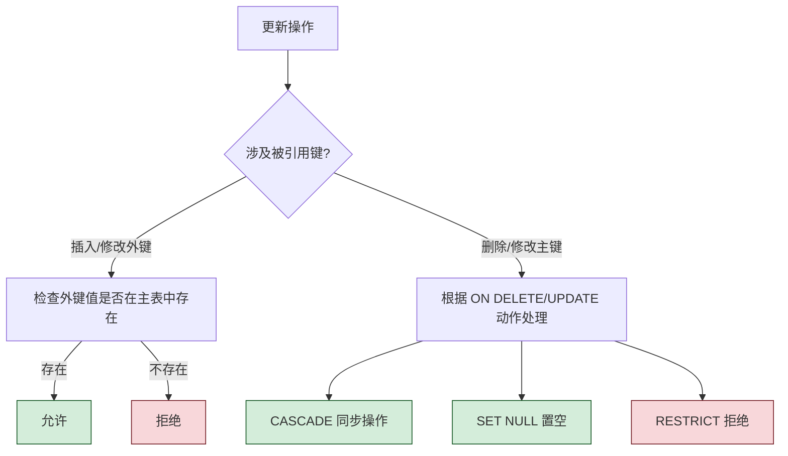
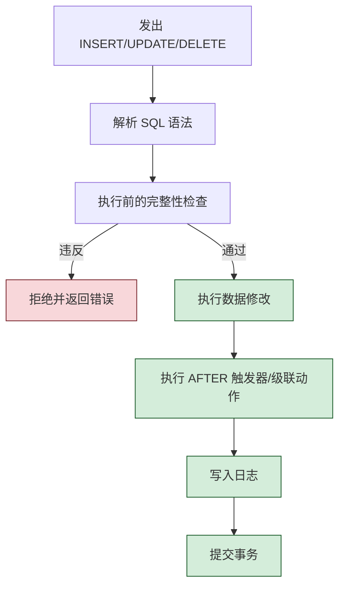

# 3.4 数据更新

数据更新解决的问题是：在表结构已定义的情况下，如何向表中**插入**新数据、**修改**已有数据、**删除**数据，并保证更新过程不违反 [[2.3 关系的完整性|完整性约束]]。SQL 提供三条语句：`INSERT`、`UPDATE`、`DELETE`。

> [!info] 示例数据库
> 沿用 [[3.2 数据定义]] 中的 Student / Course / SC 三表及其数据。

## 插入数据（INSERT）

### 1. 插入单个元组（INSERT INTO ... VALUES）

> [!definition] 插入语法
> ```sql
> INSERT INTO <表名> [(<列名1>, <列名2>, ...)]
> VALUES (<常量1>, <常量2>, ...);
> ```
> - 列名顺序可与表定义不一致，但常量须与列名一一对应；
> - 缺省列名时按表定义顺序提供全部列值；
> - 未列出且无默认值的列为 `NULL`（必须允许 `NULL`）。

```sql
-- 例1：将一个新学生元组(学号 2024006, 姓名 王二, 男, 19, MA)插入 Student
INSERT INTO Student
VALUES ('2024006', '王二', '男', 19, 'MA');

-- 例2：插入一条选课记录, 学号 2024006, 课程号 1, 成绩暂空
INSERT INTO SC(Sno, Cno)
VALUES ('2024006', '1');
-- Grade 缺省为 NULL, 但 CHECK (Grade BETWEEN 0 AND 100) 允许 NULL
```

```sql
-- 例3：插入新学生, 部分列省略(Ssex, Sdept 缺省 NULL)
INSERT INTO Student(Sno, Sname, Sage)
VALUES ('2024007', '吴九', 20);
-- Ssex, Sdept 为 NULL, 因 Student 中未声明 NOT NULL
```

> [!warning] 违反约束会拒绝插入
> 若插入元组违反 PRIMARY KEY、FOREIGN KEY、CHECK、NOT NULL、UNIQUE 任一约束，DBMS 拒绝执行并报错：
> ```sql
> -- 例：插入学号已存在的元组会被 PRIMARY KEY 拒绝
> INSERT INTO Student VALUES ('2024001', '重复', '男', 22, 'CS');
> -- 错误: Duplicate entry '2024001' for key 'PRIMARY'
>
> -- 例：插入选课引用不存在的课程号会被外键拒绝
> INSERT INTO SC VALUES ('2024001', '99', 80);
> -- 错误: Cannot add or update a child row: a foreign key constraint fails
> ```

### 2. 插入子查询结果（INSERT INTO ... SELECT）

> [!definition] 批量插入语法
> ```sql
> INSERT INTO <表名> [(<列名1>, ...)]
> <子查询>;
> ```
> 用于将一个查询的结果整体插入另一表，常用于数据迁移、表复制、统计汇总落库。

```sql
-- 例4：对每个系求学生平均年龄, 存入新表 Dept_AvgAge(系别, 平均年龄)
-- 先建表
CREATE TABLE Dept_AvgAge(
    Sdept  VARCHAR(20),
    AvgAge DECIMAL(5,2)
);
-- 再插入: 子查询按系分组并计算平均年龄
INSERT INTO Dept_AvgAge(Sdept, AvgAge)
SELECT Sdept, AVG(Sage)
FROM Student
GROUP BY Sdept;
/*
结果(Dept_AvgAge 表内容):
Sdept | AvgAge
CS    | 20.00
IS    | 20.00
MA    | 18.00
*/
```

```sql
-- 例5：将选课成绩未及格的学生选入 Warn 表(便于预警)
CREATE TABLE Warn (Sno CHAR(7), Cno CHAR(2), Grade DECIMAL(4,1));
INSERT INTO Warn
SELECT Sno, Cno, Grade FROM SC WHERE Grade < 60;
```

> [!tip] 子查询插入是 [[3.3 数据查询]] 的应用
> `INSERT INTO ... SELECT` 把查询结果当作数据源插入，是 SQL DML 与 DQL 的结合，能实现复杂的数据加工。注意列数与类型须对应。

## 修改数据（UPDATE）

> [!definition] UPDATE 语法
> ```sql
> UPDATE <表名>
> SET <列名> = <表达式> [, <列名> = <表达式> ...]
> [WHERE <条件>];
> ```
> - 修改满足 `WHERE` 条件的所有元组；省略 `WHERE` 则修改全表（危险！）；
> - `<表达式>` 可以是常量、算式、函数，也可引用其他列。

### 1. 修改一个元组

```sql
-- 例6：将学生 2024001 的年龄改为 22 岁
UPDATE Student
SET Sage = 22
WHERE Sno = '2024001';
```

### 2. 修改多个元组

```sql
-- 例7：将所有学生年龄增加 1 岁
UPDATE Student SET Sage = Sage + 1;

-- 例8：将计算机系(CS)全体学生年龄加 1
UPDATE Student
SET Sage = Sage + 1
WHERE Sdept = 'CS';
```

### 3. 带子查询的修改

```sql
-- 例9：将计算机科学系(CS)全体学生成绩置零
UPDATE SC
SET Grade = 0
WHERE Sno IN (SELECT Sno FROM Student WHERE Sdept = 'CS');

-- 例10：将所有低于平均成绩的选课成绩提升 5 分
UPDATE SC
SET Grade = Grade + 5
WHERE Grade < (SELECT AVG(Grade) FROM SC);
```

> [!warning] MySQL 限制：不能直接更新子查询引用的表
> MySQL 不允许在 `UPDATE` 的子查询中直接引用被更新的同一表，需用派生表包裹：
> ```sql
> -- 直接写法(可能报错 Error 1093):
> UPDATE SC SET Grade = Grade + 5
>   WHERE Grade < (SELECT AVG(Grade) FROM SC);
>
> -- 用派生表绕过:
> UPDATE SC SET Grade = Grade + 5
>   WHERE Grade < (SELECT avg_g FROM (SELECT AVG(Grade) AS avg_g FROM SC) t);
> ```

### 4. 修改与约束

```sql
-- 例11：将 2024003 的性别改为 'X' (违反 CHECK 约束)
UPDATE Student SET Ssex = 'X' WHERE Sno = '2024003';
-- MySQL 8.0 默认 IGNORE 行为, 但严格模式会报错或静默置 NULL/不修改
-- 标准行为: 拒绝并报错: Check constraint ... is violated
```

> [!tip] 完整性约束在更新中的作用
> `UPDATE` 触发与 `INSERT` 类似的约束检查，且参照完整性上的 `ON UPDATE CASCADE / SET NULL / RESTRICT` 动作由 DBMS 自动处理。

## 删除数据（DELETE）

> [!definition] DELETE 语法
> ```sql
> DELETE FROM <表名>
> [WHERE <条件>];
> ```
> - 删除满足 `WHERE` 条件的元组；省略 `WHERE` 删除全表数据（**保留表结构**，与 `DROP TABLE` 不同）；
> - `DELETE` 仅删数据，表定义与索引仍保留。

### 1. 删除一个元组

```sql
-- 例12：删除学号为 2024006 的学生记录
DELETE FROM Student WHERE Sno = '2024006';
```

> [!warning] 外键级联删除的连锁效应
> 由于 SC 表定义了 `FOREIGN KEY (Sno) REFERENCES Student(Sno) ON DELETE CASCADE`，删除 Student 中某学生时，SC 表中其所有选课记录会被自动级联删除。这是参照完整性的体现，须谨慎使用。

### 2. 删除多个元组

```sql
-- 例13：删除所有学生的选课记录(注意仅数据)
DELETE FROM SC;

-- 例14：删除计算机系(CS)学生的所有选课记录
DELETE FROM SC
WHERE Sno IN (SELECT Sno FROM Student WHERE Sdept = 'CS');
```

### 3. 带子查询的删除

```sql
-- 例15：删除成绩低于 60 分的选课记录
DELETE FROM SC WHERE Grade < 60;

-- 例16：删除选修人数少于 2 人的课程(从 Course 表删除, 需考虑外键)
-- 直接删会因 SC 引用而失败(RESTRICT 默认)
DELETE FROM Course
WHERE Cno IN (
    SELECT Cno FROM (
        SELECT Cno FROM SC GROUP BY Cno HAVING COUNT(*) < 2
    ) t
);
```

## 更新操作与完整性约束的关系

更新操作（`INSERT` / `UPDATE` / `DELETE`）必须维护 [[2.3 关系的完整性|关系完整性]]。DBMS 在每次更新前自动检查，违反则拒绝：

| 完整性类型 | 触发更新的检查 | 典型违反情形 |
| ---------- | -------------- | ------------ |
| **实体完整性** | 主键非空、唯一 | 插入重复主键；删除主键为某值后又被引用 |
| **参照完整性** | 外键引用合法 | 插入/更新外键引用不存在的主键值；删除被引用的主键行 |
| **用户定义完整性** | CHECK/NOT NULL/UNIQUE | 插入 NULL 到非空列；插入违反 CHECK 的值 |

### 参照完整性的处理策略



> [!example] 级联与限制的对比示例
> 假设 SC 表对 Student 的外键定义为 `ON DELETE CASCADE`，对 Course 为默认 `RESTRICT`：
>
> ```sql
> -- (1) 删除 Student 中 2024001 → SC 中其选课被自动删除(级联)
> DELETE FROM Student WHERE Sno = '2024001';
> -- (2) 删除 Course 中 1 号课程 → 因 SC 引用, 被拒绝(RESTRICT)
> DELETE FROM Course WHERE Cno = '1';
> -- 错误: Cannot delete or update a parent row
> ```
> 若需删除被引用课程，必须先删除或重新指派其所有选课记录。

### 完整性约束小结表

| 操作 | 主键约束 | 外键约束 | CHECK 约束 | NOT NULL | UNIQUE |
| ---- | -------- | -------- | ---------- | -------- | ------ |
| INSERT | 检查主键非空唯一 | 检查外键值存在或为空 | 检查布尔为真 | 检查非空 | 检查唯一 |
| UPDATE | 同上（若改主键） | 同上（若改外键）+ 级联动作 | 同上 | 同上 | 同上 |
| DELETE | 一般不直接检查 | 若被引用则按 ON DELETE 动作 | 一般不检查 | 一般不检查 | 一般不检查 |

> [!warning] 关于 NULL 的特殊处理
> - 主键列**不允许 NULL**（实体完整性要求）；
> - 外键列允许 NULL，表示"未引用"；
> - `CHECK` 中若列值为 NULL，结果视为 UNKNOWN，标准 SQL 中 UNKNOWN 视为通过（不违反）。

## 更新操作的执行流程



## 小结

- 数据更新三语句：`INSERT INTO ... VALUES` / `INSERT INTO ... SELECT`、`UPDATE ... SET ... WHERE`、`DELETE FROM ... WHERE`。
- 插入数据可插入单条或批量子查询结果，违反约束即拒绝。
- 修改数据修改满足条件的元组，省略 `WHERE` 修改全表；可携带子查询（MySQL 限制需用派生表）。
- 删除数据保留表结构，与 `DROP TABLE` 区分；级联删除会牵连子表数据。
- 三类更新均受完整性约束约束：实体（主键）、参照（外键，含级联动作）、用户定义（CHECK/NOT NULL/UNIQUE）。
- 参照完整性的 `ON DELETE/UPDATE` 动作分 `CASCADE`、`SET NULL`、`RESTRICT`/`NO ACTION`、`SET DEFAULT` 四类。

## 关联

- 先修：[[3.2 数据定义]]（约束定义来源）、[[2.3 关系的完整性]]
- 关联：[[3.3 数据查询]]（INSERT INTO ... SELECT 依赖查询能力）、[[3.5 视图]]（视图可更新性）
- 完整性扩展：[[MOC - 第5章]]（触发器实现复杂完整性）
- 本章导航：[[MOC - 第3章]]
