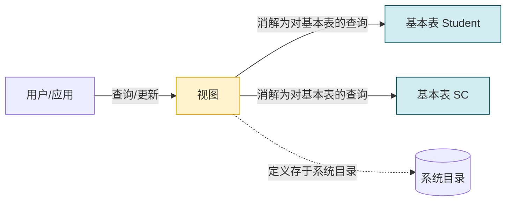
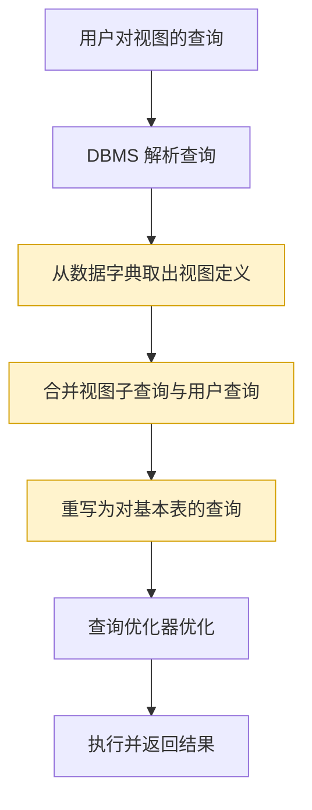
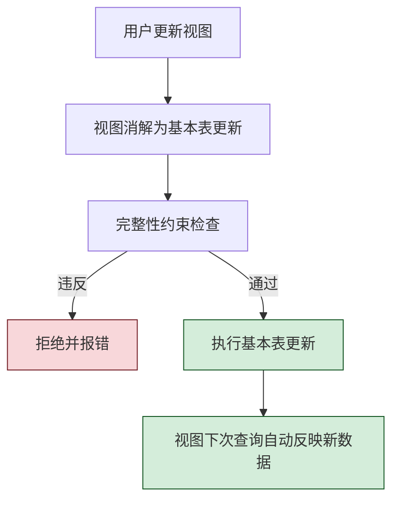
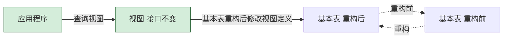

# 3.5 视图

视图（View）解决的问题是：在不复制底层数据的前提下，为不同用户、不同应用提供**多角度**的、**安全**的、**逻辑独立**的数据访问方式。它是一张"虚表"——其结构与数据来自基本表，但仅保存定义。本节讨论视图的定义、删除、查询、更新以及它的作用。

> [!info] 示例数据库
> 沿用 [[3.2 数据定义]] 中的 Student / Course / SC 三表及其数据。

## 视图的概念

> [!definition] 视图
> **视图**是从一个或几个基本表（或视图）导出的表。它本身不独立存储在数据库中，数据库中只存放视图的**定义**，不存放视图对应的**数据**，这些数据仍存放在导出视图的基本表中。因此视图是一张**虚表**。

视图与基本表的关键差异：

| 方面 | 基本表 | 视图 |
| ---- | ------ | ---- |
| 数据存储 | 独立存储，占物理空间 | 不独立存储，仅存定义 |
| 数据来源 | 用户录入 | 由基本表导出 |
| 是否实表 | 是（实表） | 否（虚表） |
| 占用空间 | 占用 | 几乎不占用 |
| 可更新性 | 总是可更新 | 视情况而定 |



## 定义视图（CREATE VIEW）

> [!definition] CREATE VIEW 语法
> ```sql
> CREATE VIEW <视图名> [(<列名> [,<列名>]...)]
> AS <子查询>
> [WITH CHECK OPTION];
> ```
> - 子查询即视图的来源，可以是任意 `SELECT` 语句，但通常**不能含 `ORDER BY` 与 `DISTINCT`**（标准 SQL 限制，部分 DBMS 放宽）；
> - 列名可省略，默认取子查询列名；含表达式/聚集函数/列名冲突时**必须**显式指定列名；
> - `WITH CHECK OPTION`：对视图进行更新时，DBMS 检查更新后的元组是否满足视图定义的子查询条件，不满足则拒绝，防止"通过视图更新后该行在视图中消失"。

### 1. 行列子集视图

> [!definition] 行列子集视图
> **行列子集视图**是从一个基本表中选取若干行和若干列导出的视图，且**包含主键**。它是最简单也最重要的视图，通常**可更新**。

```sql
-- 例1：建立计算机系(CS)学生的视图
CREATE VIEW CS_Student
AS
SELECT Sno, Sname, Ssex, Sage, Sdept
FROM Student
WHERE Sdept = 'CS';
-- 视图列名继承子查询, 含 Sno 主键

-- 例2：建立 CS 系学生视图, 加 WITH CHECK OPTION
CREATE VIEW CS_Student_Check
AS
SELECT Sno, Sname, Ssex, Sage, Sdept
FROM Student
WHERE Sdept = 'CS'
WITH CHECK OPTION;
-- 此后通过此视图插入/修改的元组必须满足 Sdept='CS', 否则拒绝
```

```sql
-- 例3：基于多个表派生的视图(连接查询)
CREATE VIEW Student_Grade
AS
SELECT Student.Sno, Sname, Cname, Grade
FROM Student
    JOIN SC ON Student.Sno = SC.Sno
    JOIN Course ON SC.Cno = Course.Cno;
```

### 2. 带表达式的视图

视图中列可包含算术表达式，须显式命名列名。

```sql
-- 例4：定义反映学生出生年份的视图
CREATE VIEW BirthYear_Student(Sno, Sname, BirthYear)
AS
SELECT Sno, Sname, 2026 - Sage
FROM Student;
-- 第3列是表达式, 必须在视图名后给出列名 BirthYear
```

### 3. 分组视图

子查询含 `GROUP BY` 和聚集函数的视图，称为分组视图。

```sql
-- 例5：将学生的学号及其平均成绩定义为一个视图
CREATE VIEW S_G(Sno, Gavg)
AS
SELECT Sno, AVG(Grade)
FROM SC
GROUP BY Sno;
-- 第2列 Gavg 是聚集函数结果, 必须显式命名
```

> [!warning] 分组视图通常不可更新
> 分组视图的"行"代表一个分组而非一个基本表元组，DBMS 无法将更新映射回基本表，因此一般不可更新。

### 4. 基于视图的视图

视图可以建立在另一视图上。

```sql
-- 例6：基于 CS_Student 视图再定义 20 岁以下学生视图
CREATE VIEW CS_Student_Young
AS
SELECT Sno, Sname, Sage
FROM CS_Student
WHERE Sage < 20;
```

## 删除视图（DROP VIEW）

> [!definition] DROP VIEW 语法
> ```sql
> DROP VIEW <视图名> [CASCADE|RESTRICT];
> ```
> - `RESTRICT`：默认，仅当该视图无依赖（无其他视图依赖它）时才能删除；
> - `CASCADE`：级联删除依赖此视图的其他视图。
>
> MySQL 方言不支持 `CASCADE/RESTRICT` 关键字，删除被依赖视图会留下失效视图，需手动清理。

```sql
-- 例7：删除视图 CS_Student
DROP VIEW CS_Student RESTRICT;
-- 若有视图基于 CS_Student, 则删除失败

-- 例8：级联删除 CS_Student 及其依赖的视图
DROP VIEW CS_Student CASCADE;
```

> [!warning] 删除视图不影响基本表
> `DROP VIEW` 仅删除视图定义，不影响其依赖的基本表中的数据。但若基本表被删除，依赖它的视图将变为失效视图。

## 查询视图与视图消解

视图定义后，可像基本表一样查询。DBMS 处理视图查询时执行**视图消解（View Resolution）**。

> [!definition] 视图消解
> 视图消解的过程：DBMS 在执行视图查询时，**用视图定义中的子查询替换查询中的视图名**，将其转化为对基本表的等价查询，然后执行。
> 步骤：
> 1. 检查查询中涉及的视图、基本表是否存在；
> 2. 从数据字典取出视图定义；
> 3. 把视图定义中的子查询与用户查询合并，重写为对基本表的查询；
> 4. 执行重写后的查询。

```sql
-- 例9：查询 CS_Student 视图中年龄小于 20 岁的学生
SELECT Sno, Sname
FROM CS_Student
WHERE Sage < 20;
```

DBMS 视图消解后的等价查询：

```sql
-- 消解后等价于对基本表 Student 的查询
SELECT Sno, Sname
FROM Student
WHERE Sdept = 'CS' AND Sage < 20;
-- 视图的 WHERE 条件与查询的 WHERE 条件 AND 起来
```

### 视图消解的流程图



> [!warning] 部分情况下视图消解有限制
> 某些复杂查询（如含聚集函数的视图上再施加 `WHERE` 限制子查询列）直接消解会失效，标准 SQL 此时拒绝执行。现代 DBMS 多支持物化视图或更复杂的重写策略规避此问题。

## 更新视图

更新视图（`INSERT`/`UPDATE`/`DELETE`）通过视图修改数据，最终落实在基本表上。DBMS 同样对更新语句做视图消解。

### 可更新视图的条件

> [!definition] 可更新视图（行列子集视图可更新）
> 一个视图是**可更新**的，当且仅当它满足：
> 1. 视图来自**单一**基本表（不含连接、嵌套子查询的复杂来源）；
> 2. 视图列对应基本表的列，无表达式列、无聚集函数、无 `DISTINCT`、无 `GROUP BY`/`HAVING`；
> 3. 视图包含基本表的主键（行列子集视图），保证更新的元组能映射回基本表。
>
> **行列子集视图**是可更新的；含连接/表达式/聚集的视图通常不可更新。

### 1. 可更新视图的更新示例

```sql
-- 例10：将视图 CS_Student 中 2024001 的年龄改为 21
UPDATE CS_Student
SET Sage = 21
WHERE Sno = '2024001';
-- DBMS 消解为: UPDATE Student SET Sage=21 WHERE Sno='2024001' AND Sdept='CS'

-- 例11：向 CS_Student 视图插入新学生(必须 Sdept='CS' 才满足 WITH CHECK OPTION)
INSERT INTO CS_Student
VALUES ('2024010', '赵十', '男', 19, 'CS');
-- 实际写入基本表 Student

-- 例12：删除 CS_Student 中 2024010 号学生
DELETE FROM CS_Student WHERE Sno = '2024010';
-- 实际从 Student 表删除
```

### 2. 不可更新视图的情形

| 视图类型 | 可否更新 | 原因 |
| -------- | -------- | ---- |
| 行列子集视图 | 可更新 | 单表、含主键、无表达式 |
| 含表达式/计算列的视图 | 不可更新该列 | 无法将表达式反推回基本表 |
| 分组视图（含 GROUP BY/聚集） | 不可更新 | 一行对应一组，无法映射 |
| 多表连接视图 | 一般不可更新（部分 DBMS 允许更新来自单表的列） | 来源元组不明确 |
| 含 DISTINCT 的视图 | 不可更新 | DISTINCT 可能合并行，无法还原 |
| 含子查询的复杂视图 | 视情况而定 | 取决于子查询是否可消解 |

> [!warning] WITH CHECK OPTION 的语义
> `WITH CHECK OPTION` 限制通过视图的更新操作必须使更新后元组**仍满足视图定义的 WHERE 条件**，否则拒绝：
> ```sql
> -- 例：CS_Student_Check 视图含 WITH CHECK OPTION
> -- 通过该视图把学生所在系改为 MA 会被拒绝
> UPDATE CS_Student_Check SET Sdept = 'MA' WHERE Sno = '2024001';
> -- 错误: CHECK OPTION failed, 因修改后 Sdept 不再满足 WHERE Sdept='CS'
> ```

### 3. 视图更新的执行流程



## 视图的作用

> [!tip] 视图的核心价值
> 视图并非冗余机制，而是从不同角度、不同权限、不同逻辑层次组织数据的工具。

### 1. 简化用户操作

视图将复杂的多表连接、子查询预先封装为简单视图，用户只需对视图查询，不必每次编写复杂 SQL。

```sql
-- 复杂查询封装为视图后, 用户查询非常简单
SELECT * FROM Student_Grade WHERE Sname = '李勇';
```

### 2. 使用户能以多种角度看待同一数据

同一基本表可定义多个视图，对应不同应用或角色：
- `CS_Student` 给计算机系管理员；
- `Student_Young` 给辅导员统计年龄；
- `Student_Grade` 给教务查询成绩。

### 3. 提供逻辑独立性

> [!definition] 逻辑独立性
> 当数据库基本表结构发生变化（如重新合并/拆分、改表名），只需修改视图定义（保持视图对外不变），基于视图的应用程序无需改动，从而提供**逻辑数据独立性**。



### 4. 提供安全保护

视图可作为**安全机制**：对敏感列或行定义视图，授予用户视图权限而非基本表权限，使用户只能看到允许的部分。详见 [[MOC - 第4章]]。

```sql
-- 例：仅暴露学生姓名, 隐藏敏感列 Sage/Sdept
CREATE VIEW Student_NameOnly(Sno, Sname)
AS SELECT Sno, Sname FROM Student;

-- 授权某用户只能查询此视图, 不能访问 Student 表
-- GRANT SELECT ON Student_NameOnly TO user_a;
```

### 视图作用对照

| 作用 | 主要受益方 | 实现机制 |
| ---- | ---------- | -------- |
| 简化操作 | 终端用户、应用开发 | 封装复杂查询 |
| 多角度看待数据 | 不同业务角色 | 同一基本表派生多视图 |
| 逻辑独立性 | 应用程序 | 视图屏蔽基本表结构变化 |
| 安全保护 | 安全管理员 | 视图限制可见列/行 |

## 小结

- 视图是从一个或多个基本表（或视图）导出的**虚表**，只存定义不存数据。
- `CREATE VIEW <视图名> AS <子查询> [WITH CHECK OPTION]` 定义视图，含行列子集视图、带表达式视图、分组视图、基于视图的视图。
- 删除视图用 `DROP VIEW ... CASCADE/RESTRICT`，删除视图不影响基本表数据。
- 查询视图通过**视图消解**转化为对基本表的查询。
- 行列子集视图**可更新**；含连接、表达式、聚集、`DISTINCT` 的视图通常不可更新。
- `WITH CHECK OPTION` 限制更新必须仍满足视图条件。
- 视图作用：简化操作、多角度数据、逻辑独立性、安全保护。

## 关联

- 先修：[[3.2 数据定义]]、[[3.3 数据查询]]（子查询是视图定义基础）、[[3.4 数据更新]]
- 关联：[[2.3 关系的完整性]]（视图更新受约束）、[[MOC - 第4章]]（视图用于安全控制）
- 进阶：物化视图（Oracle、PostgreSQL 等支持，存储视图数据，提供查询加速）、[[MOC - 第11章]]（查询优化中的视图重写）
- 本章导航：[[MOC - 第3章]]
