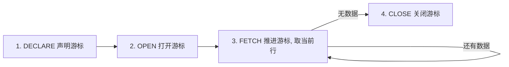
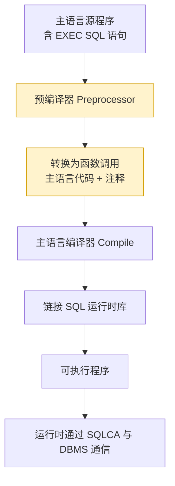

# 3.6 嵌入式SQL基础

前 5 节的 SQL 都是**交互式**使用——在终端或工具中直接键入执行。但实际应用中，SQL 通常嵌入到 C、Java、Python 等高级语言（主语言）编写的程序中使用，称为**嵌入式 SQL**。本节解决的问题是：理解 SQL 与主语言的协作机制，掌握 SQL 通信区、主变量、游标等核心概念，以及嵌入式 SQL 的处理流程。

## 嵌入式 SQL 的概念

> [!definition] 嵌入式 SQL
> **嵌入式 SQL（Embedded SQL）** 是将 SQL 语句嵌入到主语言（Host Language，如 C、COBOL、Java）源程序中，由预编译器将其转换为主语言可调用的函数或库调用，再由主语言编译器统一编译。这样既保留了 SQL 的数据处理能力，又能利用主语言的流程控制、计算、I/O 能力。

### 为什么要使用嵌入式 SQL

- SQL 是**非过程化**的，无法表达循环、条件分支、复杂计算；
- 主语言（如 C）是**过程化**的，擅长流程控制，但不擅长集合操作；
- 二者互补：用 SQL 处理数据库访问，用主语言处理业务逻辑。

### SQL 与主语言的差异（阻抗失配）

| 方面 | SQL | 主语言（C 等） |
| ---- | --- | -------------- |
| 数据模型 | 面向集合（一次一集合） | 面向记录（一次一记录） |
| 数据类型 | 与 DBMS 相关 | 与语言相关 |
| 语句返回 | 多行（结果集） | 单值或单记录 |
| 错误处理 | SQLSTATE/SQLCODE | 异常/返回码 |

> [!warning] 阻抗失配
> SQL 与主语言在数据模型与类型上的不匹配称为**阻抗失配（Impedance Mismatch）**，是嵌入式 SQL 设计的核心难点。游标机制正是为弥合"集合—记录"差异而引入。

## SQL 语句的嵌入方式

### 1. 区分 SQL 与主语言语句

所有嵌入式 SQL 语句以 `EXEC SQL` 为前缀，以分号 `;`（或主语言约定的结束符）结尾，便于预编译器识别：

```c
EXEC SQL <SQL 语句>;
```

### 2. 主语言变量在 SQL 中的使用

主语言变量在 SQL 中称为**主变量**，须以 `EXEC SQL BEGIN DECLARE SECTION` 与 `EXEC SQL END DECLARE SECTION` 包围声明，并加冒号 `:` 前缀引用：

```c
EXEC SQL BEGIN DECLARE SECTION;
    char sno[8];
    char sname[21];
    int  sage;
EXEC SQL END DECLARE SECTION;
```

## SQL 通信区（SQLCA）

> [!definition] SQLCA
> **SQL 通信区（SQL Communication Area, SQLCA）** 是 DBMS 向主语言传递 SQL 执行状态信息的结构。其中最重要的字段是 `SQLCODE`（旧）或 `SQLSTATE`（新）：
> - `SQLCODE = 0`：执行成功；
> - `SQLCODE < 0`：执行失败（错误）；
> - `SQLCODE > 0`：执行成功但有警告或异常（如无数据 `SQLCODE = 100`）。
>
> `SQLSTATE` 是 5 位字符串标准码（如 `'00000'` 表示成功，`'02000'` 表示无数据）。

主程序通过检查 `SQLCODE` 决定后续流程：

```c
EXEC SQL INCLUDE SQLCA;   /* 引入 SQLCA 定义 */

EXEC SQL SELECT Sname INTO :sname FROM Student WHERE Sno = :sno;
if (sqlca.sqlcode != 0) {
    printf("查询失败, 错误码 %ld\n", sqlca.sqlcode);
    return -1;
}
```

## 主变量

> [!definition] 主变量
> **主变量（Host Variable）** 是主语言中用于与 SQL 交换数据的变量。按用途分：
> - **输入主变量**：主语言 → SQL，由主语言赋值后供 SQL 使用（如 `WHERE Sno = :sno`）；
> - **输出主变量**：SQL → 主语言，SQL 把结果存入主变量供主语言使用（如 `SELECT ... INTO :sname`）；
> - **指示变量**：附带在主变量后，反映该主变量是否为 NULL 或值是否被截断，类型为短整型。

### 指示变量

```c
EXEC SQL BEGIN DECLARE SECTION;
    char sname[21];
    short sname_ind;       /* 指示变量 */
EXEC SQL END DECLARE SECTION;

EXEC SQL SELECT Sname INTO :sname:sname_ind
    FROM Student WHERE Sno = :sno;

if (sname_ind == -1) {
    printf("姓名为 NULL\n");
}
```

| 指示变量值 | 含义 |
| ---------- | ---- |
| `0` | 主变量取到正常值 |
| `-1` | 列值为 NULL |
| `>0` | 字符串被截断，原长为指示值 |

> [!tip] 指示变量的作用
> 主语言变量无法表示 NULL，故用指示变量配合主变量共同表达 NULL 状态，是嵌入式 SQL 处理空值的标准方式。

## 游标（CURSOR）

### 为什么需要游标

SQL 查询通常返回**多行**结果，而主语言一次只能处理一条记录。为弥合"集合—记录"差异，引入**游标**：

> [!definition] 游标
> **游标（Cursor）** 是系统为用户开设的一个数据缓冲区，存放 SQL 查询的结果集，并维护一个指向当前行的指针。主语言通过游标一次取出一条记录进行处理。

### 游标的四条基本操作



#### 1. 声明游标（DECLARE）

```sql
EXEC SQL DECLARE <游标名> CURSOR FOR <SELECT 语句>;
-- 例: 声明一个游标, 用于检索 CS 系所有学生
EXEC SQL DECLARE cs_cursor CURSOR FOR
    SELECT Sno, Sname, Sage FROM Student WHERE Sdept = 'CS';
```

声明游标并不立即执行查询，仅是定义。

#### 2. 打开游标（OPEN）

```sql
EXEC SQL OPEN <游标名>;
-- 例
EXEC SQL OPEN cs_cursor;
```

打开游标时执行 `SELECT` 语句，结果集进入缓冲区，游标指针指向第一行**之前**。

#### 3. 推进游标并取当前行（FETCH）

```sql
EXEC SQL FETCH [[NEXT|PRIOR|FIRST|LAST|ABSOLUTE n|RELATIVE n] FROM] <游标名>
    INTO <主变量1>, <主变量2>, ...;
-- 例: 取下一行存入主变量
EXEC SQL FETCH cs_cursor INTO :sno, :sname, :sage;
```

`FETCH` 默认为 `NEXT`，每次取下一行。若游标已到末尾，`SQLCODE` 返回 `100`（无数据）。

```c
while (1) {
    EXEC SQL FETCH cs_cursor INTO :sno, :sname, :sage;
    if (sqlca.sqlcode == 100) break;   /* 无数据 */
    printf("%s %s %d\n", sno, sname, sage);
}
```

#### 4. 关闭游标（CLOSE）

```sql
EXEC SQL CLOSE <游标名>;
-- 例
EXEC SQL CLOSE cs_cursor;
```

关闭游标后结果集释放，游标不再可用。如需再次使用需重新 `OPEN`。

### 不需游标 vs 必须使用游标

| SQL 语句类型 | 是否需游标 | 说明 |
| ------------ | ---------- | ---- |
| `INSERT`/`UPDATE`/`DELETE`（非当前元组形式） | 不需要 | 一次作用于集合 |
| 查询结果为单行（`SELECT INTO`） | 不需要 | 直接放入主变量 |
| 查询结果为多行 | **必须** | 用游标逐行处理 |
| `UPDATE`/`DELETE` 的 `CURRENT OF <游标>` 形式 | 需要先有游标 | 更新/删除当前游标指向的元组 |

> [!tip] CURRENT OF 形式
> ```sql
> EXEC SQL UPDATE Student SET Sage = :new_age
>     WHERE CURRENT OF cs_cursor;
> ```
> 此语句修改游标当前指向的元组，需先 `DECLARE` 并 `OPEN` 游标且 `FETCH` 到该元组。

## 使用游标的 SQL 与不使用游标的 SQL

### 1. 不使用游标的 SQL

#### (a) 说明性语句

```sql
EXEC SQL BEGIN DECLARE SECTION;
    /* 主变量声明 */
EXEC SQL END DECLARE SECTION;
```

#### (b) 数据定义与控制语句

```sql
EXEC SQL CREATE TABLE T1 (...);
EXEC SQL DROP TABLE T1;
EXEC SQL COMMIT;
EXEC SQL ROLLBACK;
```

#### (c) 查询结果为单记录的 SELECT 语句

```c
EXEC SQL SELECT Sname, Sage
    INTO :sname, :sage
    FROM Student
    WHERE Sno = :sno;
-- 若结果非单行, 会触发错误(SQLCODE != 0)
```

#### (d) 非 CURRENT 形式的 INSERT/UPDATE/DELETE

```c
EXEC SQL INSERT INTO Student VALUES (:sno, :sname, :ssex, :sage, :sdept);
EXEC SQL UPDATE Student SET Sage = :sage WHERE Sno = :sno;
EXEC SQL DELETE FROM Student WHERE Sage < :min_age;
```

### 2. 必须使用游标的 SQL

#### (a) 查询结果为多行的 SELECT

```c
EXEC SQL DECLARE dept_cursor CURSOR FOR
    SELECT Sno, Sname, Sage FROM Student WHERE Sdept = :sdept;

EXEC SQL OPEN dept_cursor;
while (1) {
    EXEC SQL FETCH dept_cursor INTO :sno, :sname, :sage;
    if (sqlca.sqlcode == 100) break;
    /* 处理当前记录 */
}
EXEC SQL CLOSE dept_cursor;
```

#### (b) CURRENT 形式的 UPDATE/DELETE

```c
EXEC SQL DECLARE update_cursor CURSOR FOR
    SELECT Sno, Sage FROM Student WHERE Sdept = 'CS' FOR UPDATE OF Sage;

EXEC SQL OPEN update_cursor;
while (1) {
    EXEC SQL FETCH update_cursor INTO :sno, :sage;
    if (sqlca.sqlcode == 100) break;
    if (sage < 20) {
        EXEC SQL UPDATE Student SET Sage = 20 WHERE CURRENT OF update_cursor;
    }
}
EXEC SQL CLOSE update_cursor;
```

> [!warning] FOR UPDATE 子句
> 若游标要用于 `CURRENT OF` 形式的更新/删除，须在 `DECLARE` 时加 `FOR UPDATE [OF <列>]`，锁定可更新列。

## 嵌入式 SQL 处理流程

完整的嵌入式 SQL 程序从源码到执行的流程如下：



### 运行时执行一条嵌入式 SQL 的流程

```mermaid
flowchart TD
    Run[程序运行] --> Assign[主语言为主变量赋值]
    Assign --> Exec[执行 EXEC SQL 语句]
    Exec --> DBMS[DBMS 接收并解析]
    DBMS -> Opt[优化并执行]
    Opt -> Result[结果通过 SQLCA/主变量/游标返回]
    Result -> Check[主语言检查 SQLCODE]
    Check -> Next[根据结果继续主程序]

    classDef db fill:#d1ecf1,stroke:#0c5460;
    class DBMS,Opt,Result db;
```

## 完整嵌入式 SQL 程序示例

以下示例展示一个查询指定系学生信息的 C 程序（使用预编译伪代码风格）：

```c
#include <stdio.h>
#include <string.h>

EXEC SQL INCLUDE SQLCA;

int main() {
    EXEC SQL BEGIN DECLARE SECTION;
        char sno[8];
        char sname[21];
        int  sage;
        char dept[21];
    EXEC SQL END DECLARE SECTION;

    /* 输入主变量 */
    printf("请输入系别: ");
    scanf("%20s", dept);

    /* 连接数据库(语法因 DBMS 而异) */
    EXEC SQL CONNECT TO student_db USER 'sa' USING 'pwd';
    if (sqlca.sqlcode != 0) {
        printf("数据库连接失败\n");
        return -1;
    }

    /* 声明并打开游标 */
    EXEC SQL DECLARE dept_cursor CURSOR FOR
        SELECT Sno, Sname, Sage FROM Student WHERE Sdept = :dept;
    EXEC SQL OPEN dept_cursor;

    /* 逐行取出并处理 */
    printf("学号\t姓名\t年龄\n");
    while (1) {
        EXEC SQL FETCH dept_cursor INTO :sno, :sname, :sage;
        if (sqlca.sqlcode == 100) break;       /* 无更多数据 */
        printf("%s\t%s\t%d\n", sno, sname, sage);
    }

    /* 关闭游标与连接 */
    EXEC SQL CLOSE dept_cursor;
    EXEC SQL DISCONNECT;
    return 0;
}
```

> [!note] 高级语言访问数据库的现代方式
> 现代 C/C++ 应用多使用 ODBC、JDBC（Java）、ADO.NET（.NET）、Python DB-API 等接口代替嵌入式 SQL。其本质仍是预编译或运行期解析的 SQL 调用，且**游标仍是核心机制**。嵌入式 SQL 是其鼻祖，理解它有助于理解 ODBC/JDBC 中 `Statement`/`ResultSet`/`Cursor` 的设计。

## 小结

- 嵌入式 SQL 将 SQL 嵌入主语言程序，由预编译器转换为主语言可调用的形式，弥补 SQL 的非过程化不足。
- SQL 与主语言存在**阻抗失配**：SQL 面向集合、主语言面向记录；游标机制弥合此差异。
- **SQLCA**（含 `SQLCODE`/`SQLSTATE`）是 SQL 向主语言传递执行状态的标准结构。
- **主变量**分输入、输出与指示变量，是 SQL 与主语言交换数据的载体，须以 `:` 引用。
- **游标**有四条基本操作：`DECLARE`、`OPEN`、`FETCH`、`CLOSE`，用于处理多行查询结果。
- 查询结果为单行（`SELECT INTO`）、非 CURRENT 形式的更新删除等**不需游标**；多行查询与 `CURRENT OF` 更新删除**必须用游标**。
- 预编译流程：源程序 → 预编译器 → 主语言代码 → 编译链接 → 可执行程序。

## 关联

- 先修：[[3.3 数据查询]]（嵌入式 SQL 即 SQL 查询的嵌入形式）、[[3.4 数据更新]]
- 关联：[[3.5 视图]]（视图与嵌入式 SQL 都提供应用与基本表的隔离层）
- 进阶：ODBC、JDBC、嵌入式 SQL 与存储过程的关系、[[MOC - 数据库开发技术]]
- 本章导航：[[MOC - 第3章]]
