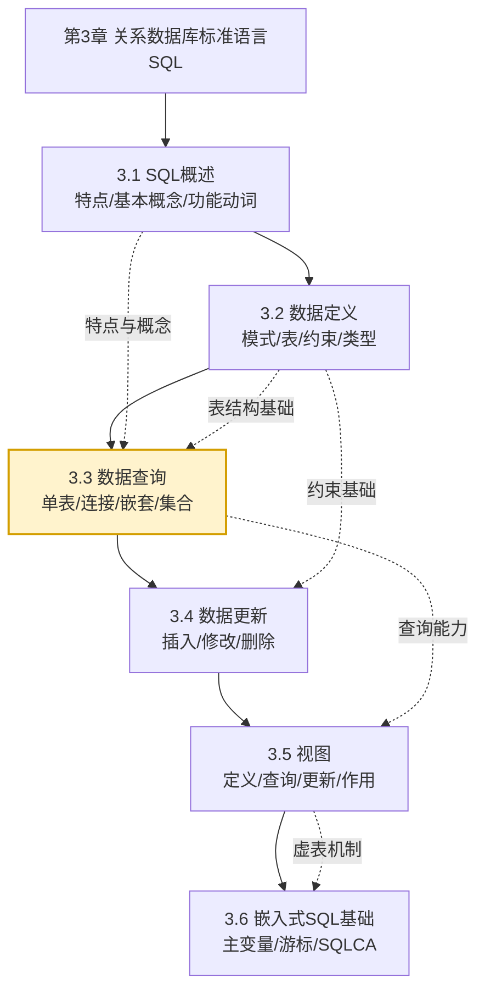

# MOC - 第3章 关系数据库标准语言SQL

> [!info] 本章定位
> 本章在第2章[[2.4 关系代数|关系代数]]的理论基础上，介绍关系数据库的标准操作语言 SQL（Structured Query Language）。它要解决的核心问题是：如何用一种**统一、非过程化、面向集合**的语言，完成从数据结构定义、数据查询、数据更新到视图构建的全部数据库操作。SQL 既是关系代数的工程化实现，又是后续[[MOC - 第4章|数据库安全性]]与[[MOC - 第5章|数据库完整性]]的实现基础，也是[[MOC - 第11章|查询优化]]的研究对象。掌握 SQL 是数据库应用开发与运维的最基本能力。

## 学习路线图

> [!note] 学习顺序说明
> 3.1 建立对 SQL 整体认识；3.2 定义表结构是后续一切操作的前提；3.3 数据查询是全章核心且篇幅最大，须重点掌握；3.4 数据更新需结合 3.2 的完整性约束理解；3.5 视图建立在外表之上，需先掌握查询；3.6 嵌入式 SQL 是 SQL 与主语言协作的扩展，属了解层次。

## 知识点导航

| 节次 | 标题 | 入口 | 核心内容 | 难度 |
| ---- | ---- | ---- | -------- | ---- |
| 3.1 | SQL 概述 | [[3.1 SQL概述]] | SQL 特点、基本表与视图、存储文件、功能动词 | ★★ |
| 3.2 | 数据定义 | [[3.2 数据定义]] | 模式、基本表定义/修改/删除、数据类型、完整性约束 | ★★★ |
| 3.3 | 数据查询 | [[3.3 数据查询]] | 单表查询、连接查询、嵌套查询、集合查询、派生表 | ★★★★★ |
| 3.4 | 数据更新 | [[3.4 数据更新]] | INSERT、UPDATE、DELETE 与完整性约束关系 | ★★★ |
| 3.5 | 视图 | [[3.5 视图]] | 视图定义/删除/查询/更新、视图消解、视图作用 | ★★★★ |
| 3.6 | 嵌入式 SQL 基础 | [[3.6 嵌入式SQL基础]] | SQLCA、主变量、游标、嵌入式处理流程 | ★★★ |

## 核心考点

> [!warning] 高频考点（务必掌握）
> 1. **SQL 的特点**：综合统一、高度非过程化、面向集合的操作方式、统一的语法结构、语言简洁易学易用。
> 2. **数据定义**：`CREATE/ALTER/DROP TABLE`，列级与表级完整性约束（`PRIMARY KEY`、`FOREIGN KEY`、`CHECK`、`NOT NULL`、`UNIQUE`）的声明方式与语义。
> 3. **单表查询**：`SELECT`、`WHERE`、`ORDER BY`、`GROUP BY`、`HAVING`、聚集函数（`COUNT/SUM/AVG/MAX/MIN`）的执行顺序与 `WHERE`/`HAVING` 的区别。
> 4. **连接查询**：等值与自然连接、外连接（`LEFT/RIGHT/FULL`）、自身连接的语义与写法。
> 5. **嵌套查询**：`IN`、比较运算符、`ANY/ALL`、`EXISTS` 子查询；相关子查询与不相关子查询的区别与执行过程。
> 6. **集合查询**：`UNION/INTERSECT/EXCEPT` 的语义与列数兼容性要求。
> 7. **视图**：`CREATE VIEW`、行列子集视图、视图消解、可更新视图条件、视图作用（逻辑独立性、安全保护）。
> 8. **数据更新与约束**：`INSERT/UPDATE/DELETE` 三种语句及违反完整性约束时的处理。

## 自测题

> [!question] 自测题 1
> 用一条 SQL 语句查询选修了全部课程的学生的学号。这考察哪类嵌套查询？是否可以用 `JOIN` 等价改写？参见 [[3.3 数据查询#4. 带 EXISTS 的子查询]]。

> [!question] 自测题 2
> `WHERE` 子句与 `HAVING` 子句的作用对象有何不同？聚集函数能否出现在 `WHERE` 中？为什么？参见 [[3.3 数据查询#5. GROUP BY 与 HAVING]]。

> [!question] 自测题 3
> 视图消解（View Resolution）的过程是什么？为什么行列子集视图一定可更新，而分组视图通常不可更新？参见 [[3.5 视图#查询视图与视图消解]]。

> [!question] 自测题 4
> 在嵌入式 SQL 中，何时必须使用游标？何时不使用游标？游标的四条基本操作是什么？参见 [[3.6 嵌入式SQL基础#游标（CURSOR）]]。

## 章节导航

> [!nav] 导航
> 上一级：[[MOC - 数据库原理]] · 上一章：[[MOC - 第2章]] · 下一章：[[MOC - 第4章]]
> 配套习题：[[MOC - 第3章习题]]
