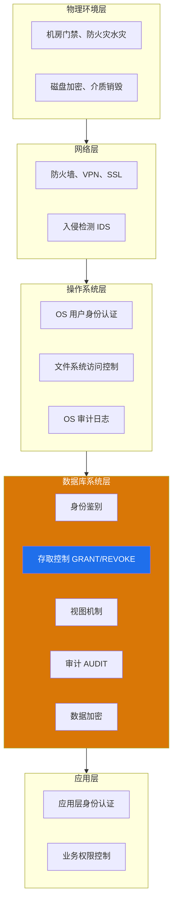

# 4.1 数据库安全概述

数据库安全性的研究先于数据库系统本身：当数据集中存储、多用户共享后，"谁能访问什么数据"就成为必须回答的问题。本节首先建立计算机安全性的整体认知（CIA 三元组），再聚焦到数据库安全性的定义与目标，介绍主流安全标准（TCSEC、CC），并说明数据库安全保护需在多个层面协同实现。

## 一、计算机安全性的三类要求

> [!definition] 计算机安全性（Computer Security）
> 计算机系统为保护其硬件、软件、数据不被偶然或恶意地泄露、更改或破坏，而提供的服务与机制的总称。

国际标准化组织（ISO）将计算机安全性概括为三类，简称 **CIA 三元组**：

| 安全属性 | 英文 | 含义 | 针对的威胁 |
| ---- | ---- | ---- | ---- |
| 保密性 | Confidentiality | 确保信息仅被授权者访问，防止数据泄露 | 窃听、未授权读取 |
| 完整性 | Integrity | 确保信息不被未授权篡改或破坏，保持正确与一致 | 篡改、伪造、恶意修改 |
| 可用性 | Availability | 确保授权者在需要时能及时访问数据与服务 | 拒绝服务攻击（DoS）、系统宕机 |

> [!note] 保密性 vs 完整性
> 保密性关注"谁可以看"，完整性关注"内容是否正确合法"。前者是**访问控制**问题，后者是**约束检查**问题。例如：黑客盗取用户表是破坏保密性；员工误将负数录入工资字段是破坏完整性。

## 二、数据库安全性

### 2.1 定义与目标

> [!definition] 数据库安全性（Database Security）
> 保护数据库，防止因**非法使用**而造成的数据泄露、更改或破坏。

数据库安全性的目标是确保只有**经过授权**的用户才能在**授权范围内**访问数据库，并在授权范围内执行合法操作。其核心问题是：

1. **身份鉴别**：确认操作者身份（"你是谁"）；
2. **权限控制**：决定操作者能做什么（"你能做什么"）；
3. **行为追溯**：记录操作行为以备审计（"你做过什么"）；
4. **数据保护**：即使数据被窃取也无法解读（"看到了也读不懂"）。

### 2.2 数据库安全性与完整性的区别

> [!warning] 关键区分
> - **数据库安全性**：防止**非法用户**对数据库的**非法访问**与恶意破坏，关注"用户合法性"。
> - **数据库完整性**：防止**合法用户**输入**不合语义**的错误数据，关注"数据正确性"。
>
> 前者针对"人"的合法性，后者针对"数据"的合法性。前者由 DBMS 的安全子系统保证，后者由完整性约束子系统保证。

详见 [[5.1 完整性约束概念]] 与 [[4.3 存取控制]] 的对比。

## 三、安全标准简介

为统一评价计算机系统的安全性，国际与各国制定了多种安全评估标准。

### 3.1 TCSEC（可信计算机系统评估准则）

> [!info] TCSEC 概述
> TCSEC（Trusted Computer System Evaluation Criteria）由美国国防部于 1985 年发布，又称"橙皮书"，是世界上第一个计算机安全评估标准。它将系统安全分为 4 组 7 个等级，从低到高依次为 D、C1、C2、B1、B2、B3、A1。

| 等级 | 名称 | 主要特征 | 数据库相关 |
| :---: | ---- | ---- | ---- |
| D | 最低保护 | 无安全保护 | — |
| C1 | 自主安全保护 | 用户标识与基本自主存取控制 | DAC 基础 |
| C2 | 受控访问保护 | 细粒度 DAC、审计登录 | 大多数商业 DBMS |
| B1 | 标记安全保护 | 强制存取控制（MAC）、敏感度标记 | 引入 MAC |
| B2 | 结构化保护 | 形式化安全策略模型、隐通道分析 | 高安全需求 |
| B3 | 安全域 | 全面访问监视、可信恢复 | — |
| A1 | 验证设计 | 形式化验证、最高保障 | 军用系统 |

> [!tip] 等级与机制对应
> - **C1-C2 级**：仅支持**自主存取控制 DAC**，是目前主流商业 DBMS（如 Oracle、MySQL、SQL Server）默认达到的安全级别。
> - **B1 级及以上**：必须支持**强制存取控制 MAC**，需要为所有主体与客体打上敏感度标记，多见于军用或高涉密系统。

### 3.2 CC（通用准则）

> [!definition] CC（Common Criteria，信息技术安全评估通用准则）
> 由美、英、法、德、加等国于 1996 年联合发布的国际标准（ISO/IEC 15408），统一了 TCSEC、ITSEC、CTCPEC 等各国标准。CC 采用"保护轮廓（PP）—安全目标（ST）—评估保证级（EAL）"的评估框架，EAL1（最低）至 EAL7（最高）共 7 个保证级别。

CC 是目前国际通用的安全评估标准，取代了 TCSEC 的地位，但其安全等级划分仍以 TCSEC 的思想为基础。

## 四、数据库安全保护的多层层面

数据库安全不是 DBMS 一家之事，需要从物理到应用的多个层面协同防护：

| 保护层面 | 主要手段 | 防范威胁 |
| ---- | ---- | ---- |
| 物理环境层 | 机房门禁、防火防水、介质加密销毁 | 物理窃取、自然灾害 |
| 网络层 | 防火墙、VPN、SSL/TLS、入侵检测 | 网络窃听、远程入侵 |
| 操作系统层 | OS 用户认证、文件系统权限、OS 审计 | 本地越权访问 |
| 数据库系统层 | 身份鉴别、存取控制、视图、审计、加密 | 数据库内非法访问 |
| 应用层 | 应用认证、业务权限、输入校验 | 应用层滥用、SQL 注入 |

> [!important] 数据库系统层是本章核心
> 本章重点讨论**数据库系统层**的安全机制，包括身份鉴别（[[4.2 身份鉴别]]）、存取控制（[[4.3 存取控制]]）、视图机制与审计（[[4.4 视图机制、审计]]）、数据加密（[[4.5 数据加密基础]]）。其他层面属于相关课程（操作系统、计算机网络）的范畴，但需理解其与数据库安全的协同关系。

## 小结

- 计算机安全性包括**保密性、完整性、可用性**三个方面（CIA 三元组）。
- 数据库安全性聚焦防止**非法访问**，与数据库完整性（防止不合语义数据）目标不同。
- TCSEC 将系统安全划分为 D-C1-C2-B1-B2-B3-A1 七级，C1-C2 仅支持 DAC，B1 及以上支持 MAC。
- 数据库安全保护需在物理、网络、操作系统、数据库系统、应用多个层面协同实现，本章核心是数据库系统层。

## 关联

- 本章导航：[[MOC - 第4章]]
- 下一节：[[4.2 身份鉴别]]
- 相关对比：[[5.1 完整性约束概念]]（安全性与完整性的区别与联系）
- 课程总览：[[MOC - 数据库原理]]
