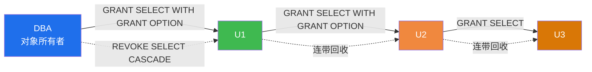

# 4.3 存取控制

身份鉴别通过后，DBMS 必须进一步控制"已登录用户能做什么"。存取控制（Access Control）是数据库安全的核心机制，决定用户对哪些数据库对象拥有哪些操作权限。本节是第4章的重点与考点密集区，介绍两类存取控制方法——**自主存取控制 DAC** 与**强制存取控制 MAC**，重点掌握 GRANT/REVOKE 语法、权限传播与回收机制，以及 DAC 与 MAC 的本质区别。

## 一、存取控制的概念

> [!definition] 存取控制（Access Control）
> DBMS 保证只有经过授权的用户才能在授权范围内访问数据库对象的机制。存取控制包括三个要素：
> 1. **主体（Subject）**：发起访问的实体，即用户或代表用户的进程；
> 2. **客体（Object）**：被访问的资源，如表、视图、列、存储过程等；
> 3. **访问权限（Access Right）**：主体对客体可执行的操作，如 SELECT、INSERT、UPDATE、DELETE、ALL PRIVILEGES。

存取控制解决的是"**你能做什么**"的问题，建立在身份鉴别（[[4.2 身份鉴别]]）之上。

存取控制主要有两类方法：

| 类型 | 全称 | 控制依据 | 安全等级 | 用户能否自主授权 |
| ---- | ---- | ---- | ---- | ---- |
| DAC | 自主存取控制 Discretionary Access Control | 用户身份 + 授权表 | C1-C2 级 | 能 |
| MAC | 强制存取控制 Mandatory Access Control | 主体/客体的敏感度标记 | B1 级及以上 | 不能 |

## 二、自主存取控制 DAC

### 2.1 DAC 的概念

> [!definition] 自主存取控制（DAC）
> 用户（或对象的**所有者**）对其拥有的数据库对象有权自主决定将哪些权限授予哪些用户，也可将授权权限再授予他人，由 DBMS 通过授权矩阵（权限矩阵）记录并检查。

DAC 的"自主"体现在：对象所有者可以自由决定授权对象与权限范围，且可以传递授权能力。其核心机制是 SQL 的 `GRANT` 与 `REVOKE` 语句。

### 2.2 权限类型

| 权限 | 适用对象 | 含义 |
| ---- | ---- | ---- |
| SELECT | 表、视图 | 查询数据 |
| INSERT | 表、视图 | 插入数据 |
| UPDATE | 表、视图、列 | 修改数据 |
| DELETE | 表、视图 | 删除数据 |
| REFERENCES | 表 | 定义外键引用该表 |
| CREATE | 数据库、模式 | 创建对象 |
| ALTER | 表 | 修改表结构 |
| DROP | 表、视图 | 删除对象 |
| ALL PRIVILEGES | 各种对象 | 上述所有权限 |
| USAGE | 模式、域 | 仅可访问，无具体操作权限 |

> [!note] 列级权限
> `SELECT` 和 `UPDATE` 可以指定到列：`GRANT SELECT(Sno, Sname) ON Student TO U1;` 表示 `U1` 只能查看 `Sno` 和 `Sname` 两列。这是实现"列级权限隔离"的方式之一，另一种方式是视图（[[4.4 视图机制、审计]]）。

### 2.3 GRANT 语句

```sql
-- 一般语法
GRANT <权限列表> ON <对象> TO <用户列表>
  [WITH GRANT OPTION];

-- 示例表结构（MySQL 8.0，使用 scdb 数据库）
USE scdb;
-- Student(Sno, Sname, Ssex, Sage, Sdept)
-- Course(Cno, Cname, Cpno, Ccredit)
-- SC(Sno, Cno, Grade)
```

**示例 1**：授予查询权限。

```sql
-- 将 Student 表的 SELECT 权限授予用户 u1
GRANT SELECT ON Student TO u1;

-- 将 Course 表的部分列查询权限授予 u2
GRANT SELECT(Cno, Cname) ON Course TO u2;

-- 将 SC 表的所有权限授予 u3
GRANT ALL PRIVILEGES ON SC TO u3;

-- 将 Student 表的 SELECT、UPDATE(Sage) 权限授予 u4，并允许 u4 转授
GRANT SELECT, UPDATE(Sage) ON Student TO u4 WITH GRANT OPTION;
```

> [!important] WITH GRANT OPTION
> `WITH GRANT OPTION` 子句允许被授权用户将所得权限**再授予**其他用户，形成权限传播链。这是 DAC "自主"特征的核心体现，但也会带来权限扩散风险，生产环境慎用。

### 2.4 REVOKE 语句

```sql
-- 一般语法
REVOKE <权限列表> ON <对象> FROM <用户列表>
  [CASCADE | RESTRICT];

-- MySQL 8.0 语法（无 CASCADE/RESTRICT 关键字，默认级联回收）
REVOKE <权限列表> ON <对象> FROM <用户列表>;
```

**示例 2**：回收权限。

```sql
-- 回收 u1 对 Student 表的 SELECT 权限
REVOKE SELECT ON Student FROM u1;

-- 回收 u3 对 SC 表的所有权限
REVOKE ALL PRIVILEGES ON SC FROM u3;
```

### 2.5 权限传播与级联回收



> [!warning] 级联回收规则
> 当对象所有者从某用户回收权限时，若该用户已将权限转授他人（因 `WITH GRANT OPTION`），系统会**连带回收**该用户转授出去的权限，使整条传播链失效。
> - `CASCADE`：级联回收所有依赖权限（标准 SQL 与多数 DBMS 的默认行为）；
> - `RESTRICT`：若存在依赖权限则拒绝回收并报错（标准 SQL 选项，MySQL 8.0 不支持该选项，默认 CASCADE）。

**示例 3**：权限传播与级联回收。

```sql
-- 假设 DBA 是 Student 表所有者
GRANT SELECT ON Student TO u1 WITH GRANT OPTION;
-- u1 登录后执行：
GRANT SELECT ON Student TO u2;
-- 现在权限链：DBA -> u1 -> u2

-- DBA 执行级联回收
REVOKE SELECT ON Student FROM u1;
-- 结果：u1 失去 SELECT 权限，u2 通过 u1 获得的权限也被回收
```

### 2.6 权限矩阵

DBMS 通过**授权矩阵**（存取矩阵）记录"哪个用户对哪个对象有何种权限"。设用户为 $U_i$、对象为 $O_j$、权限为 $P_k$，则授权矩阵 $A$ 的元素：

$$
A[U_i, O_j] = \{P_{k_1}, P_{k_2}, \ldots\}
$$

> [!example] 示例权限矩阵
> | 用户 \ 对象 | Student 表 | Course 表 | SC 表 |
> | :---: | :---: | :---: | :---: |
> | u1 | {SELECT} | ∅ | ∅ |
> | u2 | ∅ | {SELECT(Cno,Cname)} | ∅ |
> | u3 | ∅ | ∅ | {SELECT, INSERT, UPDATE, DELETE} |
> | u4 | {SELECT, UPDATE(Sage)} | ∅ | ∅ |
>
> 表中 ∅ 表示无权限，{SELECT} 表示拥有 SELECT 权限。每次用户执行操作时，DBMS 检查矩阵相应元素是否包含所请求的权限。

### 2.7 创建用户与授权的完整示例（MySQL 8.0）

```sql
-- 1. 管理员 root 创建用户
CREATE USER 'u1'@'localhost' IDENTIFIED BY 'Pwd@u1_2024';
CREATE USER 'u2'@'localhost' IDENTIFIED BY 'Pwd@u2_2024';
CREATE USER 'u3'@'localhost' IDENTIFIED BY 'Pwd@u3_2024';
CREATE USER 'u4'@'localhost' IDENTIFIED BY 'Pwd@u4_2024';

-- 2. 授权
USE scdb;
GRANT SELECT ON Student TO 'u1'@'localhost';
GRANT SELECT(Cno, Cname) ON Course TO 'u2'@'localhost';
GRANT ALL PRIVILEGES ON SC TO 'u3'@'localhost';
GRANT SELECT, UPDATE(Sage) ON Student TO 'u4'@'localhost' WITH GRANT OPTION;

-- 3. 查看权限
SHOW GRANTS FOR 'u4'@'localhost';
-- 预期输出包含：GRANT SELECT, UPDATE(Sage) ON `scdb`.`Student` TO `u4`@`localhost` WITH GRANT OPTION

-- 4. 回收权限（级联）
REVOKE SELECT, UPDATE(Sage) ON Student FROM 'u4'@'localhost';
```

## 三、强制存取控制 MAC

### 3.1 MAC 的概念

> [!definition] 强制存取控制（MAC）
> 由系统统一为所有**主体**（用户、进程）和**客体**（数据文件、表、记录）分配**敏感度标记（Security Label）**，依据"支配关系"强制决定主体能否访问客体。用户无权更改自身或客体的标记，也不能自主授权。

MAC 用于达到 TCSEC B1 级及以上的高安全系统（如军用、政府涉密系统），是 DAC 之上的进一步安全约束。

### 3.2 敏感度标记

> [!important] 四级敏感度标记
> TCSEC 中将敏感度标记（密级）从高到低分为四级：
> - **TS**（Top Secret，绝密）
> - **S**（Secret，机密）
> - **C**（Confidential，秘密）
> - **U**（Unclassified，普通）
>
> 标记的**支配关系**：TS > S > C > U，高级别标记支配低级别标记。

除了密级（TS/S/C/U）外，每个标记还包含**范畴（Category）**，表示数据所属的业务领域（如财务、人事、研发等）。完整的敏感度标记由"密级 + 范畴"组成，主体访问客体需同时满足密级与范畴的支配关系。

### 3.3 支配关系

设主体 $S$ 的敏感度标记为 $(L_S, C_S)$（密级 + 范畴），客体 $O$ 的敏感度标记为 $(L_O, C_O)$：

- $S$ 支配 $O$（$S \succeq O$）当且仅当 $L_S \geq L_O$ **且** $C_S \supseteq C_O$。

### 3.4 MAC 的读写规则

> [!important] MAC 的两条规则
> 1. **读规则（向下读，Read Down）**：主体 $S$ 能读客体 $O$，当且仅当 $S$ 的密级 **$\geq$** $O$ 的密级，且 $S$ 的范畴 $\supseteq$ $O$ 的范畴。即**主体支配客体**。
>    - 直觉：高级别用户可以读低级别数据。
> 2. **写规则（向上写，Write Up）**：主体 $S$ 能写客体 $O$，当且仅当 $S$ 的密级 **$\leq$** $O$ 的密级，且 $O$ 的范畴 $\supsetseteq$ $S$ 的范畴。即**客体支配主体**。
>    - 直觉：低级别用户只能写高级别数据，防止把低级别数据"污染"到高级别文件（实际上，写规则防止的是"通过写操作泄露信息"）。

> [!note] 读写规则的设计动机
> - **向下读**：高级别主体能读低级别数据，符合"密级高的人可以看密级低的信息"的常识。
> - **向上写**：低级别主体向高级别客体写数据是允许的（如普通用户向上级系统提交报告），但高级别主体不能向低级别客体写数据，以防泄露高级别信息到低级别文件。
>
> 这种设计可防止**信息从高密级流向低密级**，是 MAC 的核心安全保证。

### 3.5 MAC 示例

| 主体 | 密级 | 范畴 | 客体 | 密级 | 范畴 | 能否读 | 能否写 |
| :---: | :---: | :---: | :---: | :---: | :---: | :---: | :---: |
| Alice | S | {财务} | 文件A | C | {财务} | ✓（S≥C, 范畴⊇） | ✗（S>C，写规则要求S≤O） |
| Alice | S | {财务} | 文件B | S | {财务,人事} | ✗（范畴不⊇） | ✓（S=S，范畴⊆） |
| Bob | U | {财务} | 文件A | C | {财务} | ✗（U<C） | ✗（U<C） |
| Bob | U | {财务} | 文件C | S | {财务} | ✗（U<S） | ✓（U<S，范畴⊆） |

## 四、DAC 与 MAC 对比

| 对比项 | DAC | MAC |
| ---- | ---- | ---- |
| 全称 | 自主存取控制 | 强制存取控制 |
| 控制依据 | 用户身份 + 授权矩阵 | 主体/客体的敏感度标记 |
| 授权主体 | 对象所有者（用户自主决定） | 系统（统一强制） |
| 用户能否授权 | 能（WITH GRANT OPTION） | 不能 |
| 权限传递 | 允许传播 | 不允许，由系统统一标记 |
| 安全等级 | C1-C2 级 | B1 级及以上 |
| 实现复杂度 | 低（GRANT/REVOKE） | 高（需标记机制、强制检查） |
| 典型场景 | 商业 DBMS（Oracle、MySQL、SQL Server） | 军用、政府涉密系统 |
| 控制粒度 | 表、视图、列 | 表、行、列、记录 |
| 主要风险 | 权限扩散、特洛伊木马攻击 | 配置复杂、灵活性低 |
| 是否可绕过 | 易被特洛伊木马绕过 | 难被绕过 |

> [!warning] DAC 的特洛伊木马问题
> DAC 的根本缺陷：用户自主授权时，恶意程序（特洛伊木马）可利用合法用户的权限，将其拥有的敏感数据复制到自己可访问的文件中，从而绕过 DAC 限制。MAC 通过"向上写"规则防止此类攻击——即便木马获取了高级别数据，也无法将其写入低级别文件，因为高级别主体不能写低级别客体。

> [!tip] DAC 与 MAC 的关系
> 实际系统中，MAC 通常作为 DAC 的补充：**先经 MAC 检查（标记支配关系），再经 DAC 检查（授权矩阵）**。只有同时满足两者的访问才被允许。例如，B1 级系统的用户即使被 DAC 授权可读某表，若其敏感度标记不能支配该表的标记，仍不能读取。

## 小结

- 存取控制决定主体对客体的访问权限，包括主体、客体、权限三要素。
- **DAC** 由对象所有者自主授权，通过 `GRANT`/`REVOKE` 实现，支持权限传播（`WITH GRANT OPTION`）与级联回收，安全等级 C1-C2。
- **MAC** 由系统统一标记主体/客体的敏感度（TS/S/C/U + 范畴），按"向下读、向上写"规则强制检查，安全等级 B1+，可防止特洛伊木马攻击。
- GRANT/REVOKE 是数据库考试高频考点，需熟练掌握语法与权限传播/级联回收机制。

## 关联

- 本章导航：[[MOC - 第4章]]
- 上一节：[[4.2 身份鉴别]]
- 下一节：[[4.4 视图机制、审计]]
- 安全性 vs 完整性：[[5.1 完整性约束概念]]（DAC 控制访问 vs 完整性约束控制数据正确性）
- 课程总览：[[MOC - 数据库原理]]
