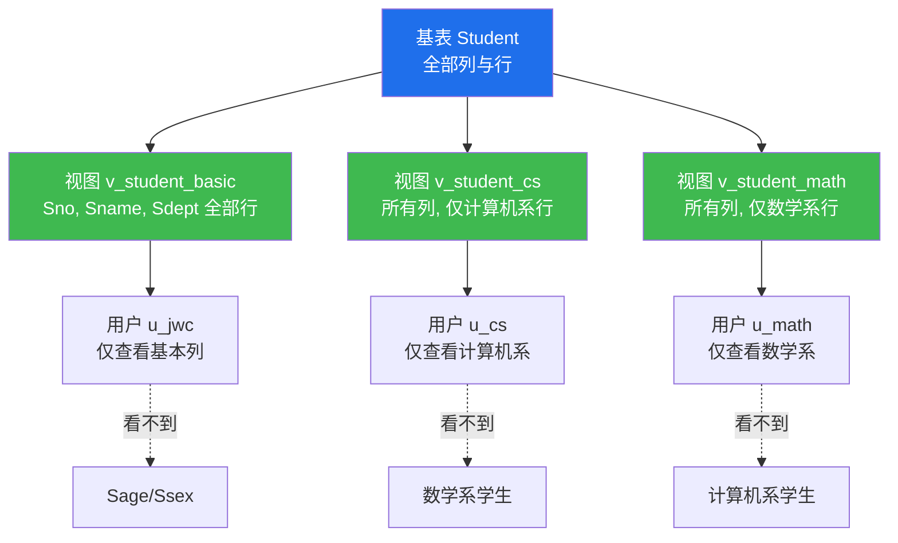
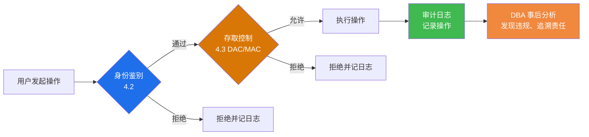

# 4.4 视图机制、审计

存取控制（[[4.3 存取控制]]）能在表和列级别限制用户权限，但仍存在两个问题：一是表内不同行可能属于不同敏感级别（如各院系只能看本院系学生），表级权限无法表达；二是即使阻止了非法操作，事后也无法追溯"谁做了什么"。视图机制和审计分别解决这两个问题：**视图**实现更细粒度（行级、列级）的权限隔离，**审计**记录操作日志以便事后追责与安全分析。

## 一、视图机制实现安全性

### 1.1 视图的作用

> [!definition] 视图（View）的安全性作用
> 为不同的用户定义不同的视图，把用户能访问的数据限制在视图范围内，使无权访问的数据对用户不可见。视图是 [[4.3 存取控制]] 的重要补充手段，可实现**列级**和**行级**权限隔离。

视图实现安全性的思路：

1. 先创建视图，仅包含该用户可访问的列或行；
2. 将视图的 `SELECT` 权限授予用户（而非底层基表的权限）；
3. 用户通过视图访问数据，无法看到视图外的列与行。

### 1.2 列级权限隔离

> [!example] 列级隔离示例
> 假设 `Student(Sno, Sname, Ssex, Sage, Sdept)` 表，教务员只允许查看学号、姓名、所在系，不允许看性别与年龄。

```sql
-- MySQL 8.0，使用 scdb 数据库
USE scdb;

-- 1. 创建视图，仅暴露允许查看的列
CREATE VIEW v_student_basic AS
SELECT Sno, Sname, Sdept FROM Student;

-- 2. 创建用户并授予视图查询权限（不授予基表权限）
CREATE USER 'u_jwc'@'localhost' IDENTIFIED BY 'Pwd@jwc_2024';
GRANT SELECT ON v_student_basic TO 'u_jwc'@'localhost';

-- 3. 用户 u_jwc 登录后查询
-- SELECT * FROM v_student_basic;          -- 允许
-- SELECT Sage FROM Student;              -- 报错：无 Student 表权限
```

### 1.3 行级权限隔离

> [!example] 行级隔离示例
> 各院系教学秘书只能查看本院系的学生，不能查看其他院系。

```sql
-- 1. 为计算机系创建视图（仅含计算机系学生）
CREATE VIEW v_student_cs AS
SELECT * FROM Student WHERE Sdept = '计算机';

-- 2. 为数学系创建视图
CREATE VIEW v_student_math AS
SELECT * FROM Student WHERE Sdept = '数学';

-- 3. 分别授权给对应用户
CREATE USER 'u_cs'@'localhost'   IDENTIFIED BY 'Pwd@cs_2024';
CREATE USER 'u_math'@'localhost' IDENTIFIED BY 'Pwd@math_2024';

GRANT SELECT ON v_student_cs   TO 'u_cs'@'localhost';
GRANT SELECT ON v_student_math TO 'u_math'@'localhost';

-- 4. 用户 u_cs 登录后
-- SELECT * FROM v_student_cs;       -- 仅能看到计算机系学生
-- SELECT * FROM v_student_math;    -- 报错：无权限
```

### 1.4 视图权限隔离示意



> [!tip] 视图与列级 GRANT 的取舍
> - 列级 `GRANT`（如 `GRANT SELECT(Sno,Sname) ON Student TO u1`）也能实现列级隔离，但每加一列都要重新授权，维护成本高。
> - 视图机制更灵活，可包含复杂查询（连接、聚合、过滤），且能同时实现列级与行级隔离，**生产中通常优先使用视图**。
> - 二者可结合使用：先建视图再对视图做列级授权。

## 二、审计

### 2.1 审计的概念

> [!definition] 审计（Audit）
> DBMS 自动记录用户对数据库的所有操作（或敏感操作）到**审计日志（Audit Log）**中，DBA 可事后分析日志以发现非法访问、追踪安全事件、定位责任人的机制。

审计是**事后**安全机制，与存取控制（事前预防）不同：存取控制阻止非法操作发生，审计则记录"已经发生了什么"以便追溯。两者互补，构成完整的安全防护链：



### 2.2 AUDIT 与 NOAUDIT 语句（标准 SQL 概念）

标准 SQL（教材）中审计语句的形式：

```sql
-- 开启对某对象某操作的审计
AUDIT SELECT, INSERT, UPDATE ON Student;

-- 关闭对某对象某操作的审计
NOAUDIT UPDATE ON Student;

-- 审计所有操作
AUDIT ALL ON Student;
```

> [!note] 教材与实现的差异
> `AUDIT`/`NOAUDIT` 是《数据库系统概论》（王珊/萨师煊）教材中的标准语法示意，**Oracle 数据库支持**类似的 `AUDIT` 语句；**MySQL 8.0 原生不支持 `AUDIT`/`NOAUDIT` 语法**，需通过企业版审计插件（`audit_log`）或第三方插件（如 Percona Audit Plugin、MariaDB Audit Plugin）实现审计功能。学习时应区分"教材的标准概念"与"具体 DBMS 的实现"。

### 2.3 审计日志的内容

审计日志通常记录以下信息：

| 日志字段 | 说明 | 示例 |
| ---- | ---- | ---- |
| 操作时间 | 操作发生的时间戳 | 2026-08-02 10:23:15 |
| 操作用户 | 执行操作的用户标识 | u_jwc@localhost |
| 操作类型 | SELECT/INSERT/UPDATE/DELETE/DDL 等 | SELECT |
| 操作对象 | 数据库对象名（库.表.列） | scdb.Student |
| 操作结果 | 成功 / 失败 / 拒绝 | SUCCESS / DENIED |
| 来源主机 | 客户端 IP/主机名 | 192.168.1.10 |
| SQL 文本 | 实际执行的 SQL 语句 | `SELECT * FROM Student WHERE Sage>20` |
| 影响行数 | 操作影响的记录数 | 5 |

### 2.4 MySQL 审计配置简介

> [!info] MySQL 审计实现
> MySQL 8.0 社区版默认不含审计插件，企业版提供 `audit_log` 插件。开源方案可使用 MariaDB Audit Plugin 或 Percona Audit Plugin。以下为 MariaDB Audit Plugin 的配置示例（适用于 MySQL 8.0 部署 MariaDB 审计插件的环境）：

```ini
# my.cnf 配置文件（MySQL 8.0 + MariaDB Audit Plugin）
[mysqld]
# 加载审计插件
plugin_load_add = server_audit
# 启用审计
server_audit_events = CONNECT,QUERY,TABLE
# 审计日志路径
server_audit_file_path = /var/log/mysql/audit.log
# 输出方式：file
server_audit_output_type = FILE
# 记录失败与成功操作
server_audit_logging = ON
```

```sql
-- 在 MySQL 中查看审计插件状态
SHOW PLUGINS WHERE Name = 'server_audit';

-- 查看审计相关变量
SHOW VARIABLES LIKE 'server_audit%';
```

### 2.5 审计的应用场景

> [!example] 审计的典型应用
> 1. **可疑操作追溯**：发现数据被异常篡改后，DBA 通过审计日志定位是哪个用户在何时执行了什么操作；
> 2. **合规审计**：金融、医疗等行业法规要求记录所有敏感数据访问行为，满足合规审查；
> 3. **入侵检测**：分析审计日志中异常登录频率、非常规时间访问等模式，发现潜在入侵；
> 4. **权限使用分析**：评估实际权限使用情况，发现冗余授权并优化权限配置。

## 小结

- **视图机制**通过为不同用户定义不同视图，实现列级与行级权限隔离，是存取控制的重要补充。
- **审计**记录用户操作到审计日志，是事后追溯机制，与存取控制（事前预防）互补。
- 标准 SQL 教材中 `AUDIT`/`NOAUDIT` 语句在 Oracle 中支持，MySQL 需通过审计插件实现。
- 完整安全防护链：身份鉴别（事前）→ 存取控制（事前）→ 审计（事后追溯）→ 数据加密（数据本身保护）。

## 关联

- 本章导航：[[MOC - 第4章]]
- 上一节：[[4.3 存取控制]]
- 下一节：[[4.5 数据加密基础]]
- 课程总览：[[MOC - 数据库原理]]
