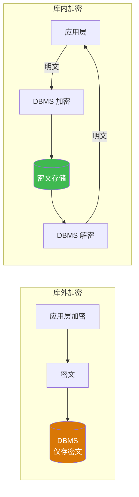

# 4.5 数据加密基础

前述机制（身份鉴别、存取控制、视图、审计）都建立在"数据本身以明文存储"的前提下。一旦攻击者绕过这些机制（如直接窃取磁盘文件、监听网络传输、盗取备份介质），明文数据将完全暴露。数据加密（Data Encryption）是最后一道防线——即使数据被窃取，攻击者也无法解读其内容。本节介绍加密的基本概念、对称与非对称加密、数据库加密方式，以及统计数据库的推断控制问题。

## 一、数据加密的概念

> [!definition] 数据加密（Data Encryption）
> 将明文（Plaintext）数据通过加密算法和密钥（Key）转换为不可读的密文（Ciphertext）的过程；只有掌握正确密钥的授权者才能将密文还原为明文（解密，Decryption）。

加密的基本模型：

$$
\text{密文 } C = E_k(\text{明文 } P), \qquad \text{明文 } P = D_k(\text{密文 } C)
$$

其中 $E$ 为加密算法，$D$ 为解密算法，$k$ 为密钥。加密的安全性取决于**算法的强度**与**密钥的保密性**（柯克霍夫原则：算法公开，安全依赖密钥保密）。

## 二、对称加密与非对称加密

### 2.1 对称加密

> [!definition] 对称加密（Symmetric Encryption）
> 加密与解密使用**同一密钥**（或可由一密钥简单推导出另一密钥）的加密方式。通信双方必须事先共享密钥并保密。

| 算法 | 全称 | 密钥长度 | 特点 | 现状 |
| ---- | ---- | ---- | ---- | ---- |
| DES | Data Encryption Standard | 56 位 | 分组加密，64 位分组 | 已不安全，已淘汰 |
| 3DES | Triple DES | 112/168 位 | DES 三次加密 | 过渡方案，逐步淘汰 |
| **AES** | Advanced Encryption Standard | 128/192/256 位 | 分组加密，128 位分组 | **当前主流**，安全 |
| RC4 | Rivest Cipher 4 | 可变 | 流加密 | 已不安全，禁用 |

**优点**：加解密速度快，适合大数据量加密。
**缺点**：密钥分发困难——通信双方需安全共享密钥，密钥管理成本高。

### 2.2 非对称加密

> [!definition] 非对称加密（Asymmetric Encryption）/ 公钥加密（Public Key Encryption）
> 使用一对数学相关的密钥：**公钥（Public Key）**公开，**私钥（Private Key）**保密。公钥加密的数据只能用对应私钥解密；私钥签名的数据可用公钥验证。

| 算法 | 全称 | 密钥长度 | 典型用途 | 现状 |
| ---- | ---- | ---- | ---- | ---- |
| **RSA** | Rivest-Shamir-Adleman | 2048+ 位 | 加密、数字签名 | **主流** |
| ECC | Elliptic Curve Cryptography | 256+ 位 | 移动端、物联网 | 主流，效率高 |
| DSA | Digital Signature Algorithm | 1024+ 位 | 数字签名 | 逐步被 ECC 替代 |
| DH | Diffie-Hellman | — | 密钥交换 | 主流 |

**优点**：解决密钥分发问题，无需事先共享密钥；支持数字签名。
**缺点**：加解密速度慢（比对称加密慢 100-1000 倍），不适合大数据量加密。

### 2.3 混合加密（实用方案）

> [!tip] 实际系统中的混合加密
> 实际系统（如 HTTPS/TLS）通常采用**混合加密**：
> 1. 用非对称加密（如 RSA/ECC）协商一个对称密钥（会话密钥）；
> 2. 用对称密钥（如 AES）加密实际数据。
>
> 这样既解决了密钥分发问题，又保证了加密速度。HTTPS、SSL/TLS、SSH 等协议均采用混合加密。

## 三、数据库加密方式

数据库加密按密文存储位置分为两类：

### 3.1 库外加密

> [!definition] 库外加密（Out-of-DB Encryption）
> 数据在**进入数据库之前**就由应用层或中间件加密，DBMS 存储与处理的都是密文。DBMS 不感知加密细节，仅作为密文存储容器。

- **优点**：DBMS 不需改造，安全性高（即使 DBA 也无法看到明文）；
- **缺点**：DBMS 无法对密文做有效查询、索引、排序、约束检查；查询能力大幅受限；
- **典型**：应用层加密、TDE（Transparent Data Encryption，部分库外）。

### 3.2 库内加密

> [!definition] 库内加密（In-DB Encryption）
> DBMS 内置加密功能，数据在存储时自动加密、读取时自动解密，对应用透明（应用层无感知）。

- **优点**：对应用透明，仍可正常查询；密钥由 DBMS 统一管理；
- **缺点**：DBA 仍可见明文（因为 DBMS 持有解密密钥）；性能有一定开销；
- **典型**：MySQL 企业版 TDE、Oracle TDE、SQL Server TDE。



### 3.3 MySQL 加密示例

```sql
-- MySQL 8.0：使用 AES_ENCRYPT / AES_DECRYPT 函数（库外加密思路）
USE scdb;

-- 应用层加密后写入密文
INSERT INTO Student(Sno, Sname) VALUES (
    '202400099',
    TO_BASE64(AES_ENCRYPT('敏感姓名', 'secret_key_2024'))
);

-- 查询时解密
SELECT Sno, CAST(AES_DECRYPT(FROM_BASE64(Sname), 'secret_key_2024') AS CHAR) AS Sname
FROM Student WHERE Sno = '202400099';

-- MySQL 8.0 表空间加密（库内加密，企业版/社区版 8.0.16+ 部分支持）
-- 需先安装 keyring 插件并配置加密
```

> [!warning] 加密注意事项
> 1. **密钥管理是关键**：加密强度取决于密钥保密性，密钥泄露等于无加密。生产环境应使用 KMS（密钥管理服务）。
> 2. **加密影响查询**：对加密列无法直接做范围查询、排序、聚合，需特殊设计（如确定性加密、盲索引）。
> 3. **示例中的硬编码密钥仅作演示**，生产环境禁止在 SQL 中硬编码密钥。

## 四、统计数据库安全

### 4.1 统计数据库的概念

> [!definition] 统计数据库（Statistical Database）
> 允许用户查询**统计信息**（如计数、求和、平均、最大值）但**不允许查询个体记录**的数据库。典型场景：人口普查、医疗统计、薪资调查——可公布"某地区平均工资"，但不能公布"某人工资"。

### 4.2 推断控制

> [!important] 统计数据库的推断攻击
> 即使只允许查询统计信息，攻击者仍可通过精心构造的多个统计查询**推断出个体数据**。

> [!example] 推断攻击示例
> 假设攻击者想知道张三的工资，且已知张三是"计算机系、男性、年龄20岁"。
> - 查询1：`SELECT AVG(Salary) FROM Employee WHERE Sdept='计算机' AND Ssex='男' AND Sage=20;` —— 假设返回 8000
> - 查询2：`SELECT AVG(Salary) FROM Employee WHERE Sdept='计算机' AND Ssex='男' AND Sage=20 AND Sname<>'张三';` —— 假设返回 7800，且该查询只匹配 1 人（除张三外无其他人）
> - 推断：张三工资 = 2 × 8000 - 7800 = 8200
>
> 即使从未直接查询张三的工资，攻击者仍通过两次统计查询推断出个体信息。

### 4.3 推断控制方法

| 方法 | 含义 | 优点 | 缺点 |
| ---- | ---- | ---- | ---- |
| 限制查询集合大小 | 仅允许查询影响行数 ≥ N 或 ≤ M 的统计 | 简单 | 仍可能被组合查询绕过 |
| 限制查询历史 | 同一用户连续查询的交集不能过小 | 有效 | 实现复杂、影响正常使用 |
| 数据扰动 | 在统计结果上加随机噪声 | 隐藏个体 | 降低统计精度 |
| 数据交换 | 在保证统计分布下交换个体记录 | 不破坏统计 | 仅适用于特定统计 |

> [!note] 统计数据库安全的本质
> 统计数据库安全是"**数据可用性**与**个体保密性**"之间的平衡问题。完全公开统计会泄露个体，完全禁止查询则失去数据库价值。推断控制（Inference Control）是统计数据库安全的核心研究问题。

## 小结

- 数据加密是数据库安全的最后一道防线，防止数据被窃取后明文泄露。
- 对称加密（AES）速度快但密钥分发难；非对称加密（RSA）解决密钥分发但速度慢；实际系统多用混合加密。
- 数据库加密分**库外加密**（应用层加密，DBMS 不感知）与**库内加密**（DBMS 透明加密，对应用透明）。
- 统计数据库允许查询统计信息但禁止个体查询，仍可能遭受推断攻击，需推断控制机制保护。

## 关联

- 本章导航：[[MOC - 第4章]]
- 上一节：[[4.4 视图机制、审计]]
- 下一章：[[MOC - 第5章]]（数据库完整性，与本章共同构成数据保护体系）
- 课程总览：[[MOC - 数据库原理]]
