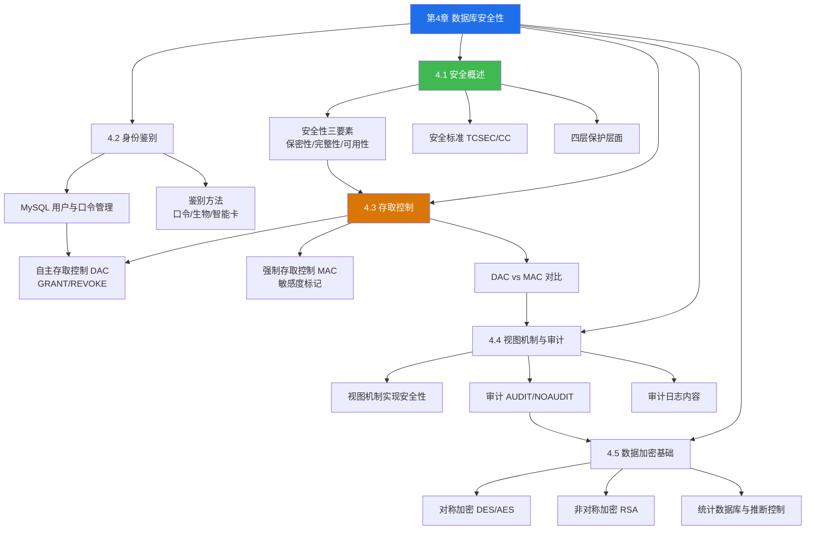

# MOC - 第4章 数据库安全性

> [!info] 本章定位
> 本章解决的核心问题是：**如何防止数据库被非法访问、非法使用和恶意破坏**。数据库中存储着大量敏感数据（个人身份信息、财务数据、商业机密等），一旦被未授权用户读取、篡改或泄露，将造成严重后果。第3章 SQL 解决了"如何操作数据"的问题，第4章则回答"如何控制谁能操作什么数据"。
>
> 数据库安全性（Database Security）与数据库完整性是数据保护的两大支柱：**安全性防范非法用户与非法操作**，**完整性防范合法用户的不合语义数据**。二者目标不同、机制不同，但协同工作共同保障数据正确可用。本章按"身份鉴别 → 存取控制 → 视图机制 → 审计 → 数据加密"的纵深防御层次展开。

## 学习路线图

> [!note] 学习顺序说明
> 安全概述建立整体认知后，按"纵深防御"的层次推进：**身份鉴别**确认"你是谁"，**存取控制**决定"你能做什么"，**视图机制**进一步收窄"你能看到什么"，**审计**记录"你做了什么"以便事后追溯，**数据加密**保证"即使数据被窃取也无法读懂"。其中 4.3 存取控制是重点与考点密集区，需重点掌握 GRANT/REVOKE 语法与 DAC/MAC 区别。

## 知识点导航

| 节号 | 标题 | 入口 | 核心内容 | 重要度 |
| ---- | ---- | ---- | ---- | ---- |
| 4.1 | 数据库安全概述 | [[4.1 数据库安全概述]] | 安全性三要素、TCSEC/CC 标准、四层保护层面 | ★★★ |
| 4.2 | 身份鉴别 | [[4.2 身份鉴别]] | 鉴别方法、MySQL 用户创建与口令管理 | ★★★ |
| 4.3 | 存取控制 | [[4.3 存取控制]] | DAC（GRANT/REVOKE）、MAC（敏感度标记）、二者对比 | ★★★★★ |
| 4.4 | 视图机制、审计 | [[4.4 视图机制、审计]] | 视图权限隔离、AUDIT/NOAUDIT、审计日志 | ★★★★ |
| 4.5 | 数据加密基础 | [[4.5 数据加密基础]] | 对称/非对称加密、库内外加密、统计数据库安全 | ★★ |

## 核心考点

> [!warning] 核心考点（7点）
> 1. **安全性 vs 完整性**：安全性防范非法访问（防止"不该看的人看到"），完整性防范不合语义数据（防止"合法用户输入错误数据"）。二者目标、机制、触发时机均不同。
> 2. **计算机安全性三要素**：保密性（Confidentiality）、完整性（Integrity）、可用性（Availability），简称 CIA 三元组。
> 3. **TCSEC 安全级别**：D（最低）< C1 < C2 < B1 < B2 < B3 < A1（最高）。DAC 在 C1-C2 级，MAC 需要 B1 级以上。
> 4. **GRANT/REVOKE 语法**：`GRANT <权限> ON <对象> TO <用户> [WITH GRANT OPTION]`；`REVOKE <权限> ON <对象> FROM <用户> [CASCADE|RESTRICT]`。WITH GRANT OPTION 允许权限传播。
> 5. **DAC 与 MAC 的本质区别**：DAC 由对象所有者自主决定授权（基于用户身份），MAC 由系统统一强制执行（基于敏感度标记的支配关系），用户无权改变。
> 6. **MAC 敏感度标记**：主体（用户）与客体（数据）都有标记，TS（绝密）> S（机密）> C（秘密）> U（普通）。读规则：主体密级 ≥ 客体密级；写规则：主体密级 ≤ 客体密级。
> 7. **视图机制的作用**：通过为不同用户定义不同视图，实现"列级"和"行级"权限隔离，是存取控制的重要补充手段。

## 自测题

> [!question] 自测题（4道）
> 1. 简述数据库安全性与数据库完整性的区别，并各举一个示例说明。
> 2. 写出将 `Student` 表的 `SELECT` 权限授予用户 `U1`，并允许 `U1` 将该权限转授他人的 SQL 语句；随后写出回收该权限（连同 `U1` 转授出去的权限一起回收）的 SQL 语句。
> 3. 在强制存取控制中，密级为 S 的用户能否读取密级为 C 的数据？能否将密级为 S 的数据写入密级为 C 的文件？分别说明原因。
> 4. 简述视图机制如何实现数据库安全性，并举例说明"行级"权限隔离。
>
> 参考答案见各小节内容及 [[MOC - 第4章习题]]。

## 章节导航

- 上一级：[[MOC - 数据库原理]]
- 上一章：[[MOC - 第3章]]
- 下一章：[[MOC - 第5章]]
- 本章习题：[[MOC - 第4章习题]]
