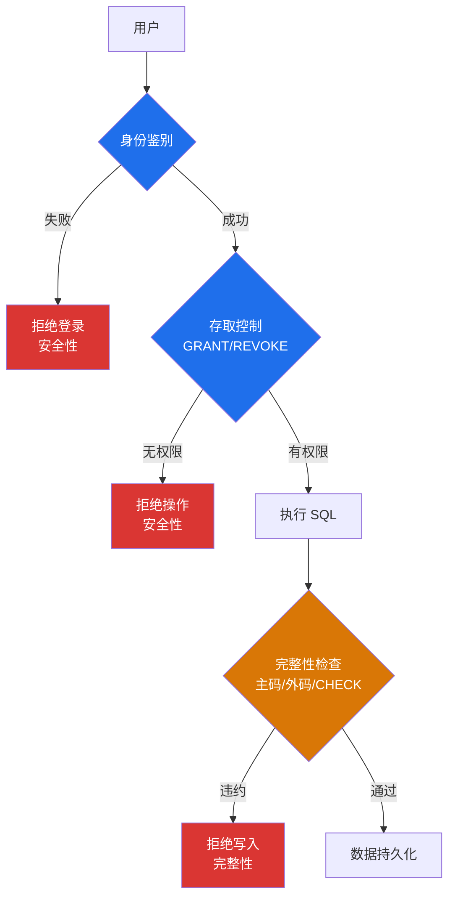

# 5.1 完整性约束概念

数据库完整性（Database Integrity）是数据库保护的一大支柱，与第4章数据库安全性并立。安全性保证"非法用户不能访问"，完整性保证"合法用户不能输入不合语义的错误数据"。本节建立完整性约束的整体框架：定义、约束条件的分类（列级/元组级/关系级，静态/动态）、DBMS 的完整性控制机制（定义、检查、违约处理三方面），并明确完整性与安全性的区别与联系。

## 一、数据库完整性的定义

> [!definition] 数据库完整性（Database Integrity）
> 数据库中数据的**正确性**（correctness）、**有效性**（validity）和**相容性**（consistency）。
> - **正确性**：数据符合现实世界语义，如年龄不能为负数；
> - **有效性**：数据在有效范围内，如月份在 1-12 之间；
> - **相容性**：数据之间逻辑一致，如外键必须在被参照表中存在。

数据库完整性通过**完整性约束条件**（Integrity Constraints）表达，由 DBMS 的完整性控制子系统进行检查与维护。

## 二、完整性约束条件的分类

完整性约束条件可从两个维度分类：**作用对象**（约束施加在哪一级）和**时间维度**（约束是否涉及状态变迁）。

### 2.1 按作用对象分类

| 类别 | 作用对象 | 约束内容 | 示例 |
| ---- | ---- | ---- | ---- |
| 列级约束 | 单个列 | 对列值的取值范围、类型、是否允许空等的约束 | `Sage INT CHECK (Sage>0 AND Sage<150)`、`NOT NULL` |
| 元组级约束 | 一个元组（行） | 元组内多个列值之间的约束 | `CHECK (EndDate >= StartDate)`：结束日期不早于开始日期 |
| 关系级约束 | 整个关系（表） | 多个元组之间或表与表之间的约束 | 实体完整性（主码唯一）、参照完整性（外码存在）、`UNIQUE` |

### 2.2 按时间维度分类

| 类别 | 含义 | 特点 | 示例 |
| ---- | ---- | ---- | ---- |
| 静态约束 | 与时间无关，对数据库**每一状态**都成立的约束 | 反映数据固有性质，不涉及状态变迁 | `Sage>0`（任何时刻年龄都为正）、主码唯一 |
| 动态约束 | 涉及数据库**状态变迁**，约束旧值到新值的变迁 | 反映业务过程的合法转换规则 | 工资只能升不能降：`NEW.Salary >= OLD.Salary` |

> [!note] 静态与动态的关系
> 静态约束关心"当前值是否合法"，动态约束关心"从旧值变到新值的过程是否合法"。例如"年龄不能为负"是静态约束（任何时刻年龄都不能为负），"年龄只能增加"是动态约束（新年龄必须大于旧年龄）。动态约束通常需用触发器（[[5.5 触发器实现完整性]]）实现。

### 2.3 综合分类矩阵

将两个维度结合，得到 6 类约束：

| | 静态 | 动态 |
| ---- | ---- | ---- |
| **列级** | 列取值范围、类型、非空（如 Sage>0） | 列值变迁规则（如工资只能升） |
| **元组级** | 元组内列间静态关系（如 EndDate≥StartDate） | 元组状态的合法转换 |
| **关系级** | 实体完整性、参照完整性、UNIQUE | 关系整体状态的变迁规则 |

## 三、完整性控制机制

> [!definition] 完整性控制机制
> DBMS 为维护数据库完整性所提供的机制，包括三方面：
> 1. **定义功能**：提供定义完整性约束条件的机制；
> 2. **检查功能**：检查用户操作是否违背完整性约束；
> 3. **违约处理**：违背约束时的响应措施。

### 3.1 定义功能

DBMS 提供 DDL 语句（如 `CREATE TABLE` 中的 `PRIMARY KEY`、`FOREIGN KEY`、`CHECK`、`NOT NULL`、`UNIQUE`）让用户声明式地定义约束。MySQL 8.0 还支持命名约束（`CONSTRAINT 约束名 ...`）便于管理。复杂约束可用触发器（[[5.5 触发器实现完整性]]）过程式定义。

### 3.2 检查功能

> [!important] 约束检查时机
> 约束检查通常在以下时机发生：
> - **立即检查（Immediate Check）**：在每条 SQL 语句执行后立即检查。默认行为。
> - **延迟检查（Deferred Check）**：在事务结束时统一检查。适用于约束依赖于事务中间状态的场景。
>
> 实体完整性、参照完整性、用户定义完整性一般在 INSERT、UPDATE、DELETE 时立即检查。

### 3.3 违约处理

| 违约处理策略 | 含义 | 适用场景 |
| ---- | ---- | ---- |
| 拒绝操作（NO ACTION / RESTRICT） | 拒绝执行违约的 SQL 语句 | 默认行为 |
| 级联操作（CASCADE） | 连带操作相关数据 | 参照完整性删除/更新 |
| 置空（SET NULL） | 将相关数据置为 NULL | 仅当列允许 NULL |
| 置默认值（SET DEFAULT） | 将相关数据置为默认值 | 列有 DEFAULT 定义 |
| 触发器处理 | 执行用户定义的触发器逻辑 | 复杂业务规则 |

## 四、完整性与安全性的区别与联系

> [!warning] 关键对比
> | 对比项 | 数据库完整性 | 数据库安全性 |
> | ---- | ---- | ---- |
> | 目标 | 防止**不合语义**的错误数据 | 防止**非法访问**与恶意破坏 |
> | 针对对象 | **数据**的正确性 | **用户**的合法性 |
> | 触发时机 | 数据写入时检查 | 访问数据库时检查 |
> | 机制 | 实体/参照/用户定义完整性、触发器 | 身份鉴别、存取控制、视图、审计、加密 |
> | 控制类型 | 数据约束 | 权限控制 |
> | 典型问题 | 学号不能为空、外键必须存在 | 非授权用户不能读取工资表 |

> [!tip] 区分要点
> - **完整性**：合法用户登录后，执行 INSERT 时如果数据不合语义（如年龄为负），DBMS 拒绝写入——这是完整性问题。
> - **安全性**：非法用户尝试登录或无权限用户尝试 SELECT 工资表——这是安全性问题。
>
> 详见 [[4.3 存取控制]] 与 [[4.1 数据库安全概述]]。

> [!note] 联系
> 二者目标一致：保证数据库**正确可用**。安全性保证"只有授权用户能访问"，完整性保证"被访问的数据本身正确"。两者协同：先经安全性检查（用户合法性），再经完整性检查（数据合法性），共同守护数据质量。

## 小结

- 数据库完整性保证数据的正确性、有效性、相容性，防止合法用户输入不合语义数据。
- 完整性约束条件按作用对象分列级、元组级、关系级；按时间分静态、动态。
- DBMS 完整性控制机制包括定义、检查、违约处理三方面。
- 完整性针对"数据正确性"，安全性针对"用户合法性"，二者互补共同保障数据质量。

## 关联

- 本章导航：[[MOC - 第5章]]
- 下一节：[[5.2 实体完整性]]
- 安全性对比：[[4.3 存取控制]]（存取控制 vs 完整性约束）
- 安全概述：[[4.1 数据库安全概述]]（安全 vs 完整性的目标差异）
- 课程总览：[[MOC - 数据库原理]]
