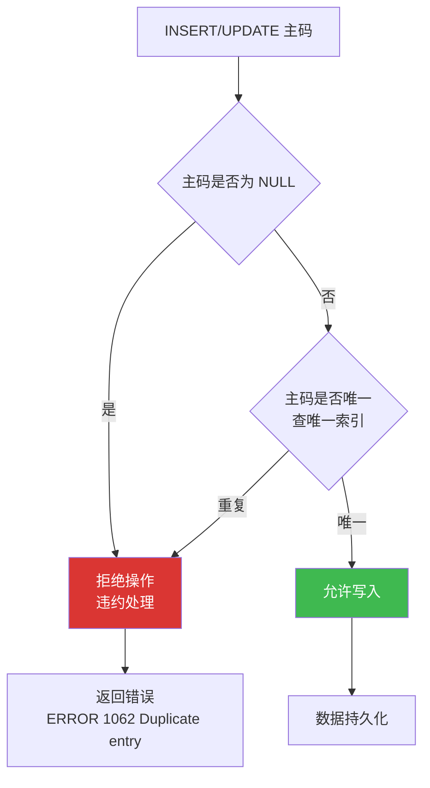

# 5.2 实体完整性

实体完整性（Entity Integrity）是关系模型最基础的完整性约束，确保关系中的每个实体都能被唯一识别。它由 E.F. Codd 在关系模型中提出，对应 [[2.3 关系的完整性]] 中的"实体完整性规则"。本节介绍实体完整性的定义、检查机制与违约处理，并给出 MySQL 8.0 中 PRIMARY KEY 的定义示例。

## 一、实体完整性的定义

> [!definition] 实体完整性规则（Entity Integrity Rule）
> 若属性（或属性组）$A$ 是基本关系 $R$ 的**主属性**（即 $A$ 是 $R$ 的主码或主码的组成部分），则 $A$ 不能取空值（NULL）。
>
> 等价表述：**主码取值唯一且非空**。

实体完整性的语义含义：

1. **唯一性**：关系中任意两个元组的主码值不能相同。这是关系模型"实体可识别"的基础——主码用于唯一标识一个元组（一个实体）。
2. **非空性**：主码的任何组成部分都不能为 NULL。因为 NULL 表示"未知"或"不存在"，无法唯一标识一个实体。

> [!note] 为什么主码不能为空
> 若允许主码为 NULL，则该元组无法被唯一识别，违反"关系是元组集合"的定义（集合元素必须可区分）。例如 `Student` 表中主码 `Sno` 为 NULL 的元组，无法回答"这是哪个学生"。

## 二、实体完整性的检查

### 2.1 检查时机

DBMS 在以下操作时检查实体完整性：

| 操作 | 检查内容 |
| ---- | ---- |
| INSERT | 新插入元组的主码值是否唯一、是否为 NULL |
| UPDATE 主码 | 更新后的主码值是否唯一、是否为 NULL |

### 2.2 检查方法

- **非空检查**：检查主码列值是否为 NULL（含主码任一组成部分）；
- **唯一性检查**：检查新主码值是否与已有元组的主码值重复。DBMS 通常通过在主码列上**自动建立唯一索引**来高效实现——插入时若索引上已存在相同键值，则违反唯一性。



### 2.3 违约处理

实体完整性违约的默认处理：**拒绝执行**该 INSERT 或 UPDATE 语句，并向用户返回错误。MySQL 8.0 返回错误码 1062（重复键）或 1048（列不能为 NULL）。

## 三、MySQL PRIMARY KEY 示例

### 3.1 最小示例表

```sql
-- MySQL 8.0，使用 scdb 数据库
USE scdb;

-- 方式一：在列定义时声明主码
CREATE TABLE Student (
    Sno   CHAR(9)      PRIMARY KEY,        -- 单列主码
    Sname VARCHAR(20)  NOT NULL,
    Ssex  CHAR(2),
    Sage  INT,
    Sdept VARCHAR(20)
);

-- 方式二：在表级约束中声明主码（适用于复合主码）
CREATE TABLE SC (
    Sno   CHAR(9),
    Cno   CHAR(4),
    Grade INT,
    PRIMARY KEY (Sno, Cno)                  -- 复合主码：学号+课程号
);
```

### 3.2 实体完整性违约演示

```sql
-- 1. 违反非空性：主码为 NULL
INSERT INTO Student(Sno, Sname) VALUES (NULL, '张三');
-- ERROR 1048 (23000): Column 'Sno' cannot be null

-- 2. 违反唯一性：主码重复
INSERT INTO Student(Sno, Sname) VALUES ('202400001', '张三');
INSERT INTO Student(Sno, Sname) VALUES ('202400001', '李四');
-- ERROR 1062 (23000): Duplicate entry '202400001' for key 'PRIMARY'

-- 3. 违反复合主码的唯一性（部分列相同但整体不同则允许）
INSERT INTO SC(Sno, Cno, Grade) VALUES ('202400001', 'C001', 85);
INSERT INTO SC(Sno, Cno, Grade) VALUES ('202400001', 'C002', 90);   -- 允许：主码整体不同
INSERT INTO SC(Sno, Cno, Grade) VALUES ('202400001', 'C001', 95);    -- 报错：主码整体重复
-- ERROR 1062 (23000): Duplicate entry '202400001-C001' for key 'PRIMARY'
```

### 3.3 主码与唯一索引

> [!info] MySQL 主码的内部实现
> MySQL 8.0 在 InnoDB 存储引擎中，主码自动创建**聚簇索引（Clustered Index）**——表数据按主码顺序物理存储。因此：
> - 主码查询非常高效（直接定位）；
> - 主码应选择**短而稳定**的列（避免长字符串、频繁更新的列），以减小索引体积与维护开销；
> - 若未显式声明 PRIMARY KEY，InnoDB 会自动选择第一个 NOT NULL UNIQUE 列作为聚簇键，或生成隐藏的 6 字节 ROWID。

### 3.4 主码与候选码的关系

> [!note] 候选码与主码
> - **候选码（Candidate Key）**：能唯一标识元组且不包含多余属性的属性组。一个关系可有多个候选码。
> - **主码（Primary Key）**：DBA 从候选码中选定的一个，作为表的主标识。
> - **主属性（Prime Attribute）**：包含在任一候选码中的属性。
> - 实体完整性规则要求：**所有主属性都不能取 NULL**，不仅是主码列。

```sql
-- 示例：候选码与主码
-- 假设 Student 表中 Sno 与 身份证号 都能唯一标识学生，则二者都是候选码
CREATE TABLE Student (
    Sno       CHAR(9)      PRIMARY KEY,           -- 选定主码
    IDCard    CHAR(18)     NOT NULL UNIQUE,         -- 另一候选码，UNIQUE 保证唯一
    Sname     VARCHAR(20)  NOT NULL,
    Sage      INT
);
-- 实体完整性：Sno 和 IDCard 都不能为 NULL（均为主属性）
```

## 小结

- 实体完整性规则：**主码取值唯一且非空**（所有主属性都不能取 NULL）。
- 检查时机：INSERT 与主码 UPDATE 时；检查方法：非空检查 + 唯一性检查（通过唯一索引）。
- 违约处理：拒绝操作并返回错误（MySQL 错误码 1048 / 1062）。
- MySQL 主码自动建立聚簇索引，应选择短而稳定的列。

## 关联

- 本章导航：[[MOC - 第5章]]
- 上一节：[[5.1 完整性约束概念]]
- 下一节：[[5.3 参照完整性]]（外码约束）
- 关系模型基础：[[2.3 关系的完整性]]（实体、参照、用户定义三类完整性的关系模型定义）
- 课程总览：[[MOC - 数据库原理]]
