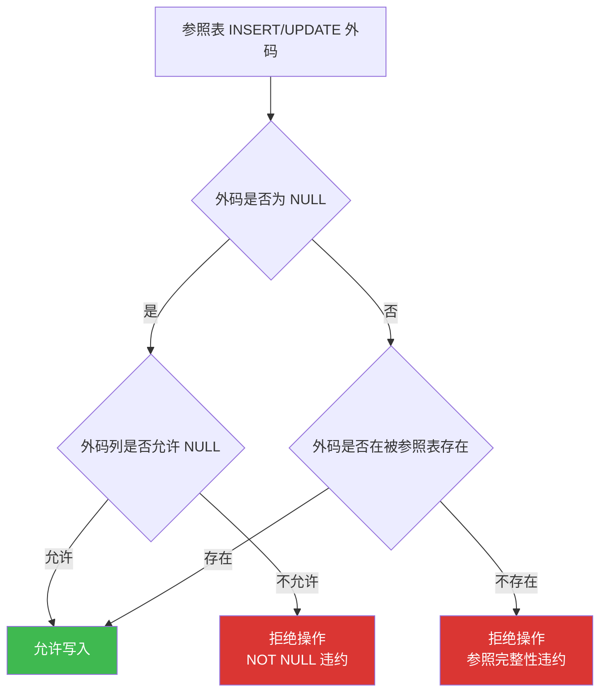
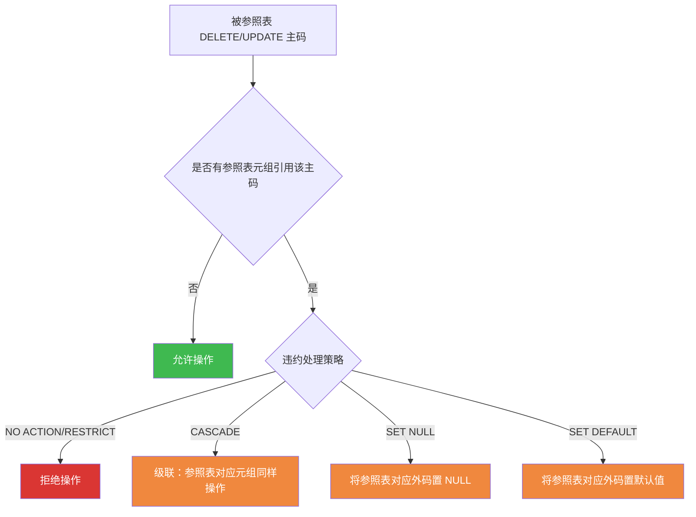
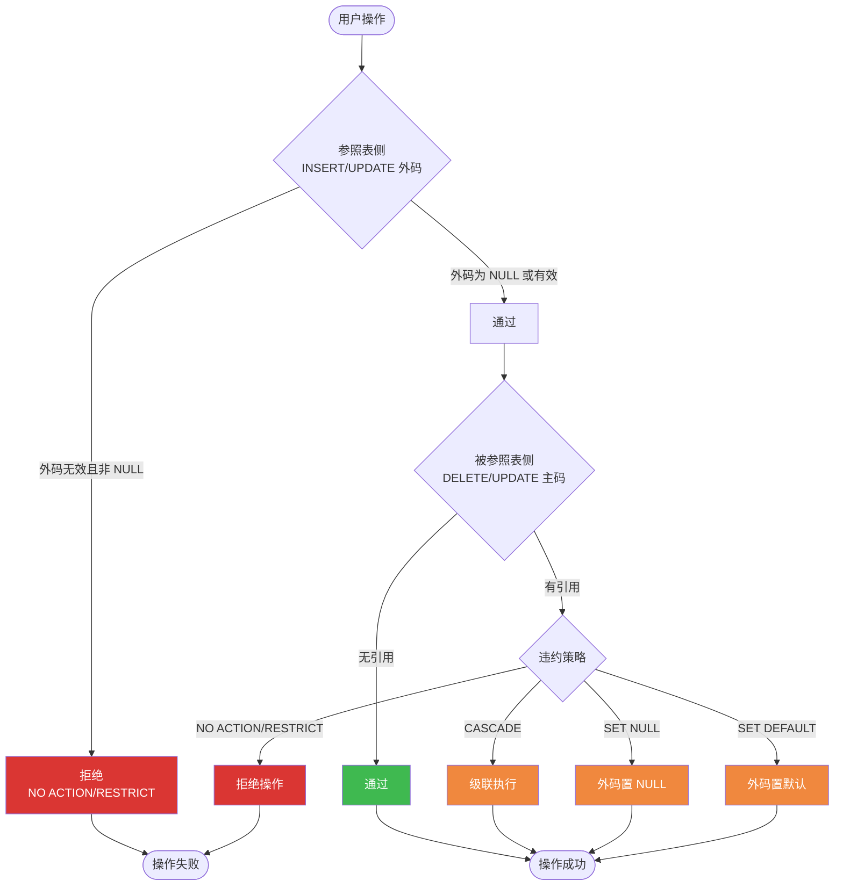

# 5.3 参照完整性

参照完整性（Referential Integrity）保证关系之间引用的正确性——当一个关系通过外码引用另一个关系的主码时，被引用的主码值必须存在。它是关系模型第二类完整性约束，对应 [[2.3 关系的完整性]] 中的"参照完整性规则"。本节是第5章重点与考点密集区，介绍外码定义、参照完整性检查的双向性、四种违约处理策略，并给出 MySQL 8.0 中 FOREIGN KEY 的完整示例。

## 一、参照完整性的定义

> [!definition] 参照完整性规则（Referential Integrity Rule）
> 若属性（或属性组）$F$ 是基本关系 $R$ 的**外码**（Foreign Key），$F$ 与基本关系 $S$ 的主码 $\bar{K}_s$ 相对应（$R$ 与 $S$ 不一定是不同的关系），则 $R$ 中每个元组在 $F$ 上的取值：
> - 或者取 NULL；
> - 或者等于 $S$ 中某个元组的主码值。
>
> 简言之：**外码要么为 NULL，要么必须在被参照表中存在**。

术语约定：

| 术语 | 含义 | 示例 |
| ---- | ---- | ---- |
| 参照关系（Referencing Relation） | 包含外码的关系 | `SC` 表（含 `Sno` 外码） |
| 被参照关系（Referenced Relation） | 被外码引用的关系 | `Student` 表（`Sno` 为主码） |
| 外码（Foreign Key） | 参照关系中的引用列 | `SC.Sno` |
| 目标列 | 被参照关系的主码 | `Student.Sno` |

> [!example] 典型参照关系
> ```sql
> -- Student(Sno, Sname, ...) 主码 Sno
> -- Course(Cno, Cname, ...) 主码 Cno
> -- SC(Sno, Cno, Grade) 主码 (Sno, Cno)，外码 Sno 参照 Student，外码 Cno 参照 Course
> ```
> SC 表通过外码 Sno 引用 Student 表，通过外码 Cno 引用 Course 表——选课记录必须指向存在的学生和存在的课程。

## 二、参照完整性的检查

参照完整性的检查是**双向**的：既检查被参照表的修改，也检查参照表的修改。

### 2.1 双向检查场景

| 场景 | 检查对象 | 检查内容 |
| ---- | ---- | ---- |
| 在参照表中 INSERT | 外码值 | 外码值在被参照表中是否存在（或为 NULL） |
| 在参照表中 UPDATE 外码 | 新外码值 | 新外码值在被参照表中是否存在（或为 NULL） |
| 在被参照表中 DELETE 主码 | 被删主码 | 是否有参照表的元组引用该主码 |
| 在被参照表中 UPDATE 主码 | 旧主码 | 是否有参照表的元组引用该主码 |

### 2.2 参照表侧的检查（保证外码有效）



### 2.3 被参照表侧的检查（处理引用依赖）



## 三、违约处理

### 3.1 四种违约处理策略

> [!important] 参照完整性违约处理四策略
> 当被参照表修改主码、且该主码被参照表引用时，按外码定义的策略处理：
>
> | 策略 | 含义 | 适用场景 |
> | ---- | ---- | ---- |
> | **NO ACTION** | 不允许违约操作，在<b>事务结束时</b>检查（标准 SQL 默认） | 严格要求无引用才能删/改 |
> | **RESTRICT** | 不允许违约操作，在<b>语句执行时立即</b>检查 | 严格立即检查 |
> | **CASCADE** | 级联：参照表中对应元组执行相同操作（删除/更新） | 强从属关系（如删学生连带删选课） |
> | **SET NULL** | 将参照表中对应外码置为 NULL（要求外码允许 NULL） | 弱关联，保留记录但断开引用 |
> | **SET DEFAULT** | 将参照表中对应外码置为默认值 | 列有 DEFAULT 定义时 |

### 3.2 NO ACTION vs RESTRICT 的细微差异

| 策略 | 检查时机 | 是否允许事务中间状态违约 |
| ---- | ---- | ---- |
| NO ACTION | 事务结束时（SQL 语句全部执行完毕） | 允许（事务中间状态可暂时违约，最终一致即可） |
| RESTRICT | 语句执行时立即 | 不允许（任一中间步骤违约即拒绝） |

> [!note] MySQL 的实现
> MySQL 8.0 中 `NO ACTION` 与 `RESTRICT` 行为相同，都是立即检查并拒绝。若需延迟检查需配合 `SET FOREIGN_KEY_CHECKS` 或事务隔离级别处理。标准 SQL 中 NO ACTION 才是默认值，但 MySQL 默认也是 RESTRICT 行为。

### 3.3 完整违约处理流程



## 四、MySQL FOREIGN KEY 示例

### 4.1 最小示例表

```sql
-- MySQL 8.0，使用 scdb 数据库
USE scdb;

-- 被参照表：Student、Course
CREATE TABLE Student (
    Sno   CHAR(9)      PRIMARY KEY,
    Sname VARCHAR(20)  NOT NULL,
    Ssex  CHAR(2),
    Sage  INT,
    Sdept VARCHAR(20)
);

CREATE TABLE Course (
    Cno     CHAR(4)     PRIMARY KEY,
    Cname   VARCHAR(40) NOT NULL,
    Cpno    CHAR(4),
    Ccredit INT
);

-- 参照表：SC，含两个外码
CREATE TABLE SC (
    Sno   CHAR(9),
    Cno   CHAR(4),
    Grade INT,
    PRIMARY KEY (Sno, Cno),                                  -- 实体完整性
    -- 外码 Sno 参照 Student.Sno：删除时级联，更新时级联
    FOREIGN KEY (Sno) REFERENCES Student(Sno)
        ON DELETE CASCADE ON UPDATE CASCADE,
    -- 外码 Cno 参照 Course.Cno：删除时置 NULL，更新时级联
    FOREIGN KEY (Cno) REFERENCES Course(Cno)
        ON DELETE SET NULL ON UPDATE CASCADE
);
```

### 4.2 违约处理演示

```sql
-- 1. 参照表侧：插入不存在外码（违约）
INSERT INTO SC(Sno, Cno, Grade) VALUES ('202499999', 'C001', 85);
-- ERROR 1452 (23000): Cannot add or update a child row: a foreign key constraint fails

-- 2. 正常插入
INSERT INTO Student VALUES ('202400001','张三','男',20,'计算机');
INSERT INTO Course VALUES ('C001','数据库原理',NULL,3);
INSERT INTO SC VALUES ('202400001', 'C001', 88);              -- 成功

-- 3. 被参照表侧：删除学生（CASCADE 级联）
DELETE FROM Student WHERE Sno = '202400001';
-- 结果：Student 中该记录被删除，SC 中对应选课记录也被级联删除

-- 4. 被参照表侧：删除课程（SET NULL）
-- 假设 SC 表中存在引用 C001 的记录
DELETE FROM Course WHERE Cno = 'C001';
-- 结果：Course 中 C001 被删除，SC 中对应记录的 Cno 被置为 NULL（Grade 仍保留）

-- 5. RESTRICT 拒绝演示
CREATE TABLE SC2 (
    Sno CHAR(9),
    PRIMARY KEY (Sno),
    FOREIGN KEY (Sno) REFERENCES Student(Sno) ON DELETE RESTRICT
);
INSERT INTO SC2 VALUES ('202400001');
DELETE FROM Student WHERE Sno = '202400001';
-- ERROR 1451 (23000): Cannot delete or update a parent row: a foreign key constraint fails
```

> [!warning] SET NULL 的前提
> 使用 `SET NULL` 策略时，外码列必须允许 NULL。若外码是主码的组成部分（如 SC 的 `(Sno, Cno)` 主码），则该列不能为 NULL（实体完整性要求），此时 `SET NULL` 将无法生效——MySQL 会报错。设计时需注意外码是否同时是主属性。

### 4.3 外码约束的查看与删除

```sql
-- 查看表的所有外键约束
SHOW CREATE TABLE SC;

-- 查询 information_schema 中的外键信息
SELECT CONSTRAINT_NAME, TABLE_NAME, COLUMN_NAME, REFERENCED_TABLE_NAME, REFERENCED_COLUMN_NAME
FROM information_schema.KEY_COLUMN_USAGE
WHERE TABLE_SCHEMA = 'scdb' AND TABLE_NAME = 'SC' AND REFERENCED_TABLE_NAME IS NOT NULL;

-- 删除外键约束（需先查询约束名）
ALTER TABLE SC DROP FOREIGN KEY sc_ibfk_1;
```

## 小结

- 参照完整性规则：**外码要么为 NULL，要么必须在被参照表中存在**。
- 检查是双向的：参照表修改外码时检查外码有效性；被参照表修改主码时处理引用依赖。
- 四种违约处理策略：NO ACTION/RESTRICT（拒绝）、CASCADE（级联）、SET NULL（置空）、SET DEFAULT（置默认值）。
- MySQL 通过 `FOREIGN KEY ... REFERENCES ... ON DELETE/UPDATE` 定义外码与违约处理策略。
- SET NULL 要求外码列允许 NULL，且外码不能同时是主属性。

## 关联

- 本章导航：[[MOC - 第5章]]
- 上一节：[[5.2 实体完整性]]
- 下一节：[[5.4 用户定义完整性]]
- 关系模型基础：[[2.3 关系的完整性]]（三类完整性的关系模型定义）
- 课程总览：[[MOC - 数据库原理]]
