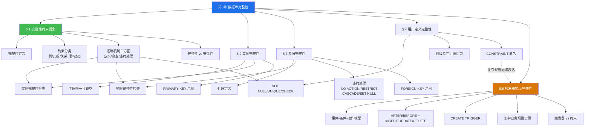

# MOC - 第5章 数据库完整性

> [!info] 本章定位
> 本章解决的核心问题是：**如何防止合法用户向数据库中输入不合语义的错误数据**。第4章安全性保证"非法用户不能访问"，第5章完整性保证"合法用户不能输入错误数据"——即使一个合法用户登录后执行 INSERT/UPDATE，DBMS 也要检查其数据是否符合业务规则（如学号不能为空、外键必须存在、工资不得低于最低工资等）。
>
> 数据库完整性（Database Integrity）通过**完整性约束条件**和**完整性控制机制**实现。约束条件按作用对象分为列级、元组级、关系级，按是否依赖时间分为静态约束与动态约束；DBMS 的完整性控制机制包括**定义、检查、违约处理**三方面。本章按"实体完整性 → 参照完整性 → 用户定义完整性 → 触发器"的层次展开，前三者是声明式约束，触发器是过程式约束的实现手段。

## 学习路线图

> [!note] 学习顺序说明
> 先在 5.1 建立完整性约束的整体框架（分类与控制机制），再依次学习三类声明式约束：**实体完整性**（主码）、**参照完整性**（外码）、**用户定义完整性**（业务规则）。这三类约束是 SQL 标准 `CREATE TABLE` 中声明式表达，简单高效但表达能力有限。**触发器**（5.5）是表达复杂业务规则的过程式手段，能实现声明式约束无法覆盖的场景（如跨表约束、条件级联、审计日志），是本章的难点。

## 知识点导航

| 节号 | 标题 | 入口 | 核心内容 | 重要度 |
| ---- | ---- | ---- | ---- | ---- |
| 5.1 | 完整性约束概念 | [[5.1 完整性约束概念]] | 完整性定义、约束分类、控制机制三方面、完整性 vs 安全性 | ★★★★ |
| 5.2 | 实体完整性 | [[5.2 实体完整性]] | 主码唯一与非空、检查机制、PRIMARY KEY 示例 | ★★★★ |
| 5.3 | 参照完整性 | [[5.3 参照完整性]] | 外码、参照检查、四种违约处理、FOREIGN KEY 示例 | ★★★★★ |
| 5.4 | 用户定义完整性 | [[5.4 用户定义完整性]] | NOT NULL/UNIQUE/CHECK、列级与元组级约束 | ★★★ |
| 5.5 | 触发器实现完整性 | [[5.5 触发器实现完整性]] | 事件-条件-动作模型、CREATE TRIGGER、复杂规则、与约束对比 | ★★★★★ |

## 核心考点

> [!warning] 核心考点（7点）
> 1. **完整性 vs 安全性**：完整性防止合法用户输入不合语义数据（针对"数据正确性"），安全性防止非法用户非法访问（针对"用户合法性"）。详见 [[4.3 存取控制]] 对比。
> 2. **完整性约束分类**：按作用对象分列级、元组级、关系级；按是否依赖时间分静态约束（与时间无关）与动态约束（涉及状态变迁）。
> 3. **完整性控制机制三方面**：定义（DBMS 提供定义约束的机制）、检查（在何时何地检查）、违约处理（违约时如何响应）。
> 4. **实体完整性规则**：主码取值唯一且非空。检查时机：INSERT 与主码 UPDATE 时。违约处理：拒绝操作。
> 5. **参照完整性违约处理四策略**：NO ACTION/RESTRICT（拒绝）、CASCADE（级联）、SET NULL（置空）、SET DEFAULT（置默认值）。RESTRICT 要求无依赖才能拒绝，NO ACTION 在事务结束时检查。
> 6. **参照完整性的双向检查**：被参照表修改（删除/更新主码）要检查是否被参照；参照表修改（插入/更新外码）要检查外码是否在被参照表中存在。
> 7. **触发器 vs 声明式约束**：声明式约束（PRIMARY KEY、FOREIGN KEY、CHECK）简单高效但表达能力有限；触发器灵活强大可表达复杂业务规则，但开发与维护成本高，性能开销大。优先用约束，复杂场景才用触发器。

## 自测题

> [!question] 自测题（4道）
> 1. 简述数据库完整性约束条件的分类（按作用对象与按时间维度），并各举一例。
> 2. 在 `SC(Sno, Cno, Grade)` 表中，`(Sno, Cno)` 是主码，`Sno` 是外码参照 `Student(Sno)`，`Cno` 是外码参照 `Course(Cno)`。若从 `Student` 表删除一条学生记录，`SC` 表中对应选课记录应如何处理？列出四种违约处理策略及效果。
> 3. 写出在 `Employee(EmpID, Name, Salary, Dept)` 表上定义"工资不得低于本部门最低工资"约束的思路，并说明为何此约束难以用 CHECK 实现、需用触发器。
> 4. 简述触发器的"事件-条件-动作"模型，并说明 AFTER 与 BEFORE 触发器的区别与典型应用场景。
>
> 参考答案见各小节内容及 [[MOC - 第5章习题]]。

## 章节导航

- 上一级：[[MOC - 数据库原理]]
- 上一章：[[MOC - 第4章]]
- 下一章：[[MOC - 第6章]]
- 本章习题：[[MOC - 第5章习题]]
