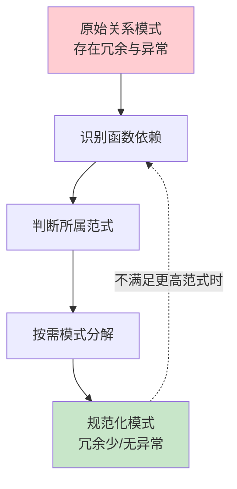

# 6.1 问题提出

关系模式设计的优劣直接决定数据库的存储效率与操作正确性。一个随意设计的关系模式，即使满足关系完整性约束，仍可能在存储与维护时暴露出严重的**数据冗余**与**操作异常**。本节以一个具体实例揭示这些问题，并指出其本质在于**函数依赖关系与模式结构不匹配**，从而引出后续范式与模式分解理论。

## 关系模式存储异常的四大问题

> [!definition] 四类典型异常
> - **数据冗余（Data Redundancy）**：同一信息在表中重复存储，浪费存储空间并增加维护成本。
> - **更新异常（Update Anomaly）**：修改一条逻辑信息需同时修改多行，遗漏任一行即产生数据不一致。
> - **插入异常（Insertion Anomaly）**：因缺少主码（或关键属性）值而无法插入本应存在的客观信息。
> - **删除异常（Deletion Anomaly）**：删除某信息时，连带丢失了与之无关的另一类信息。

## 示例：学生-系-课程关系模式 S-L-C

> [!example] 不良设计示例
> 设有关系模式
> $$\text{S-L-C}(\text{Sno},\ \text{Sdept},\ \text{Sloc},\ \text{Cno},\ \text{Grade})$$
> 其中 $\text{Sno}$ 为学号、$\text{Sdept}$ 为所在系、$\text{Sloc}$ 为宿舍楼地址（设每个系学生住同一宿舍楼）、$\text{Cno}$ 为课程号、$\text{Grade}$ 为成绩。
>
> 函数依赖关系：
> - $(\text{Sno},\text{Cno}) \to \text{Grade}$ （学号+课程号决定成绩）
> - $\text{Sno} \to \text{Sdept}$ （学号决定所在系）
> - $\text{Sdept} \to \text{Sloc}$ （系决定宿舍楼）
>
> 码为 $(\text{Sno},\text{Cno})$。注意 $\text{Sdept}$、$\text{Sloc}$ 并不完全函数依赖于码，而是部分函数依赖于码（仅依赖 $\text{Sno}$）。

设有一组数据：

| Sno | Sdept | Sloc | Cno | Grade |
| --- | --- | --- | --- | --- |
| S1 | 计算机系 | A 楼 | C1 | 90 |
| S1 | 计算机系 | A 楼 | C2 | 85 |
| S1 | 计算机系 | A 楼 | C3 | 88 |
| S2 | 信息系 | B 楼 | C1 | 78 |
| S2 | 信息系 | B 楼 | C2 | 80 |
| S3 | 计算机系 | A 楼 | C1 | 92 |

### 各类异常的具体表现

> [!warning] 数据冗余
> 每个学生每修一门课，其所在系 $\text{Sdept}$ 与宿舍楼 $\text{Sloc}$ 就被重复存储一次。学生 $S1$ 修了 3 门课，"计算机系 / A 楼"重复存储 3 次；学生 $S2$ 修了 2 门课，"信息系 / B 楼"重复存储 2 次。冗余量随选课数线性增长。

> [!warning] 更新异常
> 若学生 $S1$ 从计算机系转入信息系（宿舍楼变为 B 楼），需同时修改 $S1$ 的全部 3 行记录。漏改一行，则同一学生的所在系出现两个不同值，造成数据不一致。

> [!warning] 插入异常
> - 学生尚未选课时（$\text{Cno}$ 为空），由于码 $(\text{Sno},\text{Cno})$ 中的 $\text{Cno}$ 为空，违反实体完整性，无法插入该学生及其所在系、宿舍楼信息。
> - 一个新成立的系尚无学生时，无法记录该系的宿舍楼信息（因为没有 $\text{Sno}$）。

> [!warning] 删除异常
> 若学生 $S3$ 仅选修了 $C1$ 一门课并取消该选课记录，则删除该行后，$S3$ 的所在系与宿舍楼信息也随之丢失——尽管我们只想删除选课，却连带删除了学生的系别信息。

## 异常的本质：函数依赖与模式结构不匹配

> [!theorem] 问题本质
> S-L-C 中的异常并非偶然，而是源于**一个关系模式内同时承载了多组互不相同的函数依赖**，且这些函数依赖的决定因素都不是模式的码。

具体地，S-L-C 的函数依赖可拆为两组：

1. **选课信息组**：$(\text{Sno},\text{Cno}) \to \text{Grade}$，决定因素是码，正常。
2. **学生-系信息组**：$\text{Sno} \to \text{Sdept}$，$\text{Sdept} \to \text{Sloc}$，决定因素 $\text{Sno}$ 不是码。

由于第 2 组的决定因素 $\text{Sno}$ 仅为码的一部分，导致 $\text{Sdept}$、$\text{Sloc}$ **部分函数依赖**于码；又因 $\text{Sno}\to\text{Sdept}\to\text{Sloc}$，存在 $\text{Sloc}$ 对码的**传递函数依赖**。这两类"非正常"依赖正是冗余与异常的根源。

```mermaid
flowchart LR
    Code[(Sno, Cno)<br/>码] -->|完全依赖| Grade
    Sno -->|部分依赖| Sdept
    Sdept --> Sloc
    Sdept -.传递依赖.-> Sloc

    style Code fill:#fff9c4
    style Grade fill:#c8e6c9
    style Sdept fill:#ffcdd2
    style Sloc fill:#ffcdd2
```

## 规范化的必要性

> [!note] 规范化思想
> 解决上述问题的方法是**模式分解**：把一个"大而杂"的关系模式按函数依赖的"亲缘关系"拆分为若干"小而专"的关系模式，使每个模式内的非主属性都"恰当地"依赖于码。
>
> S-L-C 可分解为：
> - $\text{SC}(\text{Sno},\text{Cno},\text{Grade})$ —— 选课关系
> - $\text{S-D}(\text{Sno},\text{Sdept})$ —— 学生-系关系
> - $\text{D-L}(\text{Sdept},\text{Sloc})$ —— 系-宿舍楼关系

分解后：
- 学生 $S1$ 的系别信息仅在 S-D 中存储 1 次，消除冗余；
- 转系只需修改 S-D 的 1 行，无更新异常；
- 学生未选课时也可在 S-D 中插入，无插入异常；
- 删除 S3 的选课只影响 SC，S-D 中 $S3$ 的系别信息保留，无删除异常。

判定"分解是否合理"、分解到什么程度、是否保证信息不丢失等问题，正是 [[6.5 模式分解]] 的主题；而判定一个模式"是否已经足够好"的尺度，由 [[6.3 范式（1NF、2NF、3NF、BCNF）]] 给出。两者的理论基础则统一于 [[6.2 函数依赖]]。

## 关系模式规范化的基本思路



> [!summary] 本节要点
> - 数据冗余与三大异常（更新、插入、删除）是不良关系模式的共同病症。
> - 病根是**函数依赖与模式结构不匹配**：非主属性对码存在部分依赖或传递依赖。
> - 治法是**模式分解**，将模式规范化到合适的范式。
> - 后续各节依次给出分析工具（6.2）、判定尺度（6.3、6.4）与分解算法（6.5）。

## 关联与延伸

- 先修：[[MOC - 第2章]]（关系模型与完整性约束，码与实体完整性）
- 后续：[[6.2 函数依赖]]、[[6.3 范式（1NF、2NF、3NF、BCNF）]]、[[6.5 模式分解]]
- 应用：[[MOC - 第7章]]（逻辑结构设计中需把 E-R 模型转换为规范化关系模式）
