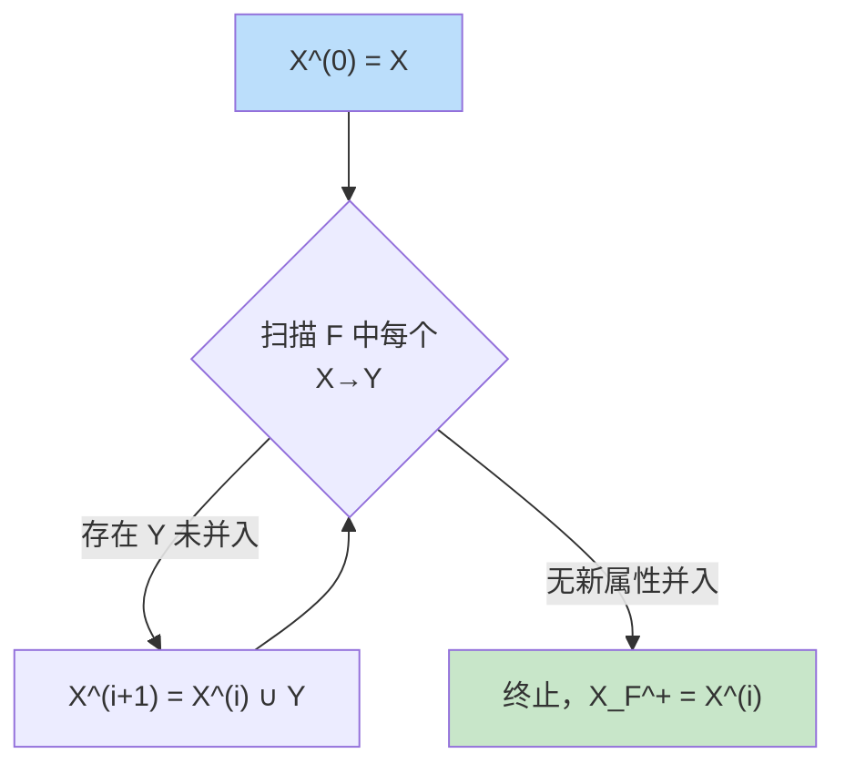
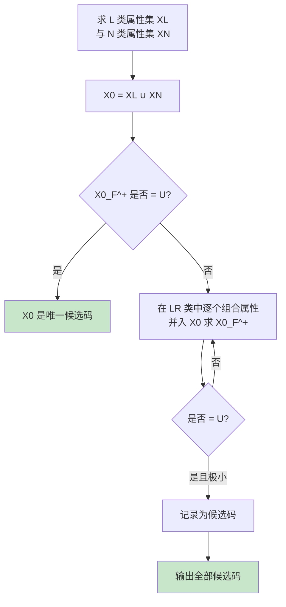

# 6.2 函数依赖

函数依赖（Functional Dependency, FD）是关系数据理论的**形式化语言**。它用数学化的方式刻画"属性值之间的决定关系"，使我们能够精确地分析关系模式存在的问题、判断范式归属、求解候选码、检验模式分解的等价性。本节是 [[6.3 范式（1NF、2NF、3NF、BCNF）]]、[[6.5 模式分解]] 的理论基础。

## 函数依赖的定义

> [!definition] 函数依赖
> 设 $R(U)$ 是属性集 $U$ 上的关系模式，$X, Y \subseteq U$。若对 $R(U)$ 的任意一个可能的关系 $r$，$r$ 中不可能存在两个元组在 $X$ 上的属性值相等而在 $Y$ 上的属性值不相等，则称 **$X$ 函数决定 $Y$**，或 **$Y$ 函数依赖于 $X$**，记作 $X \to Y$。

> [!note] 定义要点
> - 函数依赖是**语义范畴**的概念，必须根据现实世界的语义来断定，不能仅凭某一时刻的某个具体关系实例来断定。
> - 函数依赖是**对所有可能的关系**而言的：只要存在某一可能的关系 $r$ 违反"X 相等则 Y 必相等"，就认为 $X \to Y$ 不成立。
> - 若 $X \to Y$ 且 $Y \not\subseteq X$，则称 $X \to Y$ 是**非平凡的函数依赖**；若 $Y \subseteq X$，则称 $X \to Y$ 是**平凡的函数依赖**。

> [!example] 函数依赖示例
> 对关系模式 `Student(Sno, Sname, Ssex, Sage, Sdept)`：
> - 由于每个学号唯一对应一名学生，有 $\text{Sno}\to\text{Sname},\ \text{Sno}\to\text{Ssex},\ \text{Sno}\to\text{Sage},\ \text{Sno}\to\text{Sdept}$。
> - 反过来 $\text{Sname}\to\text{Sno}$ 一般**不成立**，因为可能存在同名学生。
> - 平凡依赖：$\text{Sno}\to\text{Sno}$，$(\text{Sno},\text{Sname})\to\text{Sno}$（必然成立，无信息价值）。

## 完全函数依赖与部分函数依赖

> [!definition] 完全 / 部分函数依赖
> 设 $R(U)$，$X\subseteq U$，$Y\subseteq U$，$X \to Y$。若对任意 $X' \subsetneq X$，都有 $X' \not\to Y$，则称 $Y$ **完全函数依赖**于 $X$，记作 $X \xrightarrow{F} Y$；否则称 $Y$ **部分函数依赖**于 $X$，记作 $X \xrightarrow{P} Y$。

> [!example] 完全与部分依赖
> 对 `SC(Sno, Cno, Grade)`：
> - 成绩由学号与课程号共同决定，缺一不可，故 $(\text{Sno},\text{Cno}) \xrightarrow{F} \text{Grade}$。
>
> 对 S-L-C（见 [[6.1 问题提出]]）：
> - $\text{Sdept}$ 仅依赖 $\text{Sno}$（不依赖 $\text{Cno}$），故 $(\text{Sno},\text{Cno}) \xrightarrow{P} \text{Sdept}$。这正是 2NF 要消除的依赖。

## 传递函数依赖

> [!definition] 传递函数依赖
> 设 $R(U)$，若 $X \to Y$（$Y \not\subseteq X$，且 $Y \not\to X$），$Y \to Z$，则称 $Z$ 对 $X$ **传递函数依赖**，记作 $X \xrightarrow{\text{传递}} Z$。

> [!warning] 传递依赖的两个前提
> 1. **$Y \not\subseteq X$**：否则 $X\to Y$ 是平凡依赖，谈不上传递。
> 2. **$Y \not\to X$**：若 $Y \to X$ 也成立，则 $X$ 与 $Y$ 实际上互相决定（等价），$Z$ 对 $X$ 的依赖等价于直接依赖，不算传递。

> [!example] 传递依赖
> 在 S-L-C 中：$\text{Sno}\to\text{Sdept}$，$\text{Sdept}\to\text{Sloc}$，且 $\text{Sdept}\not\to\text{Sno}$（一个系有多名学生），故 $\text{Sloc}$ 对 $\text{Sno}$ 传递函数依赖。这正是 3NF 要消除的依赖。

## 码的形式化定义

> [!definition] 候选码、主码、主属性、外码
> 设 $K$ 为关系模式 $R(U,F)$ 的一个属性或属性组。
> - **候选码（Candidate Key）**：若 $K \xrightarrow{F} U$（即 $K$ 完全函数决定全部属性 $U$），且 $K$ 的任何真子集都不能函数决定 $U$，则称 $K$ 为候选码。
> - **主码（Primary Key）**：若一个关系模式有多个候选码，选定其中一个为主码。
> - **主属性（Prime Attribute）**：包含在**任何一个候选码**中的属性。不包含在任何候选码中的属性称为**非主属性（Non-prime Attribute）**。
> - **全码（All-key）**：候选码包含全部属性的关系模式。
> - **外码（Foreign Key）**：若关系模式 $R$ 中某属性或属性组 $X$ 不是 $R$ 的码，但 $X$ 是另一关系模式 $S$ 的码，则称 $X$ 为 $R$ 的外码。

> [!example] 码的判定
> - `SC(Sno, Cno, Grade)`：$(\text{Sno},\text{Cno})\xrightarrow{F}\{\text{Sno},\text{Cno},\text{Grade}\}$，候选码为 $(\text{Sno},\text{Cno})$，主属性为 $\{\text{Sno},\text{Cno}\}$，非主属性为 $\{\text{Grade}\}$。
> - `R(A,B,C)`，$F=\{AB\to C,\ C\to B\}$：候选码有 $AB$ 和 $AC$ 两个（由 $C\to B$ 可得 $AC\to AB\to ABC$）。主属性为 $\{A,B,C\}$，无非主属性。

## Armstrong 公理体系

> [!definition] Armstrong 公理
> 设关系模式 $R(U,F)$，$X,Y,Z\subseteq U$。Armstrong 公理包含以下三条推理规则：
>
> 1. **A1 自反律（Reflexivity）**：若 $Y\subseteq X\subseteq U$，则 $X\to Y$ 成立。
> 2. **A2 增广律（Augmentation）**：若 $X\to Y$，且 $Z\subseteq U$，则 $XZ\to YZ$ 成立。
> 3. **A3 传递律（Transitivity）**：若 $X\to Y$ 且 $Y\to Z$，则 $X\to Z$ 成立。

> [!theorem] Armstrong 公理的有效性与完备性
> Armstrong 公理是**有效的**（由它推出的任一函数依赖必在 $F^+$ 中）且**完备的**（$F^+$ 中的任一函数依赖均可由公理从 $F$ 推出）。因此公理体系可作为函数依赖推导的可靠基础。

### 导出规则

> [!definition] 三个导出规则
> 1. **合并规则（Union）**：若 $X\to Y$ 且 $X\to Z$，则 $X\to YZ$。
> 2. **分解规则（Decomposition）**：若 $X\to YZ$，则 $X\to Y$ 且 $X\to Z$。
> 3. **伪传递规则（Pseudo-transitivity）**：若 $X\to Y$ 且 $YW\to Z$，则 $XW\to Z$。

> [!proof] 合并规则的推导
> 已知 $X\to Y$ 且 $X\to Z$。
> - 由 A2 增广律，对 $X\to Y$ 加 $X$ 得 $X\to XY$；
> - 由 A2 增广律，对 $X\to Z$ 加 $Y$ 得 $XY\to YZ$；
> - 由 A3 传递律，$X\to XY$ 与 $XY\to YZ$ 联立得 $X\to YZ$。$\square$

> [!proof] 分解规则的推导
> 已知 $X\to YZ$。因 $Y\subseteq YZ$，由 A1 自反律得 $YZ\to Y$；同理 $YZ\to Z$。再由 A3 传递律分别得 $X\to Y$ 与 $X\to Z$。$\square$

> [!proof] 伪传递规则的推导
> 已知 $X\to Y$ 且 $YW\to Z$。由 A2 增广律，对 $X\to Y$ 加 $W$ 得 $XW\to YW$；再由 A3 传递律与 $YW\to Z$ 联立得 $XW\to Z$。$\square$

> [!note] 分解与合并的推论
> 由合并规则与分解规则可得：$X\to A_1 A_2\cdots A_k \iff X\to A_i\ (i=1,2,\ldots,k)$。因此判断 $X\to Y$ 是否成立只需逐个属性判断。

## 属性闭包 $X_F^+$

> [!definition] 属性闭包
> 设 $F$ 为 $R(U)$ 上的函数依赖集，$X\subseteq U$。称所有由 $F$ 按 Armstrong 公理可从 $X$ 推出的属性的集合为 **$X$ 关于 $F$ 的闭包**，记为
> $$X_F^+ = \{A \mid X\to A \text{ 可由 } F \text{ 经 Armstrong 公理推出}\}$$

> [!theorem] 闭包的判定意义
> - $X\to Y$ 能由 $F$ 推出 $\iff Y\subseteq X_F^+$。
> - $X$ 是候选码 $\iff X_F^+ = U$（且 $X$ 极小）。

### 属性闭包的计算算法

> [!example] 闭包计算示例
> 设 $R(A,B,C,D,E)$，$F=\{AB\to C,\ B\to D,\ C\to E,\ EC\to B\}$。求 $(AB)_F^+$。
>
> **步骤**：
> 1. 初始化 $X^{(0)}=\{A,B\}$。
> 2. 第一轮扫描 $F$：
>    - $AB\to C$：$AB\subseteq X^{(0)}$，并入 $C$，得 $X^{(1)}=\{A,B,C\}$。
>    - $B\to D$：$B\subseteq X^{(1)}$，并入 $D$，得 $X^{(1)}=\{A,B,C,D\}$。
>    - $C\to E$：$C\subseteq X^{(1)}$，并入 $E$，得 $X^{(1)}=\{A,B,C,D,E\}$。
>    - $EC\to B$：$B$ 已在 $X^{(1)}$ 中。
> 3. 因 $X^{(1)}=U$，终止。
>
> 故 $(AB)_F^+=\{A,B,C,D,E\}=U$，即 $AB$ 是候选码（需再验证其极小性：$A_F^+=\{A\}\ne U$，$B_F^+=\{B,D\}\ne U$，故 $AB$ 极小，确为候选码）。

## 最小函数依赖集

> [!definition] 最小函数依赖集（最小覆盖）
> 若函数依赖集 $F$ 满足以下三个条件，则称 $F$ 为一个**最小函数依赖集**（也叫最小覆盖）：
> 1. $F$ 中每个函数依赖的右部仅含**单个属性**。
> 2. $F$ 中不存在这样的函数依赖 $X\to A$，使得 $F$ 与 $F-\{X\to A\}$ 等价（即 $F$ 中无**多余依赖**）。
> 3. $F$ 中不存在这样的函数依赖 $X\to A$，$X$ 有真子集 $Z$ 使得 $(F-\{X\to A\})\cup\{Z\to A\}$ 与 $F$ 等价（即 $F$ 中各依赖左部无**多余属性**）。

> [!theorem] 最小覆盖的存在性与等价性
> 任一函数依赖集 $F$ 都存在至少一个最小覆盖 $F_{\min}$，且 $F_{\min}^+ = F^+$（即二者等价，可互相推出全部函数依赖）。

### 最小覆盖的求法

> [!example] 最小覆盖求解示例
> 设 $F=\{A\to B,\ A\to C,\ AB\to C,\ B\to C\}$，求 $F_{\min}$。
>
> **步骤 1（右部单属性化）**：$F$ 已经全部单属性，跳过。
>
> **步骤 2（去除多余依赖）**：
> - 考察 $A\to B$：令 $G=F-\{A\to B\}=\{A\to C,\ AB\to C,\ B\to C\}$，求 $A_G^+=\{A,C\}$，$B\notin A_G^+$，故 $A\to B$ 不能去掉。
> - 考察 $A\to C$：令 $G=F-\{A\to C\}$，$A_G^+=\{A,B,C\}$（$A\to B$ 推出 $B$，$B\to C$ 推出 $C$），$C\in A_G^+$，故 $A\to C$ 多余，删去。$F$ 更新为 $\{A\to B,\ AB\to C,\ B\to C\}$。
> - 考察 $AB\to C$：令 $G=F-\{AB\to C\}$，$(AB)_G^+=\{A,B,C\}$（$A\to B$、$B\to C$），$C\in(AB)_G^+$，故 $AB\to C$ 多余，删去。$F$ 更新为 $\{A\to B,\ B\to C\}$。
> - 考察 $B\to C$：令 $G=F-\{B\to C\}$，$B_G^+=\{B\}$，$C\notin B_G^+$，故不能去掉。
>
> **步骤 3（左部去多余属性）**：$F=\{A\to B,\ B\to C\}$ 左部均为单属性，无多余属性。
>
> 故 $F_{\min}=\{A\to B,\ B\to C\}$。

> [!warning] 最小覆盖不唯一
> 由于"去除多余依赖"时考察顺序不同，同一 $F$ 可能求得多个不同的最小覆盖。但所有最小覆盖的**依赖个数相同**，且彼此等价。

## 候选码求解算法

> [!definition] 属性分类法
> 给定 $R(U,F)$，将 $U$ 中属性按其在 $F$ 中的出现位置分为四类：
> - **L 类**：仅在 $F$ 左部出现的属性。**必出现在所有候选码中**。
> - **R 类**：仅在 $F$ 右部出现的属性。**必不出现在任何候选码中**。
> - **LR 类**：在 $F$ 左右两部都出现的属性。**可能出现在候选码中**。
> - **N 类**：不在 $F$ 中出现的属性。**必出现在所有候选码中**（与 L 类合并处理）。

### 候选码求解步骤

> [!example] 候选码求解
> 设 $R(A,B,C,D,E)$，$F=\{A\to BC,\ CD\to E,\ B\to D,\ E\to A\}$，求全部候选码。
>
> **第 1 步：属性分类**（逐属性检查其在 $F$ 中左右部的出现情况）
>
> | 属性 | 左部出现 | 右部出现 | 类别 |
> | --- | --- | --- | --- |
> | $A$ | $A\to BC$ | $E\to A$ | LR |
> | $B$ | $B\to D$ | $A\to BC$ | LR |
> | $C$ | $CD\to E$ | $A\to BC$ | LR |
> | $D$ | $CD\to E$ | $B\to D$ | LR |
> | $E$ | $E\to A$ | $CD\to E$ | LR |
>
> L 类、R 类、N 类均为空，全部属性属 LR 类。需在 LR 类中按属性数从少到多组合求闭包。
>
> **第 2 步：单属性闭包**
>
> - $A_F^+$：$A\to BC$ 得 $\{A,B,C\}$；$B\to D$ 得 $\{A,B,C,D\}$；$CD\to E$ 得 $\{A,B,C,D,E\}=U$ ✓
> - $E_F^+$：$E\to A$ 得 $\{E,A\}$；$A\to BC$ 得 $\{E,A,B,C\}$；$B\to D$ 得 $\{E,A,B,C,D\}=U$ ✓
> - $B_F^+=\{B,D\}\ne U$；$C_F^+=\{C\}\ne U$；$D_F^+=\{D\}\ne U$。
>
> 故 $A$、$E$ 均为候选码。
>
> **第 3 步：两属性组合闭包**（跳过含 $A$ 或 $E$ 的组合，因其必含已有候选码而非极小）
>
> - $BC_F^+$：$B\to D$ 得 $\{B,C,D\}$；$CD\to E$ 得 $\{B,C,D,E\}$；$E\to A$ 得 $\{A,B,C,D,E\}=U$ ✓
> - $CD_F^+$：$CD\to E$ 得 $\{C,D,E\}$；$E\to A$ 得 $\{A,C,D,E\}$；$A\to BC$ 得 $\{A,B,C,D,E\}=U$ ✓
> - $BD_F^+=\{B,D\}\ne U$（$CD\to E$ 缺 $C$，链断）。
>
> 故 $BC$、$CD$ 均为候选码。
>
> **第 4 步：验证极小性**
>
> $A$、$E$、$BC$、$CD$ 互不为彼此子集，均极小。三属性及以上组合必含上述某个候选码为真子集，无需再算。
>
> **结论**：候选码为 $A$、$E$、$BC$、$CD$ 共 4 个。主属性 $=\{A,B,C,D,E\}=U$（全为主属性，无非主属性）。

> [!warning] 候选码求解的常见错误
> 1. 漏掉"含 N 类属性"的情形（N 类属性必在候选码中）。
> 2. 未验证"极小性"：$X_F^+=U$ 但 $X$ 含已有候选码的真子集时，$X$ 不是候选码。
> 3. 仅找到部分候选码：必须穷尽所有"单属性 + L/N 类"组合、两属性组合、三属性组合……直到全部候选码找出。

## 本节要点小结

| 概念 | 符号 | 关键判定 |
| ---- | ---- | ---- |
| 函数依赖 | $X\to Y$ | $X$ 相等则 $Y$ 必相等 |
| 完全函数依赖 | $X\xrightarrow{F}Y$ | 任意 $X'\subsetneq X$ 都不能决定 $Y$ |
| 部分函数依赖 | $X\xrightarrow{P}Y$ | 存在 $X'\subsetneq X$ 使 $X'\to Y$ |
| 传递函数依赖 | $X\xrightarrow{\text{传递}}Z$ | $X\to Y,\ Y\to Z,\ Y\not\to X$ |
| 候选码 | $K$ | $K_F^+=U$ 且极小 |
| 闭包 | $X_F^+$ | $X\to Y\iff Y\subseteq X_F^+$ |

> [!summary] 本节核心
> - 函数依赖是关系数据理论的形式化语言，分平凡/非平凡、完全/部分、直接/传递三类。
> - Armstrong 公理（自反、增广、传递）有效且完备；导出合并、分解、伪传递三规则。
> - 属性闭包 $X_F^+$ 是判定 $X\to Y$ 与候选码的工具。
> - 最小覆盖是 $F$ 的"最简等价形式"，求法为：右部单属性化→去多余依赖→去左部多余属性。
> - 候选码求解用属性分类法：L、N 类必在候选码中，R 类必不在，LR 类逐组合验证。

## 关联与延伸

- 先修：[[6.1 问题提出]]（函数依赖是异常的本质）
- 后续：[[6.3 范式（1NF、2NF、3NF、BCNF）]]（用函数依赖定义范式）、[[6.5 模式分解]]（用闭包判断无损连接与保持函数依赖）
- 关联：[[MOC - 第2章]]（关系完整性与码的概念基础）
