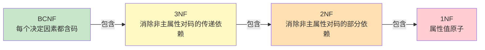
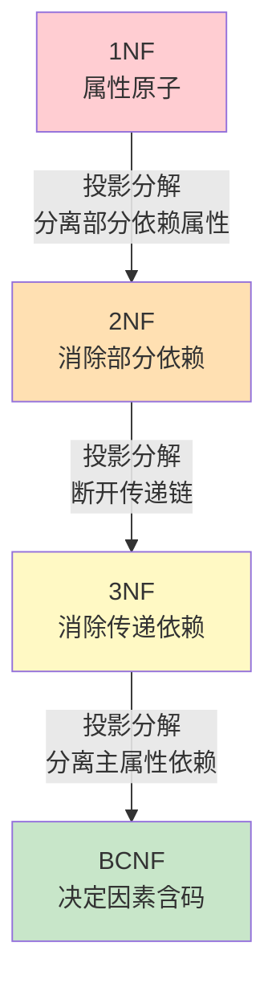
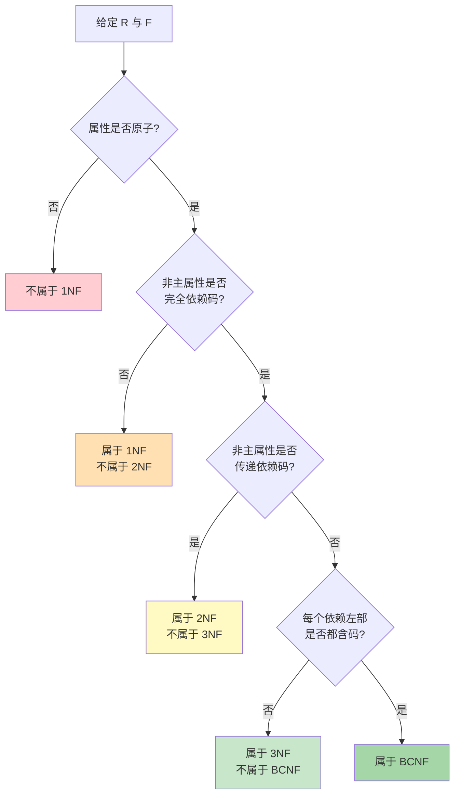

# 6.3 范式（1NF、2NF、3NF、BCNF）

范式（Normal Form, NF）是关系模式规范化的"等级标准"：等级越高，模式中冗余与异常越少。本节是关系数据理论的**核心**，定义 1NF、2NF、3NF、BCNF 四级范式，给出每一级消除的依赖类型与规范化分解方法，并通过标准例题展示"判断范式—分解升级"的完整流程。

## 范式总览

> [!theorem] 范式包含关系
> 各级范式满足包含关系：
> $$\text{BCNF} \subset 3\text{NF} \subset 2\text{NF} \subset 1\text{NF}$$
> 即：若 $R\in\text{BCNF}$，则 $R\in 3\text{NF}$、$R\in 2\text{NF}$、$R\in 1\text{NF}$。等级越高，约束越严格。

| 范式 | 消除的依赖 | 约束条件（等价表述） |
| --- | --- | --- |
| 1NF | 非原子属性 | 所有属性值不可分 |
| 2NF | 部分函数依赖 | 非主属性完全函数依赖于码 |
| 3NF | 传递函数依赖 | 非主属性不传递依赖于码 |
| BCNF | 主属性对码的部分/传递依赖 | 每个函数依赖 $X\to Y$ 中 $X$ 必含码 |

## 第一范式（1NF）

> [!definition] 1NF 定义
> 若关系模式 $R$ 的所有属性都是**不可分的基本数据项**（即每个属性值都是原子的），则 $R\in\text{1NF}$。第一范式是对关系模式的**最基本要求**——满足 1NF 的关系模式才能称为规范关系。

> [!warning] 违反 1NF 的示例
> 设关系模式 `SC(Sno, Cno, Grade)`，若把成绩列设计成"数学:90/英语:85"这样的复合值，则 `Grade` 非原子，违反 1NF。
>
> 另一典型违反：表中嵌套表。例如把"学生选课"做成一个表，其中每行又含一个"课程列表"子表。这同样违反 1NF，需把子表展开为多行。

> [!example] 1NF 规范化
> 不规范表：
>
> | Sno | Sname | Courses |
> | --- | --- | --- |
> | S1 | 张三 | {C1:90, C2:85} |
> | S2 | 李四 | {C1:78} |
>
> `Courses` 列是集合值，非原子。规范化为 1NF：每门课单独一行。
>
> | Sno | Sname | Cno | Grade |
> | --- | --- | --- | --- |
> | S1 | 张三 | C1 | 90 |
> | S1 | 张三 | C2 | 85 |
> | S2 | 李四 | C1 | 78 |

## 第二范式（2NF）

> [!definition] 2NF 定义
> 若 $R\in\text{1NF}$，且**每个非主属性都完全函数依赖于候选码**（不存在非主属性对码的部分函数依赖），则 $R\in\text{2NF}$。

> [!note] 2NF 的实质
> 2NF 针对**复合码**（码由多个属性组成）的情形。若码是单属性，1NF 自动满足 2NF。违反 2NF 的标志是：存在非主属性 $A$ 与码 $K$ 的真子集 $K'$，使 $K'\to A$。

> [!example] 2NF 判定与分解（S-L-C 例）
> 关系模式 $\text{S-L-C}(\text{Sno},\text{Sdept},\text{Sloc},\text{Cno},\text{Grade})$（见 [[6.1 问题提出]]），码为 $(\text{Sno},\text{Cno})$。函数依赖：
> - $(\text{Sno},\text{Cno})\xrightarrow{F}\text{Grade}$
> - $\text{Sno}\to\text{Sdept}$，$\text{Sno}\to\text{Sloc}$
>
> $\text{Sdept}$、$\text{Sloc}$ 仅依赖码的真子集 $\text{Sno}$，存在部分函数依赖，故 $\text{S-L-C}\notin 2\text{NF}$。
>
> **分解到 2NF**：用"投影分解法"，把依赖码真子集的属性分离出去：
> - $\text{SC}(\text{Sno},\text{Cno},\text{Grade})$ —— 主码 $(\text{Sno},\text{Cno})$
> - $\text{S-L}(\text{Sno},\text{Sdept},\text{Sloc})$ —— 主码 $\text{Sno}$
>
> 分解后 $\text{SC}$ 中 $\text{Grade}$ 完全依赖码；$\text{S-L}$ 码为单属性，无部分依赖。两者均 $\in 2\text{NF}$。

> [!warning] 2NF 分解的注意点
> 2NF 分解消除的是"非主属性对码的部分依赖"。若部分依赖涉及**主属性**（即决定因素是码真子集，但被决定属性是主属性），2NF 不管——这正是 BCNF 要处理的问题。

## 第三范式（3NF）

> [!definition] 3NF 定义
> 若 $R\in 2\text{NF}$，且**每个非主属性都不传递依赖于候选码**（即不存在非主属性 $Z$、码 $K$ 与中间属性 $Y$，使 $K\to Y,\ Y\not\to K,\ Y\to Z$），则 $R\in 3\text{NF}$。

> [!theorem] 3NF 的等价定义
> $R\in 3\text{NF}$ $\iff$ 对 $R$ 上每个非平凡函数依赖 $X\to Y$，要么 $X$ 含码，要么 $Y$ 是主属性。
>
> 等价表述：每个非平凡函数依赖的**左部要么是超码，要么右部全是主属性**。

> [!example] 3NF 判定与分解（S-L 续）
> 承接上例 $\text{S-L}(\text{Sno},\text{Sdept},\text{Sloc})$，码为 $\text{Sno}$。函数依赖：
> - $\text{Sno}\to\text{Sdept}$，$\text{Sdept}\to\text{Sloc}$
>
> $\text{Sno}\to\text{Sdept}\to\text{Sloc}$ 是传递依赖（$\text{Sdept}\not\to\text{Sno}$），故 $\text{S-L}\notin 3\text{NF}$。
>
> **分解到 3NF**：在传递链的中间断开，把 $\text{Sloc}$ 分离：
> - $\text{S-D}(\text{Sno},\text{Sdept})$ —— 主码 $\text{Sno}$
> - $\text{D-L}(\text{Sdept},\text{Sloc})$ —— 主码 $\text{Sdept}$
>
> 两者均无传递依赖，$\in 3\text{NF}$。
>
> 完整的 S-L-C 规范化链：
> $$\text{S-L-C} \xrightarrow{2\text{NF}} \{\text{SC},\text{S-L}\} \xrightarrow{3\text{NF}} \{\text{SC},\text{S-D},\text{D-L}\}$$

> [!warning] 3NF 仍存在的问题
> 3NF 仅约束**非主属性**，对**主属性**间的部分依赖与传递依赖无能为力。看下例。

## BC 范式（BCNF）

> [!definition] BCNF 定义
> 若 $R\in 1\text{NF}$，且对每个非平凡函数依赖 $X\to Y$，**$X$ 都包含码**（即 $X$ 是超码），则 $R\in\text{BCNF}$。

> [!note] BCNF 与 3NF 的关系
> BCNF 是 3NF 的加强：3NF 允许"右部是主属性"时左部不含码，BCNF 不允许任何例外。因此：
> $$\text{BCNF} \subset 3\text{NF}$$
> 若 $R$ 的候选码唯一且为单属性，则 $3\text{NF}\iff\text{BCNF}$。当存在多个候选码或复合候选码时，3NF 不一定满足 BCNF。

> [!example] 3NF 但非 BCNF（经典反例）
> 设关系模式 $\text{R}(C, S, T)$，$C$ 为课程、$S$ 为学生、$T$ 为教师。语义：每门课由一名教师讲授；一名教师只讲一门课；一名学生可选修多门课，每门课可有多个学生选修。
> 函数依赖：
> - $(C, S)\to T$ （课程+学生决定教师）
> - $C\to T$ （等价：每门课一名教师）—— 错！应是 $T\to C$（一名教师讲一门课）
>
> 修正函数依赖：
> - $(C, S)\to T$
> - $T\to C$
>
> 候选码：$(C,S)$ 与 $(T,S)$（验证 $(T,S)_F^+$：$T\to C$ 得 $C$，故 $\{T,S,C\}=U$）。
> 主属性：$C, S, T$（全部），无非主属性。
>
> 因此 $R\in 3\text{NF}$（没有非主属性可言，3NF 自动满足）。
>
> 但考察 $T\to C$：左部 $T$ 不含码（$T$ 不是 $(C,S)$ 也不是 $(T,S)$ 的超集），故 $R\notin\text{BCNF}$。
>
> **分解到 BCNF**：
> - $\text{R}_1(T, C)$ —— 主码 $T$，记录"哪位教师讲哪门课"
> - $\text{R}_2(T, S)$ —— 主码 $(T,S)$，记录"哪位教师教哪些学生"
>
> 两个子模式中每个非平凡函数依赖的左部都含码，均 $\in\text{BCNF}$。

> [!warning] BCNF 分解可能丢失函数依赖
> 上例中原依赖 $(C,S)\to T$ 在分解为 $\text{R}_1(T,C)$ 与 $\text{R}_2(T,S)$ 后**无法保持**（因 $C,S$ 不再同时出现在任一子模式中）。这是 BCNF 分解的固有代价：BCNF 分解保证**无损连接**，但**不一定保持函数依赖**。若必须同时保持函数依赖，应分解到 3NF（见 [[6.5 模式分解]]）。

## 规范化步骤

> [!summary] 规范化核心思路
> 1. **1NF→2NF**：消除非主属性对码的部分函数依赖。把依赖码真子集的属性连同该真子集投影出去。
> 2. **2NF→3NF**：消除非主属性对码的传递函数依赖。在传递链中间断开，分别投影。
> 3. **3NF→BCNF**：消除主属性对码的部分/传递依赖。把决定因素不含码的依赖拆出去。
>
> 每步都用**投影分解**：把原模式按函数依赖"亲缘"分组，每组单独成一个子模式。

## 标准例题集

### 例题 1：判断范式并分解（基础题）

> 设 $R(A,B,C)$，$F=\{A\to B,\ B\to C\}$。求候选码、判断范式、分解到 3NF。

**解**：

1. **候选码**：$A_F^+=\{A,B,C\}=U$，$B_F^+=\{B,C\}\ne U$，$C_F^+=\{C\}\ne U$，故唯一候选码为 $A$。
2. **范式判定**：
   - 码为单属性 $A$，无非主属性对码的部分依赖，$R\in 2\text{NF}$。
   - 但存在 $A\to B\to C$ 的传递依赖（$B\not\to A$），故 $R\notin 3\text{NF}$。
   - 综上 $R\in 2\text{NF}$ 且不属于 3NF。
3. **分解到 3NF**：在 $A\to B\to C$ 中间断开：
   - $R_1(A,B)$，主码 $A$
   - $R_2(B,C)$，主码 $B$
   
   两者均无传递依赖，$\in 3\text{NF}$。验证无损连接：$R_1\cap R_2=B$，$B\to R_2$ 即 $B\to BC$ 成立（因 $B\to C$），故无损。验证保持依赖：$F$ 中 $A\to B$ 在 $R_1$ 中保持，$B\to C$ 在 $R_2$ 中保持，故保持函数依赖。

### 例题 2：BCNF 判定与分解

> 设 $R(A,B,C)$，$F=\{AB\to C,\ C\to B\}$。求候选码、判断范式、分解到 BCNF。

**解**：

1. **候选码**：
   - $(AB)_F^+=\{A,B,C\}=U$ ✓
   - $(AC)_F^+=\{A,B,C\}=U$ ✓（$C\to B$ 得 $B$）
   - $A_F^+=\{A\}\ne U$，$B_F^+=\{B\}\ne U$，$C_F^+=\{B,C\}\ne U$。
   - 故候选码为 $AB$ 与 $AC$。
2. **主属性**：$A, B, C$（全部），非主属性为空。
3. **范式判定**：
   - 无非主属性，3NF 自动满足。
   - 考察 $C\to B$：$C$ 不含码（既不是 $AB$ 也不是 $AC$ 的超集），故 $R\notin\text{BCNF}$。
   - 综上 $R\in 3\text{NF}$ 但不属于 BCNF。
4. **分解到 BCNF**：把 $C\to B$ 拆出：
   - $R_1(C, B)$，主码 $C$
   - $R_2(A, C)$，主码 $AC$
   
   $R_1$：唯一非平凡依赖 $C\to B$，$C$ 含码 ✓，$\in\text{BCNF}$。
   $R_2$：无非平凡依赖（$AC\to C$ 平凡），$\in\text{BCNF}$。
5. **验证**：
   - 无损连接：$R_1\cap R_2=C$，$C\to R_1$ 即 $C\to CB$ 成立 ✓。
   - 保持函数依赖：$AB\to C$ 在分解后**无法验证**（$A,B$ 不在任一子模式同时出现），故**不保持函数依赖**。这正是 BCNF 分解的代价。

### 例题 3：多候选码情形

> 设 $R(A,B,C,D)$，$F=\{A\to B,\ A\to C,\ C\to D\}$。求候选码、判断范式。

**解**：

1. **候选码**：$A_F^+=\{A,B,C,D\}=U$ ✓，$A$ 单属性即候选码。$C_F^+=\{C,D\}\ne U$，$B_F^+=\{B\}\ne U$，$D_F^+=\{D\}\ne U$。候选码唯一为 $A$。
2. **主属性**：$A$；非主属性：$B, C, D$。
3. **范式判定**：
   - 码为单属性，$R\in 2\text{NF}$。
   - $A\to C\to D$ 是传递依赖（$C\not\to A$），故 $R\notin 3\text{NF}$。
   - $A\to B\to$？$B$ 不决定任何属性，无传递链。
   - 综上 $R\in 2\text{NF}$ 但不属于 3NF。
4. **分解到 3NF**：
   - $R_1(A,C)$、$R_2(C,D)$、$R_3(A,B)$ —— 三个子模式，分别对应 $A\to C$、$C\to D$、$A\to B$，均 $\in\text{BCNF}$。

### 例题 4：综合判定

> 设 $R(A,B,C,D,E)$，$F=\{A\to BC,\ CD\to E,\ B\to D,\ E\to A\}$。求候选码、判断最高范式。

**解**：

1. **候选码**：由 [[6.2 函数依赖]] 候选码求解示例，候选码为 $A$、$E$、$BC$、$CD$，共 4 个。主属性 $=\{A,B,C,D,E\}=U$，无非主属性。
2. **范式判定**：
   - 无非主属性，3NF 自动满足。
   - 考察各依赖的左部是否含码：
     - $A\to BC$：$A$ 是候选码 ✓
     - $CD\to E$：$CD$ 是候选码 ✓
     - $E\to A$：$E$ 是候选码 ✓
     - $B\to D$：$B$ **不是**候选码，也不是超码（$B_F^+=\{B,D\}\ne U$）✗
   - 存在 $B\to D$ 决定因素不含码，故 $R\notin\text{BCNF}$。
3. **结论**：$R\in 3\text{NF}$ 但不属于 BCNF。

## 范式判定流程

## 各范式对比

| 范式 | 约束对象 | 消除的依赖 | 与码的关系 | 分解是否无损 | 是否保持 FD |
| --- | --- | --- | --- | --- | --- |
| 1NF | 属性值 | 非原子值 | — | — | — |
| 2NF | 非主属性 | 部分依赖 | 非主属性完全依赖码 | 总可无损 | 总可保持 |
| 3NF | 非主属性 | 传递依赖 | 非主属性不传递依赖码 | 总可无损 | 总可保持 |
| BCNF | 所有属性 | 部分/传递依赖（含主属性） | 每个决定因素含码 | 总可无损 | 不一定 |

> [!warning] 工程取舍
> - 实际数据库设计中，**3NF 通常是充分的目标**：既消除主要冗余与异常，又能保持函数依赖。
> - 强行升到 BCNF 可能丢失函数依赖，导致完整性约束无法在模式内表达，需用触发器或应用层逻辑补偿。
> - 对查询性能敏感的场景，有时甚至会**故意反规范化**（denormalization），用冗余换查询速度——这是设计权衡，不是违反理论。

## 本节要点小结

> [!summary] 本节核心
> 1. 范式等级：$1\text{NF}\supset 2\text{NF}\supset 3\text{NF}\supset\text{BCNF}$，等级越高约束越严。
> 2. 1NF 要求属性原子；2NF 消除非主属性对码的部分依赖；3NF 消除非主属性对码的传递依赖；BCNF 要求每个决定因素都含码。
> 3. 规范化靠**投影分解**逐级升级，每步消除一类"非正常"依赖。
> 4. 3NF 总能无损且保持函数依赖地分解达到；BCNF 总能无损分解达到，但**不一定保持函数依赖**。
> 5. 判定范式的流程：属性原子 → 非主属性完全依赖 → 非主属性不传递依赖 → 决定因素含码。

## 关联与延伸

- 先修：[[6.1 问题提出]]、[[6.2 函数依赖]]
- 后续：[[6.4 多值依赖与4NF]]（推广到多值依赖，引入 4NF）、[[6.5 模式分解]]（分解的等价标准与算法）
- 应用：[[MOC - 第7章]]（逻辑结构设计中需把关系模式规范化到 3NF 或 BCNF）
