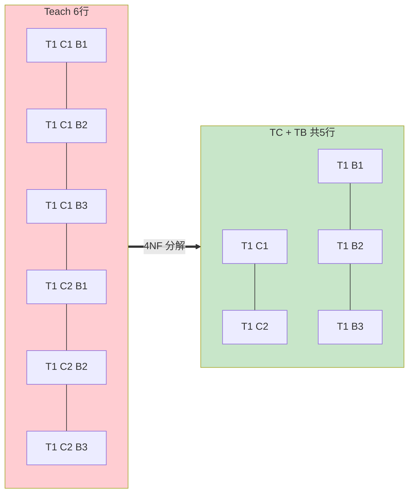
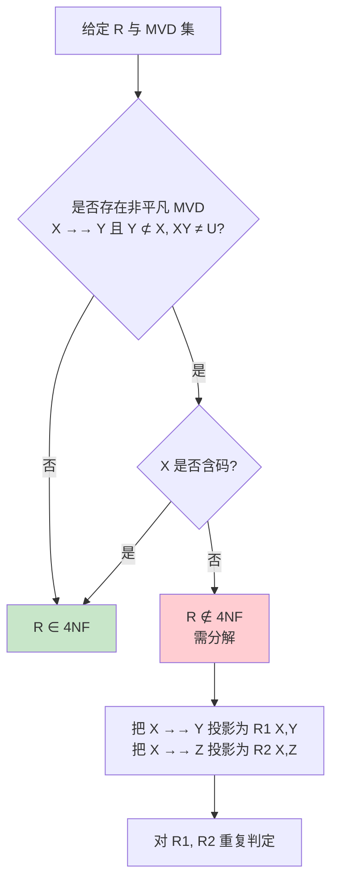

# 6.4 多值依赖与 4NF

函数依赖刻画"决定"关系：$X\to Y$ 表示 $X$ 唯一决定 $Y$。但现实中还存在**一对多独立**关系——例如一位教师讲授一门课的同时使用多本参考书，且"参考书"与"上课时段"相互独立。这类"独立多值"无法用函数依赖刻画，由此引入**多值依赖**（Multivalued Dependency, MVD）与**第四范式**（4NF）。

## 多值依赖的动机

> [!example] 教师-课程-参考书示例
> 设有关系模式 $\text{Teach}(T, C, B)$，其中 $T$ 为教师、$C$ 为课程、$B$ 为参考书。语义：教师 $T_1$ 讲授课程 $C_1$ 与 $C_2$，使用参考书 $B_1$、$B_2$、$B_3$；且参考书与课程**相互独立**——即不论讲哪门课，都用这三本参考书。
>
> 关系实例：
>
> | T | C | B |
> | --- | --- | --- |
> | $T_1$ | $C_1$ | $B_1$ |
> | $T_1$ | $C_1$ | $B_2$ |
> | $T_1$ | $C_1$ | $B_3$ |
> | $T_1$ | $C_2$ | $B_1$ |
> | $T_1$ | $C_2$ | $B_2$ |
> | $T_1$ | $C_2$ | $B_3$ |
>
> 这里的冗余显而易见：$(T_1,C_1)$ 与 $(T_1,C_2)$ 都重复存储了相同的 3 本参考书。**但 Teach 上没有任何函数依赖**（码为 $(T,C,B)$，全码），因此它属于 BCNF。这说明 BCNF 仍不足以消除所有冗余——多值依赖理论由此产生。

## 多值依赖的定义

> [!definition] 多值依赖
> 设 $R(U)$，$X, Y\subseteq U$，令 $Z=U-(X\cup Y)$。若对 $R(U)$ 的任一关系 $r$，给定一对 $(X,Z)$ 的值，都对应**一组确定的 $Y$ 值**（这组 $Y$ 值**仅依赖于 $X$**，与 $Z$ 的取值无关），则称 $Y$ 多值依赖于 $X$，或 $X$ 多值决定 $Y$，记作 $X\rightarrow\rightarrow Y$。

> [!note] 形式化判定
> 多值依赖 $X\rightarrow\rightarrow Y$ 在关系 $r$ 上成立 $\iff$ 若 $r$ 中存在元组 $t_1, t_2$ 满足 $t_1[X]=t_2[X]$，则 $r$ 中必存在元组 $t_3$（$t_4$）使得：
> - $t_3[X]=t_1[X]=t_2[X]$
> - $t_3[Y]=t_1[Y]$
> - $t_3[Z]=t_2[Z]$
>
> （以及对称的 $t_4$：$t_4[X]=t_1[X]$，$t_4[Y]=t_2[Y]$，$t_4[Z]=t_1[Z]$）

> [!example] 多值依赖示例（续上例）
> 在 $\text{Teach}(T, C, B)$ 中：
> - $T\rightarrow\rightarrow C$（一位教师讲授一组课程，与参考书无关）
> - $T\rightarrow\rightarrow B$（一位教师使用一组参考书，与课程无关）
>
> 验证：取 $t_1=(T_1,C_1,B_1)$ 与 $t_2=(T_1,C_2,B_2)$，按定义应存在 $t_3=(T_1,C_1,B_2)$（$T$ 同、$C$ 取 $t_1$ 的、$B$ 取 $t_2$ 的），表中确实存在。这印证 $T\rightarrow\rightarrow C$ 与 $T\rightarrow\rightarrow B$ 成立。

## 多值依赖的性质

> [!theorem] 多值依赖的三大性质
> 设 $R(U)$，$X, Y, Z, W\subseteq U$。
>
> 1. **互补性（Complementation）**：若 $X\rightarrow\rightarrow Y$，则 $X\rightarrow\rightarrow U-X-Y$（令 $Z=U-X-Y$，即 $X\rightarrow\rightarrow Z$）。
> 2. **增广性（Augmentation）**：若 $X\rightarrow\rightarrow Y$ 且 $W\subseteq Z$（$Z=U-X-Y$），则 $XW\rightarrow\rightarrow YW$。
> 3. **传递性（Transitivity）**：若 $X\rightarrow\rightarrow Y$ 且 $Y\rightarrow\rightarrow Z$，则 $X\rightarrow\rightarrow Z-Y$。

> [!note] 平凡多值依赖
> 若 $Y\subseteq X$ 或 $XY=U$（即 $Z=\emptyset$），则 $X\rightarrow\rightarrow Y$ 是**平凡的多值依赖**，必然成立。平凡多值依赖不携带信息，4NF 关注的是**非平凡**多值依赖。

## 多值依赖与函数依赖的关系

> [!theorem] 函数依赖是多值依赖的特例
> 若 $X\to Y$ 成立，则 $X\rightarrow\rightarrow Y$ 必成立。
>
> 直观理解：若 $X$ 能唯一决定 $Y$，则"对应一组 $Y$"自然成立（这组只有一个值）。

> [!warning] 反向不成立
> $X\rightarrow\rightarrow Y$ 成立**不能**推出 $X\to Y$ 成立。多值依赖是比函数依赖更弱的约束。

> [!theorem] 混合传递规则
> 若 $X\to Y$ 且 $Y\rightarrow\rightarrow Z$，则 $X\rightarrow\rightarrow Z$。
> 即函数依赖可以"加强"为多值依赖后参与传递。

## 第四范式（4NF）

> [!definition] 4NF 定义
> 若 $R\in 1\text{NF}$，且对 $R$ 上每个**非平凡的多值依赖** $X\rightarrow\rightarrow Y$（$Y\not\subseteq X$，$XY\ne U$），$X$ 都**包含码**（即 $X$ 是超码），则 $R\in 4\text{NF}$。

> [!note] 4NF 与 BCNF 的关系
> 4NF 是 BCNF 的加强：
> $$4\text{NF} \subset \text{BCNF} \subset 3\text{NF}$$
> 由于函数依赖是特殊的多值依赖，BCNF 仅约束非平凡函数依赖的左部含码；4NF 进一步要求非平凡多值依赖的左部也含码。

## 4NF 分解示例

> [!example] Teach 分解到 4NF
> 承接 $\text{Teach}(T, C, B)$，存在非平凡多值依赖 $T\rightarrow\rightarrow C$ 与 $T\rightarrow\rightarrow B$，且 $T$ 不是码（码为 $(T,C,B)$），故 $\text{Teach}\notin 4\text{NF}$。
>
> **分解**：把 $T\rightarrow\rightarrow C$ 与 $T\rightarrow\rightarrow B$ 分别投影成子模式：
> - $\text{TC}(T, C)$ —— 主码 $(T,C)$，记录"教师-课程"对应关系
> - $\text{TB}(T, B)$ —— 主码 $(T,B)$，记录"教师-参考书"对应关系
>
> 分解后：
> - $\text{TC}$ 中 $T\rightarrow\rightarrow C$ 是平凡的（$TC=U$），无非平凡多值依赖，$\in 4\text{NF}$。
> - $\text{TB}$ 中 $T\rightarrow\rightarrow B$ 是平凡的，$\in 4\text{NF}$。
>
> 原 6 行的 Teach 表，分解后变为：
>
> TC 表（2 行）：
>
> | T | C |
> | --- | --- |
> | $T_1$ | $C_1$ |
> | $T_1$ | $C_2$ |
>
> TB 表（3 行）：
>
> | T | B |
> | --- | --- |
> | $T_1$ | $B_1$ |
> | $T_1$ | $B_2$ |
> | $T_1$ | $B_3$ |
>
> 冗余从 6 行降到 5 行（且增长更慢：$|TC|+|TB|$ 而非 $|TC|\times|TB|$）。

## 多值依赖的实际场景

> [!example] 常见多值依赖场景
> 1. **教师-课程-参考书**：一名教师讲多门课、用多本参考书，两者独立。
> 2. **员工-技能-语言**：一名员工掌握多项技能、会多种语言，技能与语言相互独立。
> 3. **订单-商品-优惠券**：一个订单含多种商品、可叠加多张优惠券，商品与优惠券独立。
> 4. **学生-社团-比赛**：一名学生参加多个社团、参加多项比赛，两者独立。
>
> 共同特征：一个实体同时与两组独立的多值属性关联，若强行塞进一张表会产生"笛卡尔积爆炸"式冗余。

## 多值依赖判定与 4NF 分解流程

## 本节要点小结

| 概念 | 符号 | 关键判定 |
| --- | --- | --- |
| 多值依赖 | $X\rightarrow\rightarrow Y$ | 给定 $(X,Z)$ 对应一组 $Y$，与 $Z$ 无关 |
| 平凡 MVD | — | $Y\subseteq X$ 或 $XY=U$ |
| 4NF | — | 非平凡 MVD 左部含码 |

> [!summary] 本节核心
> 1. 多值依赖刻画"一对多独立"关系，是函数依赖的推广：$X\to Y \Rightarrow X\rightarrow\rightarrow Y$，反之不成立。
> 2. 多值依赖有互补性、增广性、传递性三大性质。
> 3. 4NF 消除非平凡多值依赖：要求每个非平凡 MVD $X\rightarrow\rightarrow Y$ 的 $X$ 都含码。
> 4. 4NF 是 BCNF 的加强：$4\text{NF}\subset\text{BCNF}\subset 3\text{NF}$。
> 5. 4NF 分解把"独立多值"的两组属性分别投影出去，消除笛卡尔积式冗余。

## 关联与延伸

- 先修：[[6.2 函数依赖]]、[[6.3 范式（1NF、2NF、3NF、BCNF）]]
- 后续：[[6.5 模式分解]]（多值依赖下的分解同样需保证无损连接）
- 关联：[[MOC - 第7章]]（数据库设计中遇到独立多值属性应考虑 4NF 分解）
- 连接函数依赖与多值依赖的统一理论：连接依赖（JD）与 5NF，本章不展开
