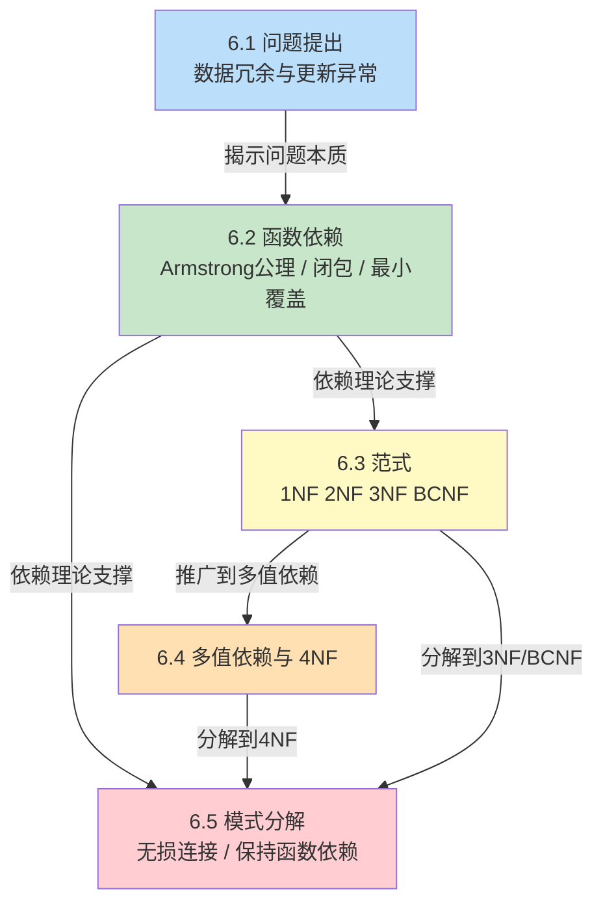

# MOC - 第6章 关系数据理论

> [!info] 本章定位
> 关系数据理论是数据库设计的**理论核心**，回答“什么样的关系模式是好的、为什么不好、如何变好”三个根本问题。它从关系模式中存在的**数据冗余与操作异常**出发，揭示问题的本质是**函数依赖**（及其推广——多值依赖）与模式结构不匹配，进而建立以 **1NF → 2NF → 3NF → BCNF → 4NF** 为阶梯的**范式理论**，并通过**模式分解**给出可操作的规范化方法。本章是 [[MOC - 第7章]]（数据库设计）逻辑结构设计的理论依据，也是后续判断一个数据库模式是否“设计良好”的判定准则。

## 学习路线图

> [!note] 学习顺序说明
> 6.1 用具体例子让读者“看到问题”；6.2 给出分析问题的形式化工具（函数依赖与公理体系）；6.3 是核心，定义范式并展示规范化分解；6.4 把函数依赖推广到多值依赖，引入 4NF；6.5 系统讨论分解的等价标准与算法，是规范化的工程实现。建议按顺序学习，并在 6.3、6.5 上投入主要精力。

## 知识点导航

| 节 | 主题 | 入口 | 关键概念 |
| ---- | ---- | ---- | ---- |
| 6.1 | 问题提出 | [[6.1 问题提出]] | 数据冗余、更新异常、插入异常、删除异常、规范化必要性 |
| 6.2 | 函数依赖 | [[6.2 函数依赖]] | 平凡/非平凡、完全/部分、传递函数依赖、码、Armstrong 公理、属性闭包、最小函数依赖集、候选码求解 |
| 6.3 | 范式（1NF、2NF、3NF、BCNF） | [[6.3 范式（1NF、2NF、3NF、BCNF）]] | 1NF 原子性、2NF 消除部分依赖、3NF 消除传递依赖、BCNF 决定因素含码、规范化步骤 |
| 6.4 | 多值依赖与 4NF | [[6.4 多值依赖与4NF]] | 多值依赖定义、互补性/增广性/传递性、4NF、教师-课程-参考书示例 |
| 6.5 | 模式分解 | [[6.5 模式分解]] | 无损连接、保持函数依赖、Chase 算法、3NF/BCNF 分解算法 |

## 核心考点

> [!warning] 高频考点（必须掌握）
> 1. **异常识别**：给定一个关系模式与实例，识别其数据冗余、插入/删除/更新异常，并指出根因。
> 2. **函数依赖分类**：判断平凡/非平凡、完全/部分、传递函数依赖，并正确书写符号 $X \xrightarrow{F} Y$、$X \xrightarrow{P} Y$。
> 3. **Armstrong 公理**：用自反律、增广律、传递律及导出规则（合并、分解、伪传递）推导函数依赖。
> 4. **属性闭包计算**：准确求 $X_F^+$，并据此判断 $X \to Y$ 是否成立、$X$ 是否为候选码。
> 5. **候选码求解**：用属性闭包法求出全部候选码（区分 L 类、R 类、LR 类、N 类属性）。
> 6. **范式判定**：给定关系模式与函数依赖集，判断其属于第几范式，并说明理由。
> 7. **规范化分解**：把模式分解到 2NF、3NF、BCNF，并说明每步消除的依赖类型。
> 8. **分解等价性**：用表格法（Chase）判断无损连接性，用 $F^+ = (\bigcup F_i)^+$ 判断保持函数依赖性；掌握分解为两个关系无损连接的充要条件 $R_1 \cap R_2 \to R_1$（或 $R_2$）。

## 自测题

1. 设关系模式 $R(A,B,C,D)$，函数依赖集 $F=\{A\to B,\ B\to C,\ C\to D\}$。
   - (1) 求 $A_F^+$、$B_F^+$；
   - (2) 求候选码；
   - (3) 判断 $R$ 属于第几范式，并说明理由。
2. 设 $R(A,B,C)$，$F=\{AB\to C,\ C\to B\}$。
   - (1) 求候选码；
   - (2) 判断 $R$ 是否属于 BCNF，给出推导；
   - (3) 若不属于 BCNF，给出达到 BCNF 的无损连接分解。
3. 给定 $R(U,F)$，$U=\{A,B,C,D,E\}$，$F=\{A\to BC,\ CD\to E,\ B\to D,\ E\to A\}$。
   - (1) 求候选码；
   - (2) 判断 $R$ 最高属于第几范式。
4. 判断下列关系模式分别属于哪一范式，并简述依据：
   - (1) $R(A,B,C)$，$F=\{A\to B,\ A\to C\}$；
   - (2) $R(A,B,C)$，$F=\{AB\to C,\ C\to B\}$（即经典 $R(B,C,A)$ 反例）；
   - (3) $R(A,B,C)$，$F=\{A\to B,\ B\to C\}$。

> [!tip] 自测题答案要点
> - 题1：$A_F^+=\{A,B,C,D\}$，$B_F^+=\{B,C,D\}$；候选码为 $A$；$R\in$ 2NF 但不属于 3NF（存在传递依赖 $A\to B\to C$ 与 $A\to B\to D$ 的链）。
> - 题2：候选码为 $AB$ 与 $AC$；非主属性为 $\emptyset$，故 $R\in$ 3NF；但 $C\to B$ 中 $C$ 不含码，故 $R\notin$ BCNF；分解为 $R_1(C,B)$、$R_2(A,C)$，无损连接（$R_1\cap R_2=C\to R_1$ 即 $C\to CB$ 成立）。
> - 题3：候选码为 $A$、$E$、$CD$、$BC$；$R\in$ 3NF 但不属于 BCNF（$B\to D$ 决定因素 $B$ 不含码）。
> - 题4：(1) BCNF；(2) 3NF（非 BCNF）；(3) 2NF（非 3NF）。

## 章节导航

- 上级 MOC：[[MOC - 数据库原理]]
- 上一章：[[MOC - 第5章]]
- 下一章：[[MOC - 第7章]]
- 本章习题：[[MOC - 第6章习题]]
